# Preset transformation 

## Coordinate properties 

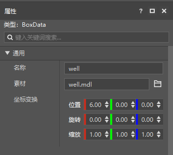 

As shown in the figure above, there are three types of properties in the coordinate transformation of the preset properties: position, rotation, and scale. These three types of properties have three values in the (x, y, z) axis. 

**Position**: Set the position offset of the preset in the parent node coordinate system. If the preset is a root node, set the position of the preset in the world coordinate system. 

**Rotation**: Set the Euler angle of rotation of the preset in the parent node coordinate system. If the preset is a root node, set the Euler angle of rotation of the preset in the world coordinate system. 

**Scale**: Set the scale factor of the preset in the parent node coordinate system. If the preset is a root node, set the scale factor of the preset in the world coordinate system. 

**Coordinate attribute transformation order**: 

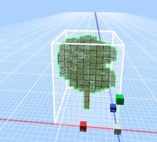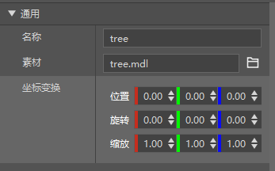 

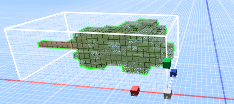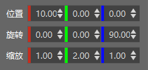 

As shown in the above parameters, the default is to perform **scaling** transformation first, then **rotation** transformation, and then position **translation** transformation according to the current coordinate system. 

The order of **rotation transformation** is to rotate according to **Z axis** first, then rotate according to **X axis**, and then rotate according to **Y axis**. 

The coordinate system of each transformation reference is the coordinate system of the current parent node (the root node is the world coordinate system), not the coordinate system after its own scaling and rotation transformation. 

## Preset transformation operation 

**Mouse picking and selection**: 

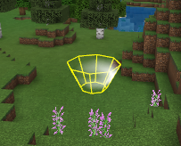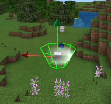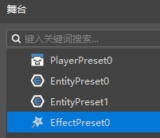 

**Click the special effects, creatures, materials and other presets in the **map** scene** with the left mouse button to **select** the current preset and perform related operations. 

You can also select the corresponding preset by **clicking the preset list item in the **stage interface** in the **level editor**, or the preset list in the **hierarchy interface** in the **preset editor** with the left mouse button. 

**Double-clicking** the preset list item with the left mouse button will **quickly locate** the corresponding preset. 

In the **preset editor**, because the **root node** has no coordinate transformation related properties, the **root node** cannot be selected for operation. 

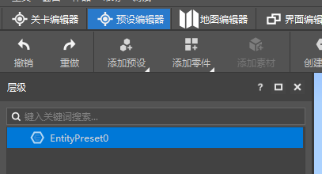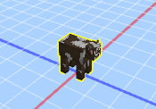 

For example, biological presets cannot be mounted under other preset nodes, so they cannot be clicked and selected and operated in the preset editor. 

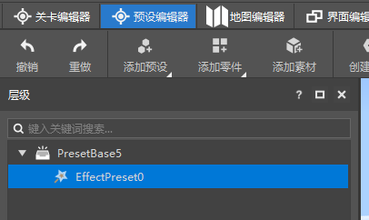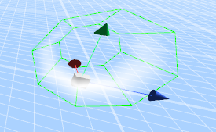 

Special effect presets can be mounted under preset nodes, so they can be clicked and selected in the preset editor for operation. 

**Switch operation mode**: 

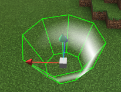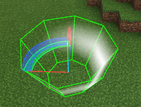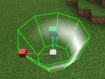 

When the preset is currently selected, press the keyboard numeric keys "**1**" "**2**" "**3**" to switch the operation mode to **position translation**, **rotation** and **scaling** operation mode. 

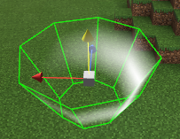 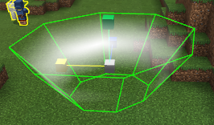 

**Translation and scaling operations**: Click the corresponding operation coordinate axis, hold down the left mouse button, and move the mouse direction to operate the movement or stretching preset. 

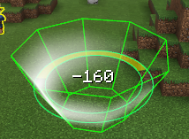 

**Rotation operation**: Click the corresponding operation coordinate axis, hold down the left mouse button, move to the **lower right** to increase the rotation angle, and move to the **upper left** to decrease the rotation angle. 

Note that the **rotation order is ZXY axis**, so the final effect of the rotation operation is **determined by the order of ZXY rotation angles**. 

## Preset transformation restrictions 

The preset operation is limited by MC rules. 

**Material preset transformation restrictions:** 

​ Position restrictions: The corresponding coordinates of the material block must be integers, and the corresponding non-integer parts are discarded for processing. 

​ Rotation restrictions: The material block can only be rotated at multiples of 90 degrees, and the non-multiples of 90 degrees are ignored. For negative angles, they are processed according to the corresponding positive direction angle. 

​ For example, if the rotation is 300 degrees, the corresponding material block rotates 270 degrees. And if it is rotated -40 degrees, it corresponds to a rotation of 320 degrees, and the corresponding material rotates 270 degrees. 

​ At the same time, some blocks such as beds also have rotation direction restrictions. 

​ Scaling now: The material scaling effect will not be less than 1 block. 

​ The maximum value of material scaling is 100, and the material block size cannot be more than 10 million blocks. Too large a material size will affect the operating performance. 

​ If the coefficient of the material scaling size is negative, it will be treated as a positive value. 

**Creature preset transformation limitations:** 

​ Rotation limitations: Creature rotation only supports the Y axis, X and Z axis rotations are simply ignored. 

​ Scaling now: The minimum scale of creatures is 0.1, and the scale effect will not be less than 1 block. 

​ The maximum scale of assets is 100, and the asset block size cannot be more than 10 million blocks. Assets that are too large will affect performance. 

Effect transformation restrictions: 

​ Rotation restrictions: The rotation of sequence frame effects is also affected by the **Always facing camera** property. 

​ The rotation of particle effects is also affected by **Effect direction** and **Particle orientation mode**. 

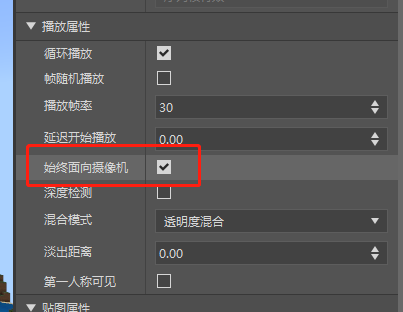 

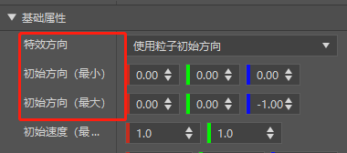 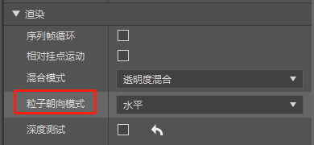 

## Preset Transformation API 

 

**Update Transformation Interval (updateTransformInterval):** 

​ Used to control the update interval of coordinate transformation (position, rotation, scale) of presets and child nodes in game mode. The default value is 2. My world logical frame rate is 30 frames per second. It is recommended to set this value to a suitable value for presets that are not necessarily updated every frame. 

​ When set to 0, the coordinate transformation of the preset set by the API will not be updated, so its attached child nodes will not be updated. When set to 1, it will be updated every frame. When set to 2, it will be updated every two frames. 

​ For example, in game mode, a creature preset mounts a special effect preset as a child node. If the transformation update interval of the creature preset is 0, the coordinate transformation will not be updated or modified if the creature preset is controlled by the API or the in-game AI or operation logic moves the creature object. Therefore, the special effects mounted on it will not have a position or rotation follow-up transformation. If the transformation update interval is 10, the coordinate transformation will be updated synchronously every 10 frames, and the position transformation of its special effect child node will also be updated. 

**Transform**: 

​ The Transform object has three properties: **pos** (position), **rotation** (rotation), **scale** (scaling), all in **tulpe(x,y,z)** format. 

​ Through the **AddOffset**, **AddRotation**, **AddScale** interfaces, the corresponding tuple(x,y,z) parameters are passed in, and the corresponding pos,rotation,scale properties of the Transform can be modified based on the current properties of the Transform. 

​ Through the **AddTransform** interface, pass in a Transform object, and modify the corresponding pos, rotation, and scale properties of the Transform based on the current properties of the Transform. 

​ Note that the Transform object itself is not associated with the parent node data, nor is it associated with the object in the game. 

​ Directly operating the properties of the Transform through the above interface will not update the coordinate transformation of the associated objects in the game. 

**TransformObject**: 

​ The TransformObject object is associated with the creatures, special effects, etc. of the game, and is also associated with its parent node and child node. Through this object API, you can control the coordinate transformation of the game object and its child nodes in the game. 

​ The coordinate transformation properties of the TransformObject have two coordinate reference systems, one is **WorldTransform**, which corresponds to the coordinate transformation (position, rotation, scale) properties under the **world coordinate system**. The other is **LocalTransform**, which corresponds to the coordinate transformation (position, rotation, scale) properties under the **parent node local coordinate system**. When a preset node is a root node, its WorldTransform and LocalTransform are equal. 

​ WorldTransform is obtained by transforming LocalTransform and the local coordinate system of the parent node, so the following interface modifies WorldTransform and converts it into modifying the corresponding LocalTransform attribute. Modifying LocalTransform also modifies the WorldTransform attribute. 

​ **GetLocalTransform** interface: 

​ Get the Transform object of the current TransformObject. This Transform attribute corresponds to its coordinate transformation attribute in the local coordinate system of the parent node. If it is the root node, it is the coordinate transformation attribute in the world coordinate system. 

​ **SetLocalTransform** interface: 

​ Pass in a Transform object and set its coordinate transformation attribute in the local coordinate system of the parent node. If it is the root node, it is the coordinate transformation attribute in the world coordinate system. 

​ Get and modify **LocalTransform** specific properties: 

​ GetLocalPosition, SetLocalPosition, GetLocalRotation, SetLocalRotation, GetLocalScale, SetLocalScale respectively get and set the pos (position), rotation (rotation), scale (scaling) properties of LocalTransform. 

​ AddLocalOffset, AddLocalRotation, AddLocalScale respectively increase the pos (position), rotation (rotation), scale (scaling) property values ​​of LocalTransform. It can be used to implement the logic of rotating or moving according to speed in the local coordinate system of the parent node. 

​ **GetWorldTransform** interface: 

​ Get the coordinate transformation properties of the current TransformObject in the world coordinate system. When it is a root node, this value is consistent with GetLocalTransform. When it is a child node, it is obtained by transforming its LocalTransform and the WorldTransform of the parent node. 

​ **SetWorldTransform** interface: 

​ Pass in a Transform object and set its transformation properties in the world coordinate system. If it is a root node, it is consistent with SetLocalTransform. If it is a child node, the corresponding LocalTransform is obtained according to the WorldTransform transformation of the parent node. 

​ Get and modify **WorldTransform** specific properties: 

​ GetWorldPosition, SetWorldPosition, GetWorldRotation, SetWorldRotation, GetWorldScale, SetWorldScale respectively get and set **WorldTransform**'s pos (position), rotation (rotation), scale (scaling) properties. 

​ AddWorldOffset, AddWorldRotation, AddWorldScale respectively increase **WorldTransform**'s pos (position), rotation (rotation), scale (scaling) property values. It can be used to implement its logic such as rotating or moving by speed in the world coordinate system. 

