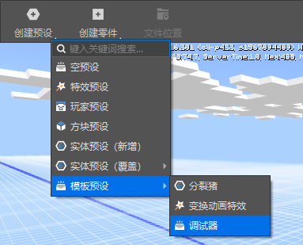
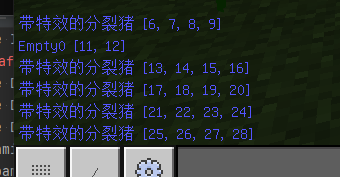
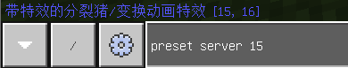

# Preset Debugging 

We have already learned about preset coordinate transformations. In this section, we will introduce how to debug various presets and parts in the MOD at runtime. 

## Add debugger 

You can build a preset debugger through preset editor => menu bar => create preset => template preset => debugger 

 

## Debugging instructions 

This preset provides the following instructions: 

- **preset server** 

Print all server preset summary information 

 

- **preset client** 

Print all client preset summary information 

- **preset server id** 

Print the preset summary information of the specified ID on the server 

 

- **preset client id** 

Print the preset summary information of the client-specified ID 

- **preset server func** 

Execute the function with the specified function name func in the debugger part on the server, such as preset server test 

Combined with the preset name and ID queried earlier, using the hot change function of MCStudio, you can perform simple debugging of the preset at runtime 

```python 
def test(self): 
# Replace the object ID you want to debug 
objId = 6 
print("test isClient: %s" % self.isClient) 
obj = self.GetManager().getGameObjectById(objId)

if obj: 
# Write some debugging code 
print(obj.GetWorldPosition()) 
``` 

- **preset client func** 

Execute the function named func in the debugger component on the client