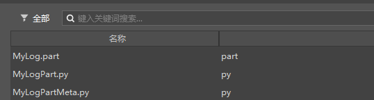
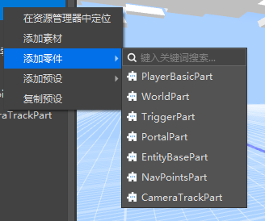
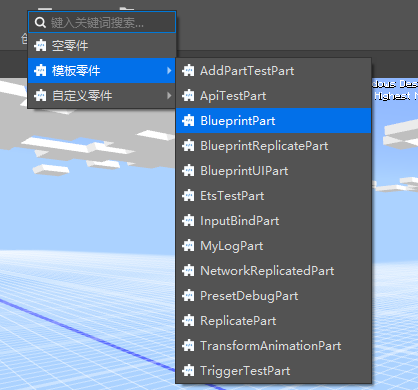

# Part Development 

## Part Composition 

When a part is successfully created using the editor, for example, MyLogPart, the editor will automatically create the following file: 

 

- MyLog.part 

MyLog.part is a part file that records the relevant information of the part. Developers do not need to care about the content of this file, but it is not recommended that developers make any changes to the file. 

- MyLogPart.py 

MyLogPart.py is a logic file, which inherits from the PartBase base class and has the lifecycle functions and API interfaces given by the part. The developer implements the part logic in this file, as shown in the following example: 

```python 
class MyLogPart(PartBase): 
def __init__(self): 
super(MyLogPart, self).__init__() 
self.name = "Print position" 
self.interval = (30, 90) 
self._tickCnt = 0 
self._tickInterval = random.randint(self.interval[0], self.interval[1]) 

def TickClient(self): 
self._tickCnt += 1 
if self._tickCnt == self._tickInterval: 
print("%s in %s" % (self.GetDisplayPath(), self.GetWorldPosition())) 
self._tickInterval = random.randint(self.interval[0], self.interval[1]) 
self._tickCnt = 0 
``` 

- MyLogPartMeta.py 

MyLogPartMeta.py is a metadata file. When the developer needs to visually edit a data member of the part in the editor, the data member can be written in the Meta file according to certain rules, as shown in the following example: 

```python 
class MyLogPartMeta(PartBaseMeta): 
CLASS_NAME = "MyLogPart" 
PROPERTIES = { 
"interval": PVector2(sort=1000, group="MyLogPart", text="Print interval"), 
} 
``` 

## Part Editing 

- Body


When a part is created, it will be stored in the resource manager as a code resource. A simple part will not work. Only when it depends on a preset, that is, the part is attached to a preset and the preset is instantiated, the code logic of the part will run normally. 

- Instance 

When a part is attached to a preset, it is called a part instance. The instance can be regarded as a reference to the part. Modifications to the part instance will be saved in the preset file without modifying the part code. Similarly, when the part code is modified, all instances of the part will synchronize the modification, but the modification to the part instance in the preset file will still be retained and take precedence over the part code. 

- Variables and custom properties 

Variables in a part can only be dynamically and visually edited in the editor after being visualized, and can only be overwritten after being attached to a preset. For details, see [Custom Property Panel](1-Custom Property Panel.md) 

## Built-in parts 

Our game engine has some built-in parts built in. Developers cannot modify the logic of built-in parts, nor can they create part copies like template parts. Developers can create built-in parts for presets and modify the data members that can be modified. 

 

Currently, there are 7 built-in parts. 

- PlayerBasicPart 

Player basic data part, which can set player basic data. This part can only be mounted under the player preset. 

- WorldPart 

World attribute part, which can set world attributes. This part is recommended to be mounted under the preset with preloaded settings. 

- TriggerPart 

Trigger part, which can set trigger conditions, etc. 

- PortalPart 

Portal part, which can set the portal and its shape. 

- EntityBasePart 

Entity part, which can spawn entity creatures at a specified location 

- NavPointsPart 

Path point part, which can set a series of path points relative to the part position in the editor, and obtain the absolute coordinate list of the path points through the interface at runtime. 

- CameraTrackPart 

Camera track part, which can set the camera movement track in the editor and play it through the interface at runtime.

## Template parts


Our editor has some template parts built in. Developers can create a copy of the part by creating a template part, so as to customize the part. 

 

There are currently 13 template parts built in. 

- AddPartTestPart 

Add part test part 

- ApiTestPart 

Part interface test part 

- MyLogPart 

Log part, used to test debug log. 

- NetworkReplicatedPart 

Network synchronization part 

- ReplicatePart 

Split part 

- TransformAnimationPart 

Transform animation part 

- TriggerTestPart 

Test trigger part, can be used with TriggerPart. 

- BlueprintPart 

Blueprint Part 

- BlueprintReplicatePart 

Blueprint Split Part 

- BlueprintUIPart 

Blueprint UI Part 

- EtsTestPart 

Ets Test Part


- InputBindPart 

Input binding part 

- PresetDebugPart 

Preset test part 

## Part hot update 

**When returning to the editor**, the part code will automatically hot update and update the instance in the current stage, and the properties will be refreshed 

## Part event 

### Listening to SDK events 

Parts provide two ways to listen to SDK events. 

#### SDK events with various IDs can be directly overloaded for listening 

There are quite a few events in SDK events that contain instance IDs in the parameters. When such events occur, the SDK will tell us which instance of ID is the party to this event through the parameters while throwing the event. For the listening of these events, we can directly overload the interface with the same name as the event and attach the part to the preset with entity (such as player preset, entity preset) to achieve it. When the instance ID contained in the event is raised and matches the instance ID of the preset, the interface will be called. Events containing the following parameters in SDK events can be listened to in this way. 

"id", "entityId", "playerId", "rideId", "actorId", "victimId", "targetId", "srcId", "projectileId", "spawnerId", 
"sourceId", "attacker", "victim", "src", "actor", "secondaryActor", "dieEntityId", "victims", "playerList" 

Take ReplicatePart as an example 

```python 
class ReplicatePart(PartBase): 
def __init__(self): 
super(ReplicatePart, self).__init__() 
...... 

def ActuallyHurtServerEvent(self, args): 
# Mob Id 
entityId = data["entityId"] 
# Damage source, see ActorDamageCause in the Minecraft enumeration value document 
cause = data["cause"] 
# Damage value 
damage = data["damage"] 
# Absorbed damage value (original damage minus damage) 
absorbedDamage = data["absorbedDamage"] 
...... 
``` 

This part overrides the function of the same name of the ActuallyHurtServerEvent event and implements the function of splitting the entity preset. 

#### Use the monitoring engine event interface to monitor events 


The part base class PartBase provides the ListenForEvent interface and the UnListenForEvent interface for registering and unregistering engine event listeners. For details, see <a href="../../../../mcdocs/3-PresetAPI/Preset Object/Part/PartBase.html" rel="noopenner"> Parts PartBase </a> 

### Listening to specific part events 

The base class PartBase provides interfaces such as ListenPartEvent and BroadcastClientEvent for event communication between parts. For details of related interfaces, see <a href="../../../../mcdocs/3-PresetAPI/Preset Object/Part/PartBase.html" rel="noopenner"> Parts PartBase </a> 

Take TriggerPart and TriggerTestPart as examples 

TriggerPart in the Tick function broadcasts the OnTriggerEntityEnter event to the client when certain conditions are met 

```python 
class TriggerPart(PartBase): 
def __init__(self): 
super(TriggerPart, self).__init__() 
        ...

	def TickClient(self, args):
		...
        if self.isTriggerEnter and len(enter_entities) > 0:
			data = {
			'TriggerPart': self,
			'EnterEntityIds': enter_entities
			}
			self.BroadcastClientEvent("OnTriggerEntityEnter", data)
        ...
```

TriggerTestPart registers a listening event for this event

```python
class TriggerTestPart(PartBase):
	def __init__(self):
		super(TriggerTestPart, self).__init__()
        ...

	def InitClient(self):
		...
		id = part.id
		self.ListenPartClientEvent(id, "OnTriggerEntityEnter", self, self.OnTriggerEntityEnter)

	def OnTriggerEntityEnter(self, arg): 
print("TriggerTestPart OnTriggerEntityEnter", arg) 
``` 

### Listen to preset system events 

Refer to <a href="./4-Parts Communication Tutorial.html?catalog=1" rel="noopenner">Parts Communication</a> 

## Development and debugging 


The logic debugging of parts is consistent with the previous script development debugging. Developers can print logs at the appropriate part code location. During development, these logs will be printed in the debug log window for developers to develop and debug. 


