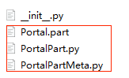
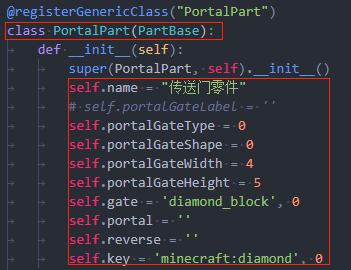
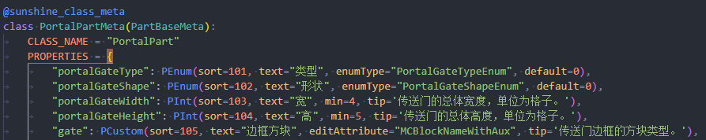
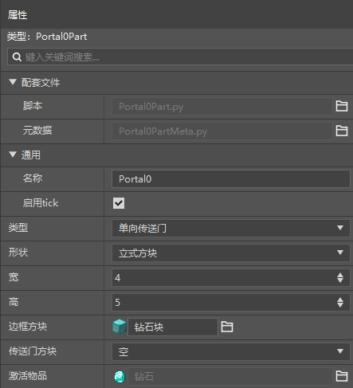
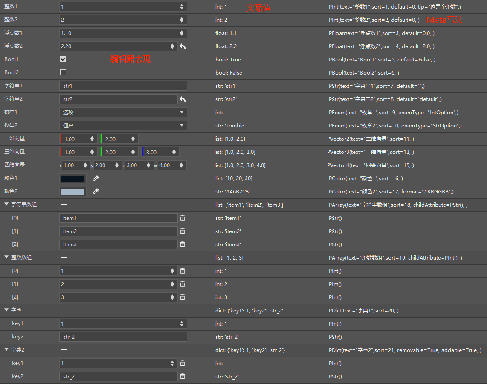
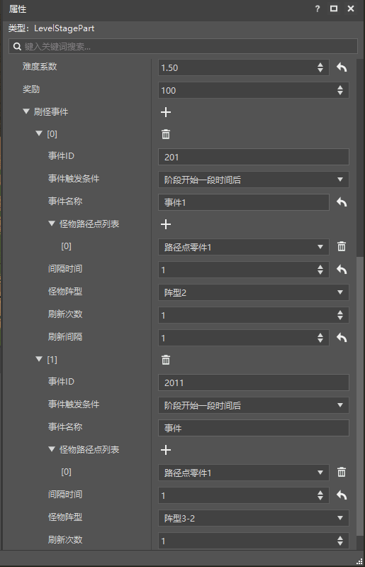
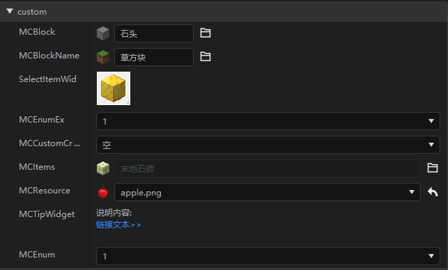
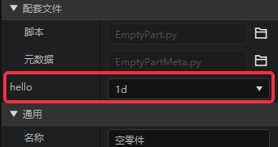
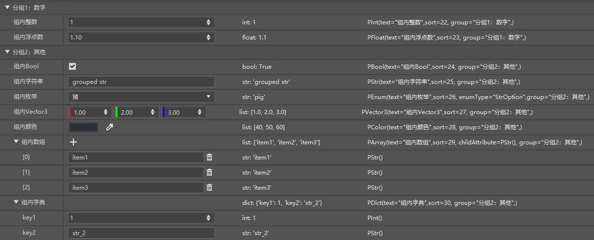

# Custom property panel 

## Preface 

A complete part generally has three main files. Taking PortalPart in the custom part as an example, it includes Portal.part, PortalMeta.py, and Portal.py. 

 

In Portal.py, a class PortalPart inherited from PartBase is defined. The instance attributes of this class, such as some variables starting with "self." in the "\__init__" method, can be configured through the editor's property panel. 

 

The PortalMeta.py file defines the editing method that each variable wants to be presented in the editor. 

 

Click the corresponding ".part" file in the editor to preview and edit the corresponding properties in the property panel. 

 

## Overview 

Currently, custom parts support editing all basic types of Python, namely: integer int, floating point float, Boolean bool, string str, dictionary dict, list list. In addition, corresponding support is also provided for some specific needs, such as drop-down list selection, multi-dimensional vector, etc. 

The figure below shows all the basic control styles and writing methods. The code can be found in the appendix. 

 

## Types and properties 

### Common properties 

| Property | Default value | Description | 
| :------- | :----- | :----------------------------------------------------------- | 
| default | None | Default value of the property. When the actual value is not equal to the default value, a button will be provided to set it as the default value. | 
| text | "" | Display name of the property in the editor | 
| sort | 0 | Attribute display order, the smaller the number, the closer it is to the front | 
| editable | True | Whether the property is editable in the editor (or vice versa, whether it is read-only) | 
| tip | "" | Tips displayed when the mouse moves over | 
| visible | True | Whether the property is visible | 
| group | "" | The group to which it belongs, which can be used for simple layout. (Only applicable to first-level nodes) | 

### Integer: PInt 

Extra attributes besides common attributes: 

| Attribute | Default value | Description | 
| :--- | :----- | :---------------------------------------------- | 
| min | None | Minimum value | 
| max | None | Maximum value |

| step | 1 | Step amount, that is, the difference in value modified by clicking the increase/decrease button in the control each time | 

### Floating point number: PFloat 

Extra properties except general properties: 

| Property | Default value | Description | 
| :-------- | :----- | :---------------------------------------------- | 
| min | None | Minimum value | 
| max | None | Maximum value | 
| step | 1.0 | Step amount, that is, the difference in value modified by clicking the increase/decrease button in the control each time | 
| precision | 2 | Number of decimal places | 

### Boolean value: PBool 

No extra properties 

### String: PStr 

Extra properties except general properties: 

| Property | Default value | Description | 
| :---- | :----- | :----------------------- | 
| regex | None | Regular expression that the content needs to match | 

### List: PArray 

Extra attributes besides common attributes: 

| Attribute | Default value | Description | 
| :--------- | :----- | :------------------------------------------ | 
| childAttribute | None | Meta definition of child element, such as: childAttribute=PStr() | 
| maxSize | 9999 | Maximum length | 

### Dictionary: PDict 

Extra attributes besides common attributes: 

| Attribute | Default value | Description | 
| :-------- | :----- | :-------------------------------------------------------- | 
| addable | False | Allows dynamic addition of child elements, the key of the child element needs to exist in this Meta definition. | 
| removable | False | Allows dynamic deletion of existing child elements | 

### Enumeration type: PEnum 

Extra properties besides common properties: 

| Property | Default value | Description | 
| :------- | :----- | :----------------------------------------------------------- | 
| enumType | "" | Enumeration type data name defined using DefEnum, such as DefEnum("MyEnum", {1: "a", 2: "b"}), just fill in "MyEnum" here |


### Multidimensional vector: PVector2, PVector3, PVector4 

Extra properties besides common properties: 

| Property | Default value | Description | 
| :-------- | :----- | :---------------------------------------------- | 
| min | None | Minimum value | 
| max | None | Maximum value | 
| step | 1.0 | Step amount, that is, the difference modified by clicking the increase/decrease button in the control each time | 
| precision | 2 | Number of decimal places | 

### Color: PColor 

Extra properties besides common properties: 

| Property | Default value | Description | 
| :----- | :----- | :----------------------------------------------------------- | 
| format | (0,0,0) or "#000000" | Color format: When format="#RRGGBB" (only this one now), the actual value is like: "#A6B7C8". When the format parameter is not passed or the passed value is not supported, the default format (r, g, b) will be used. For example: (244, 37, 18)| 

### Object array: PObjectArray 

Extra properties besides common properties: 

| Property | Default value | Description | 
| :---------- | :----- | :--------------------------------- | 
| itemCreator | None | Custom class inherited from PropertyListObject | 

For more complex editing data, we can use object arrays in addition to using list PArray and dictionary PDict for multi-layer nesting. 

First we need to create a new editing object class, it needs to inherit PropertyListObject 

```python 
from Meta.PropertyObject import sunshine_property_object 
from Preset.Model.PresetDataMeta import PropertyListObject 

@sunshine_property_object 
class EventDataObject(PropertyListObject): 
PROPERTIES = {} 
``` 

Use EventDataObject in the object array PObjectArray: 

```python 
@sunshine_class_meta 
class LevelStagePartMeta(StageBasePartMeta): 
CLASS_NAME = "LevelStagePart" 
ObjectArrayDef = { 
"events": EventDataObject, 
}

PROPERTIES = { 
"events": PObjectArray( 
text="spawning event", sort=1004, group="stage", 
itemCreator=EventDataObject 
) 
} 
``` 

The key of ObjectArrayDef and PROPERTIES must be consistent, and EventDataObject is passed in as the itemCreator parameter. 

In addition to making the hierarchy clearer, this method can also isolate the obj passed in by the custom function func. 

In the above example, the property func in EventDataObject passes in EventDataObject, not the root node LevelStagePart. 

When you need to control the mutual influence of different properties of a single object in the list, you must use an object array, such as using the condition property to control the visibility of dependencyEvents and startTime properties. 

```python 
class EventDataObject(PropertyListObject): 
PROPERTIES = { 
"classType": PStr(sort=0, text="Class name", default="SpawnMobEvent", visible=False), 
"condition": PEnum(sort=2, text="Event trigger condition", enumType='ConditionType'), 
"dependencyEvents": PArray( 
sort=3, text="Condition event", childAttribute=PCustom(text='Event ID', sort=0, editAttribute='MCEnum', extend=getEvents), 
func=lambda obj: {'visible': obj.condition == "dependency"} 
), 
"startTime": PInt( 
text="Interval time", sort=4, default=10, 
func=lambda obj: {'visible': obj.condition == "timer"} 
), 
} 
``` 

The writing method of each editing item of PROPERTIES here is consistent with the previous introduction. 

Actual effect: 

 

### Others 
- PCoordinate 
Inherited from PVector3, it has the same properties and functions as PVector3. Two auxiliary buttons are added on the basis of the original functions, namely selecting the map position and locating the position. 

- PGameObjectArea 
Area selection component, visualizes the current set area size. 
Inherited from PDict, the children field must be: 
```python 
{ 
'min': PVector3(sort=0, text="Vertex 1"), 
'max': PVector3(sort=1, text="Vertex 2"), 
'dimensionId': PInt(sort=2, text="Dimension")

} 
``` 

- PCustom 
Used for extended custom control types, editAttribute attribute is used to set the extended control type 
Note: 

- Many properties of PCustom vary with different editAttribute settings. 

- customFunc has nothing to do with the func attribute. func is used to dynamically set properties, that is, the text, visible, sort and other properties of the control can be dynamically modified through the Func attribute. customFunc is used by some extended components to set data update functions. 

Example code:
   ```python
	PROPERTIES = {
		"MCEnum": PCustom(sort=0, text="MCEnum", group="custom", editAttribute="MCEnum", customFunc=updateMCEnum),
		"MCBlock": PCustom(editAttribute="MCBlock", default=('dirt', 0), group="custom", sort=1),
		'MCBlockName': PCustom(sort=2, editAttribute="MCBlockName", group="custom"),
		"SelectItemWidget": PCustom(sort=3, editAttribute="SelectItemWidget", group="custom"),
		"MCEnumEx": PCustom(sort=4, editAttribute="MCEnumEx", customFunc=updateMCEnum, group="custom"),
		"MCCustomCreature": PCustom(sort=5, editAttribute="MCCustomCreature", group="custom"),
		'MCItems': PCustom(
			sort=6, editAttribute='MCItems', 
default=('minecraft:apple', 0), 
withNamespace=False, 
withAuxValue=True, 
isBlock=None, 
itemCategory=8, 
categoryList=[8, 31], 
group="custom" 
), 
'MCResource': PCustom( 
sort=7, tip='The texture displayed by this item in the backpack grid.', 
editAttribute="MCResource", 
baseFolder=["textures"], 
relativePath=['items'], 
extension='.png', 
default='textures/items/apple', 
description='image', 
withExtension=True, 
group="custom" 
), 
'MCTipWidget': PCustom( 
group="custom", 
sort=8, editAttribute="MCTipWidget", text="MCTipWidget", 
content="Description:", 
linkText="Link text>>", 
linkUrl="https://www.baidu.com") 
} 
```

Effect: 
 

Below are instructions for using various extended controls: 

- editAttribute="MCEnum": 

This is a custom enumeration control. Compared with PEnum, this one will automatically add the default enumeration sub-item "":"empty" 

Follow-up properties: 

1. customFunc=updateMCEnum //Required 
updateMCEnum is a function whose parameter is the current part logic object and whose return value is a dictionary of str type with both key value and value. The return value will be displayed as the option data of the enumeration control. 
1. searchable=False 
Whether to display in search style 

example： 

```python 
PROPERTIES = { 
"MCEnum": PCustom(sort=0, text="MCEnum", editAttribute="MCEnum", customFunc=updateMCEnum), 
} 
... 
def updateMCEnum(obj): 
return { 
"A" : "1", 
"B" : "2", 
"C" : "dd", 
} 
``` 

- editAttribute="MCTipWidget": 

This is a custom description control, used to display some necessary tips. Note that there should be no / at the end of the link. 

example： 
```python 
'MCTipWidget': PCustom( 
group="custom", 
sort=8, editAttribute="MCTipWidget", text="MCTipWidget", 
content="Description content:", 
linkText="Link text>>", 
linkUrl="https://www.baidu.com") 
``` 

- editAttribute="MCBlock": 

Select the control of the original block. The return value is a tuple whose first element is the identifier without namespace, such as: ('birch_button', 0) 

example:


```python 
"MCBlock": PCustom( 
text="Native block", editAttribute="MCBlock", default=('dirt', 0) 
) 
``` 

- editAttribute="MCBlockName": 

Select the widget of the original block, the return value is the identifier of the block, such as "minecraft:stone" 

example： 

```python 
'MCBlockName': PCustom(sort=4, editAttribute="MCBlockName"), 
``` 

- editAttribute="SelectItemWidget": 

Select the widget of the mc item, only display the icon, the return value is a dict of the form {'itemName': 'minecraft:stripped_crimson_hyphae', 'auxValue': 0}, 

example： 

```python 
"SelectItemWidget": PCustom(sort=11, text="Item", 
editAttribute="SelectItemWidget"), 
``` 

- editAttribute="MCEnumEx" 

Same effect as editAttribute="MCEnum", can support the situation where the current value is not in the enumeration list. 

- editAttribute="MCCustomCreature": 

Customize creature selection control, the return value is the creature's identifier 

example： 

```python 
"MCCustomCreature":PCustom(sort=3, editAttribute="MCCustomCreature"), 
``` 

- editAttribute='MCItems': 

Select the control of mc items, display the small icon and name 
Follow attributes: 
1. withNamespace: bool(False) 
Return whether the value has a namespace. The default value is False 


2. withAuxValue：bool(True) 
Whether to return the Aux value, which is used to specify the sub-item category id. The default value is True 

3. isBlock：bool(None) 

Whether the selection list needs blocks, there are three cases: None all items, True only blocks, False only no blocks, the default value is None 

4. itemCategory：int(31) 
The default category is selected, used with categoryList 

Architecture = 1 
Nature = 8 
Items = 4 
Equipment = 2 
All = 31 

5. categoryList；[int] 

This is an array used to set the content of the item category list page. For item categories, refer to itemCategory. The default value is None, which will display all category pages 

example： 

```python 
'MCItems': PCustom( 
sort=4, 
editAttribute='MCItems', 
default=('minecraft:apple', 0), 
withNamespace=False, 
withAuxValue=True, 
isBlock=None, 
itemCategory=16, 
categoryList=[16,31] 
), 
... 
self.MCItems = ('end_bricks', 0) 
``` 
Return value: If there are multiple default values, use tuple type, withAuxValue is related to the setting 

- editAttribute="MCResource": 

File resource selection control, returns the relative path relative to the current archive path 

Follow attributes: 
1. extension: [str] 

Filter file suffix 

2. pack: str(None) 

If it is a "b" string, the folder in the behavior pack is used as the search directory, otherwise it is the folder of the resource pack, the default value is None


3. baseFolder:[str] 

String array, folder path array, used to set the search path, the returned result does not include this path. Default value [] 

4. relativePath:[str] 

String array, folder path array, continue to set the search path based on baseFolder, and the returned result includes this path. Default value [] 

5. recursive: bool(False) 

Whether to recursively traverse files to search for files. If False, only files under the current path (determined by pack, baseFolder, relativePath) will be searched. The default value is False 

6. withExtension:bool(False) 

Whether the return value contains the file suffix 

example: 

```python 
'MCResource': PCustom( 
sort=4, tip='The texture displayed by the item in the backpack grid.', 
editAttribute="MCResource", 
baseFolder = ["textures"], 
relativePath=['items'], 
extension='.png', 
default='textures/items/apple', 
description='image', 
withExtension= True, 
) 
... 
self.MCResource = "items/apple.png" 
``` 

- Native/custom creature drop-down list 

In the editor, we provide an EntityManager singleton, which provides the following interfaces: 

- getCreatureEnum: native creatures and custom creatures 
- getExtraCreatureEnum: custom creatures 

Using these interfaces, combined with PCustom, you can customize the editor's creature drop-down list. The following is an example of a built-in entity part: 

```python 
from Meta.ClassMetaManager import sunshine_class_meta 
from Meta.TypeMeta import PBool, PStr, PInt, PCustom, PVector3, PVector3TF, PEnum, PDict, PFloat, PArray, PVector2
  from MC.World.EntityManager import EntityManager
  from Preset.Model import PartBaseMeta
  
  @sunshine_class_meta

class EntityBasePartMeta(PartBaseMeta): 
CLASS_NAME = "EntityBasePart" 
PROPERTIES = { 
"engineType": PCustom(sort=101, group="Entity", text="Entity Type", editAttribute="MCEnum", customFunc=lambda _: EntityManager.getCreatureEnum()), 
} 
``` 

- Native/custom item selection 

```python 
"item": PCustom(sort=102, text="Type", editAttribute='MCItems', withAuxValue=True, withNamespace=True), 
``` 

- func Property description example 

```python 
def updateMCEnum(obj): 
return { 
"d": "2", 
"b": "1", 
} 
def updateMCEnum1(obj): 
return { 
"d": "2d", 
"b": "1d", 
} 

def fun1(): 
return {"visible": True, "text": "hello", "customFunc": updateMCEnum1} 

@sunshine_class_meta 
class EmptyPartMeta(PartBaseMeta): 
CLASS_NAME = "EmptyPart" 
PROPERTIES = { 
"test": PCustom(sort=1, text="test", func=fun1, editAttribute="MCEnum", customFunc=updateMCEnum) 
} 
``` 
 
As shown above, the component dynamically modifies the text attribute and customFunc attribute through the func attribute. The function pointed to by func will be called when the current editing data changes. 


## Appendix:

### Example

#### MyPart.py

```python
from Preset.Model.PartBase import PartBase
from Preset.Model.GameObject import registerGenericClass


@registerGenericClass("MyPart")
class MyPart(PartBase):
   def __init__(self, uuid):
      super(SafeAreaData, self).__init__(uuid)
      self.int1 = 1
      self.int2 = 2
      self.float1 = 1.1
      self.float2 = 2.2
      self.bool1 = True
      self.bool2 = False
      self.str1 = "str1"
      self.str2 = "str2"
      self.enum1 = 1
      self.enum2 = "zombie"
      self.vector2 = [1.0, 2.0]
      self.vector3 = [1.0, 2.0, 3.0]
      self.vector4 = [1.0, 2.0, 3.0, 4.0]
      self.color1 = [10, 20, 30]      self.color2 = "#A6B7C8"
      self.array1 = ["item1", "item2", "item3"]
      self.array2 = [1, 2, 3]
      self.dict1 = {"key1": 1, "key2": "str_2"}
      self.dict2 = {"key1": 1, "key2": "str_2"}

      self.groupedInt = 1
      self.groupedFloat = 1.1
      self.groupedBool = True
      self.groupedStr = "grouped str"
      self.groupedEnum = "pig"
      self.groupedVector3 = [1.0, 2.0, 3.0]
      self.groupedColor = [40, 50, 60]
      self.groupedArray = ["item1", "item2", "item3"]
      self.groupedDict = {"key1": 1, "key2": "str_2"}
```

#### MyPartMeta.py

```python
from Meta.ClassMetaManager import sunshine_class_meta
from Meta.EnumMeta import DefEnum
from Meta.TypeMeta import PINt, PEnum
from Preset.Model import PartBaseMeta


DefEnum("IntOption", {1: "Option 1", 2: "Option 2"})
DefEnum("StrOption", {"zombie": "zombie", "pig": "pig"})


@sunshine_class_meta

class SafeAreaDataMeta(PartBaseMeta): 
CLASS_NAME = "SafeAreaData" 
PROPERTIES = { 
"int1": PInt(text="Integer 1", sort=1, default=1, tip="This is an integer"), 
"int2": PInt(text="Integer 2", sort=2, default=1), 
"float1": PFloat(text="Floating point number 1", sort=3, default=1.1), 
"float2": PFloat(text="Floating point number 2", sort=4, default=2.0), 
"bool1": PBool(text="Bool1", sort=5, default=False), 
"bool2": PBool(text="Bool2", sort=6), 
"str1": PStr(text="String 1", sort=7, default=""), 
"str2": PStr(text="String 2", sort=8, default="default"), 
"enum1": PEnum(text="Enum1", sort=9, enumType="IntOption"), 
"enum2": PEnum(text="Enum2", sort=10, enumType="StrOption"), 
"vector2": PVector2(text="Two-dimensional vector", sort=11), 
"vector3": PVector3(text="Three-dimensional vector", sort=13), 
"vector4": PVector4(text="Four-dimensional vector", sort=15), 
"color1": PColor(text="Color1", sort=16), 
"color2": PColor(text="Color2", sort=17, format="#RRGGBB"), 
"array1": PArray(text="String array", sort=18, childAttribute=PStr()), 
"array2": PArray(text="Integer array", sort=19, childAttribute=PInt()), 
"dict1": PDict(text="Dictionary1", sort=20, children={ 
"key1": PInt(), 
"key2": PStr(), 
}), 
"dict2": PDict(text="Dictionary 2", sort=21, removable=True, addable=True, children={ 
"key1": PInt(), 
"key2": PStr(), 
}), 
"groupedInt": PInt(text="Integer in group", sort=22, group="Group 1: Number"), 
"groupedFloat": PFloat(text="Floating point in group", sort=23, group="Group 1: Number"), 
"groupedBool": PBool(text="Bool in group", sort=24, group="Group 2: Other"), 
"groupedStr": PStr(text="String in group", sort=25, group="Group 2: Other"), 
"groupedEnum": PEnum(text="Enum in group", sort=26, enumType="StrOption", group="Group 2: Other"), 
"groupedVector3": PVector3(text="Vector3 in group", sort=27, group="Group 2: Other"), 
"groupedColor": PColor(text="Color in group", sort=28, group="Group 2: Other"), 
"groupedArray": PArray(text="Array in group", sort=29, childAttribute=PStr(), group="Group 2: Other"), 
"groupedDict": PDict(text="Dictionary in group", sort=30, group="Group 2: Other", children={ 
"key1": PInt(), 
"key2": PStr(), 
}), 
} 
``` 

#### Actual effect 

 

