# Custom attribute part sample template 

- As far as the current parts are concerned, most functional requirements still require developers to manually edit the part code to implement them. The functional requirements are abstracted into specific attributes, and such attributes are exposed in the editor in a visual form. 
Developers can use these parts to implement gameplay. The visual form improves development efficiency, and such parts can also be reused. The inspiration for attribute parts comes from this. 

- At the same time, an attribute template part is provided in the preset editor as a coding reference. The following content will focus on the implementation process of this part. 

- It is emphasized that all functions are performed in the new version of the editor, and the related works are all new versions. 

## Create an attribute template part 

- The creation entry of the attribute template part is the same as other template parts. Click Create Part in the preset editor, and you can select the part in the pop-up interface, as shown in the figure below. 

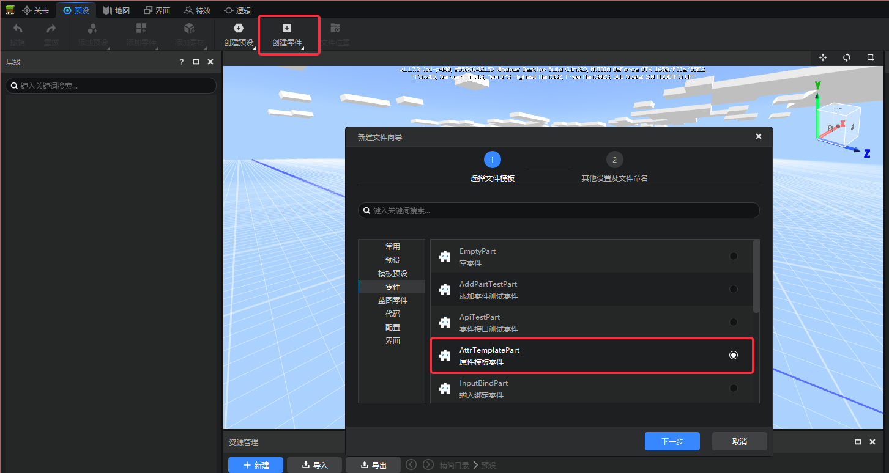 

- After checking and confirming twice, the attribute template part is successfully created, and the file bar below will also open its directory structure, as shown in the figure below.

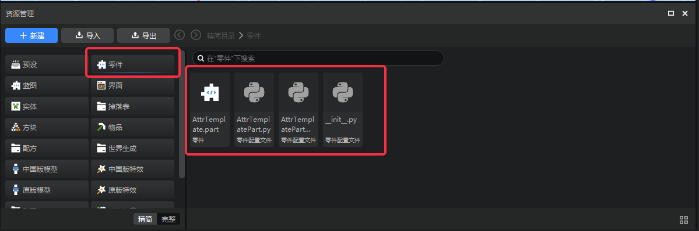 

- It is clearer to open it in the file system. The files marked with red circles in the figure below are the contents that will be modified. AttrTemplate.part is the part body, including the part file path, etc.; 
AttrTemplatePart.py is the part data attribute logic body; AttrTemplatePartMeta.py is the part interface display logic body, which will be introduced in detail later. 

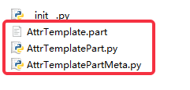 

- The writing of part function logic can be modified directly based on the content of the created attribute template part file. 

## Attribute setting framework 

- The implementation of attribute template parts depends on the underlying attribute setting framework. The framework aims to reduce the writing of repeated logic, including attribute management, modifying attributes only when the attributes are not equal to the default values, and simplifying the attribute setting function into attribute configuration form. 

- Parts include data logic and interface logic. The corresponding contents will be introduced in order. 

- The basic tutorial of part development is detailed on the official website [Part Development | Minecraft Developer Official Website (163.com)](https://mc.163.com/dev/mcmanual/mc-dev/mcguide/20-%E7%8E%A9%E6%B3%95%E5%BC%80%E5%8F%91/14-%E9%A2%84%E8%AE%BE%E7%8E%A9%E6%B 3%95%E7%BC%96%E7%A8%8B/2-%E6%B7%B1%E5%85%A5%E7%90%86%E8%A7%A3%E9%9B %B6%E4%BB%B6/0-%E9%9B%B6%E4%BB%B6%E5%BC%80%E5%8F%91.html?catalog=1)

## Data logic

- Data logic contains part data and is also the main body of logical operations. In the previous file structure, AttrTemplatePart.py is the main body of data logic. 

- In order to reduce the amount of code in the part class, the framework adds the concept of attribute class. The attribute base class BasicPartSdkAttr must be inherited. The attribute class writes attribute-related configurations, and the part class only calls the attribute class method. 
The py file of data logic contains the part attribute class PartAttr and the part class AttrTemplatePart, as shown in the figure below. 

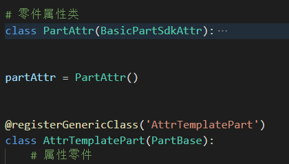 

### Attribute group 

- The framework defines the concepts of attributes and attribute groups. Attributes of the same type belong to one attribute group, which is not only a collection unit in data, but also belongs to the same attribute column in interface performance; 
Attribute implementation depends on the underlying SDK attributes, and the corresponding interface needs to be encapsulated in the part class. For example, the attribute is "whether to turn on the color correction effect". The interface SetEnableColorAdjustment is encapsulated in the part class, as shown in the figure below. In the attribute class, this interface name is used as a certain attribute, and the name must be exactly the same. 

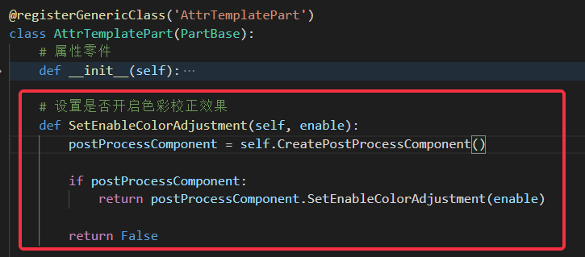

- After clarifying the above attribute concepts, we will introduce the concept of attribute group. From the above logic, we know that the attribute group contains attributes of the same type, and each attribute can find an interface with the same name in the part class; the attribute configuration logic is in the attribute class. The template defines a colorAdjustAttrs attribute group, which contains two attributes, one is the SetEnableColorAdjustment attribute mentioned above, and the other is the "adjust the tint of the screen color" attribute SetColorAdjustmentTint, as shown in the figure below. 

- As can be seen in the figure, the attribute group is stored in the attribute as a class variable, and the data structure is a dictionary (the key is the attribute name and the value is the parameter default value). The SetEnableColorAdjustment attribute parameter is simple; the SetColorAdjustmentTint attribute parameter is multi-parameter, and its parameters are stored in a dictionary; currently, due to the limitations of the underlying logic, the attribute group can only be written as a one-line code structure, and optimization countermeasures will be considered later. 

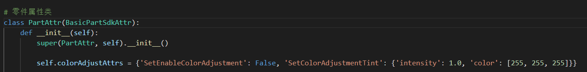 

### Additional configuration information 

- Currently, there are three issues that have not been resolved: attributes in the same attribute group have pre-dependencies, how the framework distinguishes different attribute interface parameter types, and how to distinguish part codes when running on both the client and the server. 

- The original design of the framework contains configuration data, which is used to map the attributes in the attribute class to the corresponding part class. See the figure below. Simply add the configuration data to the pre-attribute dependency order. The configuration data format is a dictionary. The element is 'Grouping class variable name': ['Dependent pre-attribute'] 

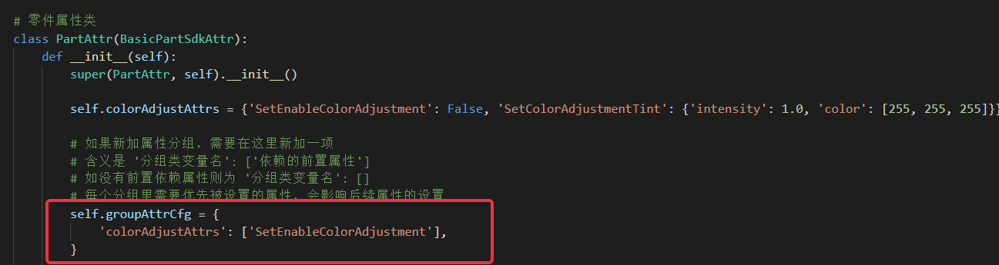 

- Determine the interface parameter type and distinguish the client and server. Both problems are processed by configuration data. It may cause configuration data redundancy, but it reduces the logical consumption time of runtime judgment. It is relatively effective when the number of parts is large. 

- Determine the interface parameter type problem, define the multi-paramAttrs list and the composite parameter list multiPlexAttrs, see the first annotation box in the figure below, store the corresponding parameter attributes respectively, single parameter attributes do not need to be processed, composite parameters refer to interfaces that can be applied multiple times, and there is an "add banned items" attribute AddBannedItem in the template, which can create a template reference. 

- To distinguish between client and server issues, the server attribute list serverSdkAttrs, client attribute list clientSdkAttrs, and dual-end list serverAndClientSdkAttrs are defined. The attribute base class uses the server attribute list serverSdkAttrs as the basis for judgment. The server attributes can be filled in. The element format is 'attribute name'; serverAndClientSdkAttrs is a dual-end attribute; the clientSdkAttrs list generally does not need to be filled in, but the CheckAttrServerClient method can also be rewritten to use the client attribute list. 

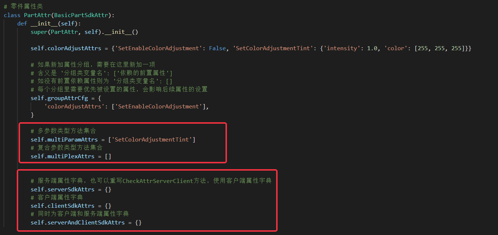 

### Attribute interface call 

- Attribute class instantiation, call the attribute class related method in the part class, and the attribute setting will take effect, see the first annotation box in the figure below. 

- Attributes are added by calling the SdkAttrsInit method in the __init__ method of the part class, and the parameter is the part class itself, see the second annotation box in the figure below. 

- To set the properties, you can call them in the InitClient method and InitServer method of the part class, as shown in the third annotation box in the figure below. In actual situations, if the part properties only include client properties, you only need to call the property setting method in the InitClient method. Similarly, if the part properties only include server properties, you only need to call them in the InitServer method. 

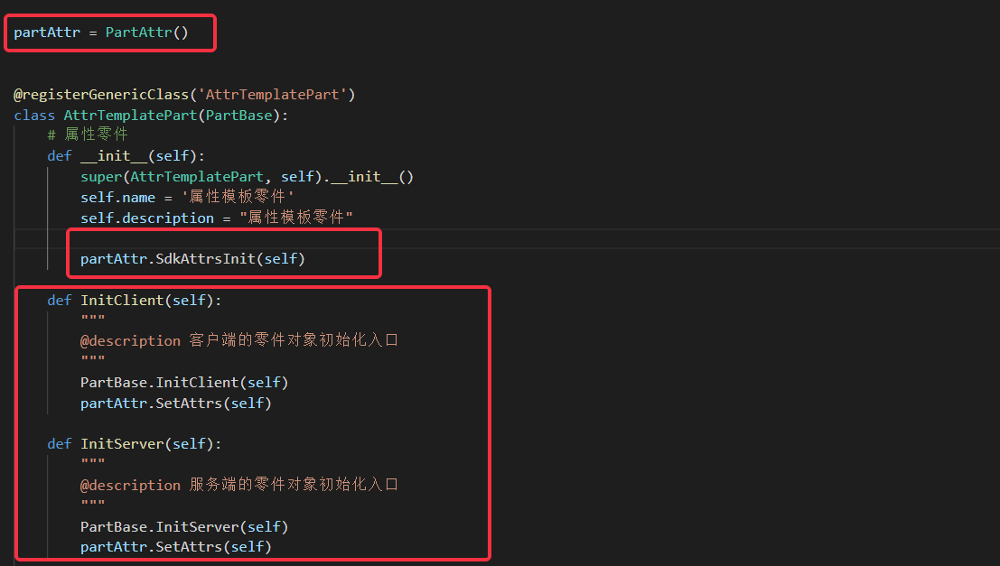 

- The property effects set by the part are partly related to the presets to which they are attached. For post-processing parts, the properties set are displayed on the screen. When the part is uninstalled or destroyed, its effects need to be restored. The framework provides 
ResetSingleAttr for resetting a property and ResetAllAttr for resetting all properties. Developers can use them selectively, as shown in the figure below, with two ResetSingleAttr calls and one ResetAllAttr call. 
The actual effects are the same, both of which eliminate the post-processing effect settings of the part. The calling order of the ResetSingleAttr method also needs to follow the rules of the preceding attributes. The preceding attributes of the attribute group are destroyed at the end. 

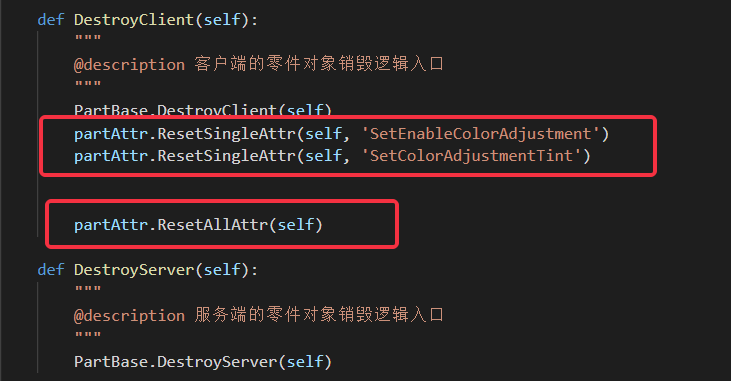 

## Interface Meta Logic 

- The interface logic is implemented by writing the Meta class. The data part of the data logic is exposed on the interface in the Meta class. The detailed Meta class writing logic is in the 
Official website has a detailed tutorial [Custom Attribute Panel | My World Developer Official Website (163.com)](https://mc.163.com/dev/mcmanual/mc-dev/mcguide/20-%E7%8E%A9%E6%B3%95%E5%BC%80%E5%8F%91/14-%E9%A2%84%E8%AE%BE%E7%8E%A9%E6%B3%95%E7%BC%96%E7 %A8%8B/2-%E6%B7%B1%E5%85%A5%E7%90%86%E8%A7%A3%E9%9B%B6%E4%BB%B6/1-%E8%87%AA%E5%AE%9A%E4%B9%89%E5%B1%9E%E6%80%A7%E9%9D%A2%E6%9D%BF.html?catalog=1) 

- The AttrTemplatePartMeta.py file in the file structure is the Meta-related logic of the attribute template part. 

- Related to the data logic, the interface Meta class contains both the attribute Meta class and the part Meta class. The attribute Meta class contains data configuration, and the part Meta class calls related interfaces. See the example in the figure below. The attribute Meta class needs to inherit the attribute Meta base class BasicPartSdkAttrMeta.

- Similar to the idea of setting data class, Meta attribute class also contains attribute configuration content, which needs to be instantiated and used in the part Meta class, as shown in the figure below. 

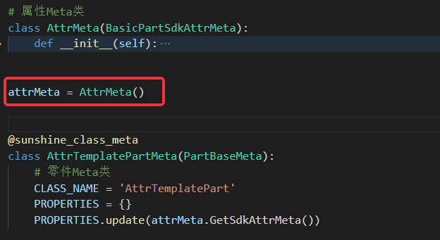 

- In terms of attribute configuration, the structure definition is similar to the data logic. The colorAdjustAttrs attribute group stores the interface control definition of the attribute. All attribute names correspond to the attributes in the part class one by one. See the first annotation box in the figure below for details. 

- The class variable attrgroupMetaCfg stores the attribute group configuration that needs to be added to the part Meta. The element format is a key-value pair "'Grouping class variable name': ['Grouping name', whether to expand by default, 'URL address']", where 'URL address' is not a required item. See the second annotation box in the figure below for reference. 

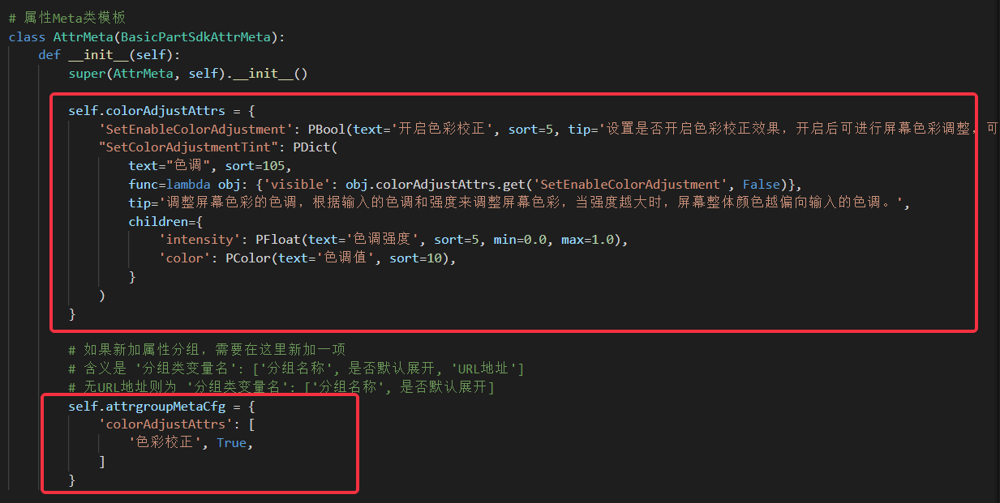 

### Special URL address 

- For the above URL address, it means that the URL address will be set in the same attribute group. If there is a special requirement, such as a certain attribute group has a URL address, but one of the attributes 
URL is empty or a unique URL, refer to the figure below. If hrefTip is 'Empty', the single attribute URL link is cancelled. If hrefTip is 'Specific URL', 
then the single attribute link is a specific link, see the SetEnableColorAdjustment attribute in the figure below. Note that tip is a required content, which is the prompt text content. 

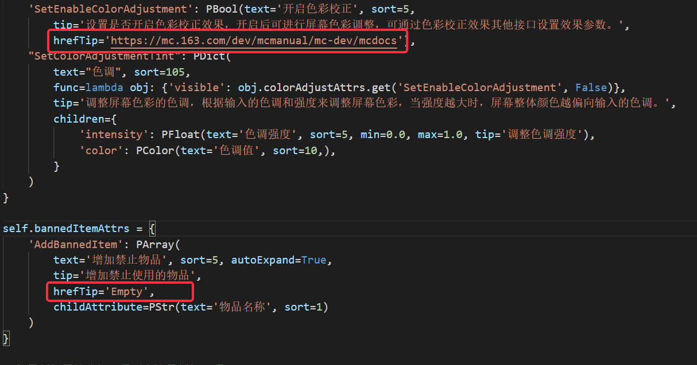 

- The attribute Meta class instance is relatively simple to use in the part Meta class. As shown in the figure below, call the GetSdkAttrMeta method in the part Meta class and add the return value to the PROPERTIES attribute.

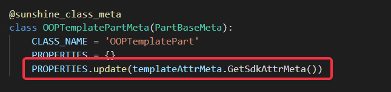 

### Part Configuration 

- In the current structure of the attribute template part created earlier, there is a file called AttrTemplate.part, which contains the basic parameter configuration of the part and is also the part body, as shown in the figure below 
- The content that needs to be manually modified includes the folder name directoryPath, the part class name AttrTemplatePart, and the part Meta class name metaType. In general, the folder name does not need to be modified, but the part class name and part Meta class name may be modified by the developer and need to be reconfigured. 

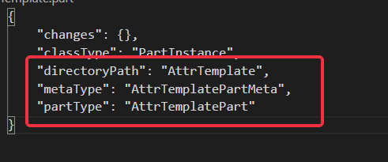 

## Part Function Acceptance 

### Property Setting 

- The above is the coding logic of the part function. The acceptance of the part function still needs to be performed in the editor. The acceptance demonstration directly uses the attribute template part. In the file structure in the figure below, the part body AttrTemplate.part is the main unit of operation in the editor.

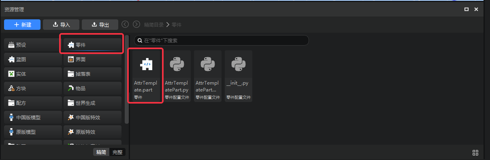 

- Click on the part body in the editor, and the attributes added to the part will appear on the right interface, which are also classified by attribute group, as shown in the figure below 

- Modify the part body attributes, the part code will be modified synchronously, and the attribute default value will also be modified, resulting in the ineffectiveness of subsequent attribute settings 
- If some attributes are not displayed in the right attribute bar, it is likely that the attribute name or data type in the part class attribute and the part Meta class does not match. Check the code 

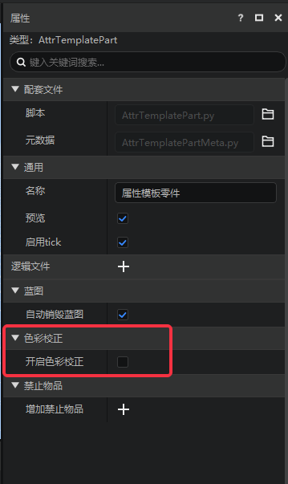 

- The logic will be executed only when the part is attached to the preset. At the same time, in order to avoid the default value in the code being modified due to the modification of the part body, attach the part to the preset to debug the effect. In the demonstration, an empty preset is created and the part body is directly attached to the empty preset, as shown in the figure below 

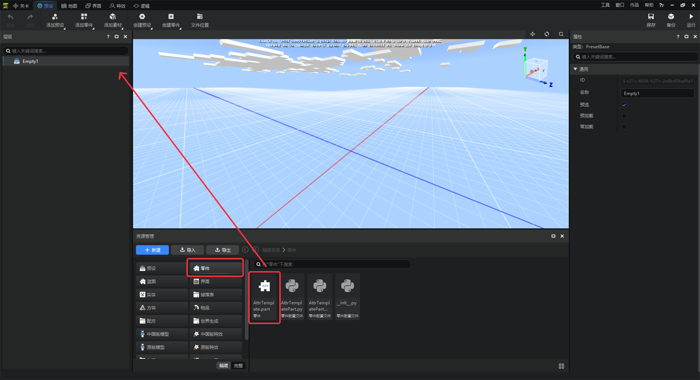 

- After successfully attaching, click on the part under the empty preset. The property bar on the right already has the corresponding property. Check the color correction property and change the hue value to green. Click Save in the upper right corner. 

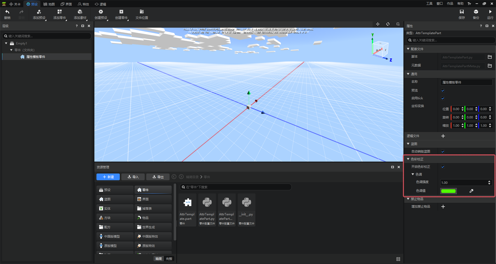 

### Run Acceptance 

- The effect acceptance needs to be switched to the level editor. Drag the empty preset Empty1 of the attached attribute template part to the scene, as shown in the figure below 
- Note! Add-on works do not save maps. For the corresponding presets, you need to check the preload option in the preset editor interface. After checking, you do not need to follow the above drag and drop steps; for map works, this is not necessary. The demonstration content is map works. 

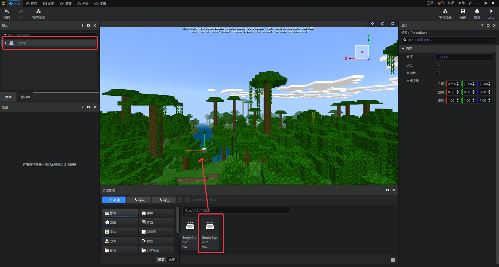 

- To debug the part effects, click Run in the upper right corner and check version 2.1 to start running. 

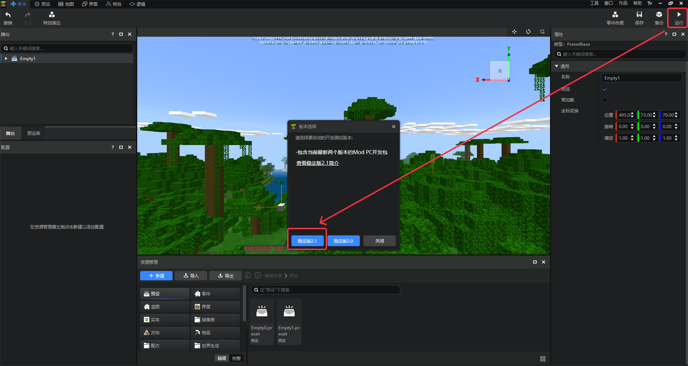 

- Click Run, and in the game interface, the post-processing properties are successfully effective. See the figure below. 

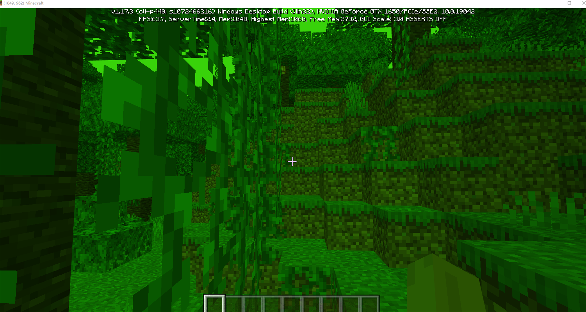