# Part Communication 

This tutorial will introduce the server-client communication function of the part and how to create and use it in the editor. 
Before that, it is recommended to read the previous sample [Tutorial][Presets and Parts] according to the process and actually operate it according to the steps. You also need to understand the difference between the server and the client, that is, ([Client-Server Architecture][Server and Client]) 

## Pre-Guide 

First, let's open a new version of the editor and create a blank template, either a map or an addon 
1. Click New 
2. Select the Blank Map Template 
3. Click Upgrade Work 
4. Confirm the content in the pop-up dialog box and click Upgrade 

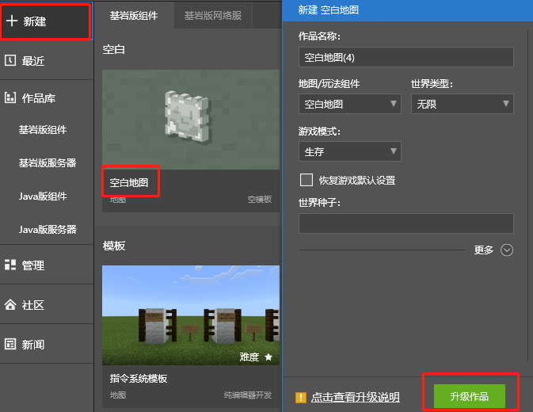 

This will enter the new version of the editor interface 
1. Click the Preset Editor (for subsequent actual use) 
2. Click the New button in the Parts category in the Resource Manager to create a blank part 
3. The sample is named A (meaningless word naming is not recommended) 

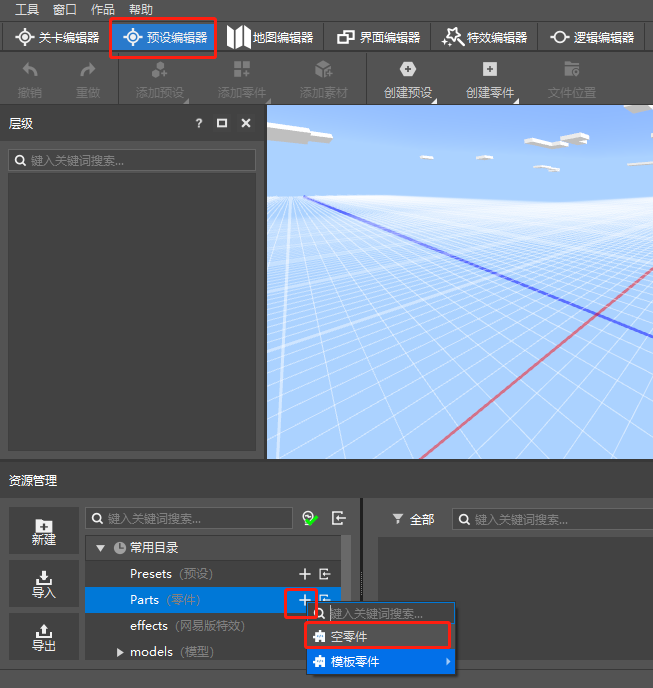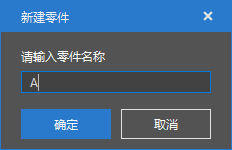 

Then a part is successfully created 
1. Here we change the running name of the part to A to facilitate the subsequent result display 
2. Open the script APart.py and start writing script tests 

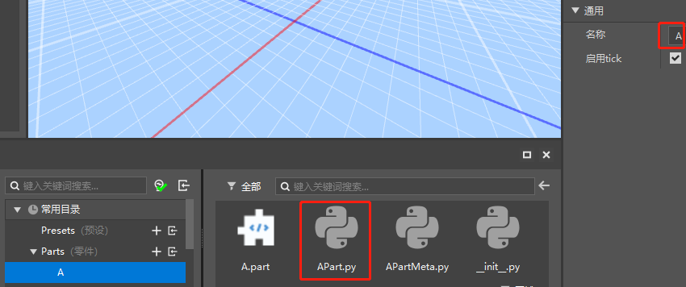 

--- 

## Sample script writing 
Part communication has many different interfaces, and they all have corresponding usage methods 

### Communication between the server and the client of a single part 

+ Logic description: Every 20 seconds (20 * 30 = 600 frames), the client notifies the server that it needs to adjust the coordinates. After receiving the notification, the server adjusts the client player's coordinates 50 grids upward and displays "takeoff" on the player's game interface 

+ API description: 
> [BroadcastEvent][BroadcastEventUrl] Server/Client Broadcast events to server/client, does not support cross-network 
> 
> [ListenSelfEvent][ListenSelfEventUrl] Listens for events from this part 
> 
> [NotifyToServer][NotifyToServerUrl] Sends events to the server, supports cross-network communication 
> 
> [NotifyToClient][NotifyToClientUrl] Sends events to the specified client, supports cross-network communication 
> 
> [BroadcastToAllClient][BroadcastToAllClientUrl] Notifies all clients of the triggered event, supports cross-network communication 


+ Code example: [here][Code_Url] 
```python 
class APart(PartBase): 
def __init__(self): 
super(APart, self).__init__() 
# Part name (the name was changed to A in the previous step) 
self.name = "A" 
# Frame number variable is used for subsequent logic judgment 
self.tickIndex = 0 

def printSelfMsg(self, msg): 
# Distinguish whether the client part is printed or the server part is printed 
print("client:" if self.isClient else "server:", msg) 

# Logical processing function 
def OnHandleClientEvent(self, msg): 
if "msg" in msg: 
# Print the received message 
self.printSelfMsg(msg["msg"]) 
if "id" in msg: 
# Processing logic 
player = msg["id"] 
# Get the current position of the player sending the message 
pos = list(self.GetEntityFootPos(player)) 
pos[1] += 50 
# Set the position of the player 
self.SetEntityFootPos(player, tuple(pos)) 
# Display red text on the client of the player who sent the ClientEvent event 
self.NotifyOneMessage(player, "Take off!", "§c") 
# Interface usage effect display, send LogicEvent event to the specified client on the client 
self.NotifyToClient(player, "LogicEvent", "from part {}_OnHandleClientEvent_NotifyToClient_{}".format(self.name, self.tickIndex)) 

def InitClient(self): 
# Listen to MsgEvent and LogicEvent events within itself 
self.ListenSelfEvent("MsgEvent", self, self.printSelfMsg) 
self.ListenSelfEvent("LogicEvent", self, self.printSelfMsg) 

def InitServer(self): 
# Listen to MsgEvent and LogicEvent events within itself 
self.ListenSelfEvent("MsgEvent", self, self.printSelfMsg) 
self.ListenSelfEvent("LogicEvent", self, self.OnHandleClientEvent) 

def TickClient(self): 
self.tickIndex += 1 
if self.tickIndex % 600 == 0: 
# Broadcast MsgEvent event to verify the differences between the other two Notify interfaces 
self.BroadcastEvent("MsgEvent", "tickClient_BroadcastEvent_Msg") 
# Send LogicEvent event from client to server, and send local player's id and corresponding message 
self.NotifyToServer("LogicEvent", { 
"id": self.GetLocalPlayerId(),

"msg": "from player {} part {}_TickClient_NotifyToServer_{}".format(self.GetLocalPlayerId(), self.name, self.tickIndex) 
}) 

def TickServer(self): 
self.tickIndex += 1 
if self.tickIndex % 600 == 60: 
# Cancel the 60th frame to keep the frequency synchronized with the client 
if self.tickIndex > 60: 
# Broadcast MsgEvent event to verify the differences between the other two interfaces 
self.BroadcastEvent("MsgEvent", "TickServer_BroadcastEvent_Msg") 
# BroadcastToAllClient interface verification test 
self.BroadcastToAllClient("MsgEvent", "from player {} part {}_TickServer_BroadcastToAllClient_Msg".format(self.GetLocalPlayerId(), self.name)) 

def DestroyClient(self): 
# Anti-listening events, ensure safe exit 
self.UnListenSelfEvent("LogicEvent", self, self.printSelfMsg) 
self.UnListenSelfEvent("MsgEvent", self, self.printSelfMsg) 

def DestroyServer(self): 
# Anti-listening events, ensure safe exit 
self.UnListenSelfEvent("LogicEvent", self, self.OnHandleClientEvent) 
self.UnListenSelfEvent("MsgEvent", self, self.printSelfMsg) 
``` 

+ Usage process 
1. Create a new empty preset, name it as you like 
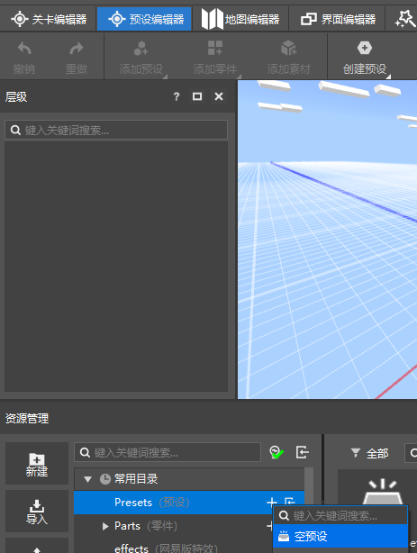 
2. Attach part A to the preset (left-click A.part, hold down and drag it to the bottom of the preset in the left hierarchy interface) 
3. Check the preload property on the right side of the preset 
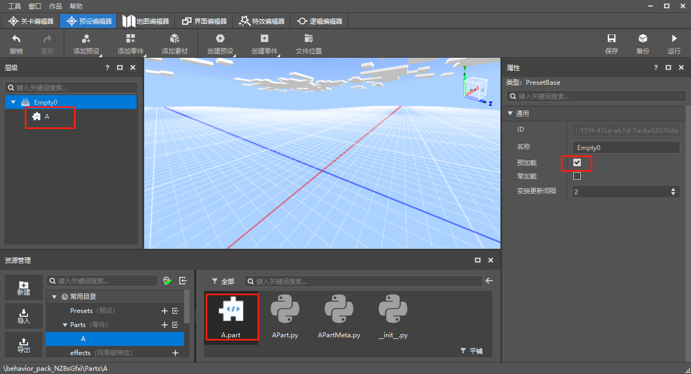 
4. Switch to the level editor interface, and you can see the preset displayed on the stage interface on the left 
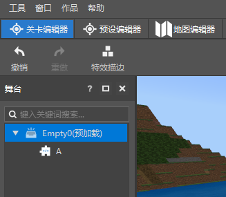 


+ Run results 
1. Local stand-alone operation 
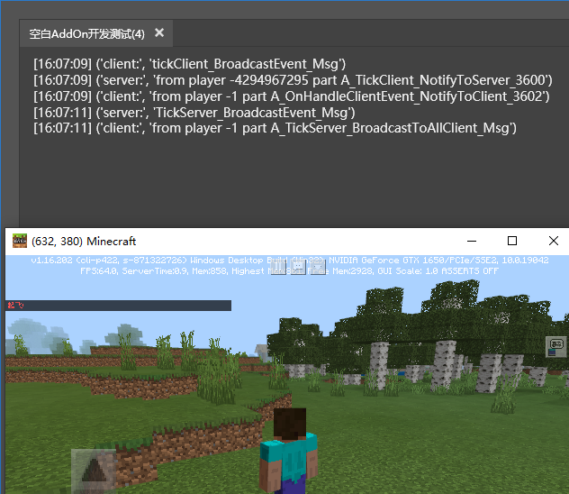 
1. Phenomenon: 
1. The first and fourth lines of logs show that the BroadCastEvent event sent by the client of the part is received by the client, and the BroadCastEvent event sent by the server is received by the server (even if the event names they receive are the same). 
2. The first and fourth lines of logs are different. The Notify series of interfaces means that the events sent by the server are received by the client, and the events sent by the client are received by the server. 
2. Conclusion: 
1. The events broadcast by the BroadCastEvent interface are internal to the client/server (thread) 
2. The events notified by the Notify series and BroadcastToAllClient interfaces can cross the client/server (thread) 

2. Multiplayer game running 
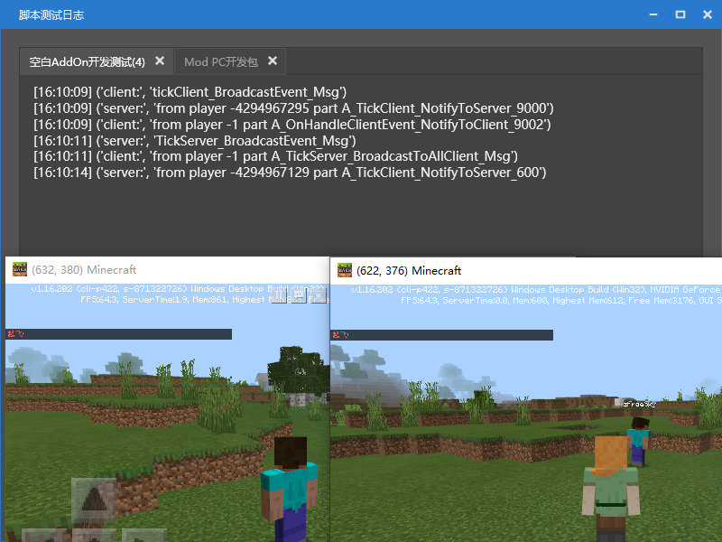 
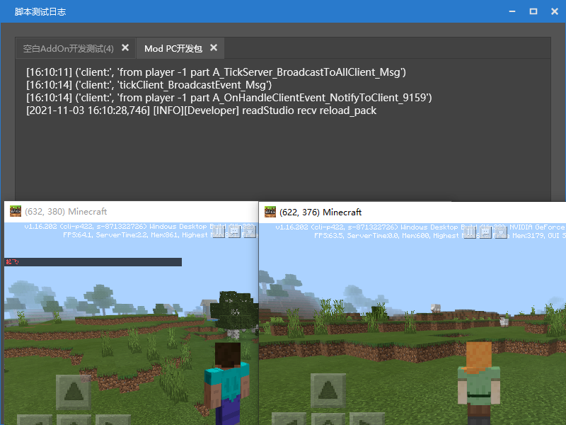 
1. Phenomenon: (Blank Addon is the server player, Mod PC development kit is the joined player) [How to test multiplayer online?][MutiPlayerUrl] 
1. The server player received one more message from the part client of the joined player than when playing alone (using the Notify series of interfaces) 
2. In the client player's log, only the messages from the parts client were successfully printed out, and there was no response from the parts server.

2. Conclusion: 
1. The part body has two instances, server and client, when running. When running on a single machine, both instances will start and run. However, in multiplayer games, all game clients will run the code logic of the part client, and only the server player (multiplayer game room owner) will run the server logic of the part 
2. It has been successfully verified that the BroadCastEvent interface cannot cross the network, while the Notify series interface can communicate across the network 

--- 

### Communication between multiple parts 

+ Logic description: Re-create three parts B, C, and D and modify the corresponding part names to show the communication between parts under the same preset and between parts across presets. 

+ API description: 
> [ListenPartEvent][ListenPartEventUrl] Listen to events from this part 
> 
> [ListenPresetSystemEvent][ListenPresetSystemEventUrl] Listen to events from the preset system 
> 
> [BroadcastPresetSystemEvent][BroadcastPresetSystemEventUrl] Broadcast events to the preset system 
> 
>> Get the (list of parts)/(first part) of the specified (type)/(name) in the preset 
>> [GetPartsByType][GetPartsByTypeUrl], [GetPartByType][GetPartByTypeUrl], [GetPartsByName][GetPartsByNameUrl], [GetPartByName][GetPartByNameUrl]. 
> 
>> Get the (list of parts)/(first part) by part type and part name in the preset system 
>> [GetGameObjectsByTypeName][GetGameObjectsByTypeNameUrl], [GetGameObjectByTypeName][GetGameObjectByTypeNameUrl] 

+ Code example: Importable resource package path [here][Code_Url] 

B part code, placed in a different preset from D, sends events to D part 
```python 
def __init__(self): 
super(BPart, self).__init__()
			#Part name
			self.name = "B"
			# The frame number variable is used for subsequent logical judgments
			self.tickIndex = 0
	
		def TickClient(self):
			self.tickIndex += 1
			if self.tickIndex == 660:
				self.NotifyToServer("PartEventB", "from player {} part {}_TickClient_NotifyToServer_{}".format(self.GetLocalPlayerId(), self.name, self.tickIndex))
				# for comparison
				self.BroadcastEvent("PartEventB", "from player {} part {}_TickClient_BroadcastEvent_{}".format(self.GetLocalPlayerId(), self.name, self.tickIndex))
				self.BroadcastPresetSystemEvent("PresetSystemEvent", "from player {} part {}_TickClient_BroadcastPresetSystemEvent_{}".format(self.GetLocalPlayerId(), self.name, self.tickIndex))
	
		def TickServer(self):
			self.tickIndex += 1
			if self.tickIndex % 600 == 60:
				self.BroadcastEvent("PartEventB", "from player {} part {}_TickServer_BroadcastEvent_{}".format(self.GetLocalPlayerId(), self.name, self.tickIndex))
				self.BroadcastPresetSystemEvent("PresetSystemEvent", "from player {} part {}_TickServer_BroadcastPresetSystemEvent_{}".format(self.GetLocalPlayerId(), self.name, self.tickIndex))
	
	```

C part code, placed in the same preset as D, sends events to D part 
```python 
def __init__(self): 
super(CPart, self).__init__() 
# Part name 
self.name = "C" 
# Frame number variable is used for subsequent logic judgment 
self.tickIndex = 0 

def TickServer(self): 
self.tickIndex += 1 
if self.tickIndex % 600 == 60: 
self.BroadcastEvent("PartEventC", "from player {} part {}_TickServer_BroadcastEvent_{}".format(self.GetLocalPlayerId(), self.name, self.tickIndex)) 
self.BroadcastPresetSystemEvent("PresetSystemEvent", "from player {} part {}_TickServer_BroadcastPresetSystemEvent_{}".format(self.GetLocalPlayerId(), self.name, self.tickIndex)) 

``` 

D part code, receive events sent by BC 
```python 
def __init__(self): 
super(DPart, self).__init__() 
# Part name 
self.name = "D" 
# Frame number variable is used for logical judgment later 
self.tickIndex = 0 

def printSelfMsg(self, msg): 
# Distinguish whether the client part is printed or the server part is printed 
print("client:" if self.isClient else "server:", msg) 

def InitServer(self): 
import Preset.Controller.PresetApi as presetApi 
# Get the specified type (BPart) and the specified name (B) of the part under the preset system (not in the same preset) 
partB = presetApi.GetGameObjectByTypeName("BPart", "B") 

if partB: 
# Listen for partB events from 
print ("partD listen PartEventB") 
self.ListenPartEvent(partB.id, "PartEventB", self, self.printSelfMsg) 

# Get a child part named (C) of the parent preset 
partC = self.GetParent().GetPartByName("C") 

if partC: 
# Listen for partC events from 
print ("partD listen PartEventC") 
self.ListenPartEvent(partC.id, "PartEventC", self, self.printSelfMsg) 

# Listen for preset system events 
self.ListenPresetSystemEvent("PresetSystemEvent", self, self.printSelfMsg)

	
	def TickServer(self):
		self.tickIndex += 1
		if self.tickIndex % 600 == 60:
			# for comparison
			self.BroadcastEvent("PartEventB", "from player {} part {}_TickServer_{}".format(self.GetLocalPlayerId(), self.name, self.tickIndex))
			self.BroadcastEvent("PartEventC", "from player {} part {}_TickServer_{}".format(self.GetLocalPlayerId(), self.name, self.tickIndex))
			self.BroadcastEvent("PresetSystemEvent", "from player {} part {}_TickServer_{}".format(self.GetLocalPlayerId(), self.name, self.tickIndex))
	
	def DestroyServer(self):
		import Preset.Controller.PresetApi as presetApi 
partB = presetApi.GetGameObjectByTypeName("BPart", "B") 
if partB: 
self.UnListenPartEvent(partB.id, "PartEventB", self, self.printSelfMsg) 
partC = self.GetParent().GetPartByName("C") 
if partC: 
self.UnListenPartEvent(partC.id, "PartEventC", self, self.printSelfMsg) 
self.UnListenPresetSystemEvent("PresetSystemEvent", self, self.printSelfMsg) 
``` 

+ Usage process (preset naming needs to be consistent, the reason is in the following notes) 
1. Create a new empty preset, named B, place part B under the B preset, and check preload 
2. Create a new empty preset, named CD, place parts C and D under the CD preset, and check preload 
3. Switch to the level editor interface, and you can see the preset display on the left stage interface 
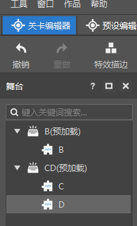 

+ Run result log 
Because the span before and after the log is too large, it is copied and only the key information is displayed, plus the sequence number 
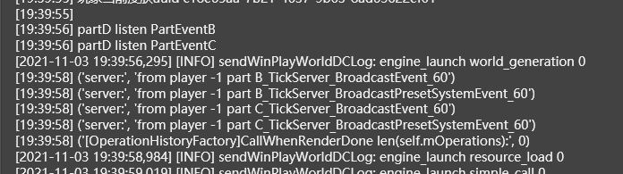 
``` 
。 。 
1. partD listens to PartEventB 
2. partD listens to PartEventC 
。 。 
3. ('server:', 'from player -1 part B_TickServer_BroadcastEvent_60')
		4. ('server:', 'from player -1 part B_TickServer_BroadcastPresetSystemEvent_60')
		5. ('server:', 'from player -1 part C_TickServer_BroadcastEvent_60')
		6. ('server:', 'from player -1 part C_TickServer_BroadcastPresetSystemEvent_60')
		. . .
		7. ('server:', 'from player -1 part B_TickServer_BroadcastEvent_660') 
8. ('server:', 'from player -1 part B_TickServer_BroadcastPresetSystemEvent_660') 
9. ('server:', 'from player -1 part C_TickServer_BroadcastEvent_660') 
10.('server:', 'from player -1 part C_TickServer_BroadcastPresetSystemEvent_660') 
11.('server:', 'from player -4294967295 part B_TickClient_NotifyToServer_660') 
``` 
Analysis conclusion: 
1. Part D has not been able to receive the event it sent. This is the role of the specified id in ListenPartEvent, and BroadcastEvent and ListenPresetSystemEvent cannot be used together. 
2. All the logs here except 11 lines are sent by TickServer, which means BroadcastPresetSystemEvent, like BroadcastEvent, cannot send messages across the server and client (threads).

3. The messages BroadcastEvent and ListenPartEvent shown in lines 3, 5, 6, and 9 can be used to communicate across parts or presets, but cannot be sent across servers and clients (threads). 
4. Line 11 also shows that the Notify series of interfaces can not only send messages across servers and clients (threads), but can also be used to send messages across parts and presets with ListenPartEvent. 
5. The messages BroadcastPresetSystemEvent and ListenPresetSystemEvent received in lines 4, 6, 8, and 10 can be used to communicate across parts or presets. 

## Summary of communication interface usage 

1. Internal (single-thread) communication between the server or client of this part uses ListenSelfEvent and BroadcastEvent. 
2. Internal (cross-thread) communication between the server and the client of this part can use NotifyToServer, NotifyToClient, BroadcastToAllClient and ListenSelfEvent. At the same time, this set of interfaces can also communicate across networks. 
3. Parts communicate with each other (regardless of whether they are in the same preset or not), without crossing networks, you can use ListenPartEvent and BroadcastEvent, or BroadcastPresetSystemEvent and ListenPresetSystemEvent 
4. Parts communicate with each other (regardless of whether they are in the same preset or not), across networks, use NotifyToServer, NotifyToClient, BroadcastToAllClient and ListenPartEvent to achieve communication between the client and the server 

## Notes 

1. ***Note that the addon template will only load the preloaded presets, while the map template will load all presets in the player's block at the same time as the preloaded presets [Presets in the level editor can be dragged to a certain coordinate on the map], see [Preload][loadUrl] for details*** 
2. ***By the way, a setting is added, the presets dragged to the map in the level editor will be loaded when the player approaches and unloaded when moving away. If the constant loading is checked, it will not be unloaded after approaching and moving away, unless the game is restarted*** 
3. ***Presets are loaded in order. If the preloaded preset is checked, the presets are loaded in alphabetical order (the order of the level editor); if it is not checked, the presets are loaded in the order of the preloaded presets on the stage*** 
4. ***All parts under the loaded preset have been initialized. You can get the brother part ID through GetPartsByType or GetGameObjectByTypeName, but you cannot get the part ID under other unloaded presets*** 

## Supplement 

The code is downloaded as a compressed package. After decompression, drag the ABCD4 folders to the display interface on the right side of the resource manager under the Parts category 
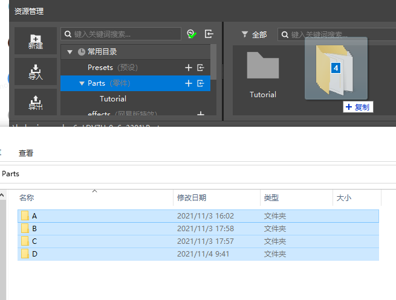 

[BroadcastEventUrl]: /mcdocs/3-PresetAPI/Preset Object/Part/PartBase.md##broadcastevent 
[ListenSelfEventUrl]: /mcdocs/3-PresetAPI/Preset Object/Part/PartBase.md##listenselfevent 
[NotifyToServerUrl]: /mcdocs/3-PresetAPI/Preset Object/Part/PartBase.md##notifytoserver 
[NotifyToClientUrl]: /mcdocs/3-PresetAPI/Preset Object/Part/PartBase.md##notifytoclient 
[BroadcastToAllClientUrl]: /mcdocs/3-PresetAPI/Preset Object/Part/PartBase.md##broadcasttoallclient 
[MutiPlayerUrl]: /mcguide/12-Getting Started/20-MC%20Studio Instructions.md#Bedrock Edition Components 
[ListenPartEventUrl]: /mcdocs/3-PresetAPI/Preset object/Part/PartBase.md##listenpartevent 
[ListenPresetSystemEventUrl]: /mcdocs/3-PresetAPI/Preset object/Part/PartBase.md##listenpresetsystemevent 
[BroadcastPresetSystemEventUrl]: /mcdocs/3-PresetAPI/Preset object/Part/PartBase.md##broadcastpresetsystemevent 
[GetPartsByTypeUrl]: /mcdocs/3-PresetAPI/Preset object/Preset/Preset base class PresetBase.md##getpartsbytype 
[GetPartByTypeUrl]: /mcdocs/3-PresetAPI/Preset object/Preset/Preset base class PresetBase.md##getpartbytype 
[GetPartsByNameUrl]: /mcdocs/3-PresetAPI/Preset object/Preset/Preset base class PresetBase.md##getpartsbyname 
[GetPartByNameUrl]: /mcdocs/3-PresetAPI/Preset object/Preset/Preset base class PresetBase.md##getpartbyname 
[GetGameObjectsByTypeNameUrl]: /mcdocs/3-PresetAPI/Preset management/PresetApi.md##getgameobjectsbytypename 
[GetGameObjectByTypeNameUrl]: /mcdocs/3-PresetAPI/Preset management/PresetApi.md##getgameobjectbytypename 

[loadUrl]: /mcguide/20-Gameplay development/14-Preset gameplay programming/1-In-depth understanding of presets/2-Instances and properties.md#Preload 
[Code_Url]: https://g79.gdl.netease.com/Parts.7z 

[Server and Client]: /mcguide/20-Gameplay Development/13-Module SDK Programming/1-Mod Development Introduction/3-How Mod Works.md 

[Presets and Parts]: /mcguide/20-Gameplay Development/14-Preset Gameplay Programming/0-The First Preset Mod/6-Using Parts Programming.md