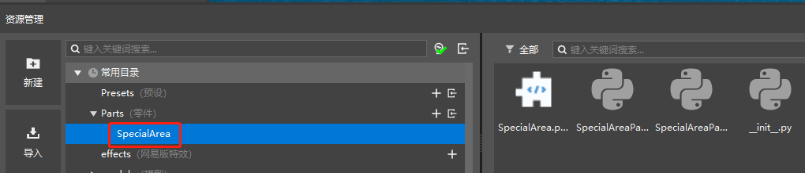
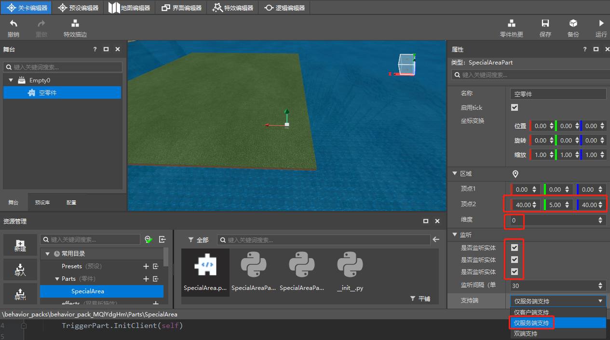
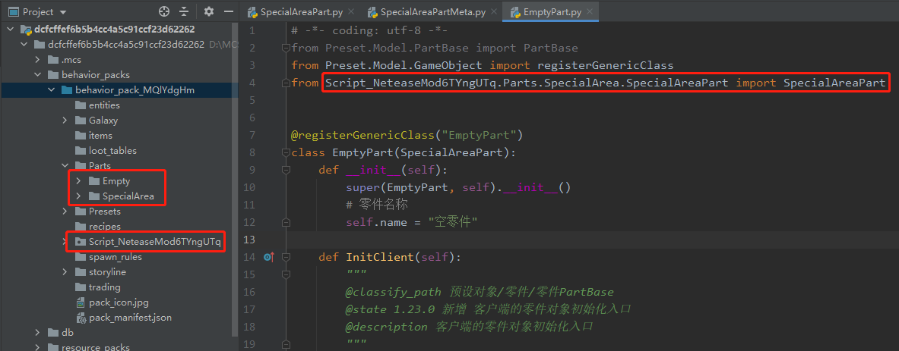

# Part inheritance 

When designing gameplay, users may occasionally need to expand on the built-in parts or resource pack parts provided by the editor. In this case, part inheritance can be used to more conveniently complete the design and implementation of the gameplay without having to start all over again 

## Sample 

Suggestion: You need to understand the meaning of class inheritance and method rewriting in Python 

Requirement: Determine an area as a special miasma area. Players will be injured when entering it, and zombie creatures will move much faster after entering it 

Implementation: The editor has built-in trigger parts that can monitor entities entering/staying/leaving a certain area. You only need to add some logic to it 

1. Create a new empty map template. Because you need to specify an area, do not choose the addon template 

1. You need to create a new empty part (the sample part is named SpecialArea) 
 

2. Inherit the corresponding trigger script part of the part script and the corresponding attribute script of the part 
 

3. Write logic code, link [here][CodeUrl], the interface can be found in the official api documentation page [api][APIUrl] 
```python 
# -*- coding: utf-8 -*- 
from Preset.Model.GameObject import registerGenericClass 
from Preset.Parts.TriggerPart import TriggerPart 
from mod.common.minecraftEnum import EntityType 
from mod.common.minecraftEnum import ActorDamageCause 

@registerGenericClass("SpecialAreaPart") 
class SpecialAreaPart(TriggerPart): 
def __init__(self): 
super(SpecialAreaPart, self).__init__() 
# Part name 
self.name = "Empty Part" 
self.support = 2 

def InitServer(self): 
# Because it inherits other parts, if you need to rewrite the method, it is recommended to call the base class method to ensure that the logic of the base class will not be destroyed. 
super(SpecialAreaPart, self).InitServer() 
# Listen to the three events sent by the base class, 
self.ListenSelfEvent("OnTriggerEntityEnter", self, self.handleEntityEnter) 
self.ListenSelfEvent("OnTriggerEntityStay", self, self.handleEntityStay) 
self.ListenSelfEvent("OnTriggerEntityExit", self, self.handleEntityExit) 

def handleEntityEnter(self, data): 
# Trigger sends the event with its own parameters 
part = data["TriggerPart"] 
entitySet = data["EnterEntityIds"] 
for entity in entitySet:

# Get the entity type of the entity entering 
entityType = self.GetEntityEngineType(entity) 
if EntityType.Player == EntityType.Player & entityType: 
# The player entity sends a notification message 
self.NotifyOneMessage(entity, "You entered the miasma", "§c") 

def handleEntityStay(self, data): 
part = data["TriggerPart"] 
entitySet = data["StayEntityIds"] 
for entity in entitySet: 
entityType = self.GetEntityEngineType(entity) 
if EntityType.Player == EntityType.Player & entityType: 
# Give the player a slow DeBuff effect 
self.AddEffectToEntity(entity, "slowness", 30, 2, True) 
# Each detection reduces the health of the player in the area by 1 
print("SetHurtByEntityNew to Player", self.SetHurtByEntityNew(entity, 1, ActorDamageCause.Override, None, False)) 

if EntityType.ZombieMonster == EntityType.ZombieMonster & entityType: 
# Give zombie-type creatures a level 3 acceleration effect (you can search for the corresponding interface parameter meaning on the official website's api page) 
print("AddEffectToEntity to ZombieMonster", self.AddEffectToEntity(entity, "speed", 30, 2, True)) 

def handleEntityExit(self, data): 
part = data["TriggerPart"] 
entitySet = data["ExitEntityIds"] 
for entity in entitySet: 
entityType = self.GetEntityEngineType(entity) 
if EntityType.Player == EntityType.Player & entityType: 
self.NotifyOneMessage(entity, "You left the miasma", "§f")
				# Remove player slowdown
				self.RemoveEffectFromEntity(entity, "slowness")

			if EntityType.ZombieMonster == EntityType.ZombieMonster & entityType:
				# Remove zombie acceleration
				self.RemoveEffectFromEntity(entity, "speed")

	def DestroyServer(self):
		super(SpecialAreaPart, self).DestroyServer()
		self.UnListenSelfEvent("OnTriggerEntityEnter", self, self.handleEntityEnter)
		self.UnListenSelfEvent("OnTriggerEntityStay", self, self.handleEntityStay)
		self.UnListenSelfEvent("OnTriggerEntityExit", self, self.handleEntityExit)
```
4. Configure the property list (only the original trigger properties can meet the needs) 
```python 
# -*- coding: utf-8 -*- 
from Meta.ClassMetaManager import sunshine_class_meta 
from Preset.Parts.TriggerPart import TriggerPartMeta 

@sunshine_class_meta 
class SpecialAreaPartMeta(TriggerPartMeta): 
CLASS_NAME = "SpecialAreaPart"

PROPERTIES = { 
} 
``` 
5. Modify some property parameters to ensure the correct effect 
1. Place the part under the preset and drag it to the map of the level editor 
2. Set the effective area (click the button above the setting area to locate the selected area) 
3. Check the monitoring of 3 states (we monitor and handle these 3 events in the logic code) 
4. Because we only need the server-side monitoring, modify the properties to only monitor the server 
 

6. Run the test 

As soon as you see the prompt, zombie monsters have buffs, witches do not, and there is a debuff on the right side of the character. You can run it yourself 
 

## Notes 
1. Inherited parts can not only inherit built-in parts, but also inherit parts written by yourself. However, for some reasons, you need to pay attention to the path when inheriting parts written by yourself 
 
2. Inheriting multiple parts is similar to inheriting a single part. Just make sure that both the script code and the attribute code are inherited. 

3. The usage of the downloaded code is the same as that in the part communication. 

[CodeUrl]: https://g79.gdl.netease.com/PartsInheritSample_SpecialArea.7z 
[APIUrl]: /mcdocs/3-PresetAPI/Preset Object/General/SDK Interface Package SdkInterface.md