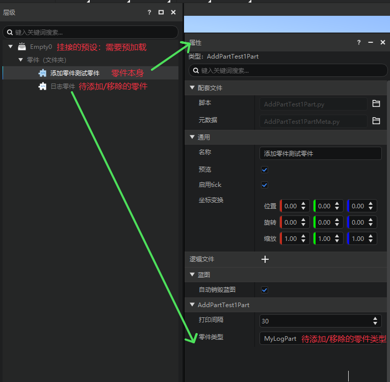
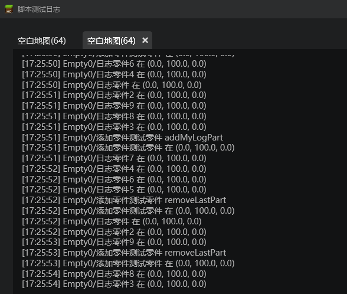

# Built-in parts and template parts 
## What are parts 
1. A part is a gameplay logic object bound to the code under the preset architecture. It can be directly attached to the preset and loaded to implement the logic in the part code as the preset is loaded. 
2. Empty parts and empty presets are blank templates without any gameplay logic. Developers can write code here and load the preset at the right time to achieve their goals. 
3. In order to help developers quickly get started with the new development method of "preset-parts", we provide two types of parts with actual gameplay functions, built-in parts and template parts, for developers to use and refer to. We hope that developers can understand the effectiveness logic and writing specifications of the parts during use, and finally write code on the empty parts by themselves to achieve the desired functions. 
## What are built-in parts 
Built-in parts are some gameplay parts built into the game engine. Developers cannot modify the code logic of built-in parts, nor can they create a new copy of built-in parts for editing. Developers can add built-in parts to presets and adjust the properties of the parts to achieve the functions defined by the parts. 

The existing built-in parts can be found in the official website development guide → gameplay development → simple assembly gameplay → [built-in parts] (../../11-Simple assembly gameplay/11-built-in parts/00-Trigger parts.md) to find relevant introductions and instructions. 

## What are (template) parts 
(Template) parts are some parts with specific functions built into the editor. Developers can modify the parts by creating copies of template parts to achieve their goals. In layman's terms, template parts are to achieve a certain function, write code based on empty parts, and provide developers with the code logic to modify the parts on the copies. 

Currently available template parts are: 

### 1. Add Part Test Part (AddPartTestPart) 
#### Introduction: 
Add Part Test demonstrates how to add and delete parts through code 

#### Logic description: 
This part will execute the add part or delete part function (random behavior) every self.interval in TickClient. The type of added parts and the execution time interval can be set through the property panel 

#### How to use: 
1. Make sure the part to be added exists in the archive 
2. Set the execution interval 
3. Start running and view the log print information 

 

After running the game, you can see the corresponding log in the test log window 

 

### 2. Part Interface Test Part (ApiTestPart) 
#### Part Introduction: 
Part Interface Test Part provides several simple examples to illustrate how to test the part interface.
#### Main logic description: 
Listen to the server ServerChatEvent interface to get the input of the chat window and call different functions according to the pre-set message distribution. 
The pre-set calls here are: 
spawn -> copy all current entity preset instances 
add_part -> add parts to all entity preset instances 
destory_entity_preset -> destroy all preset instances 
show_preset_info-> print the information of the current preset instance in the console 
#### How to use: 
1. Bind this part to a preloaded empty preset, 
2. Make sure there is at least one entity preset instance in the level 
3. Make sure that all specified parts of the "Part Type" attribute of this part exist 
4. Click "Run", enter: spawn, add_part, destory_entity_preset, show_preset_info in the dialog box and view the effect 

### 3. Log Part (MyLogPart) 
#### Part Introduction: 
The log part demonstrates how to print log output 
#### Logic Description: 
The TickClient function will print logs at each time interval. The time interval is randomly controlled by the self.interval variable. The log content is the path name and world coordinates of the part 
#### Usage: 
1. Set the print interval through the property panel 
2. Start running and view the log print information 
### 4. Network Synchronization Part (NetworkReplicatedPart) 
#### Part Introduction: 
Demonstrate how to quickly implement the network synchronization function in parts 
#### Logic Description: 
Set the fields that need network synchronization in the part class initialization function in replicated. The values of these fields will be synchronized from the server to the client during runtime 
#### Usage: 
Hook the part in the preload preset, then start the game and view the log 
### 5. Split Part (ReplicatePart) 
#### Part Introduction: 
The split part is mainly used with the entity preset to achieve the gameplay function of injury splitting. 
#### Logic description: 
1. Specify the entity's health during initialization (configurable) 
2. When the entity is actually damaged, if the attack does not kill the entity, a new entity preset is generated in the entity 
3. If the loop generation is not checked (configurable), remove the split part under the newly generated entity preset, otherwise when the newly generated entity is damaged, the new entity will also be split. 

#### Usage: 
Mount it under the entity preset and configure the part properties as needed. 

### 6. Transformation Animation Part (TransformAnimationPart) 
#### Part Introduction: 
The transformation animation part shows how to operate the transformation of the game object through the part 

#### Logic description: 
1. This part will dynamically set the transformation (relative displacement, rotation and scaling) of the parent node when running. 
2. Under the given duration and given keyframe parameters, this part will perform linear interpolation to obtain the transformation that needs to be set for each frame, and set the transformation during the tick process. 
3. The special effect is selected here to facilitate the display of the effect. Since the special effect is purely client-side, you only need to implement the corresponding client interface. 
4. In fact, you can attach it to other types of presets, such as entity presets, to achieve some effects such as movement and enlargement, but you need to implement the server-side interface of the part. 
5. You can also change all client interfaces to server-side interfaces (such as InitClient => InitServer, etc.), which can also achieve similar effects, but the performance will be very poor, because each transformation requires the server to notify the client to transform. 

#### How to use: 
1. Attach this part under any special effect. 
2. Edit the keyframe properties of the part to control the target transformation (relative displacement, rotation and scaling) of each keyframe parent special effect during the animation. 
3. If you want the special effect animation to play only once, check Auto Destroy. If you want the special effect to play in a loop, check Loop. 
### 7. Test trigger part (TriggerTestPart) 
#### Part introduction: 
Test trigger part, need to be used in conjunction with trigger part 
#### Logic description: 
When the entity enters, leaves, or stays in the area of the corresponding trigger part, print the relevant log 
#### How to use: 
1. Attach the part and the corresponding trigger part to the same preset 
2. Set the name of the corresponding trigger part through the property panel 
3. Start running and view the log print information

### 8. Input Binding Part (InputBindPart) 
#### Part Introduction: 
The Input Binding Part provides a general system key monitoring broadcast process 
#### Logic Description: 
Developers can define custom events and the system keys that need to be pressed to evoke the event in the "Key Binding" property. 
When a key is pressed or released, the corresponding custom event will be broadcast. 
Developers can call the event monitoring function of the part in the part code, or call the system monitoring function in the mod code. 
#### How to use: 
1. Set custom events and bound system buttons through the property panel 
2. Write a listening function in the required script to listen to the corresponding custom events 
3. Start running and check the callback running status 
### 9. Preset test part (PresetDebugPart) 
#### Part introduction: 
The preset test part is used to output the preset information of the current specified end 
#### Logic description: 
The server obtains the input of the player's chat window by listening to the ServerChatEvent event, and determines which end's preset information needs to be printed according to the input content 
#### How to use: 
Enter the following characters in the chat window to call the corresponding function: 
preset client --> Output all preset instance information of the current client 
preset server --> Output all preset instance information of the server 
preset client <id> --> Output the transformation object instance information of the specified id of the current client 
preset server <id> --> Output the transformation object instance information of the specified id of the server 
The output information format is blue font: Node display path [current node and recursive node id list]