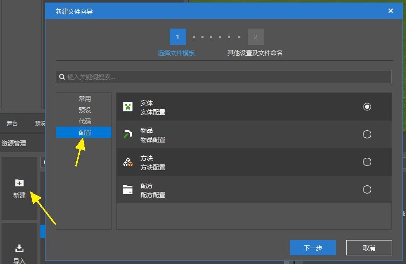
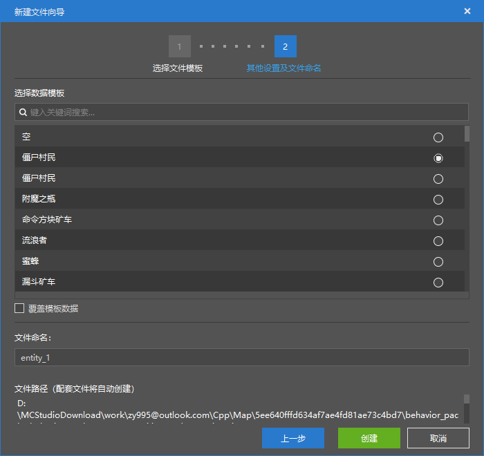
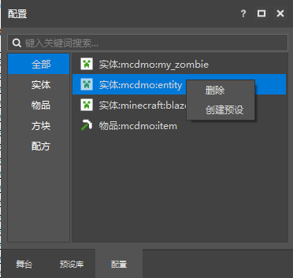
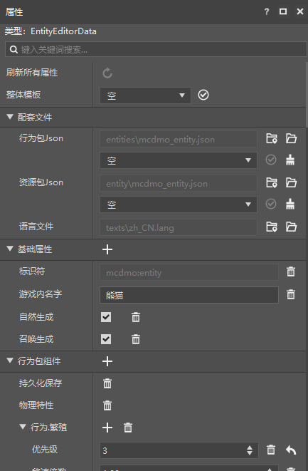
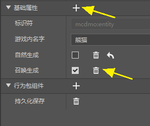
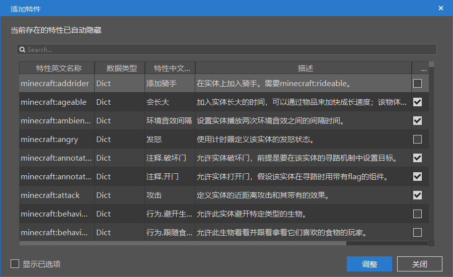
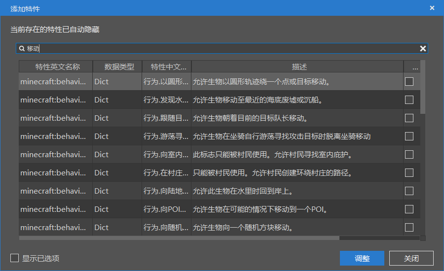
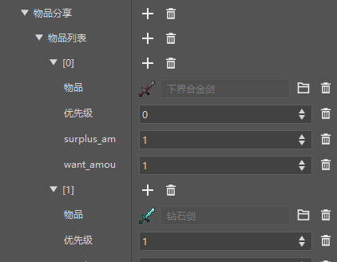
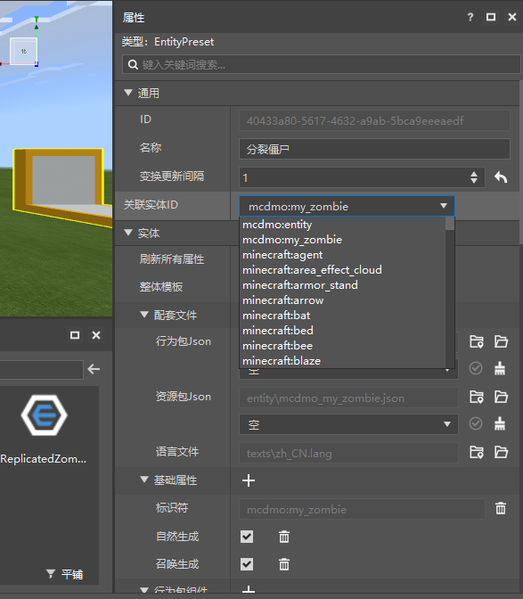
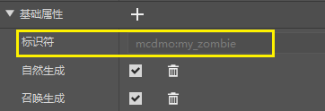

--- 
front: https://nie.res.netease.com/r/pic/20210728/d6a02b85-aba6-410c-9ed3-5c7ad395a3ab.gif 
hard: Getting Started 
time: 25 minutes 
--- 
# Configuration 
## What is Configuration 

In Bedrock Edition of Minecraft, you can use a series of files to configure the game to create add-ons. 

For example, if you want to make a custom creature, you can do it in the following three folders: 

- Add the creature's behavior pack Json in the entities folder of the behavior pack 
- Add the creature's resource pack Json in the entity folder of the resource pack 
- Add the creature's Chinese name in zh_CN.lang in the texts folder 

Work folder 
|--&nbsp;.mcs&nbsp;&nbsp;*//Folder, saves editor configuration information. * 
|--&nbsp;behavior_packs&nbsp;&nbsp;*//Folder, behavior pack collection, multiple behavior packs can be placed below * 
|&nbsp;&nbsp;&nbsp;|--&nbsp;behavior_pack_\*\*\*&nbsp;&nbsp;*//Folder, behavior pack, there is no fixed format for naming. * 
|&nbsp;&nbsp;&nbsp;&nbsp;&nbsp;&nbsp;&nbsp;&nbsp;|--&nbsp;entities&nbsp;&nbsp;*//Folder, place the JSON file of the entity, configure the entity's health, attack, behavior, etc. * 
|--&nbsp;resource_packs&nbsp;&nbsp;*//Folder, resource pack collection, multiple resource packs can be placed below * 
|&nbsp;&nbsp;&nbsp;|--&nbsp;resource_pack_\*\*\*&nbsp;&nbsp;*//Folder, resource pack, naming has no fixed format. * 
|&nbsp;&nbsp;&nbsp;&nbsp;&nbsp;&nbsp;&nbsp;&nbsp;|--&nbsp;entity&nbsp;&nbsp;*//Folder, place the configuration JSON file of the entity client. * 
|&nbsp;&nbsp;&nbsp;&nbsp;&nbsp;&nbsp;&nbsp;&nbsp;|--&nbsp;texts&nbsp;&nbsp;*//Folder, place text lang files. * 

In the new version of the editor, this series of files is called configuration. The essence of the configuration function is to change the original method of modifying Json files to visual graphic operations. Developers create, edit and delete configurations in the editor, which will be synchronized to the resource files of the module. 

## Create a new configuration 

You can use the new file wizard of the resource manager to create a configuration, and the supporting files will be created synchronously. 

Each configuration corresponds to a different Json file. For details, please refer to [Configuration and JSON Relationship](./14-Configuration and JSON File Relationship.md) 

We currently provide 11 configurations for use 
- Entity Configuration 
- Item Configuration 
- Block Configuration 
- Recipe Configuration 
- Trading Table Configuration 
- Drop Table Configuration 
- Generation Rule Configuration 
- Dimension Configuration 
- Biome Configuration 
- Feature Configuration 
- Feature Generation Configuration 
> The configuration components of the old level editor components will be gradually completed in subsequent updates. 

When creating a new configuration (taking entity configuration as an example), you can select a data template for the configuration (or leave it blank). 

If you select a template, the configuration you create will have most of the same data as the data template. By using this method, you can easily create a variant of an entity. 

> The current data template contains almost all the original entities of MC. 

If you check "Overwrite template data" here, the created configuration will overwrite the original data. 

> For example, if you select zombies here and check Overwrite template data, the zombies you create will replace the original zombies. 
> 
> Each template can be overwritten at most once. 

When selecting a data template, you can search for the data template. 

 

## Manage configurations 

All created configurations will be displayed in the configuration panel of the level editor. 

> In fact, if you did not create it through the New File Wizard, but created the Json file manually, and if it was created correctly, the result you created will still be displayed in this panel. 

Different types of configurations have different tabs in the configuration panel, and you can also find all configurations in the "All" tab. 

- Click on a configuration to modify it in the property panel. 

- Right-click a configuration to delete it. 

- For entity configuration and block configuration, each configuration can be bound to at most one preset. You can quickly create a preset bound to this configuration in the configuration panel. 

> Block configuration and entity configuration can take effect even if they are not bound to a preset, but entity presets and block presets must be bound to a configuration. 

 

## Modify configuration 

### Supporting files 

Take entity presets as an example. 

- Refresh all properties: Normally, this button is disabled. But sometimes, the modification of the configuration cannot take effect immediately. At this time, this button becomes available. Click the button to refresh the configuration. 
- Overall template, behavior pack Json, resource pack Json: You can select the template you need in the drop-down box and click the √ button to replace the template data as a whole. 
- Brush button of behavior pack Json and resource pack Json: Click to clear the corresponding file. 

> The situation of resource pack Json is complicated. We have filtered the resource pack Json data templates that cannot be directly applied for replacement.

 

There are many data templates for overall templates, behavior packs and resource packs. We have provided search support in these three drop-down boxes, refer to the following animation. 

 

### Add fields 

> The following is for the display and modification of specific fields (not the application of overall data templates). 
> 
> For entity configuration, the current editor only supports the modification of Component of behavior packs. 
> 
> For other fields of resource packs and behavior packs, you need to wait for subsequent support, and you still need to manually modify the Json file. 

Configuration is essentially Json, and each property entry in the property panel can be understood as a field in Json. 

- Click the "+" on the right side of the attribute label or attribute entry = add a field under this field 
- Click the "trash can icon" on the right side of the attribute entry = delete this field 

 

In the configuration, we call adding fields adding features. When adding features, we will automatically filter out the features that can be added for you and filter out duplicate features. 

The following is the add feature interface that pops up after clicking "+". Each entry in it is a field that can be added. Each entry displays the following information: 

- The English name of the feature, that is, the field name 
- The data type of the feature, that is, the data type of the field 
- The Chinese name of the feature, that is, our Chinese translation of the field name 
- The description of the feature, that is, the function of the field 

Select the feature and click Add to add the selected feature to the configuration. 
>Tip: The selection box is multi-select, you can check or uncheck multiple fields at the same time 

 

There are so many fields in the MC add-on pack, so we provide a search function for this purpose. All text in the add-on pop-up window is included in the search range. 

 

After adding the feature (field), you can edit the value of the feature. For some special data types, the editor has made some improvements. For example, the items in the figure below, you can give full play to the power of the editor to reduce the probability of feature editing errors. 

 

> Understanding MC's add-on packs (Molang, the meaning of Json fields) is a big project. We strongly recommend that you use data templates to understand how each original entity, creature, item, etc. in MC is configured, and learn the meaning of each field, its combination with other fields, the value range of the field, and the specific usage methods. 

## Binding presets to configurations 

As mentioned earlier, entity presets and block presets must be bound to a configuration before they can be used. 

Normally, when creating a preset, the New File Wizard will automatically handle the creation and binding of the matching configuration. If you create a configuration first, you can also create a preset bound to this configuration through the right-click menu of the configuration. 

However, if you want to switch the configuration bound to a preset, you can do this in the preset's properties panel, as shown below. 

> This drop-down box selects the identifiers of all entities in the original MC and your new one. And this drop-down box also provides a search function. 

 

As shown in the figure below, this is the identifier of the configuration. 

> In MC, including add-ons and mods, there cannot be duplicate identifiers, otherwise the configuration with the same identifier read later will replace the previously read one. 

