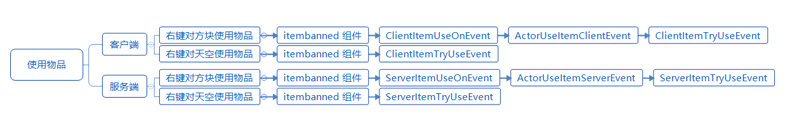
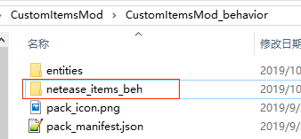
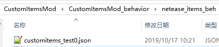
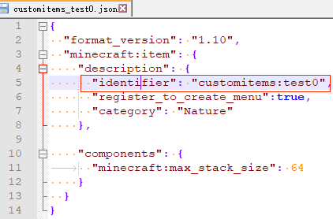
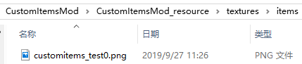
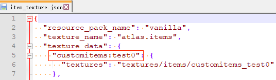
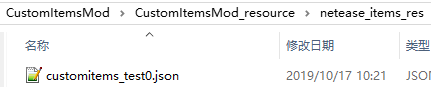
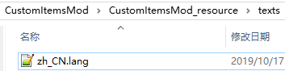
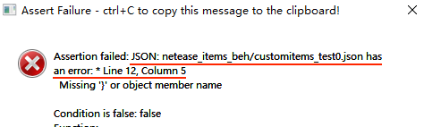

--- 
front: https://nie.res.netease.com/r/pic/20220408/3e2bb79b-32b3-4b95-a408-83556c00f775.jpg 
hard: Getting Started 
time: 20 minutes 
selection: true 
--- 
# Customize basic items 
## Overview 

This feature does not require experimental gameplay. 

Developers can add custom items by configuring json in addon. The added custom items support all events and interfaces related to items in the "MOD SDK Documentation". 

## Item-related component event flow 

**Component event flow** 

 

**Note: The order of ActorUseItemClientEvent (ActorUseItemServerEvent) and ClientItemTryUseEvent (ServerItemTryUseEvent) is related to the item used. ** 

## Registration 

Take demo [CustomItemsMod](../../13-Module SDK Programming/60-Demo Example.md#CustomItemsMod) as an example 

1. Create a new `netease_items_beh` directory in behavior 

 

2. Create a new json in the directory and write the definition of the item. For the format of json, please refer to the [official wiki](https://minecraft.gamepedia.com/Bedrock_Edition_beta_item_documentation). <a name="item_reg_2"></a> 

* There is at least one component in json 
* The identifier is divided into namespace and item name. The namespace is recommended to be consistent with the mod name, and the identifier must be globally unique. This identifier is used to correspond to this custom item in other places in the mod. **The identifier consists of lowercase letters and underscores. Please do not use uppercase letters. ** 

 

 

3. Now start to operate the resource package. 

Put the item texture in `textures\items` 

 


4. Create a new `item_texture.json` in textures and write the correspondence between resource names and textures. Resource names must be globally unique. For the json format, refer to `data\resource_packs\vanilla\textures\item_texture.json` in the "Mod PC Development Pack" 

 

 

5. Create a new `netease_items_res` folder in resource and add json to the folder to configure the performance properties of items, such as textures. The category field needs to be consistent with the settings in the behavior package or left blank, otherwise an error may occur. <a name="item_reg_5"></a> 

The identifier of this json needs to be consistent with that in the behavior, and the texture value needs to correspond to the resource name configured in the previous step `item_texture.json`. For the json format, please refer to `data\resource_packs\vanilla\items` of "Mod PC Development Pack" 

 

 

6. Configure the Chinese name of the item in `texts\zh_CN.lang`. 

The format of the key is item.item identifier.name 

 

 

7. Repeat 1-6 to write other custom items 


## JSON component 

### format_version 

Please fill in 1.10 

### description 

| key | type | default value | explanation | 
| ----------------------- | ---- | ------ | ------------------------------------------------------------ | 
| identifier | str | | Include namespace and item name. Need to be globally unique. <br>It is recommended to use the mod name as the namespace | 
| register_to_create_menu | bool | false | Whether to register to the creation column | 
| category | str | Nature | The category registered to the creation column, the optional values are: <br>Construction<br>Nature<br>Equipment<br>Items | 
| custom_item_type | str | | Custom item category, the optional values are: <br/>weapon<br/>armor<br/>egg<br/>ranged_weapon<br/>projectile_item | 

### Original components 

The supported Microsoft original components include: (For parameters and explanations, see [official wiki](https://minecraft.gamepedia.com/Bedrock_Edition_beta_item_documentation)) 

* minecraft:foil 

It can make the item have a flashing effect similar to enchantment 

* minecraft:max_damage


Can make items have durability 

> If the number of items stacked is greater than 1, the durability change will take effect on the entire stack of items. And after the durability reaches 0, each consumption of durability will reduce the number by one 

* minecraft:max_stack_size 

Set the maximum stacking number of items, `Note: this value cannot exceed 64` 

* minecraft:seed<span id="minecraft_seed"></span> 

Set the properties of the seed, such as crop_result, plant_at 

> The plant_at list needs to keep the same format, such as ["minecraft:grass", "minecraft:dirt"] or ["grass", "dirt"], otherwise planting a new crop next to a custom crop will cause the previous crop to be destroyed 

* minecraft:use_animation 

The animation played when using an item, such as the `eat` animation played when using `apple` in the original version, needs to be defined in the texture pack, such as in `resource_packs/vanilla/items/apple.json`, there is a `"minecraft:use_animation": "eat"` configuration.

### NetEase components 

#### netease:show_in_hand 

Set whether the item is displayed when held in hand 

| Key | Type | Default value | Explanation | 
| ----- | ---- | ------ | -------------- | 
| value | bool | | Whether to display when held | 

- Note: The format is different from Microsoft's component, with an extra "value" 
- You can refer to the behavior pack `netease_items_beh\customitems_test1.json` in [CustomItemsMod](../../13-Module SDK Programming/60-Demo Example.md#CustomItemsMod) 

<span id="netease_fire_resistant"></span> 

#### netease:fire_resistant 

Sets whether the item is fireproof. Fireproof items will be like netherite, not destroyed by fire, and will bounce away when dropped into lava. 

| Key | Type | Default | Explanation | 
| ----- | ---- | ------ | -------- | 
| value | bool | | Fireproof | 

- Note: The format is different from Microsoft's component, with an extra "value" 
- Please refer to `netease_items_beh\customitems_test_sword.json` in the CustomItemsMod sample behavior pack 

#### netease:allow_offhand 

Sets whether the item can be placed in the off-hand 

| Key | Type | Default | Explanation |

| ----- | ---- | ------ | ---------------- | 
| value | bool | | Can it be placed in the offhand | 

- Note: The format is different from Microsoft's component, and there is an extra "value" in it 
- You can refer to the `netease_items_beh\customitems_test_offhand.json` of the CustomItemsMod sample behavior pack 
- Currently, the original offhand function of Bedrock Edition is weak, and most of the time it cannot use items. It is mainly used for decoration and in the mod to determine whether an item is held in the offhand to execute specific logic 
- The offhand does not support some other components, such as `minecraft:foil`, `netease:render_offsets` 

#### netease:enchant_material 

Set whether the item can be used as an enchantment material 

| Key | Type | Default value | Explanation | 
| ----- | ---- | ------ | ------------------ | 
| value | bool | false | Can it be used as an enchantment material | 

- Note: The format is different from Microsoft's component, with an extra "value" 
- Please refer to `netease_items_beh\customitems_test_enchantmaterial.json` in the CustomItemsMod sample behavior pack 
#### netease:fuel 
A flammable item component. Allows this item to be burned in a furnace as fuel 

| key | type | default value | explanation | 
| ------- | ------ | ------ | ------------------------------------------------------------ | 
| duration| int | 0 | Optional, the furnace burning duration (in seconds) that this item can provide. | 
#### netease:cooldown 
Defines item cooldown 

| key | type | default value | explanation | 
| ------- | ------ | ------ | ------------------------------------------------------------ | 
| category | string | "" | Optional, item cooldown type. | 
| duration| int | 0 | Optional, the cooldown time before this item can be used again. | 
- Note: The cooldown time of custom food (minecraft:food) must be defined in minecraft:food 

#### netease:customtips 
Define item description information 

| Key | Type | Default value | Explanation | 
| ------- | ------ | ------ | ------------------------------------------------------------ | 
| value | string | "" | Item description information. | 

## Additional functions 

### Python events and interfaces 

Support all item-related events and components in the "MOD SDK Documentation", including all functions supported by old custom items. Unlike old custom items, current events and interfaces use "itemName" to pass item identifiers to distinguish different items. 

### Custom recipes 


See the "Custom Recipes" document. Both materials and results support filling in the identifier of custom items. Please refer to the `netease_recipes` of the [CustomItemsMod](../../13-Module SDK Programming/60-Demo Example.md#CustomItemsMod) behavior pack 

### Custom Food 

Original apple json structure: 

```python 
{ 
"format_version": "1.10", 
"minecraft:item": { 
"description": { 
"identifier": "minecraft:apple" 
}, 
"components": { 
"minecraft:use_duration": 32, 
"minecraft:food": { 
"nutrition": 4, 
"saturation_modifier": "low" 
} 
} 
} 
} 
``` 

The json structure of food needs to be included in minecraft:item -> The components contain the minecraft:food node, which is explained below. 

| json field | example | meaning | 
| ------------------- | ------------------------------------------------------------ | ------------------------------------------------------------ | 
| nutrition | "nutrition": 2 | Nutrition value | 
| saturation_modifier | "saturation_modifier": "low" | Saturation level, there are six levels: poor, low, normal, good, max, supernatural, and the coefficients are 0.1, 0.3, 0.6, 0.8, 1.0, 1.2 respectively | 
| using_converts_to | "using_converts_to": "bowl" | Item converted after use, such as the bowl left after using beet soup | 
| on_use_action | "on_use_action": "chorus_teleport" | Action generated by using food, currently only supports teleporting to other locations | 
| on_use_range | "on_use_range": [0, 10, 4] | Offset value of teleport position x, y, z | 
| cooldown_type | "cooldown_type": "chorusfruit" | Cooldown type | 
| cooldown_time | "cooldown_time": 1 | Cooldown time | 
| can_always_eat | "can_always_eat": true | Can it be used all the time | 
| effects | "effects": [<br/> {<br/> "name": "regeneration",<br/> "chance": 1.0,<br/> "duration": 30,<br/> "amplifier": 4<br/> },<br/> {<br/> "name": "absorption",<br/> "chance": 1.0,<br/> "duration": 120, // 2 * 60<br/> "amplifier": 3<br/> }] | Effect after use | 

### Villager Trading 

The item in the trading configuration of the behavior pack can be modified to the identifier of the custom item. Please refer to the `trading\economy_trades\butcher_trades.json` of the [CustomItemsMod](../../13-Module SDK Programming/60-Demo Example.md#CustomItemsMod) behavior pack, where one of the trading items of the novice butcher is replaced with emeralds in exchange for customitems:test0 items 

### loot_table 

The identifier of the custom item can be used as the loot_table to configure the drop. Please refer to the `loot_tables\entities\zombie.json` of the [CustomItemsMod](../../13-Module SDK Programming/60-Demo Example.md#CustomItemsMod) behavior pack, where the zombie's drop is changed from rotten meat to customitems:test0 items 


## demo explanation 

​ [CustomItemsMod](../../13-Module SDK Programming/60-Demo Example.md#CustomItemsMod) defines 2 custom items: 

* customitems:test0 

A plain custom item that only replaces the texture. 

Demonstrates the functions of "Villager Trading" and "loot_table" 

* customitems:test1 

A custom item that cannot be stacked, has durability, and is not rendered when held 

Demonstrates the function of "custom recipe" 


## Mod Uninstall 

If you use a custom item archive to uninstall the mod and then enter again: 

2. For custom items in the player's backpack: 

The items will disappear. If you reload the mod, the items will not be restored for players who logged in during the uninstallation period; for players who have not logged in, the items can be retained 

3. For custom items in containers on the map: 

The items will disappear. If the mod is reloaded, the items in the containers in the area explored during the uninstallation will not be restored; the items in the containers in the unexplored area can be retained. 

4. For the dropped items that are not picked up on the map: 

The dropped items will disappear. If the mod is reloaded, the dropped items in the area explored during the uninstallation will not be restored (unless there are no other entities in the subchunk); the dropped items in the unexplored area can be retained. 


## Common Errors 

* JSON: xxx has an error 

Generally, there is a problem with the json format. Check whether commas are missing or overwritten, whether the brackets correspond, etc. 

 

