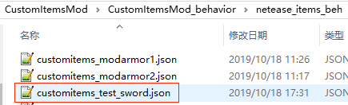

--- 
front: 
hard: Getting Started 
time: minutes 
--- 

# Custom Weapons and Tools 

## Overview 

Special custom items that support all the features of custom items and also have weapon or tool related functions. 

## Registration 

1. Same as steps 1-6 for registering custom basic items 

2. Add weapon/tool related definitions to the json of behavior/netease_items_beh, including: 

custom_item_type is weapon 

A netease:weapon component, required. See [json component](#json component) for component parameters 

Set the maximum stacking number, optional 

Set durability, optional 

 

```python 
{ 
"format_version": "1.10", 
"minecraft:item": { 
"description": { 
"identifier": "customitems:test_sword", 
"register_to_create_menu":true, 
"custom_item_type": "weapon" 
}, 

"components": { 
"minecraft:max_stack_size":1, 
"minecraft:max_damage":153, 
"netease:weapon":{ 
"type":"sword", 
"level":3, 
"speed":8, 
"attack_damage":7,

"enchantment":10 
} 
} 
} 
} 
``` 

## JSON components 

### description 

| key | type | default | explanation | 
| -------- | ---- | --------- | ---------------------------------------------- | 
| category | str | Equipment | Unlike normal items, the default category of weapons/tools is Equipment | 

### Vanilla components 

* minecraft:max_stack_size 

Custom weapons/tools only support setting to 1 

### NetEase components 

* netease:weapon 

| key | type | default | explanation | 
| ------------- | ---- | ------ | ------------------------------------------------------------ | 
| type | str | | The type of weapon/tool, currently supported types are: <br>sword<br>shovel<br>pickaxe<br>hatchet<br>hoe | 
| level | int | | Level description and repair information of weapons/tools, the following is an example of a pickaxe<br>1. For pickaxes, the corresponding mining level<br>That is, when using a pickaxe to mine certain blocks, the mining level of the pickaxe is greater than or equal to the mining level of the block, and only then will it produce drops. <br>For the original pickaxe, the wooden pickaxe and the gold pickaxe are 0, the stone pickaxe is 1, the iron pickaxe is 2, and the diamond pickaxe is 3<br>2. And this value is related to the repair material of the anvil. <br>level 0: corresponds to wood when speed is 2, otherwise corresponds to gold ingot <br>level 1: corresponds to stone <br>level 2: corresponds to iron ingot <br>level 3: corresponds to diamond <br>level greater than 3: cannot be repaired with anvil | 
| speed | int | 0 | Effective for collection tools, indicating the basic speed when digging blocks | 
| attack_damage | int | 0 | Attack damage | 
| enchantment | int | 0 | Enchanting ability. For an explanation of this value, see [Official Wiki](https://minecraft-zh.gamepedia.com/index.php?title=%E6%95%99%E7%A8%8B/%E9%99%84%E9%AD%94%E6%9C%BA%E5%88%B6&variant=zh#.E9.AD.94.E5.92.92.E6.98.AF.E5.A6.82.E4.BD.95.E9.80.89.E6.8B.A9.E5.87.BA.E6.9D.A5.E7.9A.84) | 

## Demo explanation 

[CustomItemsMod](../../13-Module SDK Programming/60-Demo Example.md#CustomItemsMod) defines a custom weapon: 

* customitems:test_sword 

Sword type custom weapons 
