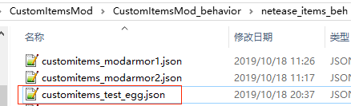

--- 
front: 
hard: Getting Started 
time: minutes 
--- 

# Custom Creature Egg 

## Overview 

It is a special custom item. In addition to supporting all the features of custom items, it also has the function of generating [custom creatures](../3-Custom Creatures/01-Custom Basic Creatures.md) by right-clicking. 

Supports monster spawners and launchers. 

## Registration 

1. Same as steps 1-6 for custom basic item registration 
2. Set custom_item_type to egg in the json of behavior/netease_items_beh 
3. Add definitions related to creature eggs, including a required **netease:egg component**. For component parameters, see [json component](#json component) 

 

```json 
{ 
"format_version": "1.10", 
"minecraft:item": { 
"description": { 
"identifier": "customitems:test_egg", 
"register_to_create_menu":true, 
"custom_item_type": "egg" 
}, 
"components": { 
"minecraft:max_stack_size":64, 
"netease:egg":{ 
"entity":"minecraft:mod{customitems:chicken}" 
} 
} 
} 
} 
``` 

## JSON components 

### NetEase components 

* netease:egg


| key | type | default value | explanation | 
| ------ | ---- | ------ | -------------------- | 
| entity | str | | identifier of the generated creature | 

## demo explanation 

[CustomItemsMod](../../13-Module SDK Programming/60-Demo Example.md#CustomItemsMod) defines a custom creature egg: 

* customitems:test_egg 

When you right-click, a Microsoft custom creature "customitems:chicken" will be generated 
