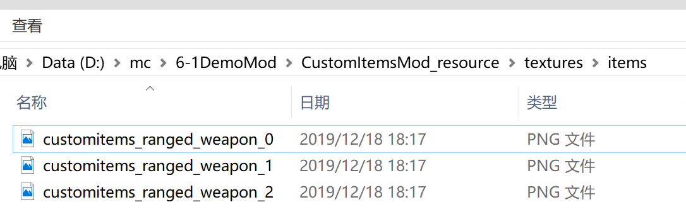

--- 
front: 
hard: Getting Started 
time: minutes 
--- 

# Custom Charged Items 

## Overview 

This is a special custom item. In addition to supporting all the features of custom items, it also supports charging when the right button is pressed and releasing when the right button is lifted. 

Similar to bows (minecraft: bow) and crossbows (minecraft: crossbow), it supports charging operations and sequence frame animations during item use. 

For detailed item definitions and item usage, see the example mod [CustomRangedWeaponMod](../../13-Module SDK Programming/60-Demo Example.md#CustomRangedWeaponMod). 

## Registration 

1. Same as steps 1-6 for custom item registration 
2. Create a json file in behavior, such as: 

```python 
{ 
"format_version": "1.10", 
"minecraft:item": { 
"description": { 
"identifier": "customitems:ranged_weapon", 
"register_to_create_menu":true, 
"custom_item_type": "ranged_weapon" 
}, 

"components": { 
"minecraft:use_duration": 72000 
} 
} 
} 
``` 

*Note: the size of use_duration should match the number of sequence frames* 

3. Custom sequence frames 

3.1 Put the sequence frame texture of the item in `textures\items`, such as: 

 

3.2 Add the definition of sequence frame images in textures/item_texture.json 


   ```python
   "customitems:ranged_weapon": {
       "textures": [
           "textures/items/customitems_ranged_weapon_0",
           "textures/items/customitems_ranged_weapon_1",
           "textures/items/customitems_ranged_weapon_2"
       ]
   }
   ```

   3.3 Add json files in netease_items_res, such as:

   ```python
   {
     "format_version": "1.10",
     "minecraft:item": {
       "description": {
         "identifier": "customrangedweapon:bow",
         "category": "Equipment"
       },
       "components": {
         "minecraft:icon": "customrangedweapon:bow", "minecraft:use_animation": "bow", 
"netease:frame_animation": { 
"frame_count": 3, 
"texture_name": "customrangedweapon:bow_frame", 
"animate_in_toolbar": true 
} 
} 
} 
} 
``` 

## NetEase components 

* netease:frame_animation 

| Key | Type | Default | Explanation | 
| ------------------ | ---- | ------ | ----------------------------------- | 
| frame_count | int | 1 | Sequence frame count | 
| texture_name | str | | Sequence frame array defined in item_texture.json | 
| animate_in_toolbar | bool | true | Whether to support animation in the inventory | 

* netease:render_offsets 

Item rendering configuration in first person 

Right-hand coordinate system, x is the direction of the thumb, y is the direction of the index finger, and z is the direction of the middle finger.


  | Key | Type | Default | Explanation | 
| -------------------------- | ----- | ------------- | ------------ | 
| controller_position_adjust | array | [0.0,0.0,0.0] | Item Position Adjustment | 
| controller_rotation_adjust | array | [0.0,0.0,0.0] | Item Rotation Adjustment | 
| controller_scale | float | 1.0 | Item Size Adjustment | 

## Item Durability 

Custom power items can set their durability via the minecraft:max_damage component 

Then get/set the durability in the item use event ItemReleaseUsingServerEvent 

```python 
slotIndex = 0 
comp = serverApi.CreateComponent(playerId,'Minecraft','item') 
val = comp.GetInvItemDurability(slotIndex) 
if val == 0: 
# Destroy item 
comp.SetInvItemNum(slotIndex, 0) 
else: 
comp.SetInvItemDurability(slotIndex, val - 1) 
``` 

