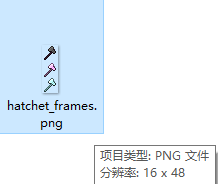
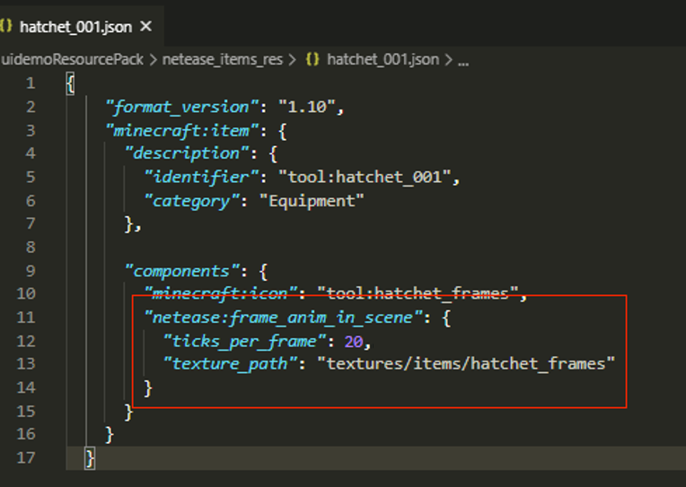
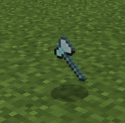
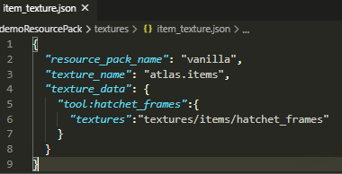
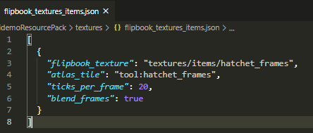
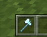

--- 
front: 
hard: Getting Started 
time: minutes 
--- 

# Customize item textures using sequence frame animation 

## Overview 

Developers can use sequence frame animation for item textures by making resources and json configurations according to specifications. 

The modification of item textures using sequence frames is divided into two parts, one is the modification of handheld and map drop textures, and the other is the modification on the UI interface. In practice, they are generally modified at the same time, but developers are also allowed to configure one of them separately. 

## Use sequence frame animation for item holding and map drop textures 

The implementation is divided into two steps: 
1) Resource production: 
It should be tiled from top to bottom. The texture height must be an integer multiple of the width. The first frame is at the top and the last frame is at the bottom. The larger the texture resolution, the greater the performance consumption. It is recommended that the texture width should not exceed 32: 

 

2) Add json component: 
Modify the json of the corresponding custom item in netease_items_res and add the netease:frame_anim_in_scene component. Here, take the custom axe as an example: 

 

| Key | Type | Explanation | 
| ------------------- | -------- | ---------------------------------------------------- | 
| ticks_per_frame | int | represents how many frames the texture is switched once, assuming 20 frames per second, if set to 20, it means one frame of texture is switched per second | 
| texture_path | str | path of the sequence frame texture | 

Final effect: 

 

## Sequence frame animation for textures on item UI interface 

The implementation is divided into three steps: 

1) Declare resources in the atlas. Because the textures displayed on the UI interface are taken from the atlas, they need to be declared first. 
Declare the sequence frame map hatchet_frames used above in textures/item_texture.json: 

 

2) Modify the json of the netease_items_res custom item, and modify the minecraft:icon field to the field declared in the above atlas: 

 

3) Create a new textures/flipbook_textures_items.json (similar to the original flipbook_textures.json file of Microsoft), and configure it in it:

 

| Key | Type | Default | Explanation | 
| ----------------- | ---- | ---------- | -------- | 
| flipbook_texture | str | | Path to the sequence frame resource | 
| atlas_tile | str | | Name declared in the atlas | 
| ticks_per_frame | int | | Indicates how many frames to switch the texture once, based on 60 frames per second. If set to 60, it means switching one frame of texture per second | 
| blend_frames | bool | True | Whether to blend the previous frame when switching textures | 

Final effect: 

