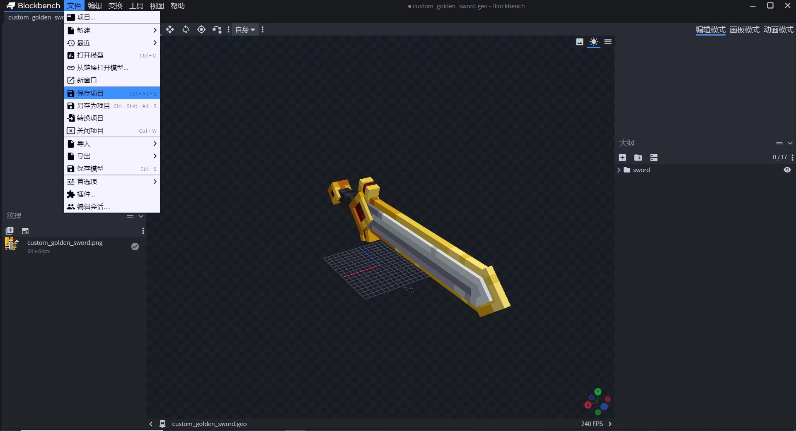
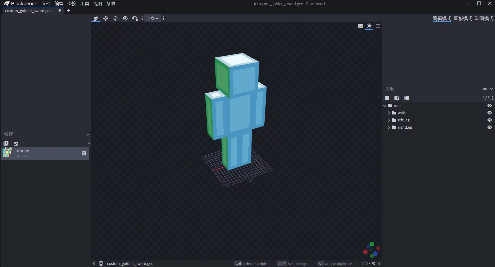
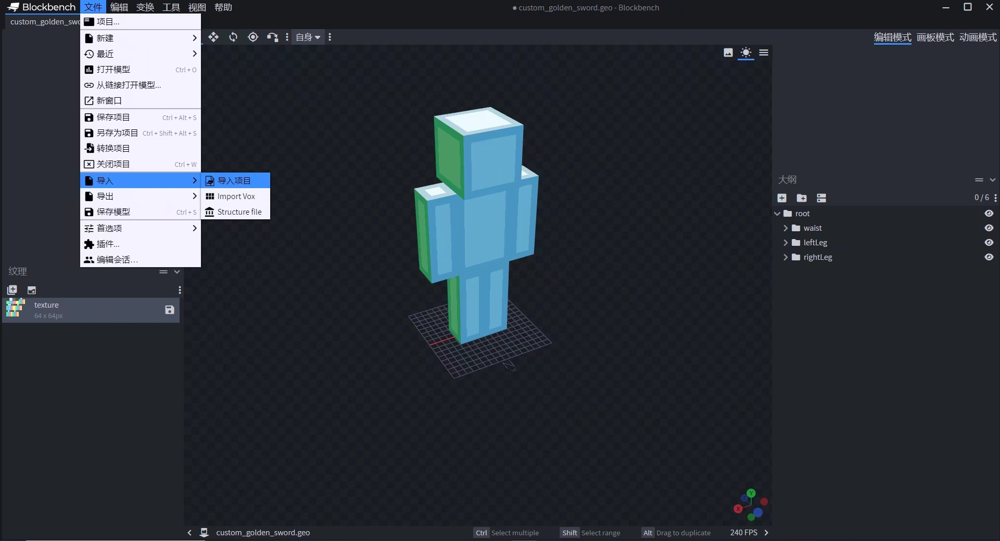
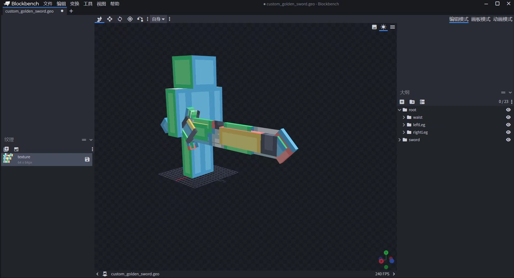
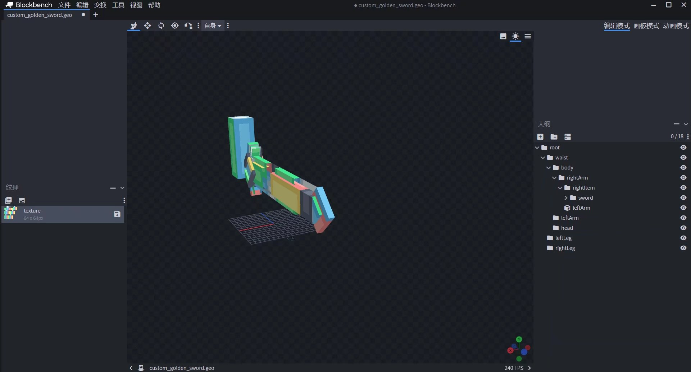
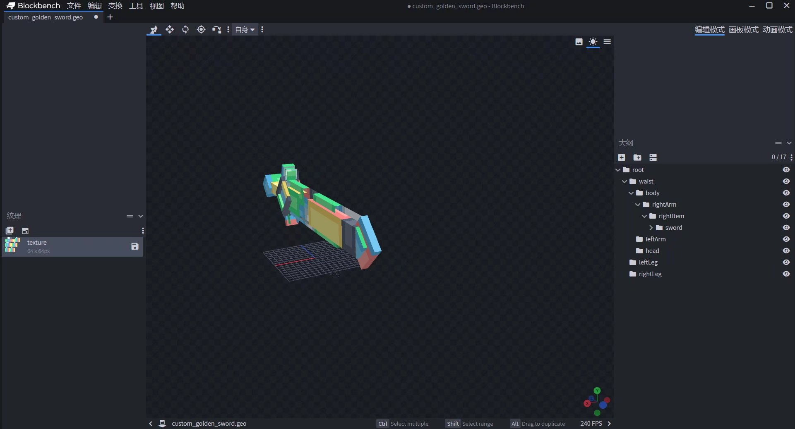
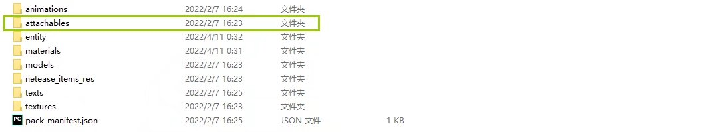
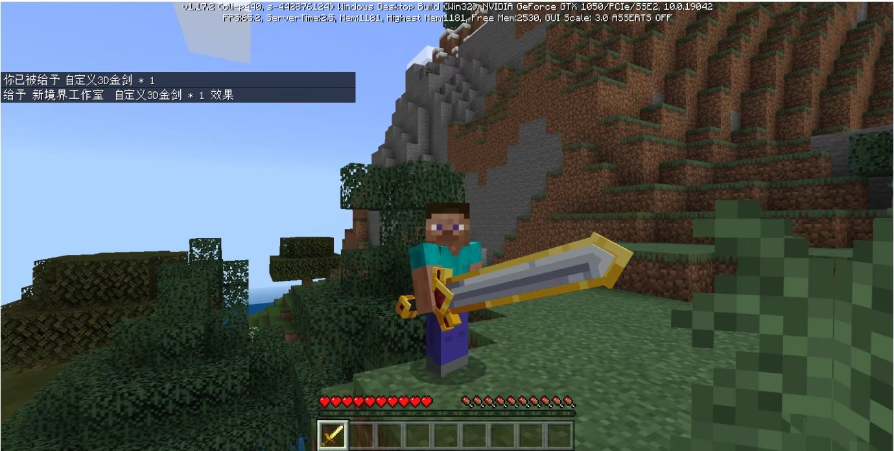

# Json configuration custom 3D items 

In this tutorial, we will focus on the topic of **How to customize a 3D item**, and teach you how to quickly create your first 3D item using only JSON configuration and add-on package development knowledge. 

> Warm Tips: Before starting to read this guide, we hope that you have a certain understanding of the "Minecraft" Bedrock Edition add-on package, have the ability to write JSON data format, and can independently read the "Minecraft" Developer Official Website-Development Guide or other technical reference documents. 

**Through this tutorial, you will learn:** 

• How to convert an existing Microsoft Bedrock Edition format item model into a custom item 3D model. 

• Check the relative position of the model in the model space to match and fix it to the player's third-person handheld position. 

## Background Introduction 

Starting with the module API 2.0 (Bedrock Edition version 1.17.2), the attachment (Attachable) file that defines the item in the resource package can bind the Microsoft original model to the item. 

## Modeling Specifications 

When making humanoid creatures (such as drowned, husks, zombies or players) hold 3D item models, we recommend that the model skeleton follow the player model skeleton layout. So that the model can prioritize the normal amplitude swing with the limb animation when the player holds it. 

The original player model uses a root bone as the base bone, and the waist bone is used in the child skeleton to control the upper body, and the rightLeg bone and leftLeg bone control the left and right legs. 

The Bedrock Edition identifier is recommended to use lowercase letters with underscores, because in the game, the effect of using rightLeg or rightleg is the same. The following is the skeleton tree of the player model, and the anchor point is the pivot in the model format. 

``` 
-root (anchor point: [0, 0, 0]) 
--waist (anchor point: [0, 12, 0]) 
---jacket (for persona) 
---cape (cloak) 
---body (anchor point: [0, 24, 0]) 
----leftArm (anchor point: [5, 22, 0]) 
-----leftSleeve (for persona) 
-----leftItem (anchor point: [6, 15, 1]) 
----rightArm (anchor point: [-5, 22, 0]) 
-----rightSleeve (for persona) 
-----rightItem (anchor point: [-6, 15, 1]) 
--leftLeg (anchor point: [-1.9, 12, 0]) 
---leftPants (for persona)

--rightLeg (anchor point: [1.9, 12, 0]) 
---rightPants (for persona) 
``` 

## Correct the model's position in space corresponding to the third-person handheld position 

First, click **[File]** - **[Save Project]** in the model project. 

 

Create a new humanoid model project and pull out the humanoid model format according to the skeleton tree diagram. 

 

Select **[File]** - **[Import]** to import the previously saved 3D model project. 

 

At this time, you can see that the texture of the item model is completely lost. But don't worry, it defaults to the material of the humanoid model. As long as its UV has been divided in the previous project, you don't need to worry about it here. 

 

Put the item model base skeleton under **【root】** - **【waist】** - **【body】** - **【rightArm】** - **【rightItem】** skeleton. And delete all model blocks except the right hand block. 

 

Continue to adjust the 3D item model until you reach a satisfactory hand-held angle. At this time, delete the right hand model block. In this way, an effective basic third-person right-handed handheld model is ready. 

 

## Install the 3D model 

Create a new attachables folder in the custom resource package of the add-on package and create a new JSON file. 

 

- Rendering controller: **"controller.render.item_default"** can be filled in by default. This is an item rendering controller provided by the original version. 
- Material: After filling in **"controller.render.item_default"**, you must add **"default"** and **"enchanted"** keys. The former corresponds to the default material of the item model, and the latter corresponds to the material carried by the item when enchanted. **"default"** is filled in by default **"entity_alphatest"** unless there are special circumstances, and "enchanted" is filled in by default **"entity_alphatest_glint"**. 
- Texture: After filling in **"controller.render.item_default"**, you must enter the **"default"** and **"enchanted"** keys, where the former corresponds to the custom item model texture, and the latter corresponds to the enchantment effect texture when the item is enchanted (usually fill in **""textures/misc/enchanted_item_glint"** by default). 
- Animation: Attachments can add animations and animation controllers like entities, and can also add particles, but currently particles will emit particles at the coordinates of the entity's sole by default, and cannot be emitted at the particle locator for the time being. 
- Geometry: The model of the attachment is based on the geometry identifier of the custom 3D model. 
- Item identifier: It can be consistent with the custom item identifier of the behavior pack. Here, fill in a custom item identifier **"design:custom_golden_sword"** in advance, and a custom item behavior will be used to correspond to it later. 


```json
{
    "format_version":"1.10.0",
    "minecraft:attachable":{
        "description":{
            "identifier":"design:custom_golden_sword",
            "materials":{
                "default":"entity_alphatest",
                "enchanted":"entity_alphatest_glint"
            },
            "textures":{
                "default":"textures/entity/custom_golden_sword",
                "enchanted":"textures/misc/enchanted_item_glint"
            },
            "geometry":{
                "default":"geometry.custom_golden_sword"
            },
            "render_controllers":[
                "controller.render.item_default"
            ]
        } } 
} 
``` 

Then in the custom behavior pack of the add-on pack, create a netease_items_beh folder and create a sub-file custom_golden_sword.json. For more custom item behaviors, please check this link: [Custom Weapons and Tools](../2-Custom Weapons and Tools.md) 

```json 
{ 
"format_version":"1.10", 
"minecraft:item":{ 
"description":{ 
"identifier":"design:custom_golden_sword", 
"register_to_create_menu":true, 
"custom_item_type":"weapon", 
"category":"Equipment" 
}, 
"components":{ 
"minecraft:max_damage":700, 
"minecraft:max_stack_size":1, 
"netease:weapon":{ 
"type":"sword", 
"level":0, 
"attack_damage":7, 
"enchantment":10 
} 
} 
} 
}

``` 

We can also add 2D item icons to custom items in the netease_items_res folder in the resource pack. For more basic content about custom items, please check this link: [Custom Basic Items](../1-Custom Basic Items.md) 

```json 
{ 
"format_version":"1.10", 
"minecraft:item":{ 
"description":{ 
"identifier":"design:custom_golden_sword", 
"category":"Equipment" 
}, 
"components":{ 
"minecraft:icon":"design:custom_golden_sword", 
"minecraft:render_offsets":"tools" 
} 
} 
} 
``` 

Now you can use this custom 3D item after loading the add-on pack in the game! 

 

You can use online tools such as Quick Format Json to locate incorrect syntax or structure that may occur during the writing process. 
