# Custom 3D Item First-Person Animation 

In the previous tutorial, we learned how to use Microsoft's Attachable feature to implement custom 3D items, and used the community tool Blockbench to calibrate the model's position in the third person, and finally installed a custom 3D golden sword in the game. 

**This course demo [click here to download](https://g79.gdl.netease.com/CustomWeapon3D.zip)** 

**Currently we have mastered:** 

- How to convert an existing Microsoft Bedrock Edition format item model into a custom item's 3D model. (Content of the first section)✔ 

- Calibrate the relative position of the model in the model space to match and fix it in the player's third-person handheld position. (Content of the first section)✔ 

- Use the developer tools to create first-person animations for models with the help of the Bedrock Edition PC Development Edition of "Minecraft". (Content of this section)❌ 

So next, I will lead you to use the developer tools to create first-person animations for models with the help of the Bedrock Edition PC Development Edition of "Minecraft".

 

In the Bedrock Edition of Minecraft, there are differences in the spatial angles of the first-person and third-person cameras. Therefore, it is necessary to design a separate first-person hand-held animation for the item model. (The following figure shows an example of a third-person hand-held correctly, but an unexpected display in the first-person) 

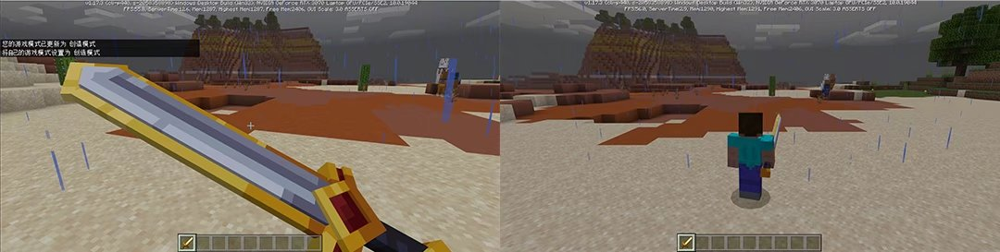 

Start Blockbench, select the custom 3D item model that was pre-made before, select [Animation Mode]-[Add Animation ➕], and create an animation for controlling the first-person hand-held angle position, and an animation for controlling the first-person hand-held 3D item scaling. (Minecraft Bedrock Edition animations can be superimposed, and after superposition, the displacement, scaling, and rotation values at the same time will be summed up) 

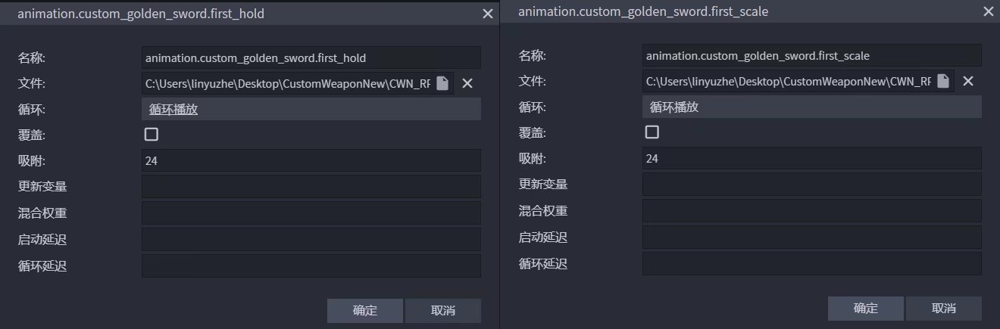 

The animation needs to be set to loop playback and the animation duration is set to 0. 

Insert a frame of scaling keyframe in the corresponding first-person handheld scaling animation (hereinafter referred to as "first_scale"), and fill in the scaling parameters of the keyframe arbitrarily. Here we fill in XYZ as 1.1 and save it. 

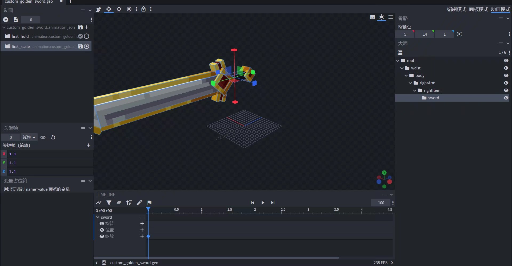 

Insert a frame of keyframe in the corresponding first-person handheld position angle animation (hereinafter referred to as "first_hold") and adjust the position and rotation values at the same time. Here we arbitrarily fill in the XYZ position and rotation values as 3 and save it. 

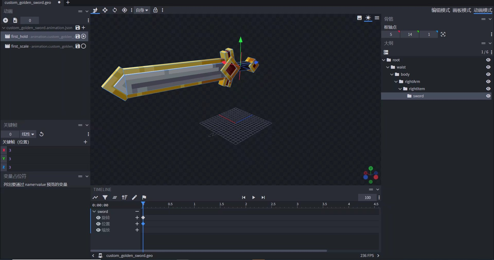 

Then go back to the attachment definition file, mount the previous "first_hold" and "first_scale" animations, and add them to the scripts/animate root animation. 

```json 
{ 
"format_version": "1.10.0", 
"minecraft:attachable": { 
"description": {

"identifier": "design:custom_golden_sword", 
"materials": { 
"default": "entity_alphatest", 
"enchanted": "entity_alphatest_glint" 
}, 
"textures": { 
"default": "textures/entity/custom_golden_sword", 
"enchanted": "textures/misc/enchanted_item_glint" 
}, 
"animations": { 
"first_hold": "animation.custom_golden_sword.first_hold", //Mount custom animation "first person holding" 
"first_scale": "animation.custom_golden_sword.first_scale" //Mount custom animation "first person sword scaling" 
}, 
"geometry": { 
"default": "geometry.custom_golden_sword" 
}, 
"render_controllers": [ "controller.render.item_default" ] 
} 
} 
} 
``` 

Return to the Bedrock Development Edition of Minecraft PC. Press F3 3 or 14 times in the game interface to call out the developer console. Then press F11 to call out the mouse. 

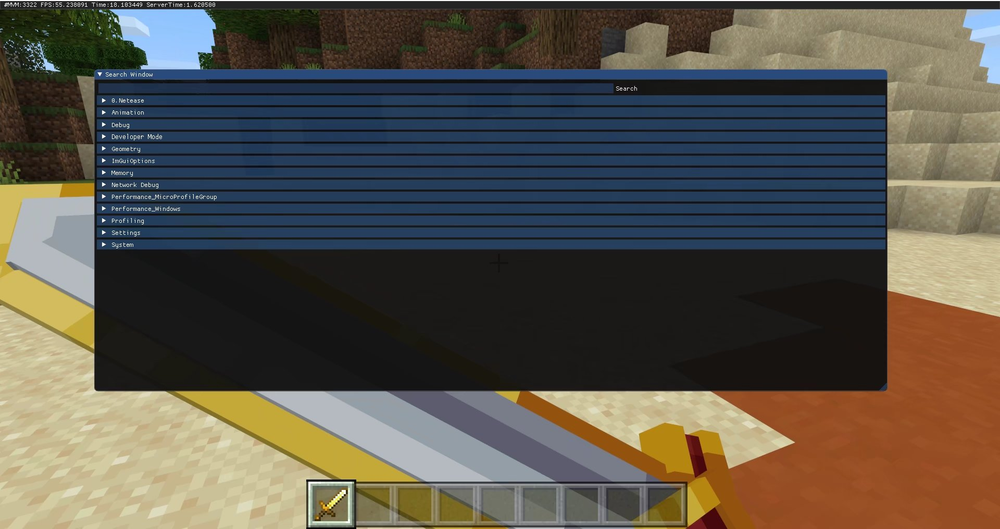 

Open the Animation list and click Open Editor. 

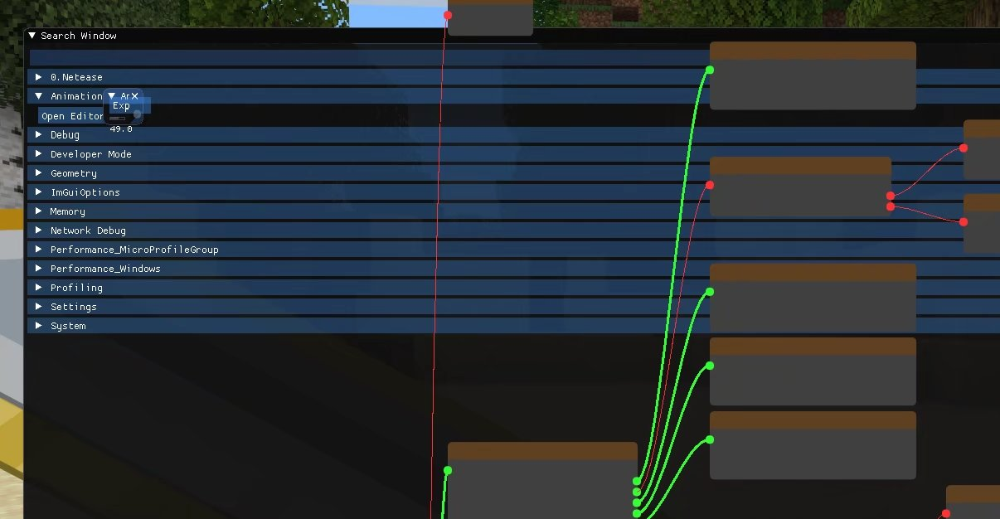 

By default, the editor window will be very small. At this time, click the stretch area in the lower right corner to stretch it. 

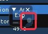 

After zooming in to a size that is clear enough, scroll down to the very bottom, where the animation status of the attachment is displayed. 

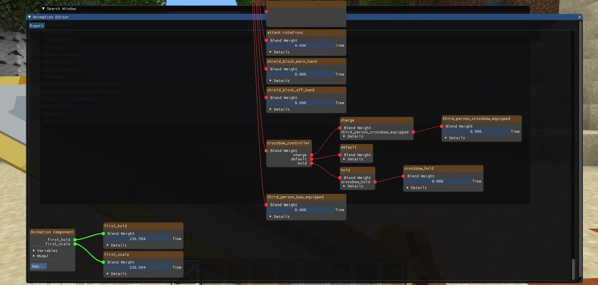 

Open the Details of "first_hold", then click Bone Animation, and you can see the various values of the animation made with Blockbench. It also supports dynamic modification directly in the editor, and is finally intuitively reflected in the game. 


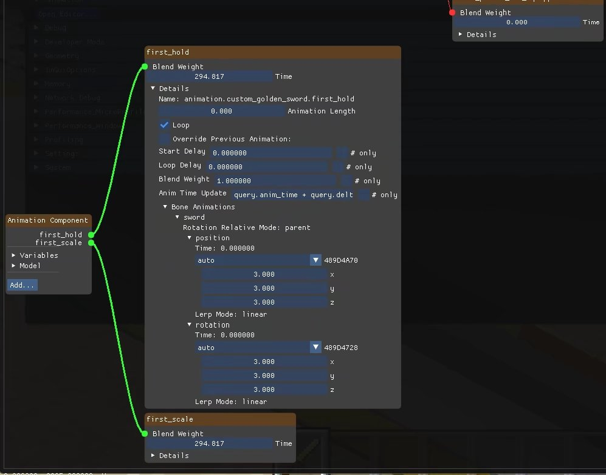 

Here we set the position of "first_hold" to -8 for X, 5 for Y, and -6 for Z. Then set the rotation to -45 for X, 15 for Y, and -135 for Z. Set the scale of "first_scale" to 0.35. 

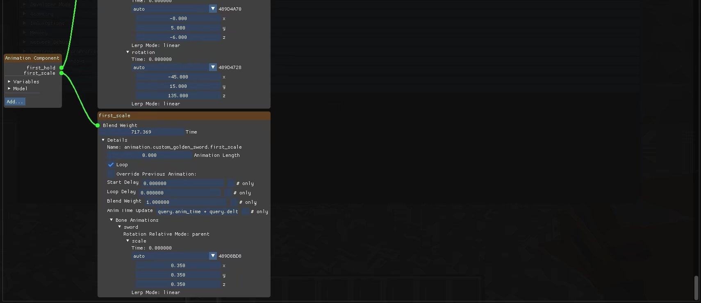 

Press F3 again until the interface disappears, and you can see the basic first-person custom 3D item holding effect in the game. 

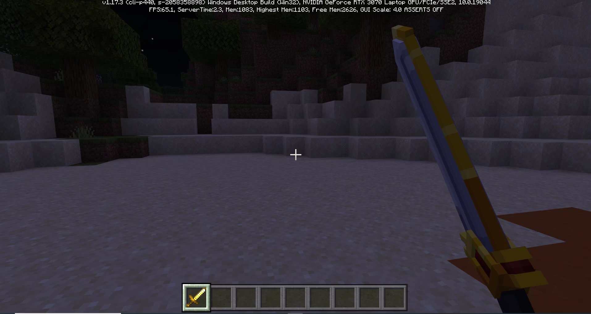 

Please note that the animation adjusted here will not be saved in the animation Json file! Therefore, we also need to memorize the value and write it into the animation file. 

```json 
{ 
"format_version": "1.8.0", 
"animations": { 
"animation.custom_golden_sword.first_hold": { 
"loop": true, 
"bones": { 
"sword": { 
"rotation": [-45, 15, 135], 
"position": [-8, 5, -6] 
} 
} 
}, 
"animation.custom_golden_sword.first_scale": { 
"loop": true, 
"bones": { 
"sword": { 
"scale": 0.35 
} 
} 
} 
} 
} 
``` 

Finally, add conditions to the loading mode of "first_hold" and "first_scale", and use "c.is_first_person" to determine whether the animation is running in first-person mode. If it is, run it.

```json
{
    "format_version": "1.10.0",

"minecraft:attachable": { 
"description": { 
"identifier": "design:custom_golden_sword", 
"materials": { 
"default": "entity_alphatest", 
"enchanted": "entity_alphatest_glint" 
}, 
"textures": { 
"default": "textures/entity/custom_golden_sword", 
"enchanted": "textures/misc/enchanted_item_glint" 
}, 
"animations": { 
"first_hold": "animation.custom_golden_sword.first_hold", //Mount custom animation "first person holding" 
"first_scale": "animation.custom_golden_sword.first_scale" //Mount custom animation "first person sword scaling" 
}, 
"scripts": { 
"animate": [ // Mount animation to root animation 
{ 
"first_hold": "c.is_first_person" // Ensure that the "first person holding" animation is only displayed in the first person 
}, 
{ 
"first_scale": "c.is_first_person"// Ensure that the "first person sword scaling" animation is only displayed in the first person 
} 
] 
}, 
"geometry": { 
"default": "geometry.custom_golden_sword" 
}, 
"render_controllers": [ "controller.render.item_default" ] 
} 
} 
} 
``` 

c is short for context, just like q can be used to represent query, which is a query function to query a specific state of an active object. c.is_first_person will return whether the attachment is in the first person perspective. Adding the ! operator in front of it will indicate whether it is in a non-first person perspective, which may be a third person front perspective or a third person back perspective. Other known context functions include: 

- **context.owning_entity:** Returns the entity that the attachment is wearing. You can use Molang's -> operator to get the properties of the entity. Assuming that the custom 3D item is known to be held by the player, you can use "c.owning_entity -> q.is_sneaking" to return whether the player is holding the attachment and squatting. 

- **context.item_slot:** The position of the attachment, returns "main_hand" (main hand) or "off_hand" (off-hand). 

