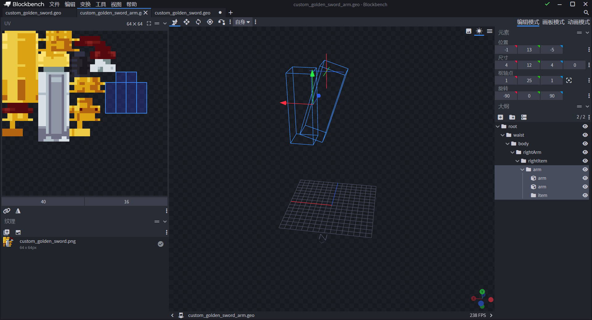

# Custom 3D Weapon First-Person Attack Effect 

After the first two custom 3D item tutorials, we learned how to use Microsoft's Attachable function to fully implement the custom 3D item function. 

Many weapon action modules occupy a very high position in the "Minecraft" module experience. Custom 3D items can highlight the characteristics of components in terms of weapons. This lesson will lead developers to learn how to use custom golden swords to create unique attack forms, and cooperate with the module SDK to make the features of the work even better. 

**Assuming that you have watched the first two custom 3D item tutorials, you should have learned:** 

- How to convert an existing Microsoft Bedrock Edition format item model into a custom item 3D model. ✔ 

- Proofread the relative position of the model in the model space to match and fix it to the player's third-person handheld position. ✔ 

- Use the developer tools to create first-person animations of 3D models with the help of the "Minecraft" Bedrock Edition PC development version. ✔ 

**In this course you will learn:** 

- Use Blockbench to design arm models for attachments and re-adjust the golden sword model. 
- Use Blockbench and Bedrock Edition animation overlay effects to create first-person handheld golden sword attack animations. 
- Use additional rendering controllers to mount arm models to attachments. 
- Use module SDK and custom query nodes to complete the first-person handheld golden sword attack effect. 

**Please click here to download the [Demo of this course](https://g79.gdl.netease.com/CustomWeaponAttackFP.zip):** 

 

## Design the arm model and readjust the golden sword modeling 

Open the previous section [Demo of custom 3D items](https://g79.gdl.netease.com/CustomWeapon3D.zip), the bones of the golden sword are currently arranged in the following order: 

``` 
-root (player root bone) 
--waist (player upper body bone) 
---body (player body bone) 
----rightArm (player right hand bone) 
-----rightItem (player right hand holding item bone) 
------sword (golden sword bone) 
``` 

 


**We have managed to display two arms holding the golden sword in the first person view when the player is holding the golden sword. At this time, the two arms follow the golden sword model, without involving the player model itself. This design intention has given some new inspirations and foreseeable challenges. ** 

 

First, the model of the golden sword is directly mounted under the right hand holding item bone. In order to allow the golden sword to follow the swinging arm in the subsequent animation, it is necessary to replace the sword bone with the arm bone to store the arm holding the golden sword handle, and incorporate the original sword bone block into a new bone group item and use it as the child bone of the arm bone. **To facilitate the first-person animation in the future**: Simply adjust the animation parameters of the arm bone, and the golden sword will rotate, offset or scale with the arm. 

 

In addition, we do not want the arm bone to appear in the third-person perspective. **This is because when the player holds an item, the player model's arms will automatically disappear. But when switching back to the third-person perspective, they will reappear. The player model's own arms will appear at the same time as the new arms of the golden sword, affecting the visual experience. ** 

 

**In the final preliminary plan, we need to use a new rendering controller to attach the arm bone to the attachment. An attachment can be used to attach multiple rendering controllers. At the same time, if the bone hierarchy remains unchanged, the sword model can be attached under the default rendering controller, and the arm model can be attached under the arm bone rendering controller. Then set the rendering controller to only be displayed in the first-person perspective. ** 

**The final sword model's bone hierarchy is as follows (Tips: right-click the corresponding bone and click Resolve Group can expand the parent bone without moving the child bone)** 

``` 
-root (player root bone) 
--waist (player upper body bone) 
---body (player body bone) 
----rightArm (player right hand bone) 
-----rightItem (player right hand holding item bone) 
------arm (gold sword double arm bone-no block) 
------item (gold sword bone) 
``` 

 

**The final sword arm model's bone hierarchy is as follows (Tips: put the original resource package/models/mo The two arms of the humanoid model in bs.json are directly copied here, which can inherit the UV unfolding of the original Steve model and quickly model the arms)** 

``` 
-root (player root bone) 
--waist (player upper body bone) 
---body (player body bone) 
----rightArm (player right hand bone) 
-----rightItem (player right hand holding item bone) 
------arm (gold sword arm bone) 
------item (gold sword bone-no block) 
``` 

 


## Make a first-person holding golden sword attack animation 

Switch to animation mode and create a new sword_attack to show the first-person attack animation. 

 

Select the sword_attack animation and check the first_hold animation. While the first-person holding animation is in effect, design the swinging animation based on this perspective. 

 

Here is a 0.75 second attack animation designed, which will actually swing the golden sword from right to left in the game. Other forms can be created by yourself. 

 

## Mount the arm model to the attachment 

Create a custom sword rendering controller in the resource pack/render_controllers folder to display the arm model. 

```json 
{ 
"format_version": "1.8.0", 
"render_controllers": { 
"controller.render.sword_controller": { 
"geometry": "Geometry.arm", 
"materials": [ 
{ 
"*": "Material.default" 
} 
], 
"textures": [ 
"Texture.arm" 
] 
} 
} 
} 
``` 

Then mount the arm model, arm texture, rendering controller and first-person animation on the attachment. 

```json
{
    "format_version": "1.10.0",

"minecraft:attachable": { 
"description": { 
"identifier": "design:custom_golden_sword", 
"materials": { 
"default": "entity_alphatest", 
"enchanted": "entity_alphatest_glint" 
}, 
"textures": { 
"default": "textures/entity/custom_golden_sword", 
"enchanted": "textures/misc/enchanted_item_glint", 
"arm": "textures/entity/steve" // The arm key corresponds to Texture.arm in the rendering controller, and the texture path is the original built-in Steve thick arm texture 
}, 
"animations": { 
"first_hold": "animation.custom_golden_sword.first_hold", 
"first_scale": "animation.custom_golden_sword.first_scale", 
"attack_rotation_sword": "animation.custom_golden_sword.sword_attack" // Custom first-person sword attack animation 
}, 
"scripts": { 
"animate": [ 
{ 
"first_hold": "c.is_first_person" 
}, 
{ 
"first_scale": "c.is_first_person" 
} 
] 
}, 
"geometry": { 
"default": "geometry.custom_golden_sword", 
"arm": "geometry.custom_golden_sword_arm" // arm key corresponds to Geometry.arm in the rendering controller 
}, 
"render_controllers": [ "controller.render.item_default", 
{ 
"controller.render.sword_controller": "c.is_first_person" // Only display arm model and arm texture in first-person view 
} 
] 
} 
} 
} 
``` 

After entering the game, you can see that when you take out the golden sword, the effect of two arms holding the hilt is displayed. 

 

## Complete the first-person holding golden sword attack effect


Using a custom Query node interface can minimize the impact of component conflicts. The custom Query interface can customize new Query functions on the client thread, which can be built into animations or animation controllers to change the effects of animations and animation controllers as conditions. 

 

Create a Python script directory in the behavior pack, name it CustomSwordScripts, and create a server system and a client system. For module SDK directory creation and system registration modules, you can view [this official website tutorial link](https://g.126.fm/00FchC4). 

``` 
-CustomSwordScripts: folder 
--client.py: client Python file 
---AnimationClient: client class 
--modMain.py: mod entry 
--server.py: server Python file 
---AnimationServer: server class 
``` 

```python 
# -*- coding: UTF-8 -*- 
from mod.common.mod import Mod 
import mod.server.extraServerApi as serverApi 
import mod.client.extraClientApi as clientApi 

@Mod.Binding(name="CustomSwordMod", version="0.1") 
class CustomSwordMod(object): 

def __init__(self): 
pass 

@Mod.InitClient() 
def init_client(self): 
clientApi.RegisterSystem("CustomSwordMod", "AnimationClient", 
                                 "CustomSwordScripts.client.AnimationClient")

    @Mod.InitServer()
    def init_server(self):
        serverApi.RegisterSystem("CustomSwordMod", "AnimationServer",
                                 "CustomSwordScripts.server.AnimationServer")

    @Mod.DestroyClient()
    def destroy_client(self):
        pass

    @Mod.DestroyServer()
    def destroy_server(self):
        pass

```


In the \__init__ function of the client class, listen to the OnLocalPlayerStopLoading event. When the player client is loaded, call the Query node interface and register query.mod.sword_attack. 

```python
# -*- coding: UTF-8 -*-
import mod.client.extraClientApi as clientApi
import time

compFactory = clientApi.GetEngineCompFactory()
ClientSystem = clientApi.GetClientSystemCls()


class AnimationClient(ClientSystem):

    def __init__(self, namespace, system_name):
        ClientSystem.__init__(self, namespace, system_name)
        namespace = clientApi.GetEngineNamespace()
        system_name = clientApi.GetEngineSystemName()
        self.ListenForEvent(namespace, system_name,
                            'OnLocalPlayerStopLoading', self, self.client_init) # Listen for events

    def client_init(self, event):
        player_id = clientApi.GetLocalPlayerId()
        query_comp = compFactory.CreateQueryVariable(clientApi.GetLevelId()) # Create a world-based query component 
query_comp.Register('query.mod.sword_attack_time', 0.0) # Registering a custom Query node must start with query.mod 
query_comp = compFactory.CreateQueryVariable(player_id) 
query_comp.Set('query.mod.sword_attack_time', 0.0) # Set the default value of this node again for the local player 
``` 

Added the first-person sword attack animation controller controller.animation.sword.first_attack. 

```json
{
    "format_version": "1.10.0",
    "animation_controllers": {
		"controller.animation.sword.first_attack": {
			"initial_state" : "default",
			"states" : {
				"default": {
					"transitions" : [
						{
							"first_person" : "c.is_first_person"
						}
					]
				},
				"first_person": {

"transitions" : [ 
{ 
"default" : "!c.is_first_person" // If it is not the first-person perspective, return to the default state 
}, 
{ 
"first_person_attack": "query.mod.sword_attack_time" // When query.mod.sword_attack_time is true, switch to the state of playing the attack animation 
} 
] 
}, 
"first_person_attack": { 
"animations": [ 
"attack_rotation_sword" // Attack animation 
], 
"transitions" : [ 
{ 
"default" : "!c.is_first_person" // If it is not the first-person perspective, return to the default state 
}, 
{ 
"first_person": "!query.mod.sword_attack_time"// Switch to default state when query.mod.sword_attack_time is false 
} 
] 
} 
} 
} 
} 
} 
``` 

Put first person sword attack animation controller into attachment definition file. 

```json
{
    "format_version": "1.10.0",
    "minecraft:attachable": {
        "description": {
            //...
            "animations": {
                "first_hold": "animation.custom_golden_sword.first_hold",
                "first_scale": "animation.custom_golden_sword.first_scale",
                "attack_rotation_sword": "animation.custom_golden_sword.sword_attack",
                "controller.attack": "controller.animation.sword.first_attack"
            },
            "scripts": {
                "animate": [
                    "controller.attack",
                    {
                        "first_hold": "c.is_first_person"
                    },

{ 
"first_scale": "c.is_first_person" 
} 
] 
} 
// ... 
} 
} 
} 
``` 

Then listen to LeftClickBeforeClientEvent and TapBeforeClientEvent, which correspond to the events of using the left button on the computer launcher and clicking the screen on the mobile phone, respectively. The event callback can point to the same function address. The code is analyzed as follows: 

1. Store the timestamp of the click on the client system. 
2. When responding to the event, calculate whether the current time minus the past timestamp is greater than the time of the attack animation. Our custom attack animation time is 0.75 seconds, so the judgment result needs to be greater than 0.75. 
3. When condition 2 is met, continue to judge whether it is a golden sword. If so, recalculate the timestamp. And execute the function send_attacked_packet. 
4. The business logic in the send_attacked_packet function is mainly to create a timer task to send data to the server, and then notify other players' clients through the server to play the swinging animation. And set the value of query.mod.sword_attack on the local client to help the animation controller play the animation effect. 

```python
# -*- coding: UTF-8 -*-
import mod.client.extraClientApi as clientApi
import time

compFactory = clientApi.GetEngineCompFactory()
ClientSystem = clientApi.GetClientSystemCls()


class AnimationClient(ClientSystem):

    def __init__(self, namespace, system_name):
        ClientSystem.__init__(self, namespace, system_name)
        namespace = clientApi.GetEngineNamespace()
        system_name = clientApi.GetEngineSystemName()
        self.ListenForEvent(namespace, system_name,
                            'OnLocalPlayerStopLoading', self, self.client_init)
        self.ListenForEvent(namespace, system_name,
                            'LeftClickBeforeClientEvent', self, self.attack_click)        self.ListenForEvent(namespace, system_name,
                            'TapBeforeClientEvent', self, self.attack_click)
        self.click_cooldown = time.time()

    def client_init(self, event):
        #...
        pass

    def attack_click(self, event):
        current_time = time.time()
        carried_item = compFactory.CreateItem(clientApi.GetLocalPlayerId()).GetCarriedItem()

if current_time - self.click_cooldown > 0.75 and carried_item and carried_item['newItemName'] == 'design:custom_golden_sword': 
self.click_cooldown = time.time() 
self.send_attacked_packet(0.0, {# Time when the animation starts 
'playerId': clientApi.GetLocalPlayerId(), 
'type': 'start' 
}) 
self.send_attacked_packet(0.16, {# Time when the animation strikes out damage, depending on the design form of the custom animation 
'playerId': clientApi.GetLocalPlayerId(), 
'type': 'will_hit' 
}) 
self.send_attacked_packet(0.75, { # Time when the animation ends 
'playerId': clientApi.GetLocalPlayerId(), 
'type': 'end' 
}) 
else: 
# Cancel the click if the animation is playing 
if carried_item and carried_item['newItemName'] == 'design:custom_golden_sword': 
event['cancel'] = True 

def send_attacked_packet(self, _time, data): 
game_comp = compFactory.CreateGame(clientApi.GetLevelId()) 
game_comp.AddTimer( 
_time, 
self.NotifyToServer, # Send data to the server to inform other clients of the current player's animation status so that other clients can also see the effect of the player's animation. 
'AttackedPacket', 
data 
) 
game_comp.AddTimer( 
_time, 
compFactory.CreateQueryVariable(clientApi.GetLocalPlayerId()).Set, # Set the value of the query node required for the local player client to play the animation 
'query.mod.sword_attack_time', 
1.0 if data['type'] == 'start' or data['type'] == 'will_hit' else 0.0 
) 
``` 

On the server system code, listen to the AttackedPacket event from the client. The code analysis is as follows: 

1. If the player clicks the left button to play the custom client event of the animation, when the state is will_hit (animation hits damage), get the surrounding entities and execute the sector attack function sector_attack. 
2. The sector_attack function calculates whether a certain entity is within the sector view range of another entity. By calculating the coordinate distance between the attacker and the victim, and the difference in view angle between the attacker and the victim, and judging that the difference in view angle is at a fixed sector angle, a damage component is created to create damage to the victim. 
3. Use the GetRelevantPlayer interface to obtain the IDs of the surrounding players, and use the NotifyToMultiClients interface to send the AttackSync event to other players to inform this player to start playing the animation. Other players also need to set the query.mod.sword_attack of this player to true in their local clients to synchronize the animation effects. 

```python 
# -*- coding: UTF-8 -*- 
import mod.server.extraServerApi as serverApi 
import math 
from mod.common.utils.mcmath import Vector3 

compFactory = serverApi.GetEngineCompFactory()

ServerSystem = serverApi.GetServerSystemCls()


class AnimationServer(ServerSystem):

    def __init__(self, namespace, system_name):
        ServerSystem.__init__(self, namespace, system_name)
        namespace = serverApi.GetEngineNamespace()
        system_name = serverApi.GetEngineSystemName()
        self.ListenForEvent('CustomSwordMod', 'AnimationClient',
                            'AttackedPacket', self, self.attacked)

    def attacked(self, event):
        _type = event['type']
        player_id = event['playerId']
        if _type == 'will_hit':
            entities = compFactory.CreateGame(player_id).GetEntitiesAround(player_id, 6,
                                                                  {
                                                                      'any_of': {
                                                                          'test': 'is_family',
                                                                          'subject': 'other',
                                                                          'operator': 'not',
                                                                          'value': 'instabuild'
                                                                      }
                                                                  })
            for entity in entities:
                self.sector_attack(player_id, entity, 65.0, 6.0, 7, attacker_id=player_id)
        elif _type == 'start':
            players = compFactory.CreatePlayer(player_id).GetRelevantPlayer([player_id])
            self.NotifyToMultiClients(players, 'AttackSync', {
                'playerId': player_id,
                'value': 1.0
            })
        else:
            players = compFactory.CreatePlayer(player_id).GetRelevantPlayer([player_id])
            self.NotifyToMultiClients(players, 'AttackSync', {
                'playerId': player_id,
                'value': 0.0
            })

    def sector_attack(self, attacker, victim, between_angle=0.0, radius=0.0, damage=0, cause=serverApi.GetMinecraftEnum().ActorDamageCause.EntityAttack, attacker_id=None, child_attacker_id=None, knock=True):
        attacker_foot_pos = compFactory.CreatePos(attacker).GetFootPos()
        victim_foot_pos = compFactory.CreatePos(victim).GetFootPos()
        delta = Vector3(victim_foot_pos) - Vector3(attacker_foot_pos)
        forward_vector = serverApi.GetDirFromRot(compFactory.CreateRot(attacker).GetRot())
        angle = math.degrees(math.acos(Vector3.Dot(delta.Normalized(), Vector3(forward_vector).Normalized())))
        if angle < between_angle and delta.Length() < radius:
            compFactory.CreateHurt(victim).Hurt(damage, cause, attacker_id, child_attacker_id, knock)
```


Finally, listen to the AttackSync event from the custom server on the client. Set the progress of other players' animations on the local client. 

```python
# -*- coding: UTF-8 -*-
import mod.client.extraClientApi as clientApi
import time

compFactory = clientApi.GetEngineCompFactory()
ClientSystem = clientApi.GetClientSystemCls()


class AnimationClient(ClientSystem):

    def __init__(self, namespace, system_name):
        ClientSystem.__init__(self, namespace, system_name)
        namespace = clientApi.GetEngineNamespace()
        system_name = clientApi.GetEngineSystemName()
        # ....
        self.ListenForEvent('CustomSwordMod', 'AnimationServer',
                            'AttackedSync', self, self.attacked_sync)
        # ....

    def client_init(self, event):
        # ....
        pass

    def attack_click(self, event): 
# .... 
pass 

def attacked_sync(self, event): 
player_id = event['playerId'] 
value = event['value'] 
compFactory.CreateQueryVariable(player_id).Set( 
'query.mod.sword_attack_time', 
value 
) 

def send_attacked_packet(self, _time, data): 
# .... 
pass 
``` 

It can be seen that the actual effect is as expected, causing range damage to the flock and playing the custom attack animation. Developers who have the conditions to connect online can also verify the playback effect of the attack animation under multiplayer online. 

