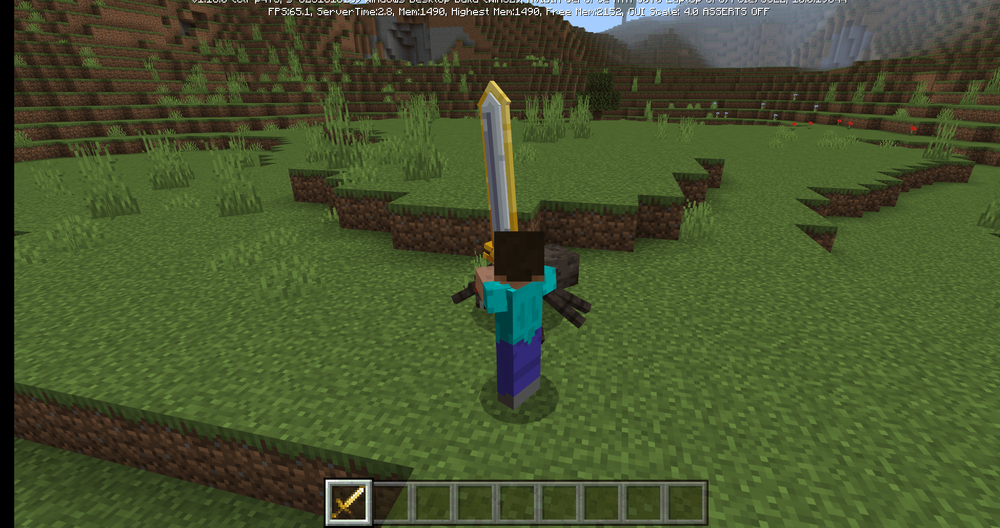
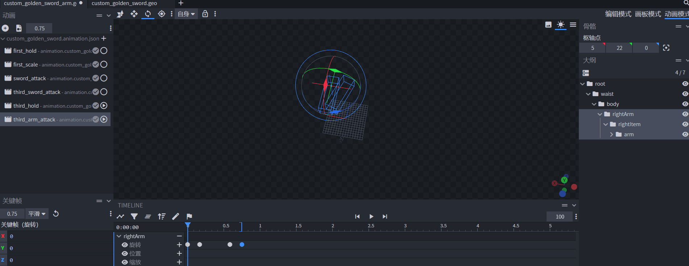
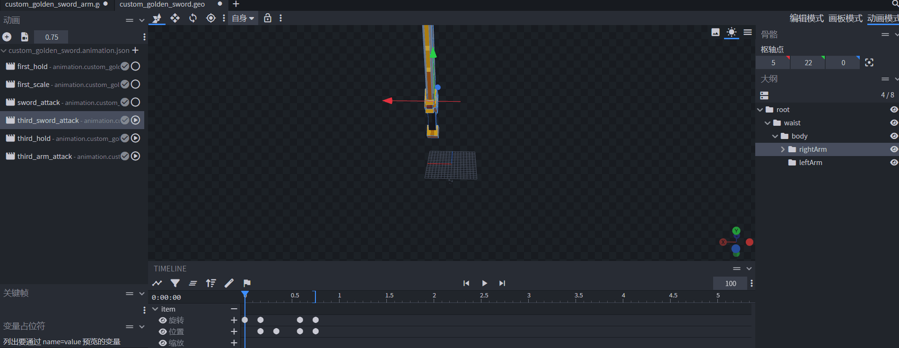

# Customize 3D weapon third-person attack effects 

In the previous section, we have a preliminary understanding of how to customize the attack effects of 3D weapons in the first-person perspective. Since players have first-person and third-person perspectives, adapting to the third-person perspective is essential. 

The custom 3D weapon attack effects in the third-person perspective require Python code. Here we use the traditional module development method of registering a custom system to explain it to you. 

**In this chapter you will learn:** 

- Use Blockbench and Bedrock Edition animation overlay effects to create third-person handheld golden sword animations and corresponding attack animations. 
- Use the module SDK to mount new animation resources and reconstruct the third-person animation controller. 

[Please click here](https://g79.gdl.netease.com/customweaponnew.zip) used in this course, the following is the final effect:** 

 

## Create the animation resources required for the third person 

Start Blockbench, open custom_golden_sword_arm.geo.json, and switch to animation mode. Create a third_hold to show the third person handheld animation. And rotate the arm upward along the X axis. 

 

Create a third_arm_attack to show the third person swinging animation, select the third_arm_attack animation and check the third_hold animation, and customize a 0.75 second attack animation. And set the keyframe to smooth to make the animation effect smoother. 

 

Since the arm and sword are separated into two models, the arm's animation channel cannot affect the weapon. In order to synchronize the sword's trajectory when the arm is swung, we need to make another animation on the sword model. Open custom_golden_sword.geo.json, switch to animation mode, add the third_sword_attack animation, check the third_hold animation after selecting it, and also customize a 0.75 second attack animation with the same duration as the hand waving. Here you can copy the arm bone keyframe of third_arm_attack and add animation keyframes to the item bone of third_sword_attack. Finally, select the third_sword_attack animation, check the third_hold and third_arm_attack animations, and you can see the complete third-person attack animation effect. 

 

## Mount new animation resources and create new animation controllers 

Create a new controller.animation.player.third_person_attack_fixed animation controller with two states: default and third_person_attack. When query.mod.sword_attack_time is not equal to 0, it switches to the state of playing the third-person attack animation. When the animation ends and the corresponding query.mod.sword_attack_time is 0, it switches back to the default state. The following is a code example. 

```json 
{ 
"format_version": "1.10.0", 
"animation_controllers": {

"controller.animation.player.third_person_attack_fixed" : { 
"states" : { 
"default": { 
"transitions": [ 
{ 
"third_person_attack": "query.mod.sword_attack_time" 
} 
] 
}, 
"third_person_attack": { 
"animations": [ 
"third_arm_attack" 
], 
"transitions": [ 
{ 
"default": "!query.mod.sword_attack_time" 
} 
] 
} 
} 
} 
} 
} 
``` 

Then add the ActorRender component to the client_init function in CustomSwordScripts/client.py to dynamically add art assets to the player asset definition when the game is running. Since the third-person arm animation involves the player's resources, this is a measure that must be taken. In order to minimize the possibility of conflict, we do not choose to directly modify the player resource definition content, but use Python code to import. 

```python 
class AnimationClient(ClientSystem): 
# ... 
def client_init(self, event): 
# ... 
actor_comp.AddPlayerAnimationController( # Third person attack animation controller 
'controller.third_person_attack_fixed', 
'controller.animation.player.third_person_attack_fixed' 
) 
actor_comp.AddPlayerAnimation( 
'sword_third_hold', 
'animation.custom_golden_sword.third_hold' # Third person handheld animation 
) 
actor_comp.AddPlayerAnimation( 
'third_arm_attack', 
'animation.custom_golden_sword.third_arm_attack' # Third person arm animation 
) 
# Add the third-person holding animation to the third_person state under the player's root animation controller. This contains the animations that the player will use in the third person. 
# The animation will only take effect if the main hand holds a custom golden sword. 
actor_comp.AddPlayerAnimationIntoState( 
'root', 'third_person', 'sword_third_hold', "query.get_equipped_item_full_name('main_hand') == 'design:custom_golden_sword'"

) 
# Add the third-person handheld animation controller to the third_person state under the player's root animation controller. The animation controller can also be nested in other animation controllers 
# The animation controller must meet the requirement that the main hand holding must be a custom golden sword to take effect 
actor_comp.AddPlayerAnimationIntoState( 
'root', 'third_person', 'controller.third_person_attack_fixed', "query.get_equipped_item_full_name('main_hand') == 'design:custom_golden_sword'" 
) 
actor_comp.RebuildPlayerRender() #After importing resources, the player rendering must be rebuilt, calling the RebuildPlayerRender method 
``` 

In the attachable definition file of the sword, attach the third_sword_attack animation. This is because the effect of the sword swinging can be transferred to the sword itself, so third_sword_attack should be attached to the resource definition file of the sword. 

```json
{
    "format_version": "1.10.0",
    "minecraft:attachable": {
        "description": {
            "identifier": "design:custom_golden_sword",
            //materials
			//textures
            "animations": {
                //...
                "attack_rotation_sword": "animation.custom_golden_sword.sword_attack",
                "third_attack_rotation_sword": "animation.custom_golden_sword.third_sword_attack",
                "controller.attack": "controller.animation.sword.attack"
            },
            "scripts": {
                "animate": [
                    "controller.attack",
                    {
                        "first_hold": "c.is_first_person"
                    },
                    {
                        "first_scale": "c.is_first_person" } 
] 
} 
//geometry 
//render_controlls 
} 
} 
} 
``` 

Rewrite controller.attack animation controller and add two states: third_person and third_person_attack. It is required that the state be switched to third_person in the third person, and the state be switched to third_person_attack when the attack starts, and the sword swinging animation of the third person be played, and the state be switched back to the third_person state when query.mod.sword_attack_time is 0. In all states related to the third person, the condition for switching to the default state is provided, that is, when c.is_first_person (the holding entity is in the first person) is satisfied. 

```json

{
    "format_version": "1.10.0",
    "animation_controllers": {
        //...
    	"controller.animation.sword.attack": {
			"initial_state" : "default",
			"states" : {
				"default": {
					"transitions" : [
						// first_person
						{
							"third_person": "!c.is_first_person"
						}
					]
				},
				// first_person
				"third_person": {
					"transitions" : [
						{
							"default" : "c.is_first_person"
						},
						{
							"third_person_attack": "query.mod.sword_attack_time"
						}
					]
				},
				"third_person_attack": {
					"animations": [ "third_attack_rotation_sword" 
], 
"transitions" : [ 
{ 
"default" : "c.is_first_person" 
}, 
{ 
"third_person": "!query.mod.sword_attack_time" 
} 
] 
} 
// first_person_attack 
} 
} 
} 
} 
``` 

Finally, enter the game and you can see that the third-person effect has taken effect. 


 

## Some other optimizations 

Since we did not block the logic of the player touching the block while swinging, if the swinging area is close to the block, a relatively ugly mining animation will be superimposed. To avoid this problem, you can listen to StartDestroyBlockClientEvent and StartDestroyBlockServerEvent in the client.py and server.py files respectively, judge the result according to the actual situation, and cancel the mining. 

Here is a code example:

```python
# client.py
class AnimationClient(ClientSystem):
    
    def __init__(self, namespace, system_name):
        #....
        namespace = clientApi.GetEngineNamespace()
        system_name = clientApi.GetEngineSystemName()
        self.ListenForEvent(namespace, system_name,
                            'StartDestroyBlockClientEvent', self, self.attack_click_block)
    #....
    def attack_click_block(self, event):
        player_id = event['playerId']
        if player_id != clientApi.GetLocalPlayerId():
            return
        current_time = time.time()
        if current_time - self.click_cooldown < 0.75:
            event['cancel'] = True
```

```python
# server.py
class AnimationServer(ServerSystem):

    def __init__(self, namespace, system_name):
        ServerSystem.__init__(self, namespace, system_name)
        #....
        namespace = serverApi.GetEngineNamespace()
        system_name = serverApi.GetEngineSystemName()
        self.ListenForEvent(namespace, system_name,
                            'StartDestroyBlockServerEvent', self, self.attack_click_block)
        self.player_attacked_cache = {}
        self.attack_type = ['start', 'will_hit', 'end']
    
    #...
    def attack_click_block(self, event):
        player_id = event['playerId']
        if self.player_attacked_cache.get(player_id, '') != 'end':
            event['cancel'] = True 
``` 

