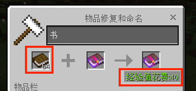

--- 
front: 
hard: Getting Started 
time: minutes 
--- 

# Custom enchantment 

Add custom enchantment based on the original game. Custom enchantment effects need to be implemented through mod writing 

## Demo explanation 

1.[EnchantDemo](../13-Module SDK Programming/60-Demo Example.md#EnchantDemo) defines 4 types of spells: 

- Sprint -- Permanent enchantment, faster movement speed, can only be attached to shoes 

- Thunder -- Cyclic enchantment, thunder falls around the player every once in a while, can only be attached to helmets 

- Loot -- Trigger enchantment, attacking a creature will produce an apple at the creature's location, can only be attached to a pickaxe 

- Heavy -- Curse type enchantment, add hunger status effect to the player, can only be attached to the sword 

2. Modified the loot table of sheep, horse, cow, and chicken, corresponding to the four loot table configurations in the document below 

3. Added a custom script, which can be used to test the situation where custom enchantments encounter custom items 

4. Rewrote the transaction between librarian and weaponsmith, and can sell enchanted books and weapons with enchantments 

## 1 Function 

1. Register new enchantments 
2. Set which tools or equipment the enchantment can be attached to 
3. Set the maximum level of the enchantment and the experience value consumed at each level 
4. Set the rarity of the enchantment 
5. Set whether the enchantment is a treasure spell 
6. Set whether the enchantment can be obtained through the librarian 
7. Set whether the enchantment is a curse spell 
8. Set conflicting enchantments 
9. You can get the enchantment information of the item from the itemdict 
10. You can enchant the appropriate tools, equipment or books from the enchantment table 
11. Enchanted books with custom enchantments can be used on anvils 
12. You can obtain the corresponding enchantment items through the original enchantment acquisition path of MC [[Enchantment Path Wiki]](https://minecraft.fandom.com/zh/wiki/附魔) 

## 2 Register custom enchantments 

Add the `netease_enchants` folder in the mod**behavior pack and resource pack**, and add the custom enchantment json to it 

### 2.1 Custom enchantment json example 

```json 
{ 
"netease:enchant": { 
// Required

"identifier": "demoenchant:customenchant1", // Custom enchantment id, all lowercase letters 
"description": "enchantment.demoenchant.customenchant1", // Custom enchantment name, corresponding to langStr in zh_CN.lang 
"primary_slots": ["elytra"], // Enchantment slot, enchantment items can only be successfully enchanted if they have the same slot 
"cost": [3,6,9,12,15], // The experience cost corresponding to the enchantment power level, which affects the experience value returned when the grindstone removes the enchantment and the probability of being enchanted with the enchantment on the enchantment table (the larger the cost, the smaller the enchantment probability); the number of elements in the list must be consistent with max_level, otherwise registration fails 

// Optional 
"frequency": "very_rare", // Custom enchantment rarity, affects the experience cost of combining anvils with enchanted items, default is common 
"is_treasure_only": false, // When set to true, it is a treasure enchantment, which will affect the way to obtain enchantments. The default is false. 
"is_discoverable": true, // When set to false, it is a treasure enchantment, which will affect the way to obtain enchantments. The default is true. 
"is_lootable": true, // When set to true, it can be obtained by trading with the librarian. The default is true. 
"is_curse": false, // When set to true, it is a curse enchantment, which cannot be removed by grinding. The default is false. 
"max_level": 5, // Enchantment power level. After setting, enchanted books of various levels will be automatically registered in the creation inventory. The default is 1. 
"incompatible": ["unbreaking"] // Conflicting enchantment name 
} 
} 
``` 

### 2.2 primary_slots (enchantment slot) 

Custom enchantment optional slots 

| string | Corresponding slot | 
| -------------- | ------------------------------------------------------------ | 
| all | All (All slots below, not all items in the game) | 
| g_armor | All armor | 
| armor_head | Helmets | 
| armor_torso | Chest armor | 
| armor_legs | Leggings | 
| armor_feet | Boots | 
| sword | Sword | 
| bow | Bow | 
| spear | Trident | 
| crossbow | Crossbow | 
| g_tool | Hoe, Scissors, Flint, Shield | 
| hoe | hoe | 
| shears | Scissors | 
| flintsteel | Flint | 
| shield | Shield | 
| g_digging | Hoe, Axe, Pickaxe, Shovel | 
| axe | axe | 
| pickaxe | Pickaxe | 
| shovel | Shovel | 
| fishing_rod | Fishing rod | 
| carrot_stick | Carrot on a stick | 
| elytra | elytra | 
| cosmetic_head | skeleton model/wither skeleton model/model/zombie model/dragon model/creeper model/carved pumpkin | 
| compass | 
| mushroom_stick | warped fungus fishing rod | 

### 2.3 frequency (rarity)


Rarity affects the calculation of experience consumption when an anvil combines enchanted items 

Default: common 

#### 2.3.1 Corresponding cost of each level of rarity 

| Rarity | cost | 
| --------- | ---- | 
| common | 1 | 
| uncommon | 2 | 
| rare | 4 | 
| very_rare | 8 | 

#### 2.3.2 Calculation rules for experience consumption when anvil combines enchanted items 

1. Assuming that item 1 has enchantments a and b, the costs corresponding to their rarity are cost_a and cost_b, and the power levels are level_a and level_b, the total cost calculation rules of the item are as follows: 

​ total_cost = cost_a * level_a + cost_b * level_b 

If the item is an enchanted book, the total_cost calculation rules are as follows: 

​ total_cost = max(1, cost_a / 2) * level_a + max(1, cost_b / 2) * level_b 

If the item has more enchantments, follow the above formula 

2. Calculate the total_cost of item 1 on the anvil, set here as initial_total_cost 
3. According to the [Anvil Combining Items Rules](https://minecraft.fandom.com/zh/wiki/%E9%93%81%E7%A0%A7#.E7.94.A8.E9.80.94), calculate the total_cost of item 2 expected to be produced after combining, set here as combined_total_cost 
4. final_cost = combined_total_cost - initial_total_cost 
5. If final_cost is greater than 0, and the number of item 1 is greater than 1, then final_cost = 40 as shown below: 
6. If item 2 combined by the anvil does not carry enchantments, then final_cost = 0 

**The final anvil combined with the item operation consumption experience is also affected by other factors, and the final consumption level may be greater than final_cost** 

 

#### 2.3.3 Native enchantment id and frequency 

| Type | Enchantment name | identifier | frequency | 
| ---- | ---------- | --------------------- | --------- | 
| 0 | protection | protection | common | 
| 1 | fire protection | fire_protection | uncommon | 
| 2 | feather_falling | uncommon | 
| 3 | blast protection | blast_protection | rare | 
| 4 | projectile protection | projectile_protection | uncommon | 
| 5 | thorns | thorns | very_rare | 
| 6 | respiration | rare | 
| 7 | depth_strider | rare | 
| 8 | aqua_affinity | rare | 
| 9 | sharpness | common |

| 10 | smite | uncommon | 
| 11 | bane_of_arthropods | uncommon | 
| 12 | knockback | uncommon | 
| 13 | fire_aspect | rare | 
| 14 | looting | rare | 
| 15 | efficiency | common | 
| 16 | silk_touch | very_rare | 
| 17 | durability | unbreaking | uncommon | 
| 18 | fortune | rare | 
| 19 | power | common | 
| 20 | punch | rare | 
| 21 | flame | rare | 
| 22 | infinity | very_rare | 
| 23 | Favor of the Sea | luck_of_the_sea | rare | 
| 24 | lure | rare | 
| 25 | frost_walker | rare | 
| 26 | mending | rare | 
| 27 | binding | very_rare | 
| 28 | vanishing | very_rare | 
| 29 | impaling | uncommon | 
| 30 | riptide | rare | 
| 31 | loyalty | common | 
| 32 | channeling | very_rare | 
| 33 | multishot | rare | 
| 34 | piercing | common | 
| 35 | quick_charge | uncommon | 
| 36 | soul_speed | very_rare | 

### 2.4 is_treasure_only (Is it a treasure enchantment) 

When is_treasure_only is set to true, this enchantment can only be obtained through the following methods: 

1. By configuring the loot table of [***enchanted items with specified enchantment levels***](#enchant_with_levels), it can be obtained with probability 

2. By configuring the loot table of [***random enchanted items***](#enchant_randomly), it can be obtained with probability 

3. By configuring the loot table of [***specified enchanted items***](#specific_enchants), it can be obtained with probability 

4. Obtained by trading with the librarian, and the librarian will double the price for the enchanted book of the treasure enchantment 

Default: false 

### 2.5 is_discoverable 

When is_discoverable is set to false, this enchantment can only be obtained through the following methods: 

1. When is_lootable is true, obtain it through trading with the librarian 
2. Obtain it with probability by configuring [***specify the loot table of enchanted items***](#specific_enchants) 

Default: true 

### 2.6 is_lootable (whether it can be traded through the librarian) 


is_lootable only affects transactions with librarians. When set to true, librarians may sell enchanted books containing this enchantment. 

### 2.7 is_curse (Is it a curse enchantment) 

When is_curse is set to true, it is a curse enchantment and cannot be removed by a grindstone 

Default value: false 

### 2.8 max_level (enchantment power level) 

After max_level is set, enchanted books of various levels will be automatically registered in the creation column (max_level must be equal to the length of the cost array) 

Default value: 1 

## 3 Enchanting command /enchant 

Successfully registered custom enchantments will appear in the /enchant command options, and only the following formats are supported: 

**/enchant <*Player: target*> <*Spell name: spell id (string)*> [*Level: integer*]** 

For details about the /enchant command, see the [official wiki](https://minecraft.fandom.com/zh/wiki/%E5%91%BD%E4%BB%A4/enchant) 

## 4 Loot table configuration custom enchantments 

### 4.1 Loot table concept see [official wiki](https://minecraft.fandom.com/zh/wiki/%E6%88%98%E5%88%A9%E5%93%81%E8%A1%A8) 

### 4.2 Example of loot table configuration for enchanted items: 

#### 4.2.1 Loot table configuration for ***enchanted items with specified enchantment levels***<span id="enchant_with_levels"></span> 

```json 
{ 
"pools": [ 
{ 
"rolls": 1, // Number of draws 
"entries": [ 
{ 
"type": "item", // Drop type 
"name": "minecraft:book", // Item name 
"weight": 15, // Weight 
"functions": [ 
{ 
// Enchanted item function with specified enchantment level 
"function": "enchant_with_levels", 
// Enchanting level 
"levels": 30, 
// Whether the item can be enchanted with treasure-type enchantments ("is_lootable"), default is false 
"treasure": true 
} 
]

} 
] 
} 
] 
} 
``` 

Enchantment function: enchant_with_levels Enchanted item function with specified enchantment level 

Enchantment parameter: levels [enchantment level](https://minecraft.fandom.com/zh/wiki/%E6%95%99%E7%A8%8B/%E9%99%84%E9%AD%94%E6%9C%BA%E5%88%B6#.E9.AD.94.E5.92.92.E6.98.AF.E5.A6.82.E4.BD.95.E9.80.89.E6.8B.A9.E5.87.BA.E6.9D.A5.E7.9A.84) 

​ treasure Whether the item can be enchanted with treasure type enchantments 

4.2.2 Obtain *** Randomly enchanted items *** Loot table configuration <span id="enchant_randomly"></span> 

```json 
{ 
"pools": [ 
{ 
"rolls": 1, // Number of draws 
"entries": [ 
{ 
"type": "item", // Drop type 
"name": "minecraft:golden_sword", // Item name 
"weight": 15, // Weight 
"functions": [ 
{ 
// Random enchantment function, enchantment level is a random integer between 1-30 
"function": "enchant_randomly", 
// Whether the item can be enchanted with treasure ("is_lootable"), default is false 
"treasure": true 
} 
] 
} 
] 
} 
] 
} 
``` 

Enchanting function: enchant_randomly Random enchantment function, [enchantment level](https://minecraft.fandom.com/zh/wiki/%E6%95%99%E7%A8%8B/%E9%99%84%E9%AD%94%E6%9C%BA%E5%88%B6#.E9.AD.94.E5.92.92.E6.98.AF.E5.A6.82.E4.BD.95.E9.80.89.E6.8B.A9.E5.87.BA.E6.9D.A5.E7.9A.84) is a random number between 1 and 30 

Enchantment parameter: treasure item whether treasure-type enchantments can be attached 

#### 4.2.3 Get the loot table configuration of ***specified enchanted item*** id="specific_enchants"></span>

```json
{
    "pools": [
        {

"rolls": 1, // number of draws 
"entries": [ 
{ 
"type": "item", // drop type 
"name": "minecraft:iron_boots", // item name 
"weight": 5, // weight 
"functions": [ 
{ 
// Get the enchanted item function of the specified enchantment 
"function": "specific_enchants", 
"enchants": [ 
{ 
// Specified enchantment id/custom enchantment identifier 
"id": "soul_speed", 
// spell power range, default is [1,1], non-enchantment level 
"level": [1, 3] 
} 
] 
} 
] 
} 
] 
} 
] 
} 
``` 

Enchanting function: specific_enchants Enchanted item function of specified enchantment 

Enchanting parameters: enchants Specify enchantment list 

4.2.4 Get the loot table configuration of ***enchanted equipment*** 

```json 
{ 
"pools": [ 
{ 
"rolls": 1, 
"entries": [ 
{ 
"type": "item", 
"name": "minecraft:golden_sword", 
"weight": 1, 
"functions": [ 
{ 
// Function of random enchantment equipment/tools 
"function": "enchant_random_gear", 
// Probability of being enchanted 
"chance": 0.25 
}

] 
} 
] 
} 
] 
} 
``` 

Enchantment function: enchant_random_gear Random enchantment equipment/tool function 

Enchantment parameter: chance Probability of being enchanted 

Note: [Enchantment level](https://minecraft.fandom.com/zh/wiki/%E6%95%99%E7%A8%8B/%E9%99%84%E9%AD%94%E6%9C%BA%E5%88%B6#.E9.AD.94.E5.92.92.E6.98.AF.E5.A6.82.E4.BD.95.E9.80.89.E6.8B.A9.E5.87.BA.E6.9D.A 5.E7.9A.84) Non-[magic power](https://minecraft.fandom.com/zh/wiki/%E9%99%84%E9%AD%94/%E7%AD%89%E7%BA%A7), for details, please refer to [Official Wiki](https://minecraft.fandom.com/zh/wiki/%E9%99%84%E9%AD%94/%E7%AD%89%E7%BA%A7) 

## 5 Villager trading 

### 5.1 Rules for calculating the number of items required for villager trading: 

- The first item quantity required for trading (costA) follows the following rules: 
1. If quantity is configured as `"quantity" : {"min": min, "max": max}`, costA takes a random integer between min and max 
2. If quantity is configured as `"quantity": num`, costA = num 
3. If costA is greater than the maximum number of stacks of the required consumable items, costA takes the maximum number of stacks of the item 
4. Modify costA according to the configured function. For example, trading with a librarian to obtain an enchanted book "enchant_book_for_trading" will modify costA. For rules, see [Librarian Trading](#librarain) 
5. Finally, costA will be increased or decreased based on whether the player has the [Hero of the Village](https://minecraft.fandom.com/zh/wiki/%E6%9D%91%E5%BA%84%E8%8B%B1%E9%9B%84) status, and the "price_multiplier" configuration (see [Trading Economy](https://minecraft.fandom.com/zh/wiki/%E4%BA%A4%E6%98%93#.E4.BA.A4.E6.98.93.E7.BB.8F.E6.B5.8E)). 
- The second item quantity required for the transaction (if any) (costB) follows the following rules: 
1. If quantity is configured as `"quantity" : {"min": min, "max": max}`, costB takes a random integer between min and max 
2. If quantity is configured as `"quantity": num`, costB = num 
3. If costB is greater than the maximum stacking number of the required consumable items, costB takes the maximum stacking number of the item 
4. Unlike the first item, the second item is only affected by quantity and will not increase or decrease due to other reasons 

### 5.2 Librarian Trading Table <span id="librarain"></span> 

Calculation rules for the first item quantity required for the Librarian to trade enchanted books: 

1. Randomly select an enchantment with "is_lootable": true (Soul Speed is not included) 

2. The final enchantment power level takes a random integer between the minimum power level and the maximum power level of the enchantment 

3. baseCostA = base_cost + random.int(base_random_cost + enchantment power level * per_level_random_cost) + per_level_cost * enchantment power level 

*base_cost/base_random_cost/per_level_random_cost/per_level_cost see enchant_book_for_trading configuration below* 

4. If the enchantment is a treasure enchantment, baseCostA = baseCostA * 2 

5. If baseCostA is greater than the maximum stacking number of the required consumable items, baseCostA takes the maximum stacking number of the item 

An example of the librarian transaction table is as follows: 

```json 
{

"tiers": [ 
{ 
"total_exp_required": 0, // Villager experience required to unlock this group of trades 
"groups": [ 
{ 
"num_to_select": 1, // Select several trades from the following trades 
"trades": [ 
{ 
// Item information required by this trade 
"wants": [ 
// First item 
{ 
"item": "minecraft:paper", // Item name 
"quantity": 24, // Item quantity 
"price_multiplier": 0.05 // Price multiplier (affects the price after replenishment) 
}, 
// Second item (you can also not set the second item) 
{ 
"item": "minecraft:book", // Item name 
"quantity": 1 // Item quantity 
} 
], 
// Item information given to the player by this trade 
"gives": [ 
{ 
"item": "minecraft:book", // Item name 
"quantity": 1 // Item quantity 
} 
], 
// Item information given to the player by this trade 
"gives": [ 
{ 
"item": "minecraft:book", //Item name 
"quantity": 1, //Item quantity 
"functions": [ 
{ 
"function": "enchant_book_for_trading", //Trading enchanted book 
"base_cost": 2, //Default is 2 
"base_random_cost": 5, //Default is 5 
"per_level_random_cost": 10, //Default is 10 
"per_level_cost": 3 //Default is 3 
} 
] 
} 
], 
//The villager experience value added after a single transaction is completed 
"trader_exp": 2, 
//Maximum number of transactions 
"max_uses": 16, 
//Whether to give player experience after the transaction is completed, the default is true 
"reward_exp": true 
} 
] 
} 
] 
} 
]

} 
``` 

### 5.3 Weapon Dealer Trading Table 

An example of a weapon dealer trading table is as follows: 

```json 
{ 
"tiers": [ 
{ 
"total_exp_required": 0, // Villager experience required to unlock this group of trades 
"groups": [ 
{ 
"num_to_select": 1, // Select several trades from the following trades 
"trades": [ 
{ 
// Item information required for this trade 
"wants": [ 
// First item 
{ 
"item": "minecraft:coal:0", // Item name 
"quantity": 15, // Item quantity 
"price_multiplier": 0.05 // Price multiplier (affects the price after replenishment) 
} 
], 
// Item information given to the player by this trade 
"gives": [ 
{ 
"item": "minecraft:iron_sword", // Item name 
"quantity": 1, // Item quantity 
"functions": [ 
{ 
"function": "enchant_with_levels", // Attach a specified level of enchantment to an item 
// Whether the item can be enchanted with treasure enchantment ("is_lootable"), default is false 
"treasure": false, 
// The final level is a random integer between the minimum level and the maximum level 
"levels": { 
"min": 5, // Minimum enchantment level 
"max": 19 // Maximum enchantment level 
} 
} 
] 
} 
], 
// Villager experience added after a single transaction is completed 
"trader_exp": 2, 
// Maximum number of transactions 
"max_uses": 16, 
// Whether to give player experience after the transaction is completed, default is true

"reward_exp": true 
} 
] 
} 
] 
} 
] 
} 
``` 

## 6 Custom enchantments and custom items 

### 6.1 Custom weapons and tools 

Custom weapons and tools support native enchantments and custom enchantments 

The relationship between the netease:weapon component type value of custom weapons/tools and the corresponding custom enchantment slots is as follows: 

| type | Corresponding custom enchantment slot | 
| ------- | ------------------ | 
| sword | sword | 
| shovel | shovel | 
| pickaxe | pickaxe | 
| hatchet | **axe** | 
| hoe | hoe | 

### 6.2 Custom Armor 

Custom Armor supports native enchantments and custom enchantments 

The relationship between the armor_slot value of the netease:armor component of custom armor and the corresponding custom enchantment slot is as follows: 

| armor_slot | ArmorSlotType | Custom Enchantment Slot | 
| ---------- | ------------- | -------------- | 
| 0 | HEAD | armor_head | 
| 1 | BODY | armor_torso | 
| 2 | LEG | armor_legs | 
| 3 | FOOT | armor_feet | 

### 6.3 Custom Ranged Weapons 

Custom ranged weapons cannot be enchanted with native enchantments, but can be enchanted with custom enchantments whose primary_slots are configured as **bow** or **crossbow** 

### 6.4 Items that cannot be custom enchanted on the enchantment table

Due to the original characteristics, the following items **cannot be custom enchanted on the enchantment table, but can be custom enchanted on the anvil**: 

- Scissors (corresponding to the slot shears)

- Flint (corresponding slot flintsteel) 
- Shield (corresponding slot shield) 
- Elytra (corresponding slot elytra) 
- Skeleton Model/Wither Skeleton Model/Model/Zombie Model/Dragon Model/Creeper Model/Carved Pumpkin (corresponding slot cosmetic_head) 
- Compass (corresponding slot compass) 

## 7 Custom enchantment related API 

### 7.1 AddModEnchantToInvItem 

Add custom enchantment information to items in the inventory 

### 7.2 RemoveModEnchantToInvItem 

Remove custom enchantment information from items in the inventory 

### 7.3 GetInvItemModEnchantData 

Get custom enchantment information of items in the inventory 

### 7.4 GetEquItemModEnchant 

Get custom enchantment of armor in equipment slot 

## 8 Custom enchantment related events 

### 8.1 OnItemPutInEnchantingModelServerEvent 

Triggering time: When the player puts an enchantable item on the enchantment table, the enchantment table options can be modified 

## 9 References 

[Official wiki - Enchanting mechanism](https://minecraft.fandom.com/zh/wiki/%E6%95%99%E7%A8%8B/%E9%99%84%E9%AD%94%E6%9C%BA%E5%88%B6) 

[Official wiki - Enchanting](https://minecraft.fandom.com/zh/wiki/%E9%99%84%E9%AD%94) 

[Official wiki - Enchanting command/enchant](https://minecraft.fandom.com/zh/wiki/%E5%91%BD%E4%BB%A4/enchant) 

[Official wiki - Trading](https://minecraft.fandom.com/zh/wiki/%E4%BA%A4%E6%98%93)