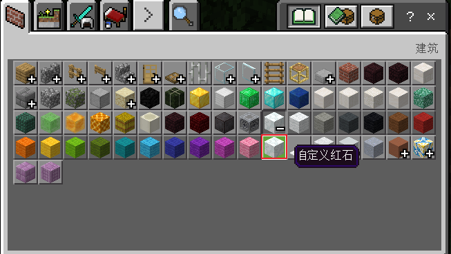

--- 
front: 
hard: Getting Started 
time: minutes 
--- 

# Custom Item Grouping 

## Overview 

Used to expand the original backpack grouping to make the display of custom items clearer 

## Original Grouping Extension 

After supporting the custom items to be placed in the original grouping, you need to create a netease_group folder under the behavior folder, and add any name json under the netease_group directory, for example: group_config.json, the configuration is as follows: 

```json 
{ 
"groups":[ 
{ 
"group_name":"itemGroup.name.wool", //Group name, Note: If you need to add to the original grouping, you need to fill in a fixed group_name. The names of all original groups will be listed below. The category in the json of the custom item must be consistent with the category of the original grouping. For example, if you need to put the custom item into the wool grouping, the category field of the custom item must be: "Nature" 
"icon" : "customblocks:customblocks_redstone", //Group icon, fill in the identifier of the custom item, Note: If group_name is the original group, the icon field will not take effect 
"list":[ //The identifier of the custom items contained in the group. If group_name is the original group, the custom items will be added after the original items. The order of the custom items is arranged according to the array order in list 
"customblocks:customblocks_redstone", 
] 
}, 
... 
] 
} 
``` 

 

## The original version retains the group name 

```json 
itemGroup.name.planks //Planks 
itemGroup.name.walls //Walls 
itemGroup.name.fence //Fence 
itemGroup.name.fenceGate //Fence Gate 
itemGroup.name.stairs //Stairs 
itemGroup.name.door //Door 
itemGroup.name.glass //Glass 
itemGroup.name.glassPane //Glass Plate 
itemGroup.name.slab //Stairs 
itemGroup.name.stoneBrick //Decorative Stone 
itemGroup.name.sandstone //Sandstone 
itemGroup.name.wool //Wool 
itemGroup.name.woolCarpet //Wool Carpet 
itemGroup.name.concretePowder //Concrete Powder

itemGroup.name.concrete //Concrete 
itemGroup.name.stainedClay //Terracotta 
itemGroup.name.glazedTerracotta //Glazed Terracotta 
itemGroup.name.dye //Dye 
itemGroup.name.ore //Ore 
itemGroup.name.stone //Stone 
itemGroup.name.log //Log 
itemGroup.name.leaves //Leaves 
itemGroup.name.sapling //Sapling 
itemGroup.name.seed //Seed 
itemGroup.name.crop //Crops 
itemGroup.name.grass //Ground Plants 
itemGroup.name.flower //Flower 
itemGroup.name.rawFood //Raw Food 
itemGroup.name.cookedFood //Cooked Food 
itemGroup.name.miscFood //Other Food 
itemGroup.name.mushroom //Mushroom 
itemGroup.name.monsterStoneEgg //Moth-eaten Stone 
itemGroup.name.mobEgg //Mob Egg 
itemGroup.name.helmet //Helmet 
itemGroup.name.chestplate //Chestplate 
itemGroup.name.leggings //Leggings 
itemGroup.name.boots //Boots 
itemGroup.name.horseArmor //Horse Armor 
itemGroup.name.sword //Sword 
itemGroup.name.axe //Axe 
itemGroup.name.pickaxe //Pickaxe 
itemGroup.name.shovel //Shovel 
itemGroup.name.hoe //Hoe 
itemGroup.name.arrow //Arrow 
itemGroup.name.potion //Potion 
itemGroup.name.splashPotion //Splash Potion 
itemGroup.name.lingeringPotion //Lingering Potion 
itemGroup.name.bed //Bed 
itemGroup.name.anvil //Anvil 
itemGroup.name.chest //Box 
itemGroup.name.shulkerBox //Shulker Box 
itemGroup.name.record //Record 
itemGroup.name.skull //Creature Model 
itemGroup.name.boat //Boat 
itemGroup.name.rail //Rail 
itemGroup.name.minecart //Minecart 
itemGroup.name.pressurePlate //Pressure Plate 
itemGroup.name.trapdoor //Trapdoor 
itemGroup.name.enchantedBook //Enchanted Book 
itemGroup.name.banner //Banner 
itemGroup.name.firework //Firework Rocket 
itemGroup.name.fireworkStars //Firework Star 
itemGroup.name.coral //Coral Block 
itemGroup.name.coral_decorations //Coral Decorations

itemGroup.name.buttons //Buttons 
itemGroup.name.sign //Signboard 
itemGroup.name.wood //Forest 
itemGroup.name.banner_pattern //Banner pattern 
``` 

## Custom group 

​ Custom group is similar to the original group extension. Just modify group_name to keep the group name. 

```json 
{ 
"groups":[ 
{ 
"group_name":"itemGroup.name.groupTest1", //Group name, avoid duplication with the original group name, you can fill in group_name in zh_CN.lang to set the Chinese name 
"icon" : "customblocks:customblocks_redstone_consumer", //Group icon, fill in the identifier of the custom item (only supports filling in the custom items in the current group) 
"list":[ //Custom item identifiers contained in the group, the order in the group is arranged in the following array order 
"customblocks:customblocks_redstone", 
"customblocks:customblocks_redstone_consumer" 
] 
}, 
... 
] 
} 
``` 

 

## Notes 

1. If the number of items in the custom group "list" is at least two, registration will fail 

2. The same custom item can only be placed in one group 

