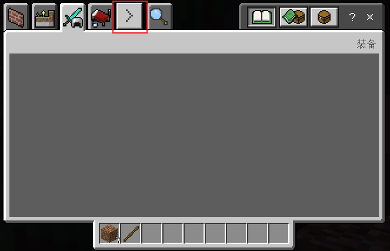
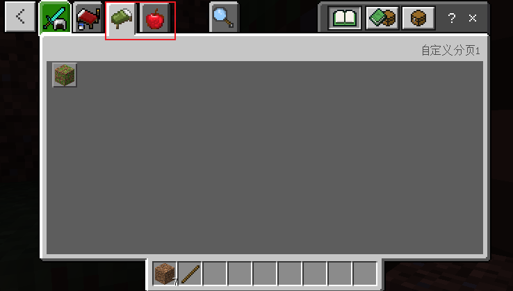
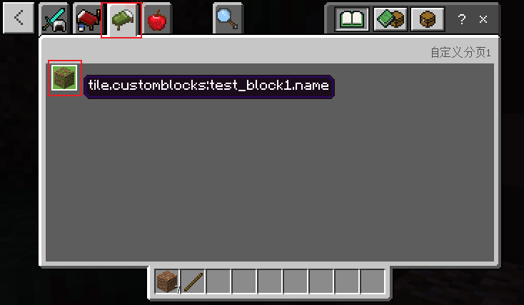

--- 
front: 
hard: Getting Started 
time: minutes 
--- 

# Custom Item Paging 

## Overview 

Used to expand the original backpack paging, so that the custom items of the same mod are displayed uniformly 

## Registration 

Create a new netease_tab folder under the behavior folder, and add a json file with any name in its directory, such as category_config.json, and configure it as follows: 

```json 
{ 
"category":[ 
{ 
"name":"custom1", //Paging name, the value of category in the json of the custom item 
"labelText":"itemCategory.name.custom1", //Paging description, you can set the Chinese name in zh_CN.lang 
"icon": "textures/items/bed_green" //Paging icon path 
}, 
{ 
"name":"custom2", 
"labelText":"itemCategory.name.custom2", 
"icon":"textures/items/apple" 
} 
... 
] 
} 
``` 

**Note: name consists of lowercase letters, please do not use uppercase letters (underscores are supported)** 

The effect is as shown below. Custom paging will be arranged after the original paging, corresponding to custom1 and custom2 respectively, arranged after the original paging. Click the right arrow to display the next group of paging. The order of custom paging is arranged according to the order of category array. 

 

 

## Usage 

In the json of the custom item under the behavior folder, change the value of `category` to custom1. 

To display by default in the custom paging, set `register_to_create_menu` to true. The reference example is as follows


```json
{
	"format_version": "1.10.0",
	"minecraft:block": {
		"description": {
			"identifier": "customblocks:test_block1",
			"register_to_creative_menu": true,
			"is_experimental": false,
			"category":"custom1" //Change to custom1
		},
		"components": {
		}
	}
}
```

