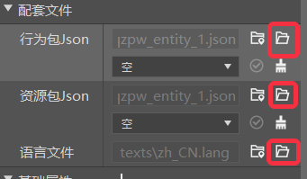
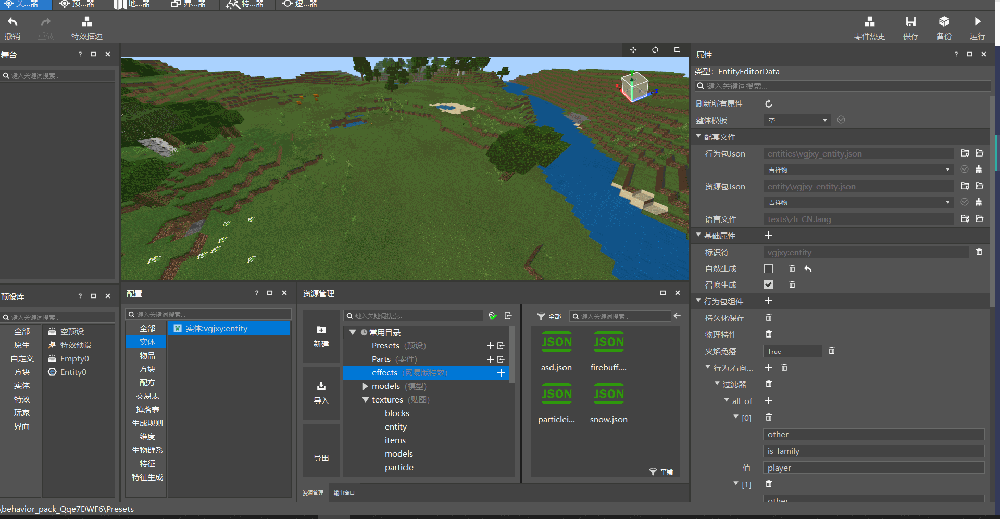
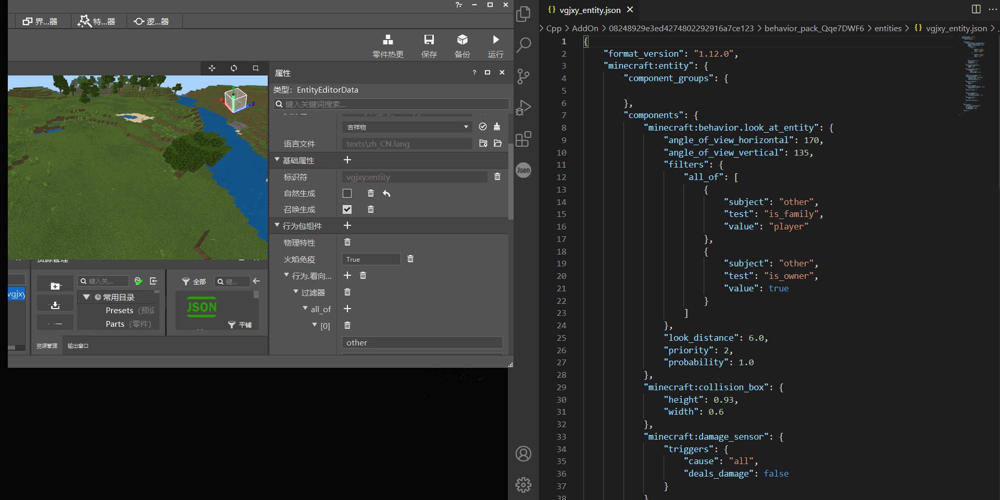

--- 
front: 
hard: Getting Started 
time: minutes 
--- 
# Relationship between configuration and Json file 
## Supporting files 

Using the configuration function of the editor and directly modifying the Json file to create Addon are essentially the same. Each different type of configuration corresponds to a different supporting file. When the configuration is modified, the corresponding Json file will also change in real time. 

Here we take the entity configuration as an example. When we create a new entity configuration, we can select it to see its corresponding Json file path in the supporting file of the property panel. Click the open file button on the right (in the red box in the figure below) to open Json 

 

Json supports multiple software to open and view. Here we use vscode to view it. 

 

At this time, we add fields to the configuration interface, and the file will be updated in real time, as shown in the figure below 

 

  

For how to create and use configurations, please refer to [Use of Configuration](./0-Configuration.md). The following lists all the configurations supported by the current editor and their corresponding files: 
>**Click the link in the title to gain an in-depth understanding of the principles and functions of custom game content from the Json file level:** 

  

## [Custom Entity](./3-Custom Creatures/01-Custom Basic Creatures.md)Configuration Corresponding Files 

> Behavior Pack json: behavior_pack_xxxxxx/entities/Entity Name.json 
> 
> Resource Pack json: resource_pack_xxxxxx/entity/Entity Name.json 
> 
> Language file (unique for a single module): resource_pack_xxxxxx/texts/zh_CN.lang 

  

## [Custom Items](./1-Custom Items/1-Custom Basic Items.md) Configure the corresponding file 

> Behavior pack json: ***behavior_pack_xxxxxx/netease_items_beh/item name.json*** 
> 
> Resource pack json: ***resource_pack_xxxxxx/netease_items_res/item name.json*** 
> 
> Language file (unique for a single module): ***resource_pack_xxxxxx/texts/zh_CN.lang*** 
> 
> Armor wearing attribute file: ***resource_pack_xxxxxx/textures/item name.json*** 
> 
> Item texture file (unique for a single module): ***resource_pack_xxxxxx/textures/item_texture.json***

  

## [Custom blocks](./2-Custom blocks/0-Custom blocks overview.md)Configure corresponding files

> Behavior pack json:***behavior_pack_xxxxxx/netease_blocks/block name.json***
> 
> Block texture file (unique for a single module):***resource_pack_xxxxxx/textures/item_texture.json***
> 
> Block list file:***resource_pack_xxxxxx/block.json***
> 
> Language file (unique for a single module):***resource_pack_xxxxxx/texts/zh_CN.lang***

  

## [Custom recipes](./5-Custom recipes.md)Configure corresponding files

> Behavior pack json:***behavior_pack_xxxxxx/netease_recipes/recipe name.json***

  

## <a href="../../../mconline/20-Gameplay Map Tutorial/Chapter 05: Set the basic status and trading table of NPC/Course 03. Add the corresponding trading table to NPC.html" rel="noopenner"> Custom trading table </a>Configure the corresponding file 

> Behavior pack json: ***behavior_pack_xxxxxx/trading/trading table name.json*** 

  

## <a href="../../../mconline/10-addon tutorial/Chapter 12: More complete custom drops/Course 01. More complete custom drops.html" rel="noopenner"> Custom drop table </a>Configure the corresponding file 

> Behavior pack json: ***behavior_pack_xxxxxx/loot_tables/drop table name.json*** 

  

## [Custom spawn rules] (./4-Custom dimension/3-Organism spawn.md) configuration corresponding file 

> Behavior pack json: ***behavior_pack_xxxxxx/spawn_rules/spawn rule name.json*** 
> 
> Language file (unique for a single module): ***resource_pack_xxxxxx/texts/zh_CN.lang*** 

  

## [Custom dimension] (./4-Custom dimension/1-Custom dimension.md) configuration corresponding file 

> Behavior pack json: ***behavior_pack_xxxxxx/netease_dimension/dimension configuration name.json*** 
> 
> Language file (unique for a single module): ***resource_pack_xxxxxx/texts/zh_CN.lang*** 

  

## [Custom biome] (./4-Custom dimension/2-biome terrain.md) configuration corresponding file

> Behavior pack json: ***behavior_pack_xxxxxx/netease_biomes/biomes configuration name.json*** 
> 
> Language file (unique for a single module): ***resource_pack_xxxxxx/texts/zh_CN.lang*** 

  

## [Custom features](./4-Custom dimensions/4-Custom features.md)Configure corresponding files 

> Behavior pack json: ***behavior_pack_xxxxxx/netease_features/Feature name.json*** 
> 
> Language file (unique for a single module): ***resource_pack_xxxxxx/texts/zh_CN.lang*** 

  

## [Custom feature generation](./4-Custom dimensions/4-Custom features.md)Configure corresponding files 
> Behavior pack json: ***behavior_pack_xxxxxx/netease_feature_rules/Feature generation rules.json*** 
> 
> Language file (unique for a single module): ***resource_pack_xxxxxx/texts/zh_CN.lang***