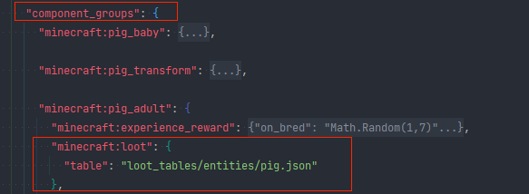
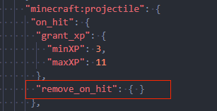

## Configuration known issues 

Some json fields in the configuration may cause abnormal performance. Here are some known issues. 

### 1. Override of entity configuration components 

In the entity configuration, in addition to the components field, you can also use component_groups to define the dynamic addition and deletion of components. Therefore, some components defined in components may be dynamically overwritten. For example, the drop table configuration of the native pig will be replaced with the corresponding drop table due to infancy or adulthood. 

 

### 2. Sudden disappearance of entities 

Some projectile entities, such as the bottle of enchantment, will break and disappear after touching the ground. This is determined by the projectile component. If your own entity uses this component, a similar phenomenon will occur. 

