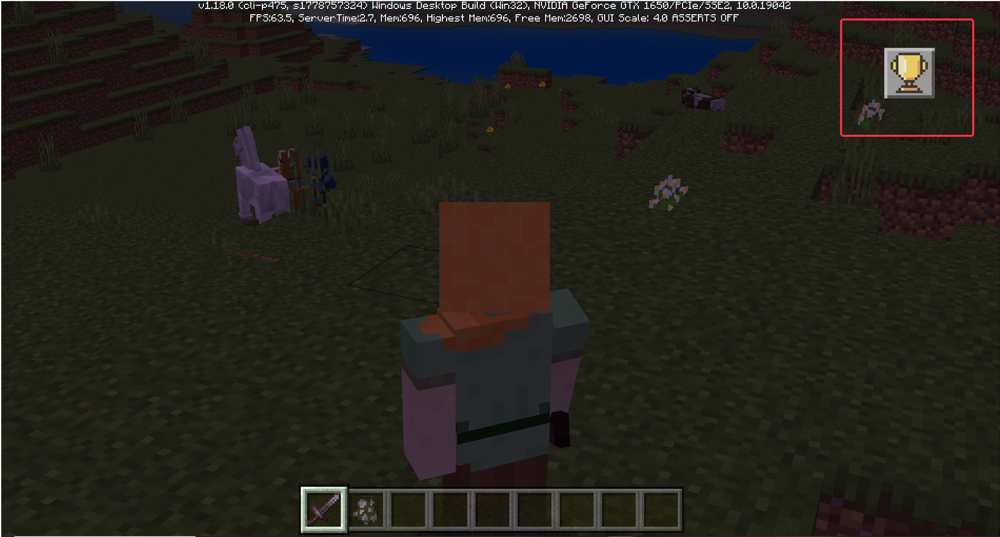

# Custom Achievement System 

## 1. Overview 

The custom achievement system is provided to developers to create an achievement system that meets their own requirements. Developers can define their own unique achievement events by configuring json. 

Currently, two built-in achievement types are provided to developers, namely [kill creature event](#kill) and [get item event](#get). Developers can also judge whether the player has achieved the achievement by monitoring the event themselves. 

The system also provides an automatic call reward mechanism. Developers only need to write a reward function in serverSystem and configure the corresponding namespace and system name in json. The custom achievement system can automatically call the corresponding function when the player completes the achievement. (See the example [CustomAchievementMod](./../13-Module SDK Programming/60-Demo Example.md#CustomAchievementMod)) 

 

## 2.json configuration achievement node 

### 2.1 Create achievement node 

- One achievement node corresponds to one json file, which must be placed in the "**behavior_pack/customAchievements**" folder 

- If you modify the published node target value "goal_number", please pay attention to the call of the reward function. For example, if the original progress is 5 and the target progress is 10, changing the target progress to 3 will not trigger the reward function. For example, if the original progress is 5 and the target progress is 5, the reward function has been triggered. Now change the target progress to 10. When the progress reaches 10, the reward function will be called again. 
- The nodes are sorted according to the sort function of Python. The node_ID letters are sorted from A to Z, and the numbers are sorted from small to large. If there is a requirement for the node position, please write the node ID according to this rule. 

### 2.2 Write json 

#### 1) Root node json 

```json 
{ 
"node_ID": "rootNode", 
"title": "Cow Lover", 
"unfinished_icon": "textures/ui/item/diamond_sword", 
"finished_icon": "textures/ui/item/diamond_sword", 
"use_default_icon_background": true, 
"goal_details":{ 
"goal_type":"default_kill", 
"entity_identifier":"minecraft:cow" 
}, 
"goal_number":3, 
"node_description":"Kill 3 cows", 
	"window_background":"textures/ui/background/sign_warped",
	"reward":[
		{
			"function_name":"fun1",
			"name_space":"namespce:systemname",
			"data":{
				"EXP":20,
				"string":"hellowerld"
			}
		},
		{
			"function_name":"fun2",
			"name_space":"namespce:systemname",

"data":{ 
"EXP":20, 
"string":"hellowerld" 
} 
} 
], 
"is_hidden":false, 
"finish_tip":true, 
"is_cloud" :false, 
"auto_sent_cloud":true 
} 
``` 

| Attribute | Explanation | 
| :-------------------------: | ------------------------------------------------------------ | 
| node_ID | Required, unique identifier of achievement node, cannot be repeated. Before using multiple MODs, please check whether the achievement nodes under each MOD have this attribute repeated | 
| title | Required, achievement node title. The title of the root node will be used as the main title of the corresponding window when it is displayed. The title will also be displayed when the node is clicked. It will also be used to display the pop-up box when the achievement is completed. [Supports color codes](https://minecraft-zh.gamepedia.com/%E6%A0%B7%E5%BC%8F%E4%BB%A3%E7%A0%81) | 
| unfinished_icon | Required, the icon before the achievement is completed. The path is "texture/../.." in the resource file. Only png format is supported. The unfinished_icon of the root node will be used as the title icon of the achievement page. | 
| finished_icon | Required, the icon after the achievement is completed. The path is "texture/../.." in the resource file. Only png format is supported. | 
| use_default_icon_background | Optional, whether to use the provided icon background, the default is True, if the developer wants to use their own background icon, you can set it to False, and then set the icon style you want in the above unfinished_icon/finished_icon, that is, an icon includes the icon and the icon background | 
| goal_details | Optional, if you want to use the provided "kill event" or "obtain event", you need to fill in the content as required. See **3. Two basic preset achievement types** for details | 
| goal_number | Required, the goal value of the achievement, for example, "kill 3 cows" is 3, "get 5 apples" is 5, if it is a special event such as "enter the netherworld", the player can set it to 1 | 
| node_description | Required, used to describe the specific information of the node. It is recommended to write the achievement goal and achievement reward here, [support color code](https://minecraft-zh.gamepedia.com/%E6%A0%B7%E5%BC%8F%E4%BB%A3%E7%A0%81) | 
| window_background | Required, **root node-specific attributes**, the background image of the achievement page corresponding to the root node, when the image is smaller than the background board size, it will be tiled. If you do not want to use the tiling effect, you can set an image that is the same size as the background board. The size of the background board is determined by the height and width of the tree formed by the nodes provided by the developer. The calculation formula is: width = tree depth * 30 px, if the width is less than 227, the width of the map should be 227, height = maximum width of the tree * 24 px, if the width is less than 129, the width of the map should be 129. | 
| reward | Optional, register a callable reward function, "function_name": function name, "name_space": nameSpace: systemName (nameSpace and systemName filled in when Mod registers RegisterSystem, here is serverSystem, not clientSystem), data is the parameter dict passed in when calling this function, and the dict parameter will also add a "playID" to transmit the player ID that triggers the reward | 
| is_hidden | Optional, whether to hide, the default is False, if set to True, when the root node is set to hidden, the entire achievement page will be hidden, and it will only be visible when this node or a child node of this node is completed. | 
| finish_tip | Optional, whether to pop up a prompt box when completing the achievement, default is True | 
| is_cloud | Optional, whether it is a cloud achievement, default is False, that is, whether the achievement progress is uploaded to the developer platform. If it is a cloud achievement, the corresponding achievement progress will be read from the server for initialization each time it is entered. **Only useful for online lobby and Apollo** | 
| auto_sent_cloud | Optional, whether to automatically upload cloud achievements, default is True, only works when "is_cloud" is also True. If set to automatic upload, each time <a href="./../../../mcdocs/1-ModAPI/接口/自定义UI/自定义成果系统.html#addnodeprogress" rel="noopenner">AddNodeProgress</a> is called to modify the achievement progress, the node progress belonging to the cloud achievement will be uploaded. If it is False, the developer can choose the upload time. You can use the <a href="./../../../mcdocs/1-ModAPI/接口/自定义UI/自定义成果系统.html#addnodeprogress" rel="noopenner">AddNodeProgress</a> interface to update local data, and use a variable to store the added Delta each time, and use the cloud achievement reporting interface <a href="./../../../mcdocs/1-ModAPI/界面/成果.html#lobbysetachievementstorage" rel="noopenner">LobbySetAchievementStorage</a>, **Only useful for online lobby and Apollo** | 

 

#### 2) Non-root node json 

```json 
{ 
	"node_ID": "Node5",
	"parent_node":"rootNode",
	"title": "111111",
	"unfinished_icon": "textures/ui/item/book_enchanted",
	"finished_icon": "textures/ui/item/book_enchanted",
	"use_default_icon_background": true,
	"goal_details":{
		"goal_type":"default_get",
		"item_dict":{
				"newItemName":"minecraft:apple"
			}
	},
	"goal_number":2,
	"node_descriptrion":"111111111",

	"reward":[
		{
			"function_name":"fun1",
			"name_space":"namespce:systemname",
			"data":{
				"EXP":20,
				"string":"hellowerld"
			}
		},
		{
			"function_name":"fun2",
			"name_space":"namespce:systemname",
			"data":{
				"EXP":20,
				"string":"hellowerld"
			}
		}
	],
	"is_hidden":false,
	"finish_tip":true,
	"is_cloud" :false,
	"auto_sent_cloud":true,
	"depend_parent":false
}
```

| Properties | Explanation |
| :-------------------------: | --------------------------------------------------------------- |
| node_ID | Required, unique identifier of achievement node, cannot appear repeatedly. Before using multiple MODs, please check whether the achievement nodes under each MOD have the same attribute. | 
| parent_node | Required, **non-root node-specific attribute**, fill in the node's parent node node_ID | 
| depend_parent | Optional, **non-root node-specific attribute**, whether to depend on the parent node, the default is False, if True, the progress of the node can only be recorded when its parent node is completed | 
| title | Required, achievement node title, the title will be displayed when clicking the node, and will also be used for the pop-up box display when the achievement is completed, [supports color code](https://minecraft-zh.gamepedia.com/%E6%A0%B7%E5%BC%8F%E4%BB%A3%E7%A0%81) | 
| unfinished_icon | Required, the icon before the achievement is completed, the path is "texture/../.." in the resource file | 
| finished_icon | Required, the icon after the achievement is completed, the path is "texture/../.." in the resource file | 
| use_default_icon_background | Optional, whether to use the provided icon background, the default is True, if the developer wants to use their own background icon, you can set it to False, and then set the icon style you want in the above unfinished_icon/finished_icon, that is, an icon includes the icon and the background of the icon | 
| goal_details | Optional, if you want to use the provided "kill event" or "obtain event", you need to fill in the content as required, see *[3. Two basic preset achievement types](#Two basic presets)* | 
| goal_number | Required, the goal value of the achievement, for example, "kill 3 cows" is 3, "obtain 5 apples" is 5, if it is a special event such as "enter the netherworld", the player can set it to 1 | 
| node_description | Required, used to describe the specific information of this node. It is recommended to write the achievement goal and achievement reward here. [Support color code](https://minecraft-zh.gamepedia.com/%E6%A0%B7%E5%BC%8F%E4%BB%A3%E7%A0%81) | 
| reward | Optional, register a callable reward function, "function_name": function name, "name_space": nameSpace: systemName (nameSpace and systemName filled in when Mod registers RegisterSystem, here is serverSystem, not clientSystem), data is the parameter dict passed in when calling this function, and the dict parameter will also add a "playID" to transmit the player ID that triggers the reward | 
| is_hidden | Optional, whether to hide, the default is False, if set to True, this node is hidden in the corresponding achievement page, and it is only visible when this node or one of its child nodes is completed | 
| finish_tip | Optional, whether to pop up a prompt box when completing the achievement, the default is True | 
| is_cloud | Optional, whether it is a cloud achievement, the default is False, that is, whether the achievement progress is uploaded to the developer platform. If it is a cloud achievement, the corresponding achievement progress will be read from the server for initialization each time it is entered. **Only useful for online lobby and Apollo** | 
| auto_sent_cloud | Optional, whether to automatically upload cloud achievements, the default is True, it only works when "is_cloud" is also True. If it is set to automatically upload, the node progress belonging to the cloud achievement will be uploaded every time <a href="./../../../mcdocs/1-ModAPI/接口/自定义UI/自定义成果系统.html#addnodeprogress" rel="noopenner">AddNodeProgress</a> is called to modify the achievement progress. If it is False, the developer can choose the upload time. You can use the <a href="./../../../mcdocs/1-ModAPI/接口/自定义UI/自定义成果系统.html#addnodeprogress" rel="noopenner">AddNodeProgress</a> interface to update local data, and use a variable to store the added Delta each time, and use the cloud achievement reporting interface <a href="./../../../mcdocs/1-ModAPI/接口/成果.html#lobbysetachievementstorage" rel="noopenner">LobbySetAchievementStorage</a>, **only useful for online lobby and Apollo** | 

## 3. Two basic preset achievement types <span id="两基本创建"></span> 

### 3.1 Killing creatures achievement <span id="kill"></span> 

1) In the json file of the achievement node, set the "goal_type" attribute of "goal_details" to "default_kill", and the system will automatically monitor 


2) In the json file of the achievement node, set the "entity_identifier" property of "goal_details" to the identifier of the corresponding creature, such as "minecraft:cow" 

3) In this event, an achievement node can only monitor one creature, and it is not possible to monitor multiple creatures in one node 

4) When the target event is detected, the node progress will be automatically added. 

Example: 

```json 
"goal_details":{ 
"goal_type":"default_kill", 
"entity_identifier":"minecraft:cow" 
} 
``` 

### 3.2 Get item achievement<span id="get"></span> 

1) In the json file of the achievement node, set the "goal_type" attribute of "goal_details" to "default_get", and the system will automatically monitor 

2) In the json file of the achievement node, set the "item_dict" attribute of "goal_details" to the corresponding [item information dictionary](https://mc.163.com/dev/mcmanual/mc-dev/mcguide/20-%E7%8E%A9%E6%B3%95%E5%BC%80%E5%8F %91/10-%E5%9F%BA%E6%9C%AC%E6%A6%82%E5%BF%B5/1-%E6%88%91%E7%9A%84%E4%B8%96%E7%95%8C%E5%9F%BA%E7%A1%80%E6%A6%82%E5%BF%B 5.html#%E7%89%A9%E5%93%81%E4%BF%A1%E6%81%AF%E5%AD%97%E5%85%B8#%E7%89%A9%E5%93%81%E4%BF%A1%E6%81%AF%E5%AD%97%E5%85%B8)

- If the check information involves enchantData and modEnchantData enchantment properties, you need to change the () in the list to [], refer to [Example 1](#Example 1). 
- "item_dict" must be configured with "newItemName", and "count" cannot be configured. 
- The check information does not include the information in "userdata". For example, when configuring wool, obtaining any wool can trigger achievement monitoring, refer to [Example 2](#Example 2). 
- In addition, if "userdata" is configured, monitoring will not be triggered, so please do not configure this information. 

3) In this event, an achievement node can only monitor one item, and multiple items cannot be monitored in one node. 

4) The triggering monitoring event is when the player's inventory changes, and the number of items in the player's inventory that meet the requirements is counted. 

5) For achievements that require cloud computing, two copies of data will be saved locally, one is the achievement progress obtained from the cloud, and the other is the progress of the local node. For example, if the cloud progress is 8 and the local progress is 3, the achievement progress update will only be triggered when the number of target items in the player's inventory is greater than 3. 

6) When the target event is detected, the node progress will be automatically added. 

Example 1<span id="Example 1"></span>: 

```json 
"goal_details": { 
//Get a diamond sword with sharpness I and custom enchantment 3II 
"item_dict": {"newItemName":"minecraft:diamond_sword", 
"enchantData": [[9,1]], 
"modEnchantData":[["customenchant3",2]] 
}, 
"goal_type": "default_get" 
} 
``` 

Example 2<span id="Example 2"></span>: 

```json

"goal_details": { 
//Triggered when any color wool is obtained 
"item_dict": { 
"newItemName": "minecraft:wool" 
}, 
"goal_type": "default_get" 
} 
``` 

## 4. Prompt box 

1) The prompt box will only appear if "finish_tip" in the Json file of the node is selected as true 

2) There are a total of 5 prompt box slots. When all five prompt box slots are playing animations, the prompts to be played will be cached and the prompt box will pop up when there is an empty slot 

3) The icon on the left side of the prompt box will read the image path under the "finished_icon" attribute 

4) The white text is the title of the corresponding node 

5) The level of the prompt box is 150, which is higher than the entry button level 

 

## 5. Entry Icon 

1) The entry icon will be initialized only when there is a node that can be displayed. If there is no node or all root nodes are hidden and invisible, the icon will not be displayed 

2) The icon supports dragging, and the button event will not be called when dragging and releasing 

3) The entry icon level is 110 and will be covered by the prompt box 

 

## 6. Achievement interface and events 

### 6.1 Interface 

- <a href="./../../../mcdocs/1-ModAPI/Interface/Custom UI/Custom Achievement System.html#getnodedetailinfo" rel="noopenner">GetNodeDetailInfo</a>: Get the corresponding node information of the corresponding player 
- <a href="./../../../mcdocs/1-ModAPI/Interface/Custom UI/Custom Achievement System.html#setnodefinish" rel="noopenner">SetNodeFinish</a>: Set the corresponding achievement node of the corresponding player to complete 
- <a href="./../../../mcdocs/1-ModAPI/Interface/Custom UI/Custom Achievement System.html#addnodeprogress" rel="noopenner">AddNodeProgress</a>: Add the achievement progress of the corresponding achievement node of the corresponding player 
- <a href="./../../../mcdocs/1-ModAPI/Interface/Custom UI/Custom Achievement System.html#getchildrennode" rel="noopenner">GetChildrenNode</a>: Get the list of all child nodes of the next level of the achievement node 

### 6.2 Achievement Events 

- <a href="./../../../mcdocs/1-ModAPI/Event/World.html#achievementcompleteevent">AchievementCompleteEvent</a>: This event is triggered when the player completes a custom achievement