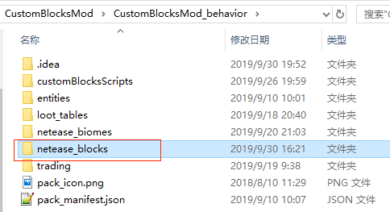
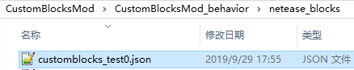
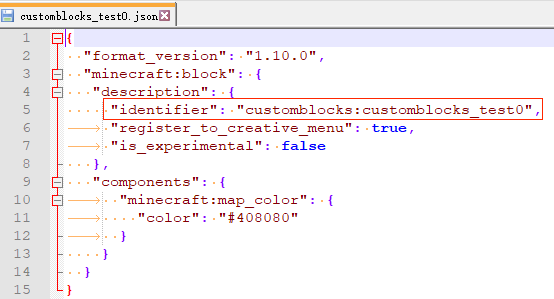
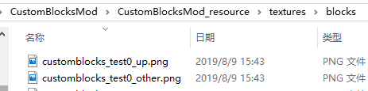
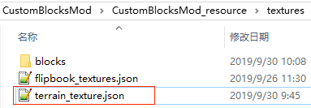
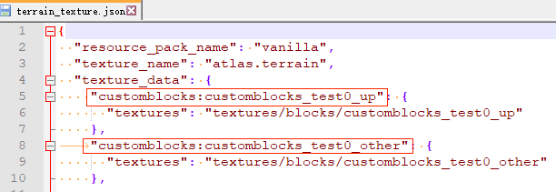
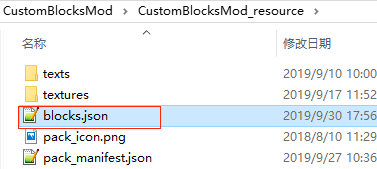
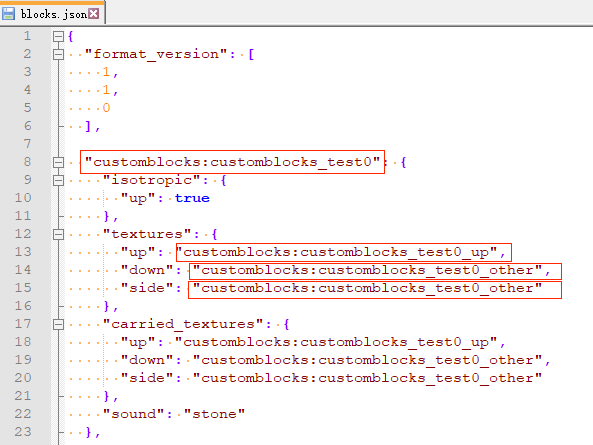
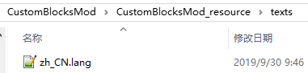
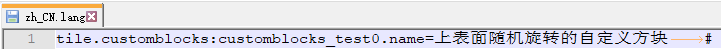

--- 
front: 
hard: Getting Started 
time: minutes 
--- 

# Overview of Custom Blocks 

 

This feature does not require experimental gameplay. 

Developers can add custom blocks by configuring json in addon. The added custom blocks support all events and interfaces related to blocks and items in ModAPI. 

## Registration 

Take demo [CustomBlocksMod](../../13-Module SDK Programming/60-Demo Example.md#CustomBlocksMod) as an example: 

1. Create a new `netease_blocks` directory in the behavior pack 

 

2. Create a new json in the directory to write the definition of the block. For the format of json, please refer to the [official wiki](https://minecraft.gamepedia.com/Bedrock_Edition_blocks_documentation). 

 

 

- There is at least one component in json 
- The format of **identifier** is: namespace[colon]block name. It is recommended that the namespace is consistent with the mod name. The **block name** after the colon must be globally unique. To avoid duplication with the original block and other mods, **please add the namespace as a prefix to ensure uniqueness**. 

(For example, customblocks:customblocks_test0 in the picture) 
​ Do not write it as customblocks:test0. 

- **This identifier is used to correspond to this custom block in other places in the mod**. 

3. Put the block texture in `textures\blocks` 

It can support high-definition textures with a resolution higher than 16x16, but it should be noted that too high a resolution will make it impossible to enter the game on mobile phones (especially low-end devices). 

 

4. Create a new `terrain_texture.json` in textures and write the correspondence between resource names and textures. Resource names must be globally unique. For the json format, please refer to `data\resource_packs\vanilla\textures\terrain_texture.json` in the "Mod PC Development Package" 

 

5. Create a new `blocks.json` in resource, write block textures and sounds, and the texture value needs to correspond to the resource name configured in the previous step `terrain_texture.json`. For the json format, please refer to `data\resource_packs\vanilla\blocks.json` in the "Mod PC Development Pack" 

 

 

6. Configure the Chinese name of the block in `texts\zh_CN.lang`: 

The key format is `tile.block identifier.name` 

 

 

7. Repeat 1-6 to write other custom blocks 

## Uninstall 

If you uninstall the mod and then enter again after using a custom block archive: 

1. For custom blocks that already exist on the map: 

(1) Custom blocks will become unknown blocks. If you use the GetBlockNew interface to get its information, the indenter is the previous custom block. In survival mode, the player can instantly destroy this unknown block with his hands to generate drops that can be picked up. After picking it up in the backpack, the name of the item displayed is "Unknown" and it cannot be placed in the world. 

(2) If a subchunk has not undergone a block update, the custom block will be retained when the mod is reloaded. However, once the subchunk has undergone a block update, even if the mod is reloaded, the custom block will disappear forever. 

2. For custom blocks in the player's backpack: 

The items will disappear. If the mod is reloaded, the items will not be restored for players who logged in during the uninstallation period; the items can be retained for players who have not logged in. 

3. For custom blocks in containers on the map: 

The items will disappear. If the mod is reloaded, the items in containers in areas that have been explored during the uninstallation period will not be restored; the items in containers in unexplored areas can be retained. 

4. For unpicked drops on the map: 

The drops will disappear. If the mod is reloaded, the drops will not be restored for the areas explored during the uninstallation (unless there are no other entities in the subchunk); the drops in the unexplored areas can be retained. 
