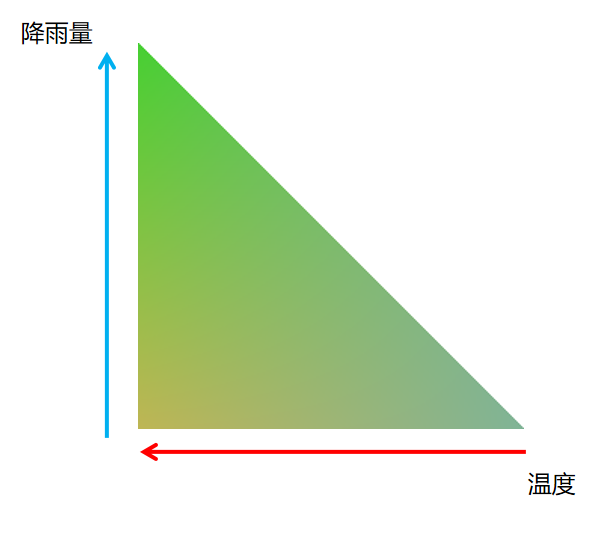
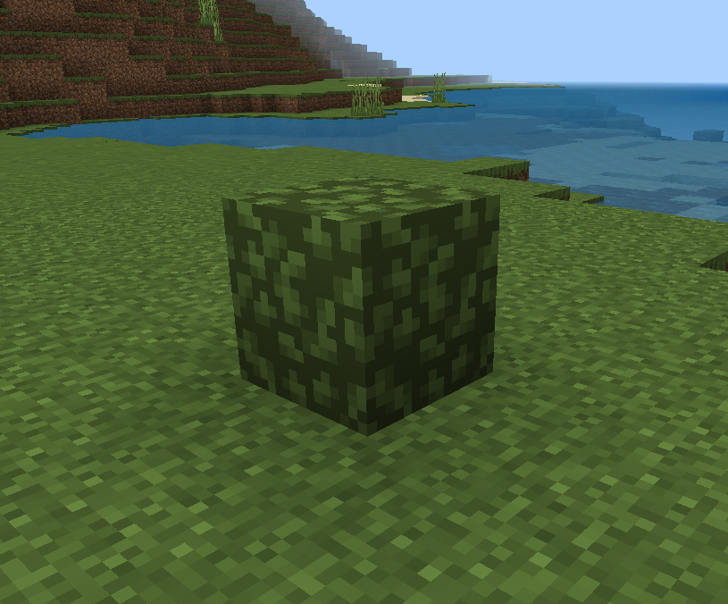
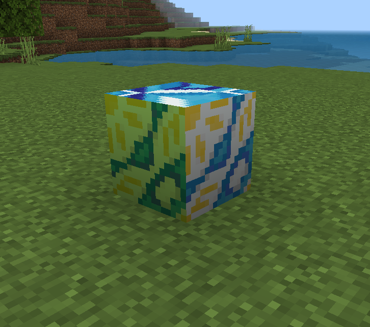

--- 
front: 
hard: Getting Started 
time: minutes 
--- 

# Function 

## Get and set the block at a certain position 

For getting, see the GetBlockNew interface of the server-side blockInfo component 

For setting, see the SetBlockNew interface of the server-side blockInfo component 

## Generate and obtain items 

Support all item-related interfaces and events in the "MOD SDK Document", where the item identifier corresponds to the block identifier. 

## Block and item events 

Support all block-related events in the "MOD API", where the "fullName" field is added to return the corresponding block identifier 

Support all item-related events in the "MOD API", where the "itemName" field is added to return the corresponding block identifier. 

## Custom recipes 

See [Custom recipe document](../5-Custom recipe.md), both materials and results support filling in block identifiers. Please refer to netease_recipes of [CustomBlocksMod](../../13-Module SDK Programming/60-Demo Example.md#CustomBlocksMod) behavior pack

## Block combination

See the server-side block component of "MOD API", the defines item supports filling in the identifier of the custom block. Please refer to CustomBlocksServer.RegisterBlockPattern of [CustomBlocksMod](../../13-Module SDK Programming/60-Demo Example.md#CustomBlocksMod) script

## Villager trading

The item in the trading configuration of the behavior pack can be modified to the identifier of the custom block. Please refer to the `trading\economy_trades\armorer_trades.json` of the [CustomBlocksMod](../../13-Module SDK Programming/60-Demo Example.md#CustomBlocksMod) behavior pack, where one of the trade items of the novice armorer is replaced with emeralds in exchange for customblocks:customblocks_test0 blocks 

## Constructing a custom biome 

Please read the [Biomorphology Document](../4-Custom Dimensions/2-Biomorphology.md) before reading this. 

You can use custom blocks to generate chunks by modifying the minecraft:overworld_surface field. You can refer to the `netease_biomes\dm5` in the [CustomBlocksMod](../../13-Module SDK Programming/60-Demo Example.md#CustomBlocksMod) behavior pack, which is modified based on the dm5 dimension in the custom biome demo [CustomBiomesMod](../../13-Module SDK Programming/60-Demo Example.md#CustomBiomesMod), and replaces the surface blocks of the dm5_cold_beach, dm5_frozen_ocean, dm5_frozen_river, dm5_ice_plains, and dm5_river biomes in this dimension. 

<span id="shengyin"></span> 
## Sound 

`blocks.json` in the resource package configures the sound of the block. 

You can use the types in block_sounds in the original `sounds.json`. Does not support adding custom block_sounds types

<span id="liangdu"></span>

## Brightness 

Use [minecraft:block_light_emission](./1-JSON component.md#minecraft_block_light_emission) in the behavior pack to set the block as a light source. 

Refer to the customblocks:customblocks_model_flower block in [CustomBlocksMod](../../13-Module SDK Programming/60-Demo Example.md#CustomBlocksMod). 

[minecraft:block_light_absorption](./1-JSON component.md#minecraft_block_light_absorption) can set the block's light transmittance, with a value range of 0-15 

<span id="wajue"></span> 
## Mining 

For a detailed introduction to mining, please refer to the [official wiki](https://minecraft-zh.gamepedia.com/mining) 

Mining time can be configured using [minecraft:destroy_time](./1-JSON component.md#minecraft_destroy_time) 

Mining tools can be configured using [netease:tier](./1-JSON component.md#netease_tier) 

Please refer to the customblocks:customblocks_test_ore block in [CustomBlocksMod](../../13-Module SDK Programming/60-Demo Example.md#CustomBlocksMod) 

<span id="duomianxiang"></span>
## Multi-faceted 

Use [netease:face_directional](./1-JSON component.md#netease_face_directional) configuration in the behavior pack. 

For four-faceted, refer to customblocks:customblocks_test_face4 block in [CustomBlocksMod](../../13-Module SDK Programming/60-Demo Example.md#CustomBlocksMod) 

For six-faceted, refer to customblocks:customblocks_test_face6 block in [CustomBlocksMod](../../13-Module SDK Programming/60-Demo Example.md#CustomBlocksMod) 

For both faces, when the player places it, the north texture faces the player. 

The face of the block is equal to the direction of the north texture face (that is, the opposite direction of the crosshair when the player places it). 

When set to four-sided, the relationship between the block orientation and the additional value auxvalue is: 

| Block orientation | auxvalue | 
| -------- | -------- | 
| south | 0 | 
| west | 1 | 
| north | 2 | 
| east | 3 | 

When set to six-sided, the relationship between the block orientation and the additional value auxvalue is: 

| Block orientation | auxvalue | 
| -------- | -------- | 
| down | 0 | 
| up | 1 | 
| north | 2 |

| south | 3 | 
| west | 4 | 
| east | 5 | 

<span id="zidingyiqunxiyanse"></span> 

## Biome colors of custom blocks and custom block models 

For a description of biome colors, see [Biome - Minecraft Wiki, the most detailed encyclopedia of my world](https://minecraft.fandom.com/zh/wiki/生物域系#.E7.94.9F.E7.89.A9.E7.BE.A4.E7.B3.BB.E9.A2.9C.E8.89.B2) 

Original blocks will have slightly different colors in different biomes, such as grass, leaves and other blocks, which will change color with the temperature and rainfall of the biome they are in. They will be green in a high temperature environment and yellow in a low rainfall environment. 

[Custom Blocks](./0-Custom Block Overview.md) and [Custom Block Models](./5-Custom Block Models.md) also support this feature. Developers can also refer to the **customblocks:customblocks_leaves_tinted** blocks, **customblocks:customblocks_test_face4_tinted** blocks, and **customblocks:customblocks_model_flower_tinted** blocks in [CustomBlocksMod](../../13-Module SDK Programming/60-Demo Example.md#CustomBlocksMod), and refer to the color gradient map used by these three blocks (CustomBlocksMod\CustomBlocksMod_resource\textures\colormap\my_grass.png). 

The following will explain how to add custom biome colors to custom blocks. 

#### **1. Preparation of color gradient map** 

First, we need to prepare a color gradient map for the block. The map is as follows: 

 

​ The resolution of this map is fixed to 256x256. Other resolutions are not supported at present. Only the lower left triangle part of the image will be used. The upper right triangle part will not be used, so it can be left blank. 

​ When the block is added with biome color, the amount of rainfall and temperature of the biome will be used to determine which color point on this color gradient map the biome color we take is. The rules are as follows: 

- When the temperature goes from low to high, the x-coordinate value of the color point will be determined from the right to the left of the color gradient map according to the direction of the red arrow, 

- When the rainfall goes from low to high, the y-coordinate value of the color point will be determined from the bottom to the top of the color gradient map according to the direction of the blue arrow. 

​ For example, in a biome with low rainfall and high temperature, the color taken is the lower left corner of this color gradient map, that is, the color will be yellowish. 

​ **According to the above rules, developers can define their own color gradient map to add special biome colors to custom blocks. When making, they can also modify it according to the original color gradient map. It should be noted that the resolution is fixed to 256x256. ** 

​ The prepared gradient map can be placed in the path resource_pack/textures/colormap/. 

#### **2. Set this gradient map for the custom block** 

​ There are two ways to use the gradient map, one is to use this gradient map for the entire block, and the other is to use this map for the specified map in the block. 

##### (1) Use this gradient map for the entire block 

​ After preparing this map, we need to add the use of this map in resource_pack/blocks.json: 

```json 
"customblocks:customblocks_leaves_tinted": { 
"sound": "grass", 
"textures": "customblocks:customblocks_leaves_tinted",

// Use the "use_colormap" field to specify the colormap path to use 
// After using the colormap, the color of the block will change with the biome 
"use_colormap":"textures/colormap/my_grass" 
} 
``` 

​ We use the "use_colormap" field to specify that this block uses custom biome colors, and the value of this field is the relative path of this color gradient map. 

​ In this way, our custom blocks can show different color differences in different biomes. 

​  

##### (2) Use this gradient map for the texture specified for the block 

​ When using this gradient map for the texture specified for the block, we need to specify it for a certain texture in resource_pack/textures/terrain_texture.json: 

```json 
"customblocks:customblocks_test_face4_top_tinted":{ 
"textures": "textures/blocks/glazed_terracotta_white", 
// Use the "use_colormap" field to specify the colormap texture path to use. The resolution is fixed to 256x256. Other resolutions are not supported yet 
"use_colormap":"textures/colormap/my_grass" 
}, 
``` 

​In the code example above, we specified the gradient map for the texture "customblocks:customblocks_test_face4_top_tinted". In this way, we can specify the use of this "customblocks:customblocks_test_face4_top_tinted" texture for a certain face of this block in resource_pack/blocks.json: 

```json 
"customblocks:customblocks_test_face4_tinted": { 
"textures": { 
"down": "customblocks:customblocks_test_face4_front_tinted", // This texture uses a texture with a colormap (colormap is specified in textures/terrain_texture.json), the color of this face will change with the change of biome 
"up": "customblocks:customblocks_test_face4_front_not_tinted", 
"north": "customblocks:customblocks_test_face4_top_tinted", // This texture uses a texture with a colormap (colormap is specified in textures/terrain_texture.json), the color of this face will change with the change of biome 
"south": "customblocks:customblocks_test_face4_top_sides_not_tinted", 
"west": "customblocks:customblocks_test_face4_top_sides_not_tinted", 
"east": "customblocks:customblocks_test_face4_top_tinted" // This texture uses a texture with a colormap (the colormap is specified in textures/terrain_texture.json), the color of this face will change with the change of the biome 
}, 
"sound": "stone" 
} 
``` 

​ We use these textures with gradients for the bottom, east and north faces of this block, so that some faces of the block can produce different color changes in the biome, while some faces will not produce color changes. 

 

#### **3. Inapplicable blocks and situations** 

Note that the following custom blocks or situations will not be applicable to custom biome colors: 

(1) Gravity blocks will be converted into block entities when falling, so the block color will return to its original color. 


(2) Custom biome colors will not work for custom blocks that use dynamic textures defined in textures/flipbook_textures.json. 

(3) Custom biome colors are not applicable to custom block entity appearance. 

(4) Custom biome colors are not applicable to custom fluids. 

(5) Custom spawners and custom portals are not applicable to custom biome colors. 

(6) Custom block models cannot support the use of custom biome colors for the textures specified in this model, and can only use custom biome colors as a whole. 

