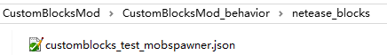
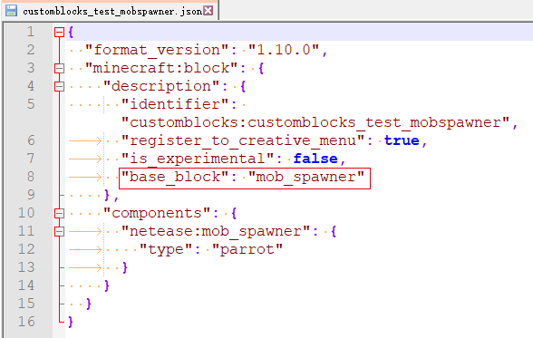

--- 
front: 
hard: Getting Started 
time: minutes 
--- 

# Special Blocks Overview 

Developers can modify the basic behavior of blocks by adding base_block to the block definition json. 

base_block includes: 

* mob_spawner custom monster spawner 
* portal custom portal 
* custom_crop_block custom crops 
* custom_heavy_block custom gravity block 
* liquid custom static fluid block 
* flowing_liquid custom dynamic fluid block 
 

The following figure shows the base_block configuration of a custom monster spawner: 

