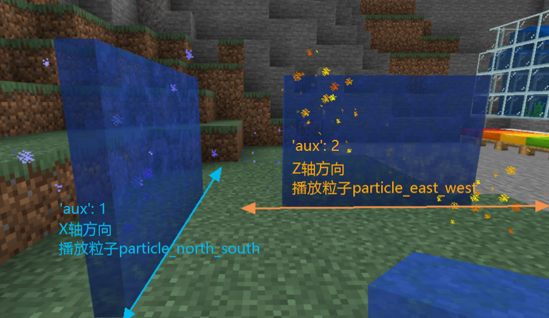

--- 
front: 
hard: Getting Started 
time: minutes 
--- 

# Custom Portal Block 

## base_block setting 

- **The base_block of a custom portal block needs to be set to portal. ** 

## Animated Texture 

- You can configure animated textures in `resource/textures/flipbook_textures.json` to make its textures dynamic, which is a Microsoft feature. 

## Portal Block Introduction 

- The portal block has two orientations, and its block extension direction is the same as the X axis and Z axis respectively, as shown in the figure: 
- You can set the particle effects and target dimension played on the portal block in netease:portal 

 

## netease:portal 

| Key | Type | Default Value | Explanation | 
| -------------------- | ------ | ------ | ------------------------------------------------------------ | 
| particle_east_west | string | | Optional, corresponds to the identifier in the particle json file, used to control the particle effects played when the block is in the same direction as the Z axis | 
| particle_north_south | string | | Optional, corresponds to the identifier in the particle json file, used to control the particle effects played when the block is in the same direction as the X axis | 
| target_dimension | int | | Must be set to control the target dimension reached after entering the portal block | 

- Particle special effects are placed in `resource/particles`. For particle special effects writing, please refer to [official instructions for particle components](https://minecraft.gamepedia.com/Bedrock_Edition_particle_documentation). 
- **The target dimension is 0 or an integer between 3 and 20 or a new version of custom dimension greater than 21. 1 (the Nether) and 2 (the End) will be treated as 0. ** 

## Custom portal block related features 

- If the portal block is placed through the SetBlockNew interface of the server-side blockInfo component: 

- When the additional value 'aux' is set to 1, the block extends in the same direction as the X axis, and the particles corresponding to particle_north_south are played; 
- When the additional value 'aux' is set to 2, the block extends in the same direction as the Z axis, and the particles corresponding to particle_east_west are played. 
- **Avoid setting the additional value 'aux' to 0. ** 

- You can also place blocks in the game with the command /setblock. **Note that the 'aux' value should be set to 1 or 2. ** 

The following command places a customblocks_test_portal_blue block with an aux value of 2 at (0, 65, 0): 

`/setblock 0 65 0 customblocks_test_portal_blue 2` 

- The additional value 'aux' of a manually placed portal block is always 0, no matter where it is facing. **It is not recommended for developers to manually place portal blocks. ** 

- Teleportation will not occur when the target dimension is the same as the current dimension. 

- Only players can teleport through custom portal blocks. 

- There is a certain teleportation cooldown for the same player, and they will not teleport continuously. 

- The player's coordinates do not change before and after the teleportation.