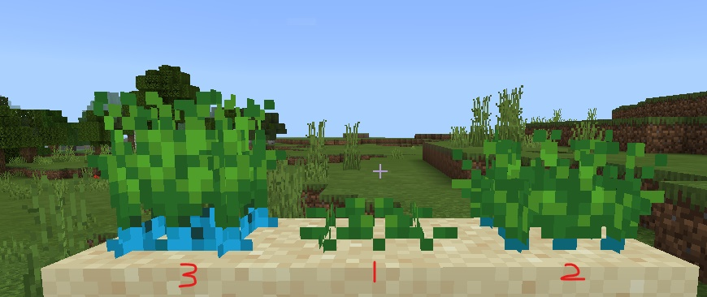

--- 
front: 
hard: Getting Started 
time: minutes 
--- 

# Custom Crops 

## Overview 

Developers can implement custom crops in the following two ways, see demo [CustomCropMod](../../../13-Module SDK Programming/60-Demo Example.md#CustomCropMod) for details 

1) Define the transformation rules between crops through [netease:transform component](#netease_transform); 

2) Listen to <a href="../../../../../mcdocs/1-ModAPI/Event/Item.html#serveritemuseonevent" rel="noopenner"> ServerItemUseOnEvent </a>, <a href="../../../../../mcdocs/1-ModAPI/Event/Block.html#blockrandomtickserverevent" through python script rel="noopenner"> BlockRandomTickServerEvent </a>, <a href="../../../../../mcdocs/1-ModAPI/事件/方块.html#blockneighborchangedserverevent" rel="noopenner"> BlockNeighborChangedServerEvent </a> and other event control methods. 

## Common component description 

### base_block settings 

- **The base_block of the custom crop block needs to be set to custom_crop_block** 

<span id="netease_transform"></span> 
### netease:transform 

This component is used to customize the conversion between crop blocks 

| Key | Type | Default value | Explanation | 
| ---------- | ---- | ------ | ---------------------------------------------------------- | 
| conditions | dict | | The conditions for the crop block conversion. When all three conditions are met at the same time, it will be converted to a result block | 
| result | str | | The name of the block after the crop block is converted | 

For example: 

```json 
"netease:transform": { 
"conditions": { 
"brightness": { # The light conditions that must be met for crop growth 
"max": 15, 
"min": 9 
}, 
"random_tick_count": { # The number of random ticks required for conversion 
"value": 2 # 2 means conversion at the third random tick, values less than or equal to 0 are not allowed 
}, 
"surrouding": { # The surrounding blocks required for conversion 
"value": "minecraft:sand",

"radius": 1 # radius 
} 
}, 
"result": "minecraft:egg" # what kind of block to convert to 
} 
``` 

### minecraft:seed 

Custom seeds, see [minecraft:seed](../../1-Custom Items/1-Custom Basic Items.md#minecraft_seed) 

## Custom Crops Method 1 

This method is suitable for pure configuration json, and does not require writing any python script logic. 

This method includes a seed (custom item) and three custom crop states (custom blocks). 

### 1) Custom Seeds 

Refer to [Custom Basic Items](../../1-Custom Items/1-Custom Basic Items.md) to customize a crop seed customcrop:custom_wheat_seeds. 

```json 
{ 
"format_version": "1.10", 
"minecraft:item": { 
"description": { 
"identifier": "customcrop:custom_wheat_seeds", 
"register_to_create_menu":true, 
"category": "Nature" 
}, 
"components": { 
"minecraft:seed": { 
"crop_result": "customcrop:customcrop_stage0",# Blocks generated by seeds 
"plant_at": "minecraft:sand" # Planting conditions 
} 
} 
} 
} 
``` 

json description: 

The seed is identified as customcrop:custom_wheat_seeds, which contains a minecraft:seed component, where 

| Field | Value | Description | 
| ----------- | ---------------------------- | ------------------------------------------------------------ | 
| crop_result | customcrop:customcrop_stage0 | The seed will grow into customcrop:customcrop_stage0 custom block | 
| plant_at | minecraft:sand | This seed can only be planted on "sand". After planting, all the blocks below its growth state must also be "sand". If the bottom block is destroyed, the crop will also be destroyed. |


### 2) Customize three crop states 

Refer to [Custom Blocks](../0-Custom Blocks Overview.md), we will customize three crop states, namely: customcrop:customcrop_stage0, customcrop:customcrop_stage1, customcrop:customcrop_stage2, some of the json is as follows: 

#### customcrop:customcrop_stage0 

```json 
{ 
"format_version": "1.10.0", 
"minecraft:block": { 
"description": { 
"identifier": "customcrop:customcrop_stage0", 
"register_to_creative_menu": true, 
"is_experimental": false, 
"base_block": "custom_crop_block" 
}, 
"components": { 
... 
"netease:transform": { 
"conditions": { 
"brightness": { # Lighting conditions 
"max": 15, 
"min": 9 
}, 
"random_tick_count": { # Random tick count condition 
"value": 1 
}, 
"surrouding": { # "Sand" needs to exist around a radius of 1 
"value": "minecraft:sand", 
"radius": 1 
} 
}, 
"result": "customcrop:customcrop_stage1" # Blocks for the next stage of growth 
}, 
... 
} 
} 
} 
``` 

#### customcrop:customcrop_stage1 

```json 
{ 
"format_version": "1.10.0",

  "minecraft:block": {
   "description": {
     "identifier": "customcrop:customcrop_stage1",
      "register_to_creative_menu": true,
      "is_experimental": false,
      "base_block": "custom_crop_block"
   },
   "components": {
      ...
      "netease:transform": {
        "conditions": {
          "brightness": {
            "max": 15,
            "min": 9
          },
          "random_tick_count": {
            "value": 1
          },
          "surrouding": {
            "value": "minecraft:sand",
            "radius": 1
          }
        },
        "result": "customcrop:customcrop_stage2" #Grow the next stage of blocks
      },
      ...
    }  }
}
```


#### customcrop:customcrop_stage2

```json
{
  "format_version": "1.10.0",
  "minecraft:block": {
   "description": {
     "identifier": "customcrop:customcrop_stage2",
      "register_to_creative_menu": true,
      "is_experimental": false,
      "base_block": "custom_crop_block"
    },
    "components": {
      ...
      "minecraft:loot": {
        "table": "loot_tables/blocks/customcrop_stage2.json"
      }

... 
} 
} 
} 
``` 

This stage is the mature stage of crops, and you can get them through minecraft:loot. 

### 3) Growth process 

 

The middle is stage 1 (customcrop:customcrop_stage0), the rightmost is stage 2 (customcrop:customcrop_stage1), and the left is stage 3 (customcrop:customcrop_stage2). 

## Custom Crops Method 2 

This method is suitable for configuring json+python script control. 

This method includes an item (custom item) and three custom crop states (custom blocks). 

This method requires configuring [netease:random_tick](../1-JSON component.md#netease_random_tick) and [netease:block_entity](../1-JSON component.md#netease_block_entity) so that the <a href="../../../../../mcdocs/1-ModAPI/Event/Block.html#blockrandomtickserverevent" rel="noopenner"> BlockRandomTickServerEvent event </a> is sent to the script layer and supports [custom block entity](../4-Custom Block Entity.md), thereby realizing the control of block conversion and the archiving of block status. 

#### 1) Custom items 

​ In the example mod, the custom item is customcrop:custom_item. When the item is used, the event <a href="../../../../../mcdocs/1-ModAPI/Events/Items.html#serveritemuseonevent" rel="noopenner"> ServerItemUseOnEvent </a> is listened to to determine whether the item can be planted at the current location (similar to the plant_at function in minecraft:seed of customcrop:custom_wheat_seeds), and the crop stage 1 (customcrop:customcrop_1_stage0) is set through <a href="../../../../../mcdocs/1-ModAPI/Interface/World/Block Management.html#setblocknew" rel="noopenner"> SetBlockNew </a>. 

#### 2) Customize three crop states 

##### customcrop:customcrop_1_stage0 

```json 
{ 
"format_version": "1.10.0", 
"minecraft:block": { 
"description": { 
"identifier": "customcrop:customcrop_1_stage0", 
"register_to_creative_menu": true, 
"is_experimental": false 
}, 
"components": { 
... 
"netease:random_tick": { # This block will trigger the BlockRandomTickServerEvent event 
"enable": true, 
"tick_to_script": true 
}, 
"netease:redstone_property": { 
"value": "break_on_push" 
}, 
"netease:neighborchanged_sendto_script": {# This block will trigger the BlockNeighborChangedServerEvent event 
"value": true

      },
      "netease:block_entity": { # Block entity data storage
        "tick": false,
        "movable": true
      }
    }
  }
}
```

##### customcrop:customcrop_1_stage1

```json
{
  "format_version": "1.10.0",
  "minecraft:block": {
   "description": {
     "identifier": "customcrop:customcrop_1_stage1",
      "register_to_creative_menu": true,
      "is_experimental": false
    },
    "components": {
      ...
      "netease:random_tick": {
        "enable": true,
        "tick_to_script": true
      },
      "netease:redstone_property": {
        "value": "break_on_push"
      },
      "netease:neighborchanged_sendto_script": {
        "value": true
      },
      "netease:block_entity": {
        "tick": false,
        "movable": true
      }
    }
  }
}
```


##### customcrop:customcrop_1_stage2

```json
{
  "format_version": "1.10.0",
  "minecraft:block": {

   "description": {
     "identifier": "customcrop:customcrop_1_stage2",
      "register_to_creative_menu": true,
      "is_experimental": false
    },
    "components": {
     ...
      "netease:neighborchanged_sendto_script": {
        "value": true
      },
      "netease:block_entity": {
        "tick": false,
        "movable": true
      }
    }
  }
}
```

#### 3) Growth process

 

The left side is stage 1 (customcrop:customcrop_1_stage0), the middle is stage 2 (customcrop:customcrop_1_stage2), and the right side is stage 3 (customcrop:customcrop_1_stage2). 

#### 4) Brief description of the script 

##### Item usage restrictions 

When the custom item customcrop:custom_item uses the first stage block of crops (customcrop:customcrop_1_stage0), you can limit it by listening to the event <a href="../../../../../mcdocs/1-ModAPI/事件/件.html#serveritemuseonevent" rel="noopenner"> ServerItemUseOnEvent </a>, for example: 

```python 
def OnServerItemUseOnEvent(self, args): 
if args["itemName"] == "customcrop:custom_item": 
# Generate custom blocks when using custom items 
comp = self.CreateComponent(self.playerId, "Minecraft", "blockInfo") 
belowPos = (args["x"], args["y"], args["z"]) # below 
blockDict = comp.GetBlockNew(belowPos) 
if blockDict["name"] == "minecraft:dirt": # Only when there is dirt below can crops be planted. Here is the same as the plant_at judgment of the seed 
blockDict = { 
'name': 'customcrop:customcrop_1_stage0', 
'aux': 0 
} 
comp.SetBlockNew((args["x"], args["y"] + 1, args["z"]), blockDict) 
``` 

##### Crop conversion conditions 


In the sample mod, we listen to the event <a href="../../../../../mcdocs/1-ModAPI/事件/方块.html#blockrandomtickserverevent" rel="noopenner"> BlockRandomTickServerEvent </a> to determine whether to switch to the next stage of custom crops. The judgment conditions are not limited to the lighting, tick number and surrounding environment described in netease:transform. At the same time, we can also use the blockEntityData component to store data. 

```python
def OnStage0BlockTick(self, args):
    pos = (args["posX"], args["posY"], args["posZ"])
    comp = self.CreateComponent(self.playerId, "Minecraft", "blockInfo")
    lightlevel = comp.GetBlockLightLevel(pos)
    if (15 >= lightlevel >= 0): # Judgment of lighting conditions
        dimension = args["dimensionId"]
        blockEntitycomp = self.CreateComponent(self.playerId, "Minecraft", "blockEntityData")
        blockEntityData = blockEntitycomp.GetBlockEntityData(dimension, pos)
        if not blockEntityData:
            return
        growth = blockEntityData["growth"]
        if not growth:
            growth = 0
            growth += 1
            # Use blockEntity to save ticks count data 
blockEntityData["growth"] = growth 

if (growth >= 1): # tick quantity condition judgment 
comp = self.CreateComponent(self.playerId, "Minecraft", "blockInfo") 
blockDict = { 
'name': 'customcrop:customcrop_1_stage1', 
'aux': 0 
} 
comp.SetBlockNew(pos, blockDict) # Switch to the next stage of crops 
``` 

##### Crop harvesting 

Developers can listen to events <a href="../../../../../mcdocs/1-ModAPI/事件/方块.html#destroyblockevent" rel="noopenner"> DestroyBlockEvent </a> and <a href="../../../../../mcdocs/1-ModAPI/Interface/World/Entity Management.html#spawnitemtolevel" rel="noopenner"> SpawnItemToLevel </a> to realize the drop of crops. 

## Customized crop appearance 

- You can use [custom block model](../5-custom block model.md) to configure the appearance of crops. 

The model project of crops in the demo is under `resource/bbmodel` of the demo. All crops in the demo share the same project, but the textures are different. 


## Q&A 

1) When do you need to configure the custom block base_block to custom_crop_block: 

​ When you need [netease:transform component](#netease_transform) to drive the conversion between blocks


2) How to limit the planting conditions of crops? 

​ Using "Custom Crop Method 1" can limit through the "plant_at" field of the seed; 

​ Using "Custom Crop Method 2" can limit the planting conditions by listening to <a href="../../../../../mcdocs/1-ModAPI/Event/Item.html#serveritemuseonevent" rel="noopenner"> ServerItemUseOnEvent </a>. 

3) How to detect when the block under the custom crop is destroyed, replaced, or pushed? 

​ Listen to <a href="../../../../../mcdocs/1-ModAPI/Event/Block.html#blockneighborchangedserverevent" rel="noopenner"> BlockNeighborChangedServerEvent </a> event to listen to the changes of surrounding blocks and make corresponding processing. 

