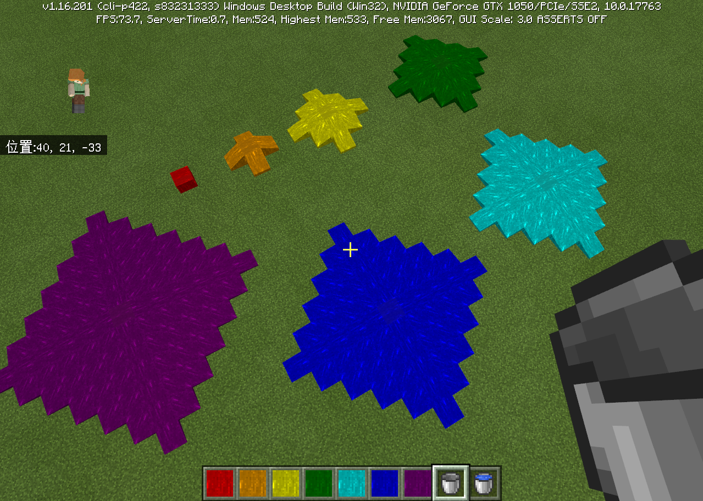

--- 
front: 
hard: Getting Started 
time: minutes 
--- 

# Custom Fluid 

## Overview 

Custom fluid requires two blocks, one static fluid and one dynamic fluid. The outermost layer of the liquid is the dynamic fluid during the flow process, and the rest are static fluids, and the two will convert to each other. When the fluid is fully diffused, all visible fluids have been converted to static fluids. You can observe the conversion between dynamic fluids and static fluids by setting different colors. 

## base_block settings 

- Custom fluid's **base_block**, static fluid needs to be set to **liquid**, dynamic fluid needs to be set to **flowing_liquid** 
- Naming rules, because static fluid and dynamic fluid are mutually convertible, and are located by flowing at the engine level, so a pair needs to be registered for normal use 
- Static fluid - **namespace: fluid block name**, for example `customLiquid:red_water` 
- Dynamic fluid - **namespace:flowing_fluid block name**, for example `customLiquid:flowing_red_water` 

## Animated texture 

- Fluid needs to configure animated textures in `resource/textures/flipbook_textures.json` to make its map have dynamic flow effects, which is a Microsoft function. 

## Introduction to Fluid Blocks 

- You can set the flow speed, flow range, color, and whether the fluid block can float the boat in netease:liquid 

- Fluid blocks are consistent with the original water, as shown in the figure: 

 

## netease:liquid 

| Key | Type | Default | Explanation | 
| -------------- | ------------- | ---------------------------------------- | ------------------------------------------------------------ | 
| liquid_color | array | [255, 255, 255, 255] | Optional, fluid color, the 4 numbers correspond to RGBA in sequence, and the value range is 0-255. Transparency is only effective when the "Beautiful Image" option is turned on. | 
| spread_range | int | 8 | Optional, fluid range, the number of grids that the dynamic fluid spreads outward from the center, the value range is 1-8, only dynamic fluid is valid | 
| spread_delay | int | 5 | Optional, the number of ticks for the fluid to spread, one grid is spread every tick, 20 ticks per second, only dynamic fluid is valid | 
| spread_fire | bool | false | Optional, whether to spread fire, refer to the lava effect | 
| can_float_boat | bool | true | Optional, whether the fluid can float a boat, both dynamic and static fluids need to be set | 
| bucket_name | string | "water_bucket" | Optional, the item obtained by using an empty bucket on a water source, the default is the original bucket (if it is a custom item, it needs to bring the namespace, enter the complete item id) | 
| water_splash | string | "minecraft:water_splash_particle_manual" | Optional. When an entity enters the fluid, the corresponding particle effects will be played. Several of these effects will be played randomly near the player's location. The effects must use Microsoft effects. | 
| mob_effects | array(dict) | [] | Optional. When an entity enters the fluid, a status effect will be added, which will trigger the corresponding event of adding/refreshing status effects. |

| remove_effects | array(string) | [] | Optional, remove status effects when an entity enters a fluid, triggering the corresponding event to remove status effects | 

- If this component is not registered, the liquid color, range, and diffusion delay default to the same as the vanilla water, **but it will not float the boat** 

Add status effects mob_effects fields are configured as follows: 

| Key | Type | Explanation | 
| ------------- | ------ | -------------------------------------------- | 
| effect_name | string | Status effect name | 
| duration | int | Status effect duration | 
| amplifier | int | Status effect multiplier, 1 less than the level, for example, the multiplier of Strength II is 1 | 
| show_particle | bool | Whether to display the particle effect of the status effect, not displayed by default | 

## Custom fluid block related features 

- You can place blocks in the game through the command /setblock. Static blocks will not spread around after being placed. When the blocks around them change, they will turn into flowing blocks and inherit the flow characteristics. 
- Inherited from the original water, it has the characteristics of the original water, such as interaction with magma, flow effect when players enter, drowning, interaction with sponges, etc. 
- After loading with a bucket, a normal bucket will be generated. By configuring bucket_name, other items can be generated. Custom buckets can be combined to load and pour custom fluids. 

## Example 

Dynamic fluid: 

```json 
{ 
"format_version": "1.16.0", 
"minecraft:block": { 
"description": { 
"identifier": "customblocks:flowing_green_water", 
"register_to_creative_menu": true, 
"base_block": "flowing_liquid" 
}, 
"components": { 
"netease:liquid": { 
"liquid_color": [ 0, 128, 0, 254 ], 
"spread_range": 4, 
"spread_delay": 5, 
"bucket_name": "customBucket:green_bucket", 
"spread_fire": true, 
                "mob_effects": [
                    {
                        "effect_name": "slowness",
                        "duration": 3,
                        "amplifier": 1,
                        "show_particle": true
                    },

                    {
                        "effect_name": "weakness",
                        "duration": 1,
                        "amplifier": 4
                    }
                ],
                "remove_effects": [ "speed", "jump_boost" ]
            }
        }
    }
}
```

Static fluid:

```json
{
    "format_version": "1.16.0",
    "minecraft:block": {
        "description": {
            "identifier": "customblocks:green_water",
            "register_to_creative_menu": false,
            "base_block": "liquid"
        },
        "components": {
            "netease:liquid": {
                "liquid_color": [ 0, 128, 0, 254 ],
                "bucket_name": "customBucket:green_bucket",
                "spread_fire": true,
                "mob_effects": [
                    {
                        "effect_name": "slowness",
                        "duration": 3,
                        "amplifier": 1,
                        "show_particle": true
                    },
                    {
                        "effect_name": "weakness",
                        "duration": 1,
                        "amplifier": 4
                    }
                ],
                "remove_effects": [ "speed", "jump_boost" ]
            }
        }
    }
}
```