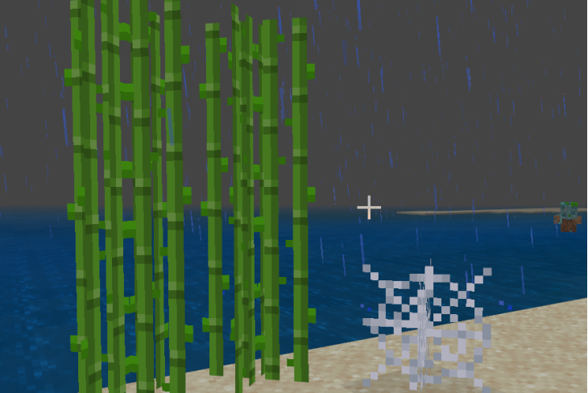

--- 
front: 
hard: Getting Started 
time: minutes 
--- 
# Custom cross-mapped blocks 

## Overview 

Custom cross-mapped blocks support using the engine's preset cross-mapped models, configuring item textures and model textures by yourself, and making model blocks similar to sugar cane and spider webs. 

 

## model_item_texture 

The item texture used can be set in model_item_texture. 

| Type | Default | Explanation | 
| ------ | ------ | ----------------------------------------------- | 
| string | | The item texture used, "netease_model" must be set to take effect | 

## model_texture 

The model texture used can be set in model_texture. 

| Type | Default | Explanation | 
| ----- | ------ | ----------------------------------------------- | 
| array | | The model texture used must be set to "netease_model" to take effect | 

- model_texture and model_item_texture must be set at the same time to take effect 

## Use cross-texture model 

- Add custom block identifier configuration under resource_packs\blocks.json 

- Configure "customblocks:web_preset" in "netease_model", "model_item_texture" and "model_textures" to configure your own item texture and model texture according to your needs 

### blocks.json example 
```json 
{ 
"format_version": [ 
1, 
1, 
0 
], 
"customblocks:web_preset": { 
"netease_model": "customblocks:web_preset", 
    	"model_item_texture": "customblocks:reeds_item",
 		"model_textures": [
      		"customblocks:reeds"
  		]

} 
} 
``` 

