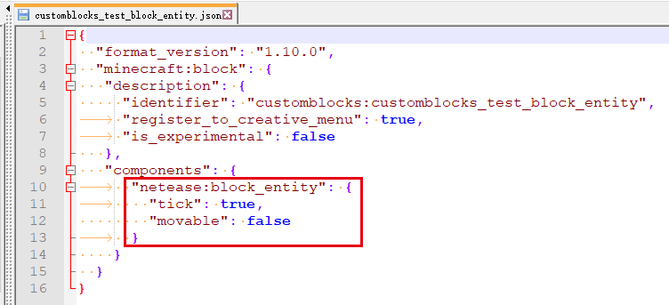

--- 
front: 
hard: Getting Started 
time: minutes 
--- 

# Custom Block Entity 

## Concept 

For the concept of block entity, please refer to [Official Wiki](https://minecraft-zh.gamepedia.com/Block Entity) 

## Add custom block entity 

You need to add the netease:block_entity component to add custom block entity for custom blocks. 

| Key | Type | Default | Explanation | 
| ------- | ---- | ------ | ------------------------------------------------------------ | 
| tick | bool | false | When true, when the player enters the tick range of the block, the block will send **20** ServerBlockEntityTickEvent events per second<br>When false, the block will not send ServerBlockEntityTickEvent events | 
| movable | bool | true | When true, the block can be pulled back by a sticky piston<br>When false, the block cannot be pulled back by a sticky piston | 

- **For blocks that already have block entities, such as [Custom Monster Spawner](./3-Special Blocks/1-Custom Monster Spawner.md), custom block entities cannot be added. ** 

- For blocks with custom block entities added, the data in the block entity can be managed through the **server-side blockEntityData component**. 


## Related components and events 

- <a href="../../../../mcdocs/1-ModAPI/Interface/Block/BlockEntity.html#getblockentitydata" rel="noopenner"> GetBlockEntityData interface </a> 

Can be used to manage data in block entities. 

- <a href="../../../../mcdocs/1-ModAPI/Event/Block.html#serverplaceblockentityevent" rel="noopenner"> ServerPlaceBlockEntityEvent event </a> 

Triggered when a player manually places a custom block containing a custom block entity, data can be stored in the block entity. 

- <a href="../../../../mcdocs/1-ModAPI/事件/世界.html#chunkgeneratedserverevent" rel="noopenner"> ChunkGeneratedServerEvent </a> 

When a custom block containing a custom block entity is placed through a custom feature, it is triggered when the chunk is generated. It contains a list of custom block entity information in the chunk. At this time, data can be stored in the block entity. 

- <a href="../../../../mcdocs/1-ModAPI/事件/方块.html#serverblockentitytickevent" rel="noopenner"> ServerBlockEntityTickEvent </a> 

If tick is configured as true in the netease:block_entity component, it will be triggered when the custom block is within the simulation range. The event trigger frequency is **20 times per second** 

<span id="demo"></span>

## demo explanation 

- Block configuration 

In [CustomBlocksMod](../../13-Module SDK Programming/60-Demo Example.md#CustomBlocksMod), the `customblocks:customblocks_test_block_entity` block is configured with a custom block entity. The specific configuration is as follows: 

That is, when the block is not far from the player, it will send 20 ServerBlockEntityTickEvent events per second and cannot be pulled back by a sticky piston. 

 

- Block placement 

In customBlocksServer.py, a listener for the ServerPlaceBlockEntityEvent event is registered. In the callback, data is written to each custom block entity manually created by the player through the blockEntityData component: 

```python 
def ServerPlaceBlockEntityEvent(self, args): 
print 'ServerPlaceBlockEntityEvent ', args 
dimension = args['dimension'] # The dimension where the custom block entity is located 
blockPos = (args['posX'], args['posY'], args['posZ']) # The position of the custom block entity 
blockName = args['blockName'] # The name of the block containing the custom block entity 

# Create blockEntityData component 
comp = self.CreateComponent(self.levelId, "Minecraft", "blockEntityData") 
# Get the object that can operate the custom block entity 
blockEntityData = comp.GetBlockEntityData(dimension, blockPos) 
# Before operating the data in the custom block entity, you must first check whether it is empty 
if blockEntityData: 
# Use a dict-like operation method to store data with the key "abc" and the value {"1":True,"2":None,"3":"123"} 
blockEntityData['abc'] = {"1": True, "2": None, "3": "123"} 
``` 

- Block interaction 

Listen to ServerBlockUseEvent to determine whether the player is interacting with the customblocks:customblocks_test_block_entity block. If yes, write data to it: 

```python 
def ServerBlockUseEvent(self, args): 
blockName = args['blockName'] # Block name 
blockPos = (args['x'], args['y'], args['z']) # Block position 
playerId = args['playerId'] # Player id 
dimensionComp = serverApi.CreateComponent(playerId, "Minecraft", "dimension") 
dimension = dimensionComp.GetPlayerDimensionId() # Get the dimension where the player is 
# Determine the type of interactive block 
if blockName == 'customblocks:customblocks_test_block_entity': 
comp = self.CreateComponent(self.levelId, "Minecraft", "blockEntityData") 
blockEntityData = comp.GetBlockEntityData(dimension, blockPos) 
if blockEntityData: 
# Write data with key "key" and value [1, 2, 3] to the block entity 
blockEntityData['key'] = [1, 2, 3] 
```


- Block entity tick 

```python 
def OnBlockEntityTick(self, args): 
# Avoid frequent printing in Tick, which may cause lag 
# print 'blockEntityTick ', args 
pass 
``` 

Listening to the ServerBlockEntityTickEvent event, the custom block with tick set to true in the netease:block_entity component will trigger its custom block entity tick event 20 times per second. 

- ** Avoid printing in high-frequency functions such as tick event callbacks, which may cause lag. ** 

- **Avoid placing too many custom blocks with the netease:block_entity component configured with tick set to true in the map. Frequent event calls may also cause lag** 


- Block destruction 

Listens to the ServerPlayerTryDestroyBlockEvent event. When a player tries to destroy the customblocks:customblocks_test_block_entity block, it will try to read data from its custom block entity and output it. 

```python
  def ServerPlayerTryDestroyBlockEvent(self, args):
  		pos = (args["x"], args["y"], args["z"])
  		playerId = args['playerId']
  		dimensionComp = serverApi.CreateComponent(playerId, "Minecraft", "dimension")
  		dimension = dimensionComp.GetPlayerDimensionId()
  		comp = self.CreateComponent(self.levelId, "Minecraft", "blockEntityData")
  		blockEntityData = comp.GetBlockEntityData(dimension, pos)
  		if blockEntityData:
              # Get the corresponding value in the block entity based on the key
              value1 = blockEntityData['key']
              value2 = blockEntityData['abc']
              print 'value of "key" is', value1
              print 'value of "abc" is', value2 ``` 

- For a customblocks:customblocks_test_block_entity block that has never been interacted with, when the player tries to destroy it, it will output: 

```python 
# Data that does not exist in the block entity will return None 
'value of "key" is None' 
'value of "abc" is {"1": True, "2": None, "3": "123"}' 
``` 

- If the player has ever interacted with the block, it will output: 

```python 
'value of "key" is [1, 2, 3]'

    'value of "abc" is {"1": True, "2": None, "3": "123"}'
    ```