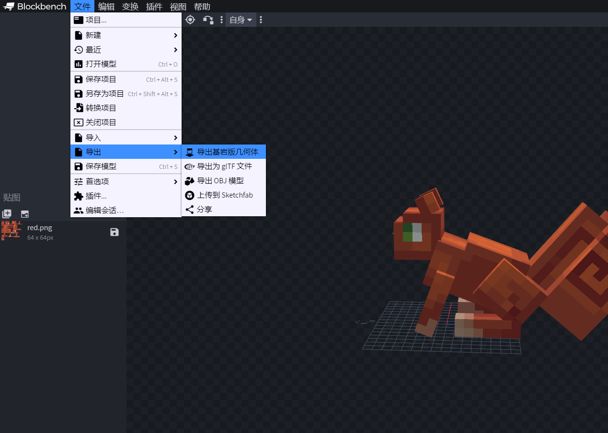
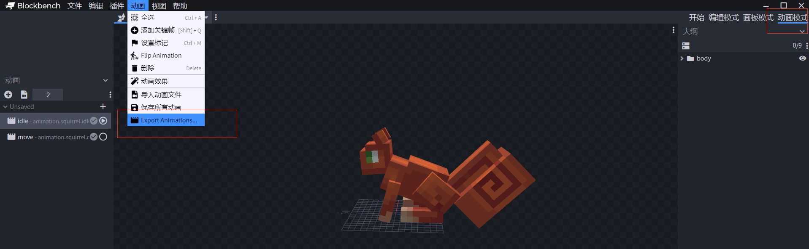
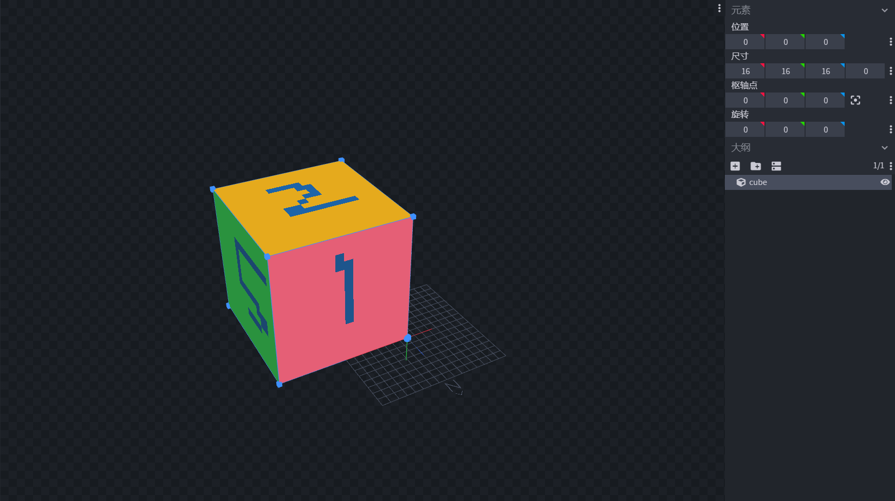
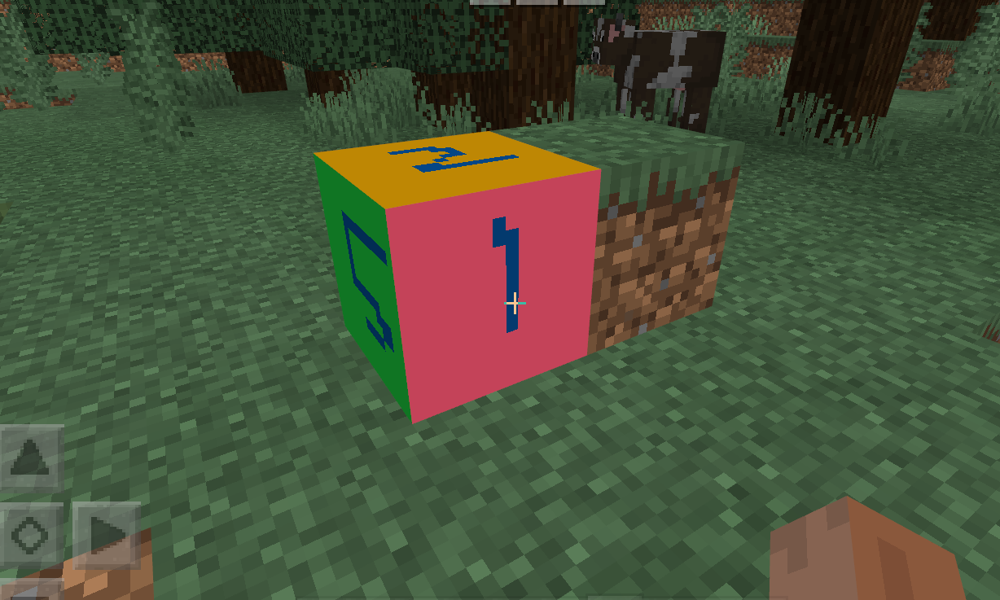
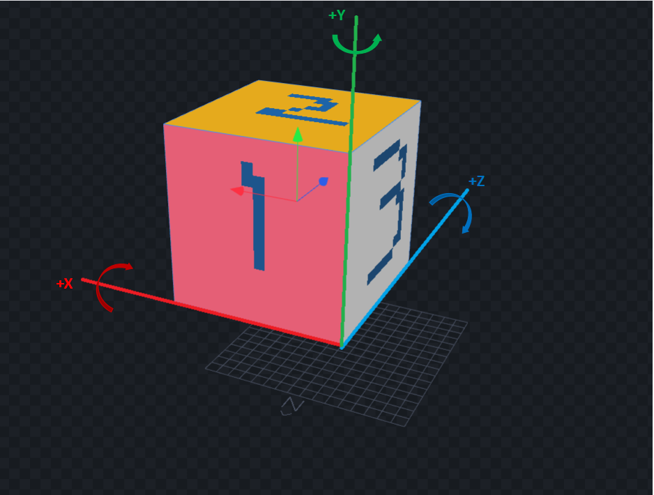
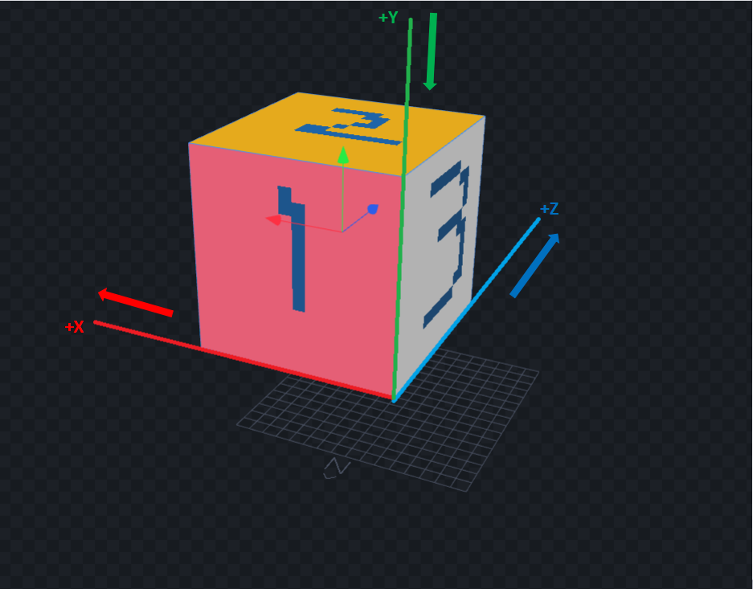
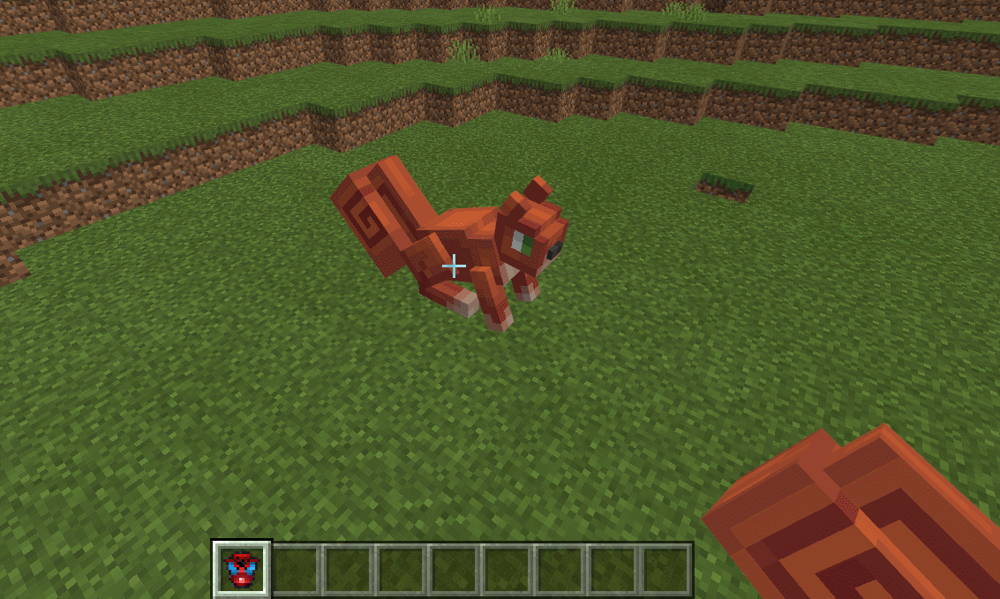
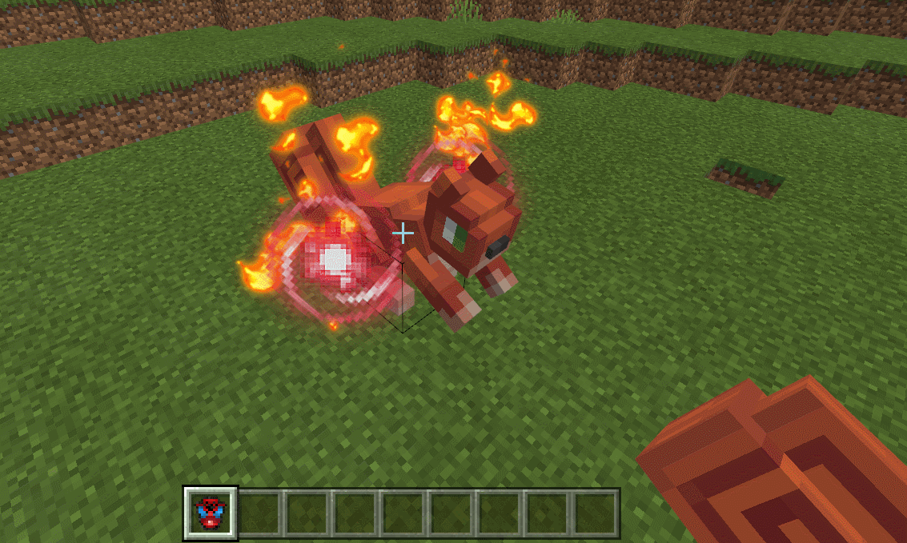
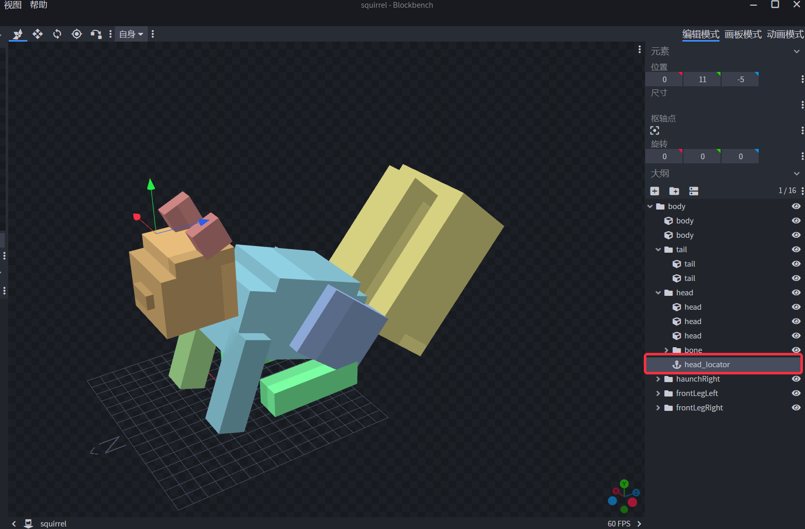

--- 
front: 
hard: Getting Started 
time: minutes 
--- 

# Customizing Block Entity Appearance 

## Overview 

According to the two steps [Customizing Block Entity](./4-Customizing Block Entity.md) and [Customizing Block Entity Model](./5-Customizing Block Model.md), we can make a custom block entity with personal characteristics. If you want this custom block entity to have stronger expressiveness, to be able to move like the original block entity such as the enchantment table, or to have cooler special effects, then you can follow this tutorial to further expand our custom block entity. 

The extended functions of custom block entities include two aspects: 

(1) **Add animation function to custom block entities**. Support the use of original models made by BlockBench or original game models, and support the animations attached to these models, so that custom block entities can have animation effects. 

(2) **Add special effects function to custom block entities**. Through configuration or interface, you can add NetEase version particle effects and sequence frame effects to custom block entities, and support the use of special effects and sequence frames and other series of interfaces for control and management. Custom block entities also support the configuration of Microsoft original particle effects and sound effects. 

Next, we will explain how to use the above two extension functions for our custom block entities and make a small squirrel custom block entity. Users can also refer to the custom block entity-small squirrel (custom_block_squirrel) in the [CustomBlocksMod](../../13-Module SDK Programming/60-Demo Example.md#CustomBlocksMod) example to learn. 

## Add animation function to custom block entity 

In this section, we will describe how to add animation function to custom block entity 

#### 1. Prepare particle effects or sequence frame effects files 

​ We first need an original entity model, which can be made through BlockBench software. For this step, users can refer to the steps of using BlockBench to make small blue flowers in [Custom Block Entity Model](./5-Custom Block Model.md). However, it should be noted that the bbmodel file of the model does not need to be imported through MC Studio to generate the json file of the model. Instead, after making the model, you only need to click **File-Export-Export Bedrock Edition Geometry**, as shown in the figure below: 

 

At the same time, we can use BlockBench to animate the model. After making the animation, we switch to animation mode in the upper right corner of the software, and then click **Animation-Export in the upper left corner Animations**, you can export the animation json file of the model. As shown in the figure below: 

 

For model production and animation production, users can also refer to [Original Model Production Guide](../../../16-Art/6-Models and Actions/01-Original Model Production Guide.md) to make them. The model json file is placed in the resource_pack/models/entity directory, and the animation json file is placed in the resource_pack/animations directory. These are the same as the original entity creatures. 

#### 1.1 BlockBench model adjustment 

​ When using BlockBench to make models, you often need to know the actual size and offset of the model in the game, and use this as a benchmark to adjust the size and position of the model. At present, the model size, rotation, and size displayed by the custom block entity appearance function are consistent with the position, size, and rotation in BlockBench.

As shown in the figure below, we create a block in BlockBench with **position (0,0,0), size (16,16,16), rotation (0,0,0)** and **the pink map surface facing north** 


 

The performance of this block in the game is as shown below: 

 

This block is also facing north with a pink texture in the game, and its size is exactly the same as that of a normal block. At the same time, if the user adjusts the rotation and size of the block in BlockBench, the game will have the same rotation and size adjustment effect as BlockBench. When using the custom block entity model adjustment interface in <a href="../../../../mcdocs/1-ModAPI/接口/方块/指数.html" rel="noopenner"> **技术手册-ModAPI-方块** </a>, the effect is the same as that of adjusting parameters in BlockBench. 

However, it should be noted that when the user uses the interface to adjust the scale of the model in the y-axis direction, it will be opposite to the stretching direction of BlockBench, and the model will be shifted in the y-axis direction while scaling. 

In general, the key points of model adjustment can be summarized as follows: 

​ (1) When scale is not defined or defined as 1 in the entity json file, the size of 16 in BlockBench is equal to the side length of an ordinary block in the game. The scale definition of the entity json file can be found in the next section. 

​ (2) The orientation and size stretching direction (except the y-axis) of the model in BlockBench are consistent with those in the game. The effect of adjusting using the scaling interface is also consistent with the effect of adjusting parameters in BlockBench. 

​ (3) When the position in BlockBench is (0,0,0), it corresponds to the actual position of the custom block entity in the game. The north-south direction of the block and the direction of the coordinate axis in BlockBench are also consistent with those in the game. 

Users can adjust the expected effects in BlockBench. Most model adjustments can be completed in BlockBench and then tested in the game to reduce the time consumption caused by repeatedly adjusting the model effects in the game. 

The characteristics of using the interface to scale and rotate the model are summarized as follows: 

​ (1) Use the <a href="../../../../mcdocs/1-ModAPI/接口/方块/创作.html#setblockentitymodelrotation" rel="noopenner"> SetBlockEntityModelRotation </a> interface to rotate the model 

​ When the model is rotated using the interface, the rotation is performed using the coordinate axis with the lower vertex in the northwest direction of the block as the origin as the rotation axis, as shown in the following figure: 

​  

​ Assuming that the interface is used to rotate 30 degrees, when rotating around the x-axis, the **thick red line** in the above figure will be used as the rotation axis, and the rotation will be 30 degrees clockwise looking towards the **positive direction of the x-axis. 

​ When rotating around the z-axis, the **thick blue line** in the above figure is used as the rotation axis, and the rotation is 30 degrees clockwise when looking at the **positive direction of the z-axis. 

​ When rotating around the y-axis, the **thick green line** in the above figure is used as the rotation axis, and the rotation is 30 degrees clockwise when looking at the **positive direction of the y-axis. 

(2) Use the <a href="../../../../mcdocs/1-ModAPI/接口/方块/创作.html#setblockentitymodelscale" rel="noopenner"> SetBlockEntityModelScale </a> interface to scale the model 

​ When the model is rotated using the interface, the rotation is stretched using the coordinate axis with the lower vertex in the northwest direction of the block as the origin, as shown in the following figure: 

​  

​ Assuming that the interface is used to zoom in 2 times, when the x-axis is zoomed in, the **thick blue line** in the above figure will be used as the starting axis, and it will be stretched to twice the original length in the **positive direction of the x-axis**. 

​ When the z-axis is zoomed in, the **thick red line** in the above figure will be used as the starting axis, and it will be stretched to twice the original length in the **positive direction of the z-axis**. 

​ When enlarging in the y-axis direction, it will stretch in the **negative direction of the y-axis** to twice its original length. 


#### 1.2 Multi-faceted Block Entities 

​ Customized block entity appearance supports four or six faces. If the block entity defines the [netease:face_directional](2-功能.md#duomianxiang) component, the block entity has multi-faceted functionality. When this component is not defined, the block entity faces the same direction as in BlockBench, i.e., it faces north by default. After defining this component, the block entity faces the same direction as the player places it or the auxValue set when using the interface <a href="../../../../mcdocs/1-ModAPI/界面/世界/块管理.html#setblocknew" rel="noopenner"> SetBlockNew </a>. 

After the face of the block entity changes, 

​ (1) The face change of the block will not affect the change of the rotation axis, because the rotation axis is based on the world coordinate system. When rotating a block using the interface, the rotation axis is still the rotation axis before the orientation is changed, that is, the coordinate axis with the lower vertex in the northwest direction of the block as the origin when facing north by default. 

​ (2) The orientation change of the block will affect the change of the stretching direction, because the stretching direction is based on the model coordinate system of the block itself. Therefore, after the orientation is changed, the stretching will be performed in the model coordinate system after the orientation change. For example, when the block is facing north by default, the stretching direction in the x direction is from west to east. When the block is facing east, the stretching in the x direction using the interface becomes from north to south, which can be regarded as the model coordinate system rotating 90 degrees clockwise. 

### 2. Configure the model and animation 

After preparing the model and animation files, we need to configure the model and animation. This step is actually the same as the configuration of the original creature. If the user is familiar with the configuration of the original creature, this step can be skipped. 

First, we need to prepare an entity.json file to control entity animation and rendering. This file is created in the resource_pack/entity directory and named xxx.entity.json, where xxx is a user-defined file name. This file can be created by referring to the resource pack creature definition in [Custom Basic Creatures](../3-Custom Creatures/01-Custom Basic Creatures.md). Users with a certain level of foreign language reading ability can also refer to the [Entity Creation Instructions](https://bedrock.dev/zh/docs/stable/Entities) and [Entity Animations](https://bedrock.dev/zh/docs/stable/Animations) in the Bedrock Edition Encyclopedia 

Our entity custom_block_squirrel.entity.json is created as follows: 

```json 
{ 
"format_version": "1.10.0", 
"minecraft:client_entity": { 
"description": { 
// Custom block entity identitfier 
"identifier": "customblocks:custom_block_squirrel", 
// Specify the entity model to use, located in the resource_pack/models/entity directory 
"geometry": { 
"default": "geometry.squirrel" 
}, 
// Specify the model texture to use, located in the resource_pack/textures/entity directory 
"textures": { 
"red": "textures/entity/squirrel/red" 
}, 
//Specify the model material to be used 
"materials": { 
"red": "entity_alphatest" 
}, 
//Specify the model rendering controller to be used, located in the resource_pack/render_controllers directory 
"render_controllers": [ "controller.render.squirrel" ], 
"scripts": { 
//Model scaling value 
"scale": "0.9375", 
//Entity Molang variable initialization, used to switch animation status 
"initialize": [ 
"variable.mod_is_moving = 2.0;" 
], 
//Running animation, general is the custom animation controller we created, indicating that the model will always run the animation controller. 
"animate": [

"general" 
] 
}, 
// The animations included in this model, general is the animation controller, defined in the resource_pack/animations_controllers directory 
// move, idle, look_at_target are animations, defined in the resource_pack/animations directory 
"animations": { 
"move": "animation.squirrel.move", 
"idle": "animation.squirrel.idle", 
"general": "controller.animation.squirrel.general" 
} 
} 
} 
} 
``` 

The above file creates an entity that uses the "geometry.squirrel" model file. The entity contains an animation controller named "general". The animation controller is run by default. The animation controller contains 2 animations: "move" and "idle". You can refer to the examples in resource_pack/animations_controllers/squirrel.animation_controllers.json: 

```json 
{ 
"format_version": "1.10.0", 
"animation_controllers": { 
"controller.animation.squirrel.general": { 
"initial_state" : "default", 
"states": { 
// Default idle animation state 
"default": { 
"animations": [ "idle" ], 
"transitions": [ 
// The animation state switching is controlled by the entity Molang variable: variable.mod_is_moving. The initial value is defined in the sripts field in entity.json. 
{ "squMove": "variable.mod_is_moving==1" } 
] 
}, 
// Walking animation state 
"squMove": { 
"animations": ["move"], 
"transitions": [ 
// The animation state switching is controlled by the entity Molang variable: variable.mod_is_moving. The initial value is defined in the sripts field in entity.json. 
{ "default": "variable.mod_is_moving==2" } 
] 
} 
} 
} 
} 
} 
``` 

We define an entity Molang variable: "variable.mod_is_moving", which is used to control the animation state switching of "general". Its initial value is 2.0, indicating that the default animation state of the entity model is "default", and the animation running in this animation state is "idle". 


### 3. Connect the entity model with the block entity 

After configuring the entity model and animation, we need to connect this model with the block entity. 

In the resouce_pack/blocks.json file, find the block entity to which we want to add entity models and animations. Here we are "customblocks:custom_block_squirrel", and add the "client_entity" field to indicate that this block entity will use the entity model, as shown below: 

```json 
{ 
"format_version": [ 
1, 
1, 
0 
], 
///... 

"customblocks:custom_block_squirrel": { 
"sound": "grass", 
// Can be used with the netease_model field 
"netease_model": "customblocks:customblocks_model_decoration", 

// --- Entity model configuration --- 
// This block entity will use the entity model 
"client_entity": { 
// Corresponding to the identifier in custom_block_squirrel.entity.json 
"identifier": "customblocks:custom_block_squirrel", 
// Whether the holding model or dropped model of this block entity uses this entity model. 
"hand_model_use_client_entity": true, 
// The icon texture of this block entity 
"block_icon": "test_block_icon", 
// Texture used when the block entity is destroyed 
"destoryed_textures":"destroy_squirrel" 
}, 
}, 
///... 
} 
``` 

The "client_entity" field contains four fields, and their functions are shown in the following table: 

| Field name | Description | 
| ---------------------------- | ------------------------------------------------------------ | 
| identifier | Corresponding to the identifier in custom_block_squirrel.entity.json, used to specify which entity.json file in the resource_pack/entity directory to use | 
| hand_model_use_client_entity | Whether the handheld model or dropped model of this block entity uses this entity model. When defined as true, the defined entity model will be displayed when the player holds the block entity or the block entity falls to the ground. When defined as false, two situations will occur depending on whether the user has defined the "netease_model" field: <br /> (1) If the netease_model field is defined, the handheld model and the dropped model will display the block model defined by netease_model; <br /> (2) If the netease_model field is not defined, the handheld model and the dropped model will display the block model composed of the texture defined by block_icon, and the block entity placed on the ground will also display the block model composed of the texture. | 
| block_icon | The item icon texture of this block entity. After defining this field, the icon texture of the block entity will use the texture in this field. The texture path is defined in the resouce_pack/textures/terrain_texture.json file. This field needs to be defined in the following situations: <br /> (1) When "hand_model_use_client_entity" is true, otherwise the item icon of this block entity will not be visible. <br />(2) When "hand_model_use_client_entity" is false and the "netease_model" field is not defined. Otherwise, the item icon of this block entity will not be seen. | 
| destoryed_textures | Optional. The texture sampled by the particles generated when the block entity is destroyed. The texture path is defined in the resouce_pack/textures/terrain_texture.json file. The sampled texture of the particles when the block is destroyed is determined in the following order of priority:<br /> (1) destoryed_texures (2) block_icon (3) Textures in netease_model (4) textures field<br /> That is, (1) is used first if it is defined, (1) is used first if it is not defined, and so on. | 


Through the configuration of the above steps, we can realize a block entity with animation effects: 

 

### 4. Use interfaces to control animation and adjust models 

We provide users with some available interfaces to adjust the size, rotation and relative position of the model, and also provide some interfaces for controlling animation playback. These interfaces can be viewed in <a href="../../../../mcdocs/1-ModAPI/接口/方块/指数.html" rel="noopenner"> **Technical Manual-ModAPI-方块** </a>. 

| Interface | Belong to | Purpose | 
| ------------------------------------------------------------ | -------------------------------------------------------- | ------------------------------------------------ | 
| <a href="../../../../mcdocs/1-ModAPI/接口/方块/Rendering.html#setblockentitymodelposoffset" rel="noopenner"> SetBlockEntityModelPosOffset </a> | <span style="display:inline;color:#7575f9">Client</span> | Set the entity model position offset value of the custom block entity. | 
| <a href="../../../../mcdocs/1-ModAPI/接口/方块/Rendering.html#setblockentitymodelrotation" rel="noopenner"> SetBlockEntityModelRotation </a> | <span style="display:inline;color:#7575f9">客户端</span> | Sets the rotation value of the entity model of the custom block entity on each axis. | 
| <a href="../../../../mcdocs/1-ModAPI/界面/方块/Rendering.html#setblockentitymodelscale" rel="noopenner"> SetBlockEntityModelScale </a> | <span style="display:inline;color:#7575f9">客户端</span> | Sets the scale value of the entity model size of the custom block entity. | 
| <a href="../../../../mcdocs/1-ModAPI/接口/块/块对象.html#setenableblockentityanimations" rel="noopenner"> SetEnableBlockEntityAnimations </a> | <span style="display:inline;color:#7575f9">客户端</span> | Set whether to enable the animation effect of custom block entities. | 
| <a href="../../../../mcdocs/1-ModAPI/界面/块/块对象.html#setblockentitymolangvalue" rel="noopenner"> SetBlockEntityMolangValue </a> | <span style="display:inline;color:#7575f9">客户端</span> | Set the Molang variable of the custom block entity. | 
| <a href="../../../../mcdocs/1-ModAPI/接口/方块/方块对象.html#getblockentitymolangvalue" rel="noopenner"> GetBlockEntityMolangValue </a> | <span style="display:inline;color:#7575f9">客户端</span> | Get the value of the Molang variable of the custom block entity. | 

## Add special effects to custom block entities 

In this section, we will describe how to add special effects to block entities. Special effects are divided into NetEase special effects and Microsoft original special effects. 

### Add NetEase special effects 

#### 1. Prepare particle special effects or sequence frame special effects files 

For this step, users can refer to [Particle Special Effects Production](../../../16-Art/9-Special Effects/2-Special Effects Creation and Use.md#Make a Particle Special Effect) or [Sequence Frame Special Effects Production](../../../16-Art/9-Special Effects/2-Special Effects Creation and Use.md#Make a Sequence Frame Special Effect) to make special effects. 

- The json files in the particle special effect resources are placed in the resource_pack/effects directory, and the texture files are placed in the resource_pack/textures/particle directory. 

- Sequence frame special effects support the use of textures and json sequence frame files exported by Texture Packer, and also support the use of sequence frame json files exported by MC Studio. If the textures and json sequence frame files are exported by Texture Packer, they are placed in the resource_pack/textures/sfx directory. If the sequence frame json files are exported by MC Studio, they are placed in the resource_pack/effects directory. 

#### 2. Configure particle effects or sequence frame effects 

Similar to the configuration of the entity model, the configuration of special effects is also configured in the resouce_pack/blocks.json file. 

In the resouce_pack/blocks.json file, find the block entity to which we want to add special effects. Here we are also "customblocks:custom_block_squirrel", and add the "netease_particle_effects" field or the "netease_frame_effects" field to indicate that this block entity will use special effects, as shown below: 

```json 
{ 
"format_version": [ 
1, 
1,

0 
], 
///... 

"customblocks:custom_block_squirrel": { 
"sound": "grass", 
// Can be used with netease_model 
"netease_model": "customblocks:customblocks_model_decoration", 

// --- Entity model configuration --- 
// This block entity will use the entity model 
"client_entity": { 
// Corresponding to the identifier in custom_block_squirrel.entity.json 
"identifier": "customblocks:custom_block_squirrel", 
// Whether the holding model or the model when dropping this block entity uses this entity model. 
"hand_model_use_client_entity": true, 
// The icon texture of this block entity 
"block_icon": "test_block_icon", 
// Texture used when the block entity is destroyed 
"destoryed_textures":"destroy_squirrel" 
}, 

// --- Special effects configuration --- 
// Use Netease particle effects 
"netease_particle_effects": { 
// Particle effects 
"particle1": { "path": "effects/xy_electro_fpA_gangqinlizu.json", "pos": [1.0,0.5,1.0]}, 
"particle2": { "path": "effects/yx_electro_fpA_02.json", "pos": [-1.0,0.5,-1.0]} 
//... You can define multiple, pay attention to performance consumption 
}, 
// Use Netease sequence frame effects 
"netease_frame_effects": { 
// Sequence frame effects 
"frame1": { "path": "effects/yx_electro_fzb_waiquan2.json", "pos": [1.0,1.0,1.0]}, 
"frame2": { "path": "textures/sfx/zhishujie_fz01", "pos": [-1.0,1.0,-1.0]} 
//... You can define multiple, pay attention to performance consumption 
} 
}, 
///... 
} 
``` 

Particle effects or sequence frame effects, we use the following format to configure: 

```json 
"particle1": { "path": "effects/xy_electro_fpA_gangqinlizu.json", "pos": [1.0,0.5,1.0]} 
``` 

Among them, 


- "particle1": The custom key name of the special effect, which can be freely determined by the user 

- "path": The relative path position of the special effect. For particle special effects, the path should be a relative path starting with "effects/". For sequence frame special effects, there are two cases: 

(1) Sequence frame special effects exported by Texture Packer are relative paths starting with "textures/" and do not need to add the .json suffix. 

(2) JSON files exported by MC Studio are relative paths starting with "effects/" and need to add the .json suffix. 

- "pos": The position of the special effect is the position offset relative to the block entity position, that is, the coordinates in the coordinate system with the block entity position as the origin. 

Through the configuration of the above two steps, we can add particle effects and sequence frame effects to the block entity: 

 

#### 3. Use interfaces to control particle and sequence frame effects 

We provide some interfaces for users to conveniently add, delete and adjust special effects. These interfaces can be viewed in <a href="../../../../mcdocs/1-ModAPI/接口/方块/指数.html" rel="noopenner"> **Technical Manual-ModAPI-方块** </a>. 

At the same time, users can obtain the special effect ID created on the custom block entity through the defined special effect key value name. With this ID, users can use the particle series interface in <a href="../../../../mcdocs/1-ModAPI/Interface/Special Effects/Particles.html" rel="noopenner"> **Technical Manual-ModAPI-Special Effects-Particles** </a> and the sequence frame series interface in <a href="../../../../mcdocs/1-ModAPI/Interface/Special Effects/Sequence Frame.html" rel="noopenner"> **Technical Manual-ModAPI-Special Effects-Sequence Frame** </a> to perform a series of special effect operations. 

**Sequence frame**: 

| Interface | Belong to | Purpose | 
| ------------------------------------------------------------ | -------------------------------------------------------- | ------------------------------------------------------------ | 
| <a href="../../../../mcdocs/1-ModAPI/接口/方块/方块对象.html#createframeeffectforblockentity" rel="noopenner"> CreateFrameEffectForBlockEntity </a> | <span style="display:inline;color:#7575f9">Client</span> | Create a sequence frame effect on a custom block entity. After creation, this interface returns the Id of the sequence frame effect. | 
| <a href="../../../../mcdocs/1-ModAPI/接口/方块/方块对象.html#getframeeffectidinblockentity" rel="noopenner"> GetFrameEffectIdInBlockEntity </a> | <span style="display:inline;color:#7575f9">客户端</span> | Get the Id of the specified sequence frame effect that has been created in the custom block entity. | 
| <a href="../../../../mcdocs/1-ModAPI/接口/方块/方块对象.html#removeframeeffectinblockentity" rel="noopenner"> RemoveFrameEffectInBlockEntity </a> | <span style="display:inline;color:#7575f9">客户端</span> | Remove the sequence frame effect created on the custom block entity. The removed special effect ID will become invalid. | 
| <a href="../../../../mcdocs/1-ModAPI/接口/方块/Rendering.html#setblockentityframeposoffset" rel="noopenner"> SetBlockEntityFramePosOffset </a> | <span style="display:inline;color:#7575f9">客户端</span> | Set the sequence frame special effect position offset value in the custom block entity, which is used to adjust the offset of the sequence frame special effect relative to the block position. | 

**Particle**: 

| Interface | Belonging end | Purpose | 
| ------------------------------------------------------------ | -------------------------------------------------------- | ------------------------------------------------------------ | 
| <a href="../../../../mcdocs/1-ModAPI/接口/方块/方块对象.html#createparticleeffectforblockentity" rel="noopenner"> CreateParticleEffectForBlockEntity </a> | <span style="display:inline;color:#7575f9">Client</span> | Create a particle effect on a custom block entity. After creation, this interface returns the Id of the particle effect. | 
| <a href="../../../../mcdocs/1-ModAPI/接口/方块/方块对象.html#getparticleeffectidinblockentity" rel="noopenner"> GetParticleEffectIdInBlockEntity </a> | <span style="display:inline;color:#7575f9">客户端</span> | Get the id of the specified particle effect that has been created in the custom block entity. | 
| <a href="../../../../mcdocs/1-ModAPI/接口/方块/方块对象.html#removeparticleeffectinblockentity" rel="noopenner"> RemoveParticleEffectInBlockEntity </a> | <span style="display:inline;color:#7575f9">客户端</span> | Removes a particle effect created on a custom block entity. The removed special effect ID will become invalid. | 
| <a href="../../../../mcdocs/1-ModAPI/接口/方块/Rendering.html#setblockentityparticleposoffset" rel="noopenner"> SetBlockEntityParticlePosOffset </a> | <span style="display:inline;color:#7575f9">客户端</span> | Set the particle special effect position offset value in the custom block entity, which is used to adjust the offset of the particle special effect relative to the block position. | 

### Add Microsoft original particle special effects and sound effects 
Microsoft animation function supports configuring particle special effects or sound effects in animation controller json file or animation json file. Custom block entity appearance function also supports this configuration method. 

Users with a certain level of foreign language reading ability can check the [original wiki](https://wiki.bedrock.dev/visuals/custom-particles.html) to learn about how to define particle effects and sound effects in entity animation controllers or animations. 

#### 1. Use original particles 

The resources of the original particles can use the particle resources that come with the game, or you can make them yourself. The particle resources that come with the game can refer to the list of [the Particles section in the Wiki](https://wiki.bedrock.dev/documentation/particles.html). The method of custom production can also refer to [the introduction in this Wiki](https://wiki.bedrock.dev/visuals/custom-particles.html). This guide will not be described here. 

The prepared particle resources can be used in the game


``` 
/particle <namespace:particle_id> ~ ~2 ~ 
``` 

This command is used to test whether it works. 

Once we have some particle resources, we need to declare them in the entity.json file and configure them in the animation_controllers.json file. The configuration method is actually the same as the method of configuring the original particles in the biological entity. If the user is familiar with this part, you can skip this part of the guide. 

Taking resource_pack/entity/custom_block_squirrel.entity.json as an example, we add a particle_effects component based on the existing one: 

```json 
{ 
"format_version": "1.10.0", 
"minecraft:client_entity": { 
"description": { 
// identitfier of custom block entity 
"identifier": "customblocks:custom_block_squirrel", 

/// ... Omit the file content in the middle 

// The animations contained in this model, generally are animation controllers, defined in the resource_pack/animations_controllers directory 
// move, idle, look_at_target are animations, defined in the resource_pack/animations directory 
"animations": { 
"move": "animation.squirrel.move", 
"idle": "animation.squirrel.idle", 
"general": "controller.animation.squirrel.general" 
}, 

// Microsoft original particles included in this model 
"particle_effects": { 
"headsmoke": "minecraft:water_fog" 
} 
} 
} 
} 
``` 

And added a particle with the key value of headsmoke, the particle uses the particle resource minecraft:water_fog. 

Next, we use BlockBench to add a Locator named head_locator to the model to determine the position of our particles in the model. We can right-click the head component of the model to add a locator, export and save: 

 

With the locator and particle definition, we can open the animation_controllers.json file to determine in which animation state our particles play: 

Take squirrel.animation_controllers.json as an example, we configure this particle for the default animation state, and add a sequence named particle_effects in the default animation state: 

```json 
{

"format_version": "1.10.0", 
"animation_controllers": { 
"controller.animation.squirrel.general": { 
"initial_state" : "default", 
"states": { 
// Default idle animation state 
"default": { 
"animations": [ "idle" ], 
// Original particle effects played in this animation state 
"particle_effects": [ 
{ 
// Particle name defined in entity.json 
"effect": "headsmoke", 
// Locator defined in geometry 
"locator": "head_locator" 
} 
//, 
//... Multiple original particles can be configured 
], 
"transitions": [ 
// The animation state switching is controlled by the entity Molang variable "variable.mod_is_moving", and the initial value is defined in the sripts field in entity.json. 
{ "squMove": "variable.mod_is_moving==1" } 
] 
} 
///, ... Other animation states 
} 
} 
} 
} 
``` 

So far, we have completed the configuration of a Microsoft original particle effect. 

In addition, the configuration of particles can not only be configured in animation_controllers.json, but also directly in the corresponding animation file animations.json. 

Taking squirrel.animation.json as an example, we directly configure the particles of the idle animation. The configuration method is to add a particle_effects sequence in the animation definition, and use the animation time as the key value to determine when our particle effects will be played in the animation: 

```json 
{ 
"format_version": "1.8.0", 
"animations": { 
"animation.squirrel.idle": { 
"loop": true, 
"animation_length": 2, 
"bones": { 
/// ... Omit the skeleton content 
}, 
/// Original particles 
"particle_effects": { 
/// Play the particle effect at the animation frame 0.4833

"0.4833": { 
// Particle name defined in entity.json 
"effect": "headsmoke", 
// Locator defined in geometry 
"locator": "head_locator" 
} 
} 
} 
} 
``` 

#### 2. Use original sound effects 

The definition and configuration of sound effects are actually similar to those of the original particle effects. Users can also refer to this [guide](https://wiki.bedrock.dev/concepts/sounds.html). 

We first need to define our sound effects in resource_pack/sounds/sound_definitions.json. If there is no such json file, you need to create it yourself. Its content is as follows: 

```json 
{ 
"format_version": "1.14.0", 
"sound_definitions": { 
// Define a custom sound effect 
"squirrel.idle.thunder": { 
"category": "music", 
"min_distance": 0.0, 
"max_distance": 5.0, 
"sounds": [ 
{ 
"name": "sounds/music/blocks", 
"pitch": 1, 
"volume": 1, 
"load_on_low_memory": true 
} 
] 
} 
} 
} 
``` 

In this file, we define a custom sound effect named squirrel.idle.thunder. 

Next, similar to the configuration of the original particle effect, we need to declare this sound effect in the entity.json file: 

```json 
{ 
"format_version": "1.10.0", 
"minecraft:client_entity": { 
"description": {

// identitfier of custom block entity 
"identifier": "customblocks:custom_block_squirrel", 

/// ... omit the file content in the middle 

// The animation contained in this model, general is the animation controller, defined in the resource_pack/animations_controllers directory 
// move, idle, look_at_target are animations, defined in the resource_pack/animations directory 
"animations": { 
"move": "animation.squirrel.move", 
"idle": "animation.squirrel.idle", 
"general": "controller.animation.squirrel.general" 
}, 

// Microsoft original particles contained in this model 
"particle_effects": { 
"headsmoke": "minecraft:water_fog" 
}, 
// Custom sound effects contained in this model 
"sound_effects": { 
"thunder": "squirrel.idle.thunder" 
} 
} 
} 
} 
``` 

After declaring the sound effect in entity.json, we can use this sound effect in animation_controllers.json or animations.json. 

Note that animation_controller.json with format_version 1.8.0 does not support the configuration of the sounds_effects component, otherwise an error will be reported. Users need to change to version 1.10.0. 

Taking squirrel.animation_controllers.json as an example, we configure this sound effect for the default animation state, which actually adds a sequence of "sound_effects": 

```json 
{ 
"format_version": "1.10.0", 
"animation_controllers": { 
"controller.animation.squirrel.general": { 
"initial_state" : "default", 
"states": { 
// Default standby animation state 
"default": { 
"animations": [ "idle" ], 
// Original particle effects played in this animation state 
"particle_effects": [ 
{ 
// Particle name defined in entity.json 
"effect": "headsmoke", 
// Locator defined in geometry 
"locator": "head_locator" 
}

//, 
//... Multiple original particles can be configured 
], 
// Custom sound effects played in this animation state 
"sound_effects": [ 
{ 
// Use the custom sound effect thunder 
"effect": "thunder" 
} 
], 
"transitions": [ 
// The animation state switching is controlled by the entity Molang variable "variable.mod_is_moving". The initial value is defined in the scripts field in entity.json. 
{ "squMove": "variable.mod_is_moving==1" } 
] 
} 
///, ... Other animation states 
} 
} 
} 
} 
``` 

Take squirrel.animation.json as an example. We directly configure the sound effects for the idle animation. The configuration method is similar to that of particle effects. Note that animations.json with format_version 1.8.0 supports the configuration of the sounds_effects component. 

```json 
{ 
"format_version": "1.8.0", 
"animations": { 
"animation.squirrel.idle": { 
"loop": true, 
"animation_length": 2, 
"bones": { 
/// ... Omit the skeleton content 
}, 
/// Original particles 
"particle_effects": { 
/// Play particle effects at the animation frame 0.4833 
"0.4833": { 
// Particle name defined in entity.json 
"effect": "headsmoke", 
// Locator defined in geometry 
"locator": "head_locator" 
} 
}, 
/// Custom sound effects 
"sound_effects": { 
"0.4833": { 
"effect": "thunder" 
} 
}

} 
} 
``` 

So far, we have completed the configuration of custom sound effects.