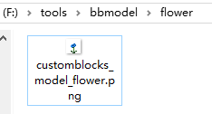
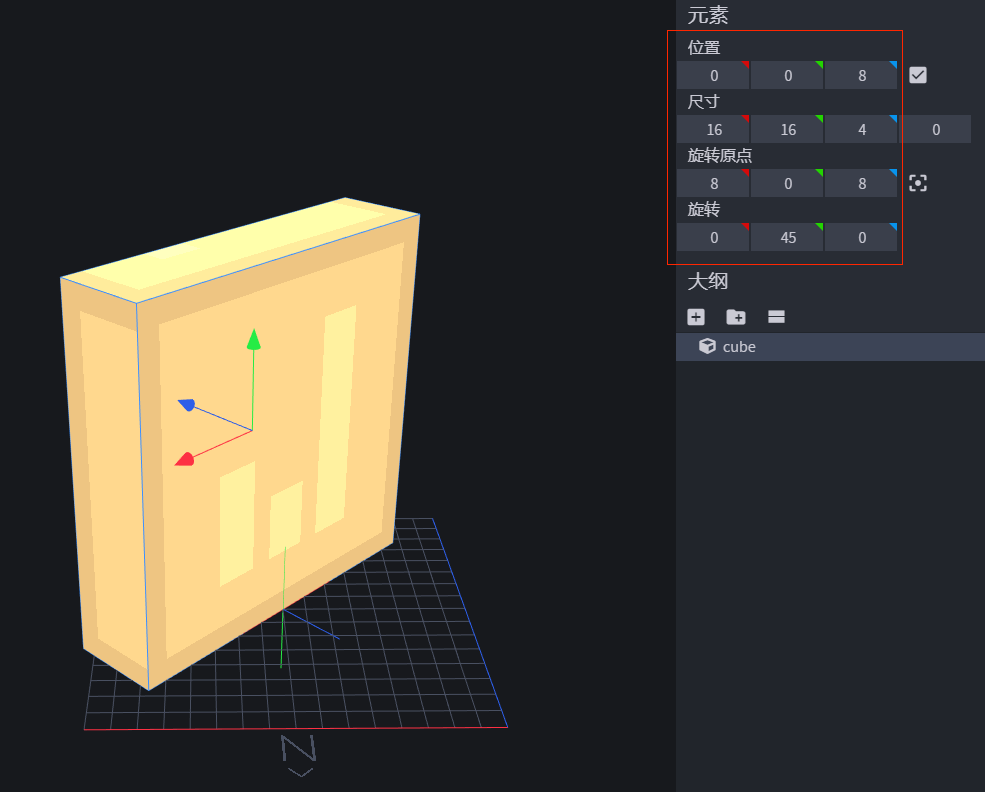
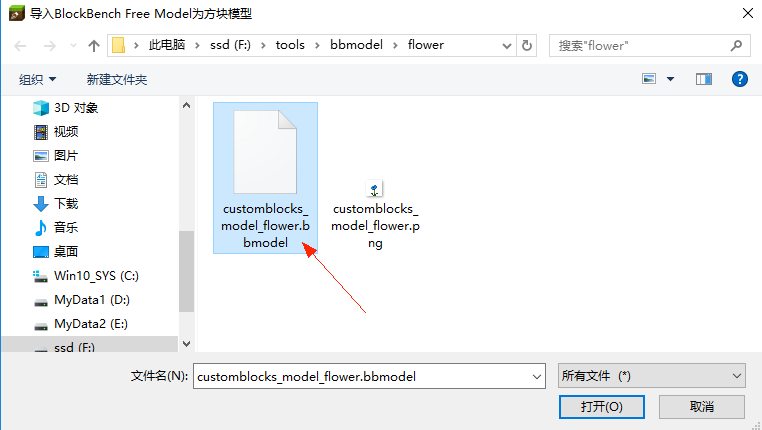
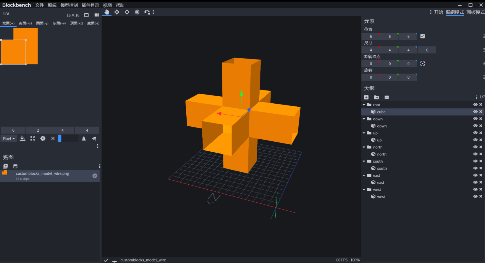

--- 
front: 
hard: Getting Started 
time: minutes 
--- 

# Custom Block Model 

## Overview 

The following will follow the three custom model blocks in the [CustomBlocksMod](../../13-Module SDK Programming/60-Demo Example.md#CustomBlocksMod) example to explain how to build a custom block model with BlockBench and MCStudio. 

## Make a Block Model from Scratch - Little Blue Flower 

Hand-in-hand guidance on how to make the little blue flower (customblocks_model_flower) in the [CustomBlocksMod](../../13-Module SDK Programming/60-Demo Example.md#CustomBlocksMod) example. 

The project file of the little blue flower is provided in `resource/bbmodel/flower` in the example. 

### Use BlockBench to make a model 

1. Find a place to create a new folder as the working path, and prepare the blue flower texture 

 

1. Open blockbench (the version used here is 3.3.1). 

In File->Settings->General, you can set it to Chinese, and restart blockbench to take effect. 

 

1. Create a new "Free Model" project, fill in the file name and geometry name. 

Do not check the box UV; the maximum length and width of the texture cannot exceed 64. In the following example, we use a 16x16 texture. 

 

1. The size of a block in the game corresponds to 16 x 16 x 16, which is the size of the grid on the board. The N on the grid indicates the direction of the north 

 

1. To avoid the impact of light on the preview, you can open File->Settings->Preview and remove the "shadow" 

 

1. Open File->Settings->Default, check "Auto UV", so that when you adjust the cube size, the UV size of each face will also be automatically adjusted 

 

1. Drag in the blue flower texture 

 

1. Add a cube, adjust its size, position and rotation so that its north face is on the diagonal of the 16 x 16 grid 

 

1. Select the north face and drag the blue flower texture onto it. The blue flower texture is now applied to the north face of the cube 

 

1. Click on the plugin directory - remove the blank face. This way the cube will only show the north side 

 

1. Repeat the above three steps to add another vertical patch 

 

1. Click File-Save Project and save it to the path where we just put the texture. 

 

### Import the model using MCStudio 

1. Open MCStudio, create a new AddOn, or import an existing one, and then start editing 

 

1. Set the namespace 

 

1. Select Import Block Model in the Resource Manager 

 

1. Select the BlockBench project file we just saved 

 

Behind this import step, MCStudio did the following operations: 

* Convert the bbmodel project file to a custom block model format json and put it in `resourcepack/models/netease_block` 
* Copied the texture to `resourcepack/textures/blocks` 
* Configured the texture to `resourcepack/textures/terrain_texture.json` 

### Configure other required files 

​ MCStudio has done some work for us. There are still a few files that need to be manually configured. 

1. Write the definition of behavior 

 

2. In `resourcepack/blocks.json`, add the block 

 

Among them, "netease_model" is used as the identifier of the model json generated in `resourcepack/models/netease_block`. 

 

3. Summary of the paths involved in completing a custom model block: 

 

## Make a more complex model - decorations 

​ The general process is similar to that of the little blue flower, and the more repeated content will not be repeated. The only difference is the operation in the blockbench. 

​ Here is how to make a model with multiple textures, and how to use uv flip and uv rotation when a single 16x16 texture is not enough 

​ **Note that we use multiple 16x16 textures to solve the texture size requirement, rather than using high-resolution textures** 

​ The project files for decorations are provided in `resource/bbmodel/decoration` in the [CustomBlocksMod](../../13-Module SDK Programming/60-Demo Example.md#CustomBlocksMod) example. 

### Multi-texture model 

​ For some more complex models, when a single 16x16 texture is not enough, different bones, cubes, or faces can be drawn to multiple textures. 

1. Create a new free model project, set up the skeleton and cube 

 

2. Create a new working directory, prepare the textures to be used, and drag them all into BlockBench. 

 

3. Configure UV for each face of each cube 

Developers familiar with BlockBench can also use the drawing board mode in the upper right corner to draw block models 

 

### UV flip and rotation 

​ You can directly use the UV rotation and UV mirroring functions of BlockBench. The upper right corner of the texture will show the rotation and flip used for the face. 

 

## Make a changeable model - wire 

​ The general process is similar to that of the little blue flower. The more repeated content will not be repeated. The only difference is the operation in blockbench, the adjustment of the exported model json, and the definition of the block json in the behavior. 

​ Here is how to make a model that changes with the surrounding blocks. 

​ The engineering file of the wire is provided in `resource/bbmodel/wire` in the [CustomBlocksMod](../../13-Module SDK Programming/60-Demo Example.md#CustomBlocksMod) example. 

1. Use [netease:connection](./1-JSON component#netease:connection) in the definition of behavior to configure the "connection" property with other blocks 

The wires in the example have the "connection" property with the furnace, grass blocks, and the wires themselves 

 

2. Analyze the effect of the wire: when there are no connectable blocks in the six directions, only a small middle block is displayed; when the blocks in a certain direction can be connected, a cuboid "grows" from the middle to connect with it. 

 

3. Then when there are connectable blocks in all six directions, the wire model will consist of a central cube and six cuboids. So set them up in blockbench. (In order to show the sense of hierarchy here, "shadow" in the settings is enabled) 

 

4. If you observe carefully, you can find that each of the six cuboids will have two faces that will never be seen. You can optimize them and set them to transparent. Skipping this step will not affect the actual effect, but it is still recommended that developers optimize performance. 

 

5. After importing with MCStudio, open the json exported in `resourcepack/models/netease_block`, and add the enable field to the bones of the six cuboids. For a detailed explanation of this field, see [Model File Structure](#Model File Structure) 

 

6. In the example, the cube of the middle root bone is manually split into six bones, and each bone has only one face. This is because if other blocks are connected in certain directions, some faces of the middle cube cannot be seen and do not need to be rendered. Skipping this step will not affect the actual effect, but it is still recommended that developers optimize performance. 

 

7. Make an additional texture for item rendering and configure it in the model json. 

For variable models, bones with enable conditions will not be drawn in item form, and a separate item texture is generally required. 

 

 

8. Turn on ambient occlusion. Block models that can be connected to themselves generally need to be turned on. This can improve the situation when the brightness of adjacent blocks is different indoors or at night. 

 

9. In the behavior block json, split aabb into a cube in the middle and six cuboids around it. For a detailed explanation of this component, see [netease:aabb](./1-JSON component#netease:aabb) 

 

 
## Model file structure 

- Detailed parameter explanation of model json in `resource/models/netease_block`: 

| key | type | explanation | 
| ---------------------- | ------ | -------------------------------------------- | 
| format_version | string | Currently 1.13.0, corresponding to blockbench 3.3.1 and above | 
| netease:block_geometry | object | | 

- netease:block_geometry structure: 

| key | type | Explanation | 
| ----------- | ------------- | ---------------------- | 
| description | object | Basic information of the model | 
| bones | array(object) | Information about the bones and cubes of the model | 

- description structure: 

| key | type | explanation | 
| --------------------- | ------------- | ------------------------------------------------------------ | 
| identifier | string | Identifier of the model. It is recommended to use the namespace plus the name | 
| textures | array(string) | Textures used by the model, corresponding to terrain_texture.json | 
| item_texture | string | Optional The texture of the item form of the block, corresponding to terrain_texture.json.  When this option is configured, the item forms such as handheld, UI item grid, and dropped items are rendered using this texture instead of the block model | 
| use_ao | bool | Optional, whether to enable ambient occlusion.  When enabled, the brightness of the blocks will be more natural, but overall it will be a little darker than when not enabled Not enabled by default | 
| textures_descriptions | array(dict) | The length and width configuration of the actual resolution of each model texture. The maximum length and width cannot exceed 64. If it exceeds, 64 will be used. One-to-one correspondence with the textures at the same index position in the textures array. That is, the length and width configuration of the first texture is the first length and width pair in "textures_descriptions", the length and width configuration of the second texture corresponds to the second length and width pair in "textures_descriptions", and so on. If the texture defined in textures does not find the corresponding texture length and width configuration in "textures_descriptions", the default value width = 16, length = 16 will be used.  Example: `"textures_descriptions":[ { "width": 32, "length":32} , { "width": 64, "length":64} , { "width": 16, "length":16} ]` **Please fill in the values of width and length according to the actual resolution of the texture. ** | 

- The structure of each element of bones: 

Except for texture and enable, which need to be configured separately, the rest can be generated by blockbench. 

| Key | Type | Explanation | 
| -------- | ------------- | ------------------------------------------------------------ | 
| name | string | The name of the bone | 
| parent | string | The name of the parent bone | 
| pivot | array(float) | The rotation center of the bone | 
| rotation | array(float) | The rotation of the bone around the rotation center | 
| texture | int | Optional The texture used by the bone, corresponding to the index of the textures array in description.  Default is 0 | 
| enable | molang | Optional. Controls whether the bone is rendered. Returns true by default Currently only supports is_connect query, see [netease:connection](./1-JSON component.md#netease_connection) for details | 
| cubes | array(object) | Information about the cubes contained in this bone | 

- The structure of each element of cubes:

Except texture, which needs to be configured separately, all other objects can be generated using blockbench. 

| Key | Type | Explanation | 
| -------- | ------------ | ------------------------------------------------------------ | 
| origin | array(float) | The position of the smallest point of the cube | 
| size | array(float) | The size of the cube | 
| pivot | array(float) | The rotation center of the cube | 
| rotation | array(float) | The rotation of the cube around the rotation center | 
| texture | int | Optional. The texture used by the cube corresponds to the subscript of the textures array in description.  By default, the texture used by the skeleton will be inherited | 
| uv | object | Information about the faces of the cube Optional faces include up, down, north, south, west, east You can select only some of them for rendering. | 

- The structure of each element in uv: 

Except texture, which needs to be configured separately, all other objects can be generated using blockbench. 

| Key | Type | Explanation | 
| ------- | ---------- | ------------------------------------------------------------ | 
| uv | array(int) | Starting uv coordinates | 
| uv_size | array(int) | UV size | 
| texture | int | Optional. The texture used by the cube, corresponding to the index of the textures array in description.  By default, the texture used by the cube will be inherited | 
| rot | int | The angle to rotate the uv clockwise Optional 90, 180, 270 | 

## Notes 

- Currently, the size of each texture cannot exceed 64x64 

- **[Special Blocks](./3-Special Blocks/0-Special Blocks Overview.md) does not support custom block models** (except crops) 

- **Blocks using models support four-sided in [netease:face_directional](./1-JSON Components.md#netease_face_directional), but do not support six-sided**. When using multiple faces, the is_connect query will automatically match the current face 

- When using custom block models, you need to use [minecraft:block_light_absorption](./1-JSON component.md#minecraft_block_light_absorption), otherwise the model will turn black 

- When full transparency or semi-transparency is required, you can use [netease:render_layer](./1-JSON component.md#netease_render_layer), but the properties will be applied to the entire model 

- Do not use custom model blocks in the composition of custom biomes, and avoid putting a large number of custom model blocks in frequently appearing custom features 

- Cubes do not support the inflate function 

 

