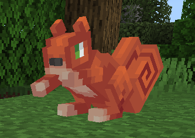
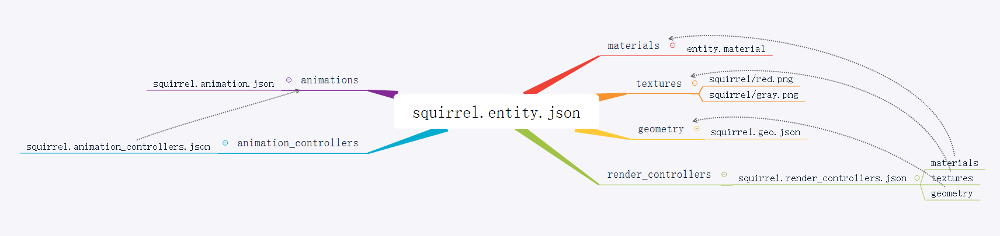
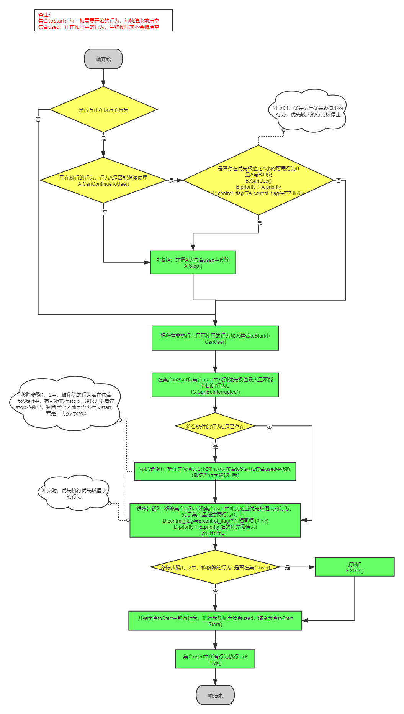
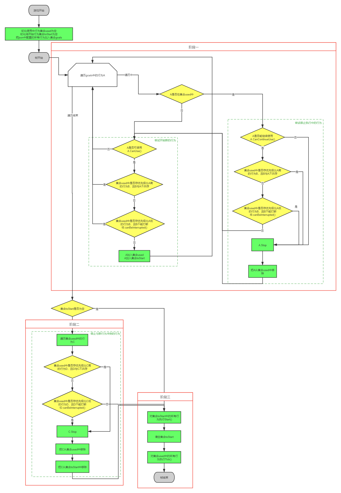

--- 
front: 
hard: Getting Started 
time: minutes 
--- 

# Custom Creatures 

## 1. Overview 

Custom creatures involve concepts such as material, texture, model, geometry, animation, animation controller, and render controller. I hope you will have some understanding of these professional terms when reading this document. 

Developers can add custom creatures by configuring json in addon. The added custom creatures support all events and interfaces related to creatures/entities in the "MOD SDK Documentation". 

The following will show how to define a creature by defining a squirrel. (For details, see the example [CustomEntityMod](../../13-Module SDK Programming/60-Demo Example.md#CustomEntityMod)) 

 

The custom squirrel includes the following json files: 

* behavior_pack/entities/squirrel.json server-side entity definition 
* resource_pack/entity/squirrel.entity.json client-side entity definition 
* resource_pack/animations/squirrel.animation.json animation definition 
* resource_pack/animation_controllers/squirrel.animation_controllers.json animation controller definition 
* resource_pack/models/entity/squirrel.geo.json model definition 
* resource_pack/render_controllers/squirrel.render_controllers.json Rendering controller definition 
* resource_pack/textures/entity/squirrel/red.png Texture 
* resource_pack/textures/entity/squirrel/gray.png Texture 
* resource_pack/materials/entity.material Material 

The following figure is the relationship between the above files: 

 

## 2. Behavior pack entity definition 

### 2.1 Example 

Add squirrel.json to the behavior pack behavior_pack/entities directory 

```json 
{ 
"format_version": "1.10.0", 
"minecraft:entity": { 
"description": { 
"identifier": "netease:squirrel", # Entity identifier 
"is_summonable": true, # Can it be summoned using commands 
"is_spawnable": true, # Can this entity be spawned using the spawn egg in the creative mode interface

"runtime_identifier": "minecraft:squirrel" # Build a custom entity based on this 
}, 
"component_groups": { 
"minecraft:color_red": { 
"minecraft:type_family": { 
"family": [ 
"red_squirrel", 
"squirrel" 
] 
}, 
# Define a variable that selects different textures and materials in the render_controller 
"minecraft:variant": { 
"value": 0 
} 
}, 
"minecraft:color_gray": { 
"minecraft:type_family": { 
"family": [ 
"gray_squirrel", 
"squirrel" 
] 
}, 
"minecraft:variant": { 
"value": 1 
} 
} 
}, 
"components": { 
... 
		},
		"events": {
			"minecraft:entity_spawned": {
				"sequence": [
					{
						"randomize": [
							{
								"weight": 1, # weight
								"add": {
									"component_groups": [
										"minecraft:color_red"
									]
								}
							},
							{
								"weight": 1, # weight
								"add": {
									"component_groups": [
										"minecraft:color_gray"
									]
								}

} 
] 
} 
] 
} 
} 
} 
} 
``` 

When creating a squirrel, there is a 50% chance of generating a red squirrel and a 50% chance of generating a gray squirrel. 

### 2.2 components 

Define the independent behavior characteristics of each entity, such as minecraft:identitier and minecraft:type_family. 

For more component introductions, please refer to the Microsoft documentation (https://minecraft-zh.gamepedia.com/Bedrock Edition Entity Component Documentation) 

**Note: In 2.2 and later versions, we have optimized the movement flow of custom creatures. Creatures that are far away from the player will teleport. If you feel that the effect is poor, you can manually add the netease:ban_bandwidth_optimization:{} component in components to actively turn off this optimization** 

### 2.3 component_groups 

Putting multiple components in a collection makes it easier to add and delete multiple components. For example, the two different stages of the entity, boby and adult, have many different properties, so you can add or remove the component group of the corresponding stage in the appropriate event. 

In this example, two groups, red squirrel (minecraft:color_red) and gray squirrel (minecraft:color_gray), are defined, and added when creating creatures. 

### 2.4 Events 

#### minecraft:entity_spawned 

Trigger time: when the entity is placed in the map 

#### minecraft:entity_transformed 

Trigger time: when the entity is transformed into another entity 

#### minecraft:entity_born 

Trigger time: when the entity reproduces 

#### minecraft:on_prime 

Trigger time: when the entity is ignited and about to explode 


## 3. Custom materials 

### 3.1 Examples 

#### 3.1.1 Native materials 

MC's native material definitions are all in "/data/resource_packs/vanilla/materials", and the materials of creatures are all in the "entity.material" file in this directory. 

Materials can be reused through inheritance. In native materials, the definition of the basic biological material entity that is often inherited is as follows: 

```json 
"entity:entity_static": { # Material entity that inherits the material entity_static. The definition of entity_static can be found in the above "entity.material" file 
"+defines": [ "USE_OVERLAY" ], # Add USE_OVERLAY macro definition when rendering 
"msaaSupport": "Both" # Use MSAA anti-aliasing technology 
}, 
``` 

#### 3.1.2 Add custom materials 

Create a json file in the resource_pack/materials directory of the resource pack: entity.material. 

```json 
{ 
"materials": { 
"version": "1.0.0", 
"custom_entity1:entity": { # Custom material custom_entity1 that inherits native material entity 
"+defines": [ "USE_ONLY_EMISSIVE", "USE_UV_ANIM"] # Add USE_ONLY_EMISSIVE and USE_UV_ANIM macro definitions when rendering 
"-defines": [ "USE_OVERLAY" ], # Because the native entity material adds the USE_OVERLAY macro definition in "+defines", you can use "-defines" here to remove the USE_OVERLAY macro definition. The native entity material has been listed in 3.1.1 
"msaaSupport": "NonMSAA" # Do not use MSAA anti-aliasing technology 
}, 
"custom_entity2:custom_entity1": { # Custom material custom_entity2 inherits custom material custom_entity1 
"msaaSupport": "Both" # Use MSAA anti-aliasing technology 
} 
} 
} 
``` 

Create common.json in the same directory resource_pack/materials and fill in the above file path. The files listed in common.json will be correctly read as custom materials. 

```python 
[ 
{"path":"materials/entity.material"} 
] 
``` 

Add the following fields to the resource pack entity definition of the custom creature to use the above custom material. 

```json 
{ 
"format_version": "1.8.0",

"minecraft:client_entity": { 
"description": { 
"identifier": "netease:squirrel", 
"min_engine_version": "1.8.0", 
"materials": { 
"default": "custom_entity1", # Default material 
"charged": "custom_entity2" # The material used in the charged state, similar to the two sets of materials used by the charged creeper and the normal creeper. The SDK does not currently support setting this state, so generally a set of default materials can be used. (See note below) 
}, 
... 
} 
} 
} 
``` 

Note: 
- The creature uses the material with the key value of default by default, so when you need to modify the creature material, use an interface similar to the following: 
``` 
# Change the squirrel's rendering material to custom_entity2 
import mod.client.extraClientApi as clientApi 
comp = clientApi.GetEngineCompFactory().CreateActorRender(levelId) 
comp.AddActorRenderMaterial('netease:squirrel', 'default', 'custom_entity2') 
comp.RebuildActorRender('netease:squirrel') 
``` 
- Currently, the SDK does not support setting the material key value of the creature, such as "changing the key value from default to charged", so generally use the default field 

### 3.2 Field Description 

#### 3.2.1 Macro definitions 

MC renderer will adopt different strategies under different macro definitions, so these macro definitions are similar to switch-type configuration options. Through "+defines", "-defines" can add or remove corresponding macro definitions based on inherited materials. The supported macro definitions are as follows: 

``` 
ALPHA_TEST 
COLOR_SECOND_TEXTURE 
COLOR_BASED 
DISABLE_TINTING 
FANCY 
ENABLE_FOG 
ENABLE_LIGHT 
GLINT 
ITEM_IN_HAND 
MULTI_COLOR_TINT 
MULTIPLICATIVE_TINT 
NO_TEXTURE 
TINTED_ALPHA_TEST 
UI_ENTITY 
USE_COLOR_MASK 
USE_EMISSIVE 
USE_MULTITEXTURE 
MASKED_MULTITEXTURE

USE_ONLY_EMISSIVE 
USE_OVERLAY 
USE_SKINNING 
USE_UV_ANIM 
``` 

#### 3.2.2 Other fields 

In addition to macro definitions and other switch-style configurations, materials also support other string-style configurations, such as "msaaSupport" in the example, which can be selected from "NonMSAA", "MSAA", and "Both" as the configuration value. The various configurations supported by custom materials are as follows: 

| Field Name | Optional Value | Description | 
| ---------------- | ------------------------------------------------------------ | ------------- | 
| msaaSupport | NonMSAA, MSAA, Both | MSAA Antialiasing | 
| depthFunc | Always, Equal, NotEqual, Less, Greater, GreaterEqual, LessEqual | Depth Test | 
| blendSrc | DestColor, SourceColor, Zero, One, OneMinusDestColor, OneMinusSrcColor, SourceAlpha, DestAlpha, OneMinusSrcAlpha | blend Blending Mode | 
| blendDst | Same as above | blend Blending Mode | 
| vertexShader | Generally use "shaders/entity_hide.vertex" | Vertex Shader | 
| vrGeometryShader | Generally use "shaders/entity.geometry" | Geometry Shader | 
| fragmentShader | Generally, "shaders/entity_hide.fragment" can be used | Fragment Shader | 

## 4. Custom animation 

Custom animations should be placed in the animations folder under the root directory of resource_pack. 

Animation is a frame animation based on changes in rotation angle, position and size. 

Developers can reference vanilla animations or create custom animations. 

Animation can be made through blockbench. 

#### 4.1 Example

resource_pack/animations/squirrel.animation.json

```python
{
	"format_version": "1.8.0",
	"animations": {
		"animation.squirrel.idle": {
			"loop": true,
			"animation_length": 2,
			"bones": {
				"rearFootLeft": {
					"rotation": {
						"0.0": [0, 0, 0],
						"0.4833": [15, 0, 0],
						"1.6": [10, 0, 0],
						"1.8833": [-10, 0, 0],
						"2.0": [0, 0, 0]
					}

}, 
... 
} 
}, 
"animation.squirrel.move": { 
"loop": true, 
"animation_length": 0.48, 
"bones": { 
"rearFootLeft": { 
"rotation": { 
"0.0": [5, 0, 0], 
"0.1667": [125, 0, 0], 
"0.4333": [5, 0, 0] 
} 
}, 
... 
} 
} 
} 
} 
``` 

#### 4.2 Description 

This animation has two actions, idle and move 

## 5. Custom animation controller 

Custom animation controllers should be placed in the resource_pack/animation_controllers directory. 

Animation controllers are used to control how and when animations are transitioned. Each animation controller contains multiple states, and each state plays one or more animations. 

Custom animation controllers can reference animations in vanilla, such as look_at_target in the example. 

#### 5.1 Example 

resource_pack/animation_controllers/squirrel.animation_controllers.json 

```json 
{ 
"format_version": "1.8.0", 
"animation_controllers": { 
"controller.animation.squirrel.general": { 
"initial_state" : "default", 
"states": { 
"default": { 
"parameters": [ "query.ground_speed" ], 
"animations": [

... 
], 
"transitions": [ 
{ "move": "query.mod.is_moving" } 
] 
}, 
"move": { 
"parameters": [ "query.ground_speed" ], 
"animations": [ 
... 
], 
"transitions": [ 
{ "default": "!query.mod.is_moving" } 
] 
} 
} 
} 
} 
} 
``` 

The default animation is default, which uses idle and look_at_target animations, where look_at_target is the animation defined in vanilla. 

transitions is the animation transition condition. When query.mod.is_moving is True, it transitions from default to move, otherwise it transitions from move to default. The use of query.mod.is_moving will be discussed [later](#molang_node). 

## 6. Custom models 

The model defines the geometry of the entity. Custom models are placed in the resource_pack/models/entity directory. 

Models can be made through blockbench. 

### 6.1 Example 

resource_pack/models/entity/squirrel.geo.json 

```json 
{ 
"format_version": "1.12.0", 
"minecraft:geometry": [ 
{ 
"description": { 
"identifier": "geometry.squirrel", 
"texture_width": 64, 
"texture_height": 64, 
"visible_bounds_width": 4, 
"visible_bounds_height": 1, 
"visible_bounds_offset": [0, 0.5, 0] 
}, 
"bones": [ 
{

"name": "body", 
"pivot": [0, 5, 8], 
"rotation": [-20, 0, 0], 
"mirror": true, 
"cubes": [ 
{"origin": [-3, 2, -2], "size": [6, 5, 10], "uv": [0, 0], "mirror": false}, 
{"origin": [-3, 7, 1], "size": [6, 1, 7], "uv": [22, 0], "mirror": false} 
] 
}, 
... 
] 
} 
] 
} 
``` 

### 6.2 Locators 

Locator offsets are specified in module space. 

An example of a locator is "lead"; a locator is used to show where a lead will be attached. 

```json 
"locators": { 
"lead": { 
"head": [ 0.0, 14.0, -6.0 ] 
} 
} 
``` 

## 7. Custom Rendering Controller 

The rendering controller is responsible for the rendering control process of biological entities, including the materials, textures, geometric models, etc. 

### 7.1 Example 

Add squirrel.render_controllers.json to the resource package resource_pack/render_controllers directory 

```json 
{ 
"format_version": "1.8.0", 
"render_controllers": { 
"controller.render.squirrel": { 
"arrays": { 
"textures": { 
"Array.base": [ 
"Texture.red", 
"Texture.gray"

				  ]
				},
				"materials": {
					"Array.skin": [
					  "Material.red",
					  "Material.gray"
				  ]
				}
			},
			"geometry": "Geometry.default",
			"materials": [ { "*": "Array.skin[query.variant]" }],
			"textures": ["Array.base[query.variant]"]
		},
		"controller.render.squirrel_more": {
			"materials": [ { "*": "query.mod.is_enchanted ? Material.gray : Material.red" } ],
		},
		"controller.render.squirrel_multi": {
			 "materials": [
				{ "*": "Material.gray" },
				{ "head": "Material.red" }
			 ] } 
} 
} 
``` 

Description: 

1) In controller.render.squirrel_more, the selection of materials is controlled by the python variable [query.mod.is_enchanted](#molang_node). Note that Material.gray must be declared in the resource pack minecraft:client_entity, otherwise the corresponding material will not be found during rendering. 

2) In controller.render.squirrel_multi: 

​ First use the material Material.gray for all parts of the model; 

​ Then use Material.red for the head part of the model 

3) For more usage, please refer to Microsoft official documentation 

**Note: If there are multiple rendering controllers, the rendering order is not guaranteed. ** 

### 7.2 Player Rendering Controller 

The following example uses the rendering controller of a vanilla player to explain the rendering controller. 

First, let's look at the following json in player.entity.json: 


```json
"render_controllers": [
        { "controller.render.player.first_person": "variable.is_first_person" },
        { "controller.render.player.third_person": "!variable.is_first_person && !variable.map_face_icon" },
        { "controller.render.player.map": "variable.map_face_icon" },
        { "controller.render.player.first_person_bloom": "variable.is_first_person" },
        { "controller.render.player.third_person_bloom": "!variable.is_first_person && !variable.map_face_icon" }
      ],
```

In the render_controllers array, there are five rendering controllers for the player.

| Rendering controller name | Rendering controller application conditions | Description | 
| ------------------------------------------- | ---------------------------------------------------- | -------------------------------- | 
| controller.render.player.first_person | variable.is_first_person | This rendering controller takes effect when in first person | 
| controller.render.player.third_person | !variable.is_first_person && !variable.map_face_icon | Take effect when not in first person and not in map icon mode | 
| controller.render.player.map | variable.map_face_icon | Take effect when in map icon mode | 
| controller.render.player.first_person_bloom | variable.is_first_person | This rendering controller takes effect when in first person | 
| controller.render.player.third_person_bloom | !variable.is_first_person && !variable.map_face_icon | Take effect when not in first person and not in map icon mode | 

**Among them, the order of the above five rendering controllers is not guaranteed during the rendering process. ** 

## 8. Resource Pack Entity Definition 

### 8.1 Overview 

The definition of client entity (client_entity) is in resource_pack. 

Create a folder "entity" in the resource_pack directory, and then create a json file in the folder, such as squirrel.entity.json. This json file requires a "format_version" and "minecraft:client_entity" information. 

The "minecraft:client_entity" part only contains a node description, which contains some detailed definitions of entities, generally including materials, textures, animations, geometry, rendering controllers, etc. 

### 8.2 Example

resource_pack/entity/squirrel.entity.json

```json
{
	"format_version": "1.8.0",
	"minecraft:client_entity": {
		"description": {
			"identifier": "netease:squirrel",
			"spawn_egg":{
                "base_color":"#1778D2",
                "overlay_color":"#1778D2"
            },

			"render_controllers": [
				"controller.render.squirrel"
			],
			"geometry": {
				"default": "geometry.squirrel"
			},
			"textures": {
				"red": "textures/entity/squirrel/red",
				"gray": "textures/entity/squirrel/gray"
			},
			"materials": {
				"red": "entity_alphatest",
				"gray": "custom_entity"
			},
			"animations": {
				"move": "animation.squirrel.move",
				"idle": "animation.squirrel.idle",
				"look_at_target": "animation.common.look_at_target"
			},
			"animation_controllers": [
				{ "general": "controller.animation.squirrel.general"} 
] 
} 
} 
} 

``` 

#### Description 

##### animations 

Corresponds to resource_pack/animations/squirrel.animation.json 

##### animation_controllers 

Corresponds to resource_pack/animation_controllers/squirrel.animation_controllers.json 

##### render_controllers 

Corresponds to resource_pack/render_controllers/squirrel.render_controllers.json 

##### Textures 

Add squirrel textures to the resource pack resource_pack/textures/entity directory, including red.png and gray.png 

### 8.3 Spawn Egg 


Used to set the color or texture of the entity spawn egg. 

When a file contains multiple textures, you can use texture_index to specify (default is 0), such as: 

```json 
"spawn_egg": { 
"texture": "spawn_egg", 
"texture_index": 2 
} 

``` 

You can also specify the color of the spawn egg, such as: 

```json 
"spawn_egg": { 
"base_color": "#53443E", 
"overlay_color": "#2E6854" 
} 

``` 

### 8.4 enable_attachables 

Specifies whether the entity can wear equipment, which allows the entity to render armor, such as: 

```json 
"enable_attachables": true 

``` 

### 8.5 Scripts 

Scripts allow developers to use *MoLang* to calculate and store data that can be reused instead of being repeatedly calculated. 

Currently, the script supports initialization (initialize), setting parent entity (parent_setup), pre-animation (pre_animation), animation (animate), zooming in and out (scale), and more will be supported in the future. 

Let's take a look at the following example: 

**Example 1 (Slime):** 

```json 
"scripts": { 
"pre_animation": [ 
"variable.squish_factor = (query.previous_squish_value + (query.current_squish_value - query.previous_squish_value) * query.frame_alpha);", 
"variable.bounce = 1 / ((variable.squish_factor / (query.variant * 0.5 + 1)) + 1);", 
"variable.horizontal_scale_amount = variable.bounce * query.variant;", 
"variable.vertical_scale_amount = (1 / variable.bounce) * query.variant;"

], 
"scaleX": "variable.horizontal_scale_amount", 
"scaleY": "variable.vertical_scale_amount", 
"scaleZ": "variable.horizontal_scale_amount" 
}, 

``` 

**Example 2 (sheep):** 

```json 
"scripts": { 
"animate": [ 
"setup", 
"look_at_target", 
"move", 
{ "baby_transform": "query.is_baby" } 
] 
}, 
``` 

## 9 Create custom creatures 

```python 
self.CreateEngineEntityByTypeStr("netease:squirrel", pos, rot) 
``` 

## 10 Script registration driver node<span id="molang_node"/>

```python
import mod.client.extraClientApi as clientApi
ClientSystem = clientApi.GetClientSystemCls()

class AnimationTestClientSystem(ClientSystem):
    def __init__(self, namespace, systemName):
        ClientSystem.__init__(self, namespace, systemName)
        self.mRotating = False # Script status
        # The calculation node of "query.mod.is_moving" is registered here, and self.UpdateScriptVariable is called to update the status value.
        self.queryVariableName = 'query.mod.is_moving'
		comp = self.CreateComponent('', "Minecraft", "queryVariable")
		result = comp.Register(self.queryVariableName, 0.0)
     
    def UpdateScriptVariable(self):
        comp = self.CreateComponent('', "Minecraft", "queryVariable")

result = comp.Set(self.queryVariableName, 1.0) 
``` 

## 11 Custom biological behavior <span id="molang_node"/> 
### 11.1 Overview 
Developers configure the behavior of biological json in behaviorpack\entities, add custom behavior nodes, and implement the logic of corresponding nodes in python to realize custom biological behavior. The following is a step-by-step explanation of how to implement the behavior of squirrel using tnt to attack players 

### 11.2 Configure behavior in the creature json of behaviorpack\entities 
CustomEntityMod_behavior/entities/squirrel.json 
```json 
... 
"minecraft:behavior.python_custom:avoid_tnt": { 
"priority": 2, 
"module_path": "customEntityModScripts.avoidTntGoal", 
"class_name": "AvoidTntGoal", 
"arg_dict": {}, 
"control_flags": [ "move"] 
}, 
"minecraft:behavior.python_custom:place_tnt_to_target": { 
"priority": 3, 
"module_path": "customEntityModScripts.placeTntToTarget", 
"class_name": "PlaceTntToTarget", 
"control_flags": [ "move"] 
}, 
... 
``` 
Format description: 
behaviorName:{ 
"priority":int 
"module_path":string 
"class_name":string 
"arg_dict":dict 
} 
**behaviorName must be prefixed with minecraft:behavior.python_custom:** 

Field description: 
| Field name | Type | Required | Description | 
| ----------- | ------------ | -- | ------------- | 
| priority | int | Yes | Behavior priority | 
| module_path | string | Yes | Behavior python module path, separated by "." | 
| class_name | string | Yes | Behavior python class name | 
| arg_dict | dict | No | Behavior parameters, will be passed to the python instance | 
| control_flags | list(string) | No | Control flags, behaviors with the same control flags are considered conflicting, **at most only one conflicting behavior will be executed at the same time**. Available flags are move, look, jump | 

### 11.3 The logic of implementing custom behaviors of creatures in the mod's scripts 
CustomEntityMod_behavior/customEntityModScripts/placeTntToTarget.py - The creature places tnt to the target 
CustomEntityMod_behavior/customEntityModScripts/avoidTntGoal.py - The creature stays away from tnt 
Take placeTntToTarget.py as an example: 

```python

import mod.server.extraServerApi as serverApi
CustomGoalCls = serverApi.GetCustomGoalCls()
class PlaceTntToTarget(CustomGoalCls):
    def __init__(self, entityId, argsJson):
        CustomGoalCls.__init__(self, entityId, argsJson)
        print "PlaceTntToTarget init, entityId:", self.GetEntityId()
        print "PlaceTntToTarget init, args:", self.GetArgs()

    def CanUse(self):
        # return True or False
        pass

    def CanContinueToUse(self):
        # return True or False
        pass

    def CanBeInterrupted(self):
        # return True or False
        pass

    def Start(self):
        pass

    def Stop(self):
        pass

    def Tick(self): pass 
``` 
Function description: 
| Function name | Return value | Description | 
| ----------- | ------------- | ---------- | 
| CanUse | bool | Whether the behavior can be used. When the behavior is not executed, the engine calls it every frame. When True is returned, if there is no other conflicting behavior with a lower priority value and the high priority value behavior being executed can be interrupted, the behavior will be executed and the Start function will be called. | 
| CanContinueToUse | bool | Whether the behavior can be continued to be used. When the behavior is executed, it is judged every frame. It is one of the judgment conditions for whether the behavior can continue to be used. | 
| CanBeInterrupted | bool | Whether the behavior can be interrupted by other behaviors. When the behavior is in the execution state, the engine calls it every frame. The return value cannot be modified dynamically during runtime, and must always return True or False | 
| Start | None | Function executed when the behavior starts | 
| Stop | None | Function executed when the behavior stops | 
| Tick | None | When the behavior is executed, it is executed up to 20 times per second, and the frequency will be reduced when the machine performance is poor | 
**Note:** 
1) The file path (i.e. module path) must match the **module_path** in the json configuration 
2) The class name of the custom behavior must match the **class_name** configured in json 
3) The class of the custom behavior must inherit from **serverApi.GetCustomGoalCls()**, and call the __init__ function of the parent class 
4) All functions are called in the **server thread (server)** 

### 11.4 Custom AI execution flow chart 

 

### 11.5 Custom AI code flow chart 


 

**Note:** 

1) If the two CanUse behaviors do not conflict, and the high priority value behavior being executed can be interrupted, the two behaviors will be executed at the same time