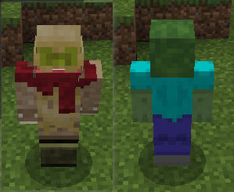

--- 
front: 
hard: Getting Started 
time: minutes 
--- 

# Use API to modify player performance 

The following example CustomEntityMod explains how to dynamically modify player models and actions through the interface. 

## Modify the material 

### Interface 

<a href="../../../../mcdocs/1-ModAPI/Interface/Player/Rendering.html#addplayerrendermaterial" rel="noopenner"> AddPlayerRenderMaterial </a> 

### Example 

```python 
actorRenderComp = self.CreateComponent(entityId, "Minecraft", "actorRender") 
actorRenderComp.AddPlayerRenderMaterial("default", "custom_entity") 
actorRenderComp.RebuildPlayerRender() 
def reset(): 
actorRenderComp.AddPlayerRenderMaterial("default", "entity_alphatest") 
actorRenderComp.RebuildPlayerRender() 
self.ShowMsg("Restore default player rendering material") 
comp = clientApi.CreateComponent(clientApi.GetLevelId(), "Minecraft", "game") 
comp.AddTimer(3.0, reset) 
self.mIsTranform = True 
self.ShowMsg("Switching player rendering material") 
``` 

### Description 

The default rendering material of the player is entity_alphatest. First, change it to the custom material custom_entity, and then restore the default value after a time of 3s. 

### Effect 

 

Left: custom_entity 

Right: entity_alphatest 

## Modify geometry and textures 

### Interface 

<a href="../../../../mcdocs/1-ModAPI/接口/玩家/Rendering.html#addplayergeometry" rel="noopenner"> AddPlayerGeometry </a> 


<a href="../../../../mcdocs/1-ModAPI/Interface/Player/Rendering.html#addplayertexture" rel="noopenner"> AddPlayerTexture </a>

### Example

```python
actorRenderComp = self.CreateComponent(entityId, "Minecraft", "actorRender")
actorRenderComp.AddPlayerGeometry("default", "geometry.zombie.v1.8")
actorRenderComp.AddPlayerTexture("default", "textures/entity/zombie/zombie")
actorRenderComp.RebuildPlayerRender()
def reset():
    actorRenderComp.AddPlayerGeometry("default", "geometry.humanoid.custom")
    actorRenderComp.AddPlayerTexture("default", "textures/entity/steve") actorRenderComp.RebuildPlayerRender() 
self.ShowMsg("Restore default player rendering geometry") 

comp = clientApi.CreateComponent(clientApi.GetLevelId(), "Minecraft", "game") 
comp.AddTimer(3.0, reset) 
``` 

### Description 

The default player rendering geometry is geometry.humanoid.custom 

The default player rendering texture is textures/entity/steve 

First, change the player's default rendering geometry to geometry.zombie.v1.8, the default rendering texture to textures/entity/zombie/zombie, and then set a timer of 3s to restore the default values. 

### Effect 

 

Left: Default 

Right: Modified zombie geometry and texture 

**Note: Modifying geometry will also involve textures and animations. If you only modify the geometry, there will be problems such as the animation not being able to play normally** 

## Modify animation 

### Interface 

<a href="../../../../mcdocs/1-ModAPI/接口/玩家/创作.html#addplayeranimation" rel="noopenner"> AddPlayerAnimation </a> 

### Example - Modify action 

Add action definition 

```json 
"animation.player.custom.move.arms" : { 
"loop" : true,

"bones" : { 
"leftarm" : { 
"rotation" : [ "variable.tcos0 + 30", 0.0, 0.0 ] 
}, 
"rightarm" : { 
"rotation" : [ "-variable.tcos0 + 30", 0.0, 0.0 ] 
} 
} 
} 
``` 

Interface to add animation 

```python 
actorRenderComp = self.CreateComponent(entityId, "Minecraft", "actorRender") 
actorRenderComp.AddPlayerAnimation("move.arms", "animation.player.custom.move.arms") 
``` 

Description: Adjust the original move.arms action, increase the rotation of leftarm and rightarm by 30 respectively, and then use the interface to overwrite the original definition. 

### Example - Controlling Animation 

move.arms and move.legs are the animations of the player's arms and legs swinging respectively. In the original version, these two animations have no restrictions and the rotation angles of the two will be calculated as long as they move. 

Here, we control these two animations through variables defined by a simple queryVariable component. 

```json 
{ 
"move.arms": "query.mod.rn_anim_index > 0" 
}, 
{ 
"move.legs": "query.mod.rn_anim_index > 1" 
} 
``` 

Script control is as follows: 

```python 
comp = self.CreateComponent(entityId, "Minecraft", "queryVariable") 
comp.Register("query.mod.rn_anim_index", 0) 
comp.Set("query.mod.rn_anim_index", 1) 
``` 

## Modify animation controller 

### Interface 

<a href="../../../../mcdocs/1-ModAPI/Interface/Player/Rendering.html#addplayeranimationcontroller" rel="noopenner"> AddPlayerAnimationController </a>


You can use this interface to add a custom animation controller to the player.