--- 
front: 
hard: Getting Started 
time: minutes 
--- 

# Biome Landscape 

## 1. Overview 

Biome Landscape: 

​ Biome: the layout of the biome in the world 

​ Landscape: the ups and downs of the terrain 

This article mainly describes how to modify the biome landscape in the world through json 

If you don’t know what "biome" is, you can read [wiki](https://minecraft-zh.gamepedia.com/%E7%94%9F%E7%89%A9%E7%BE%A4%E7%B3%BB) first. 

About <span id ="jump_to_terrant">Custom Dimension</span>: 

- Each dimension corresponds to an id, the native dimension is 0 for the main world, 1 for the underworld, and 2 for the end. The ID of the old version of custom dimensions starts from 3 and goes up to 20. [The new version of custom dimensions](./1-customdimension.md#jump_to_custom_dimension) can be set voluntarily. 
- The name of a custom dimension is the prefix "dm" plus a numeric id. For example, a dimension with an id of 3 is named "dm3". 

## 2. Terminology 

- Land biome: A biome whose surface is covered by solid blocks. 

- Ocean biome: A biome whose surface is covered by water. The json will have the tag "ocean" (e.g. ocean.json) 

- Deep sea biome: The json will have the tag "deep" (e.g. deep_ocean.json) 

- Basic biome: A biome generated in the first stage of the original version, which will be differentiated into other variants later. For example, the land biome has jungle, forest, desert, plain, etc., and the ocean biome has ocean and deep sea. There will be a key value of "generate_for_climates" under "minecraft:world_generation_rules" in json (for example plains.json) 

- Mountain biome: refers to the biome that can be transformed in the following mountain generation stage. That is, the value of "hills_transformation" in json. 

For example, in plains.json 

```json 
"minecraft:overworld_generation_rules": { 
"hills_transformation": [ 
[ "forest_hills", 1 ], 
[ "forest", 2 ] 
], 
...

}, 
``` 

Then forest and forest_hills are mountain biome variants of plains. 

- Mutated biome: refers to the variant that has a low probability of being transformed in the following mountain generation stage. That is, the value of "mutate_transformation" in json. And there will be a "mutated" tag in the json of the corresponding biome. 

For example, in jungle.json 

```json 
"minecraft:overworld_generation_rules": { 
"mutate_transformation": "jungle_mutated", 
... 
}, 
``` 

Then jungle_mutated is the mutant biome of jungle. 

- River biome: 

Mainly refers to river and frozen_river. When generating a river, ice_plains will become frozen_river, and other biomes will become river. 

- Coastal biome: 

When a land biome is adjacent to an ocean biome, a transitional biome will be generated at the adjacent biome. The json usually contains the tags shore or beach. 


## 3. Biome development template 

[CustomBiomesMod](../../../20-Gameplay Development/13-Module SDK Programming/60-Demo Example.md#CustomBiomesMod) provides a template tool in `tools\template` to generate custom dimensions that meet the minimum requirements of the writing format. The generated custom biome has the following features: 

1. Both transformations are rewritten to correspond to the current dimension biome 
2. The original generate_for_climates field is retained 
3. A label with the same dimension name is added to each biome 
4. For each custom biome, you can find a corresponding original biome without the dimension name prefix (see reference 3) 

Developers can use this as a template when writing their own dimensions. 

Usage: 

1. Open the command line in the `CustomBiomesMod\customBiomesBehaviorPack\tools` directory and enter 

``` 
python .\remake.py [dimension name] 
``` 

​ The dimension name is the name of the custom dimension. For example, to change the biome of the dm6 custom dimension, enter 

```

python .\remake.py dm6 
``` 

​ Then a folder named after the dimension will be generated under the tools folder. 

2. Create a new netease_biomes folder in the behavior pack. 
3. Copy the generated folder to the netease_biomes of your mod 

## 4. Biome file configuration 

Through step 3, we get all the biome configuration files of the custom dimension in the behavior_pack/netease_biomes directory. Here we take dm3 as an example 

(Note: Custom biomes need to have a folder named after the dimension, for example, dm3 biome configuration files are all in the dm3 directory) 

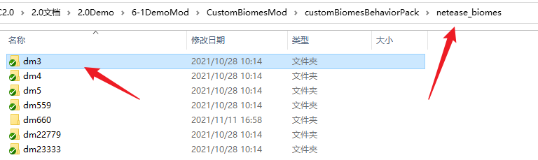 

File structure in the dm3 directory: 

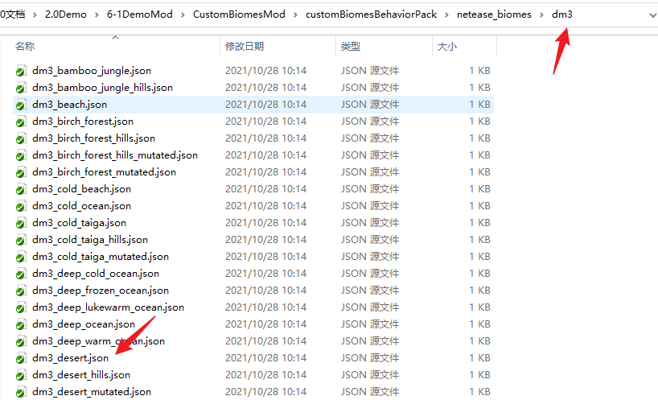 

Next, we need to write the biome that needs to be rewritten in the folder. For each custom biome, name it as the original biome plus the dimension name and an underscore as a prefix. For example, the desert biome in the DM3 dimension is named "dm3_desert". 

For each custom biome, it must inherit a vanilla biome, which is indicated by inherits in the description. The identifier of the new biome needs to be the same as the file name. For example, if the DM3 dimension rewrites the desert biome, you need to write dm3_desert.json: 

### 4-1. Biome file writing format 

```json 
{ 
"format_version": "1.14.0", 
"minecraft:biome": { 
"description": { 
"identifier": "dm3_desert", 
"inherits": "desert" 
}, 
"components": { 
... 
} 
} 
} 
``` 

For each custom dimension, each vanilla biome will have a corresponding custom biome that inherits it. When generating a biome, the process will not change, but the biome inherited from the current dimension will be taken during generation. 

4. Rewrite the properties in the new biome to overwrite the properties of the original biome. 

**Properties that are not rewritten will use the properties of the original biome. ** 

**For biomes that are not rewritten, a biome with the same attributes as the original biome and a dimension name prefix will be automatically generated**


- Currently supported fields in the vanilla biomes json include: 
- minecraft:overworld_height [【minecraft:overworld_height Wiki】](https://minecraft.fandom.com/zh/wiki/%E5%9F%BA%E5%B2%A9%E7%89%88%E7%94%9F%E7%89%A9%E7%BE%A4%E7%B3%BB%E6%96%87%E6%A1%A3) 
- minecraft:overworld_surface [【minecraft:overworld_surface Wiki】](https://minecraft.fandom.com/zh/wiki/%E5%9F%BA%E5%B2%A9%E7%89%88%E7%94%9F%E7%89%A9%E7%BE%A4%E7%B3%BB%E6%96%87%E6%A1%A3) 
- Blocks with [block entity](https://minecraft-zh.gamepedia.com/%E6%96%B9%E5%9D%97%E5%AE%9E%E4%BD%93%E5%80%BC) are not supported, nor are blocks that occupy multiple positions such as doors and beds 
- Blocks with auxvalues can be set using [nbt](https://minecraft.fandom.com/zh/wiki/NBT%E6%A0%BC%E5%BC%8F). Currently only special sand and special dirt types are supported. Refer to the vanilla biome's `mesa_plateau_stone` and `savanna_mutated` 
- minecraft:world_generation_rules can control the biome's mutation and generation ratio, which will be discussed in detail in the [Vanilla Biome Generation Process](2-Biomorphology.md#7.Vanilla Biome Generation Process) below 
- Custom tags 

Add new tags to new biomes, which can be used for functions such as creature generation. 

In the "[Biomorphology Development Template](2-Biomorphology.md#3.Biomorphology Development Template)", a tag with the same name as the dimension is added to all custom dimensions by default for easy development. 

Developers can add other tags as needed. 
<span id="jump_to_no_spawn_dragon"></span> 

```json 
{ 
"format_version": "1.14.0", 
"minecraft:biome": { 
"description": { 
"identifier": "dm4_ice_plains", 
"inherits": "ice_plains" 
}, 
"components": { 
"dm4": {}, //Tags automatically added by biome development template 
"my_dm4_tag": {} //Add other custom tags 
//"netease:no_spawn_end_dragon":{} //Do not generate the Ender Dragon and related combat logic, only the End (including custom End) dimension is available 
} 
} 
} 
``` 
Note: Since the Ender Dragon creature itself is saved, once you enter the End (including custom End) dimension and create an Ender Dragon, adding the `netease:no_spawn_end_dragon` component later will not delete the Ender Dragon, only some related logic will be blocked. 


### 4-2. Configure the client display part of the biome 

Create a new `biomes_client.json` in the root directory of the resource package and configure the biome id you want to customize. (Note: If a custom biome is not configured, there will be a default configuration. This default configuration is not the configuration of the parent biome, but a color similar to the general main world) 

```json 
{ 
"biomes": { 
"dm22779_hell": { 
"water_surface_color": "#905957",//Water surface color 
"water_fog_color": "#905957",//Underwater fog effect color 
"fog_color": "#4B0082"//Air fog effect color 
//"water_surface_transparency": 1.0//Underwater opacity 
//"water_fog_distance": 60//Underwater visible distance 
},

		"dm559_the_end": {
			"water_surface_color": "#62529e",
			"water_fog_color": "#62529e",
			"fog_color": "#0B080C"
		}
	}
}

```


## 5. Custom biome height (NetEase version) 

The original biome can only use components such as "minecraft:surface_parameters", "minecraft:mesa_surface", "minecraft:swamp_surface", etc., and fine-tune the generation of the biome surface based on the original template. It is not possible to flexibly control the type of blocks in a block, so in version 2.3, we introduced custom height to solve the problem of the original hardcode biome height 

**Note:** 

**1. The generation process of MC terrain: biome->height->feature, so the height is controlled before the feature, and the custom height cannot affect the feature generation** 

**2. At this stage, the custom dimension height range is [0, 256]** 

### 5-1. Introduction to custom height 

The custom height generation process can be understood as a pipeline. Each stage generates the final height layout by configuring different height control nodes. The input of the current stage is the output of the previous stage. By combining different types of height nodes, the height of the entire block can be controlled more flexibly. For example, the sin function is used to generate a rolling surface, as shown below: (Here, the biome source is used to set all dimensions to a biome) 

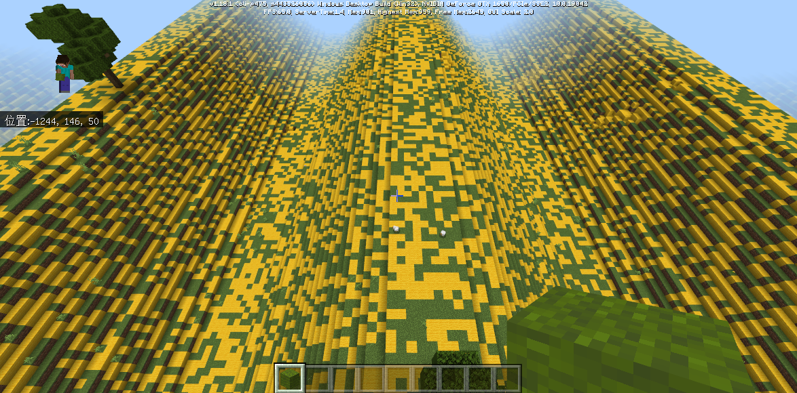 

### 5-2. Custom height writing format 

1. According to [Biome Development Steps](2-Biome Landscape.md#4. Biome File Configuration), create a custom biome file, which will not be repeated here 

2. Add the "netease:overworld_surface" component under "components" under the custom biome file 

3. The specific configuration is as follows: 

```json 
{ 
"format_version": "1.14.0", 
"minecraft:biome": { 
"description": { 
"identifier": "dm111_plains", 
"inherits": "plains" 
}, 
"components": { 
//Custom height component

"netease:overworld_surface": { 
"adjustments": [ 
{ 
"type": "fill", // Required: Height control node type. Currently only supports: fill node (fill), move node (move) 
"min_height": 90, // Required: The minimum height selected, supports molang strings. If the minimum height of the custom dimension is exceeded, an assertion window will pop up when entering the game 
"max_height": "110 + (math.sin(variable.worldx * 180 / math.pi / 10) * 10)", // Required: The maximum height selected, supports molang strings. If the maximum height of the custom dimension is exceeded, an assertion window will pop up when entering the game (because sin in mc is calculated using radians, so here we * 180 / π circumference) 
"pool": [ // fill type required: fill block pool, fill the selected area according to the weight 
{ 
"fill_block": "minecraft:grass", // "fill_block" is the name of the filled block 
"weight": 10 // "weight" is the generation weight of the filled block 
}, 
{ 
"fill_block": { 
"name": "minecraft:wool", 
"states": { //Support block additional value 
"color": "yellow" 
} 
}, 
"weight": 10 
} 
] 
}, 
{ 
//Other node types 
} 
} 
} 
} 
``` 

Custom height control can be understood as selecting a height range through "min_height" and "max_height" in each **height control node**, and then filling, moving, etc. 

### 5-3. Height control node type 

#### 1.fill 

Introduction: Use min_height and max_height to select a height range, and use the block type in the pool to fill it 

Sample code (fill the part with a height of 90 <= y <= 95 at a ratio of 10 (glass): 1 (gold block)): 

```json 
{ 
"type": "fill", // Required: height control node type, fill node (fill) 
"min_height": 90, // Required: minimum height selected, supports molang string. If the minimum height of the custom dimension is exceeded, an assertion window will pop up when entering the game. 
"max_height": 95, // Required: The maximum height selected, supports molang strings. If the maximum height of the custom dimension is exceeded, an assertion window will pop up when entering the game. 
"pool": [ // fill type is required: the block pool to be filled, fill the selected area according to the weight. 
{ 
"fill_block": "minecraft:glass", // "fill_block" is the name of the block to be filled, supports additional values

"weight": 10 // "weight" is the generation weight of the filled block 
}, 
{ 
"fill_block": "minecraft:gold_block", // "fill_block" is the name of the filled block, supports additional values 
"weight": 1 // "weight" is the generation weight of the filled block 
} 
] 
} 
``` 

In-game effect: 

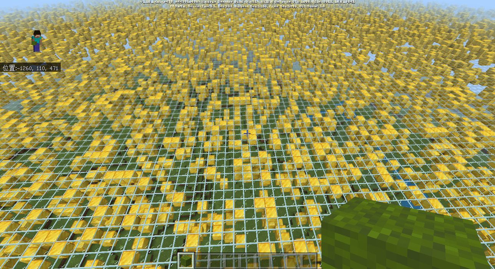 

**Note: The block type in the pool cannot be filled in with special block types such as "bed", "enchantment table", "custom block entity appearance", etc.** 

The following variable attributes can be used in "min_height" and "max_height": 

| Variable | Explanation | 
| --------------- | --------------------------- | 
| variable.worldx | The actual coordinate of the x-axis of the actual position | 
| variable.worldz | Actual coordinate of the z axis of the actual position | 
| variable.height | Y coordinate of the highest non-air block of the actual position | 

#### 2.move 

Introduction: Use min_height and max_height to select a height range, and use offset to move the selected area up and down 

Sample code (select [highest non-air block - 3, highest non-air block] range and move it up 5 grids): 

```json 
{ 
"type": "move", // Required: height control node type, move node (move) 
"min_height": "variable.height - 3", // Required: minimum height selected, supports molang string. If it exceeds the minimum height of the custom dimension, an assertion window will pop up when entering the game 
"max_height": "variable.height", // Required: maximum height selected, supports molang string. If the maximum height of the custom dimension is exceeded, an assertion window will pop up when entering the game 
"move_offset": 5 // move type required: up and down movement offset (positive integer means upward movement, negative integer means downward movement), molang statements are not supported yet 
} 
``` 

Underground effect map: 

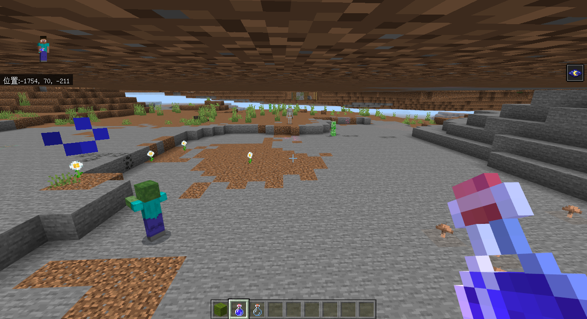 

Above ground effect map: 

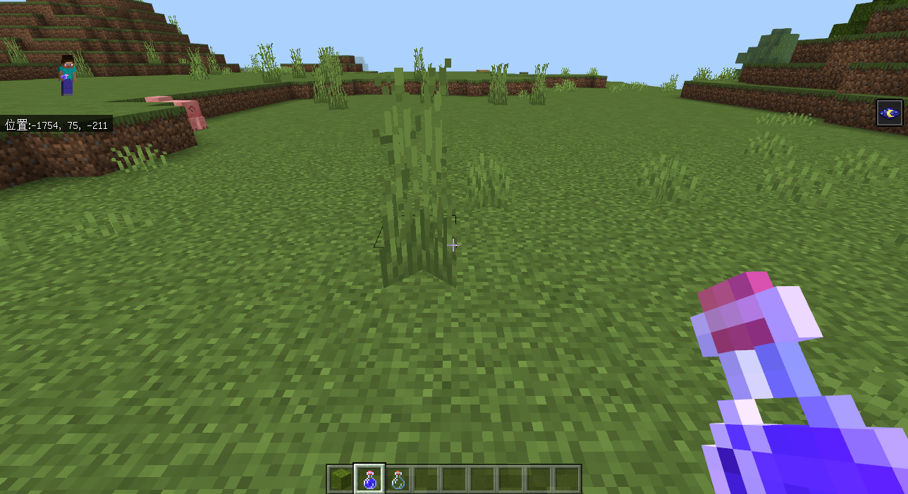 

The following variable attributes can be used in "min_height" and "max_height":


| Variable | Explanation | 
| --------------- | --------------------------- | 
| variable.worldx | Actual x-axis coordinate of actual position | 
| variable.worldz | Actual z-axis coordinate of actual position | 
| variable.height | Actual highest non-air block y-coordinate | 

#### 3.replace 

Introduction: Use min_height and max_height to select a height range and replace some block types with other block types 

Sample code: (Select [highest non-air block - 3, highest non-air block] range, replace 50% of air and grass blocks with black wool and gold blocks) 

```json 
{ 
"type": "replace", // Required: height control node type, replace node (replace) 
"min_height": "variable.height - 3", // Required: minimum height selected, supports molang string. If the minimum height of the custom dimension is exceeded, an assertion window will pop up when entering the game 
"max_height": "variable.height", // Required: The maximum height selected, supports molang strings. If the maximum height of the custom dimension is exceeded, an assertion window will pop up when entering the game 
"percentage" : 0.5, //repalce type required, replacement ratio, range (0, 1], represents the replacement ratio of the total number of blocks in the replaced pool 
"from_block_pool":[ //replace type required, replaced pool, block type supports additional value 
"minecraft:air", 
"minecraft:grass" 
], 
"to_block_pool":[ //replace type required, according to the weight, the selected area is replaced proportionally 
{ 
"fill_block": { //"fill_block" replaced block name, support additional value 
"name": "minecraft:wool", 
"states": { 
"color": "black" 
} 
}, 
"weight": 10 // "weight" replaced block generation weight 
}, 
{ 
"fill_block": "minecraft:gold_block", //"fill_block" replaces the block name, supports additional values 
"weight": 10 // "weight" replaces the block generation weight 
} 
] 

} 
``` 

Before replacement: 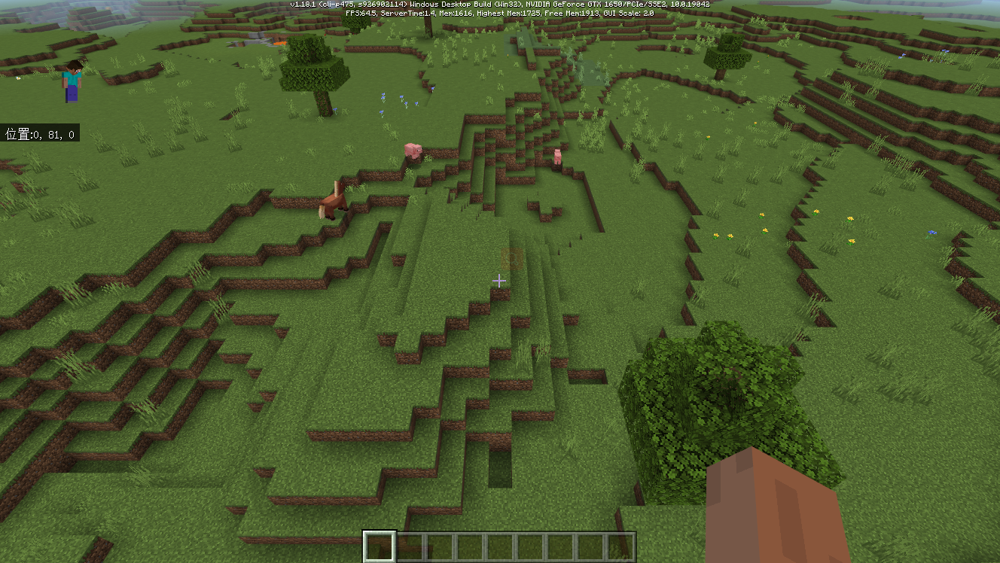 

After replacement: 

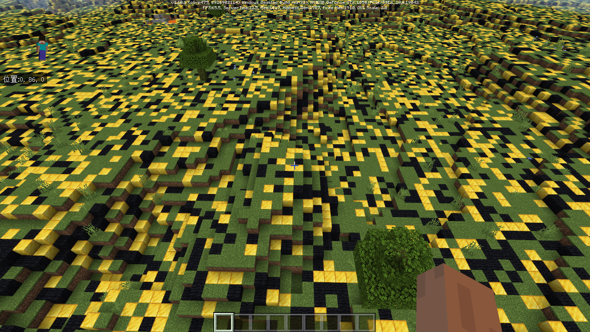 


## 6. Introduction to biome generation 

Biome generation controls the layout of the entire biome in the MC world 

At present, the biome generation process is divided into [original biome generation process] (2-biome landforms.md#7. Original biome generation process) and [custom biome generation process] (2-biome landforms.md#8. Custom biome generation process (NetEase version)). The two are mutually exclusive. If the custom biome generation process is used, the original biome process is closed by default 

## 7. Original biome generation process 

Currently, the pipeline for biome generation in Bedrock Edition is still in the hard-coded stage. In order to give developers a basic idea of configuring custom biomes, we will first briefly describe the various steps of biome generation. If you are interested or want to have a deeper understanding, you can refer to the source code of the Java version and some analysis on the Internet 

1. Divide the map into oceans and land, and determine the temperature of different areas. 

Temperature types include: 

` frozen, cold, medium, lukewarm, warm ` 

2. Change ocean to ocean, and then change ocean to deep_ocean 

3. Differentiate land into basic land biomes based on temperature 

4. Some hardcoded spawns: 

- Add mushroom island biomes 

So mushroom_island and mushroom_island_shore will spawn in all cases 

- Mutate some rainforest biomes to bamboo forests 

So if jungle is allowed to spawn, bamboo_jungle will also spawn 

- Mutate some plains to sunflower plains 

So if plains is allowed to spawn, sunflower_plains will also spawn 

5. Perform mountain and mutation mutations (according to hills_transformation and mutate_transformation configured in json) 

6. Perform river mutation (hardcoded) 

7. Perform coast mutation (hardcoded) 

8. Differentiate the ocean into basic ocean biomes based on temperature

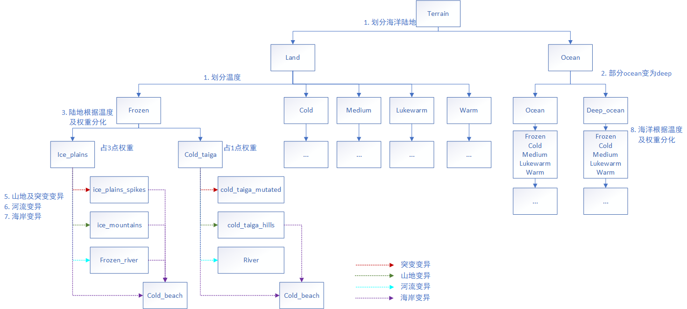

We can configure the layout of the original biome (mutation, occurrence probability) through "minecraft:overworld_generation_rules" in the biome configuration file


dm3_desert.json: Configuration is as follows: 

```json 
{ 
"format_version": "1.14.0", 
"minecraft:biome": { 
"description": { 
"identifier": "dm3_desert", 
"inherits": "desert" 
}, 
"components": { 
"minecraft:overworld_generation_rules": { 
"hills_transformation": "dm3_desert_hills", //Keep the original mutation logic 
"mutate_transformation": "dm3_desert_mutated", //Keep the original mutation logic 
"generate_for_climates": [ 
["warm", 3] //The weight is 3, then at warm temperature, the probability of generation is (3/the sum of warm weights) 
] 
}, 
"dm3": {} 
} 
} 
``` 

Note: 

- All hills_transformation, mutate_transformation, values must be the biome of the current dimension. 

- If the original biome has these two transformations, they need to be rewritten to the biome of the current dimension. Therefore, if there is an original biome with these two transformations that has not been rewritten, it is undefined behavior, which will cause some places to behave unexpectedly, such as using the GetBiomeName interface to get the name incorrectly. 

- For example, in the original desert biome, hills_transformation is desert_hills, and mutate_transformation is desert_mutated. In the custom dimension, the configuration must be the same as the above dm3_desert.json 

If you want to delete the hills_transformation, mutate_transformation, and generate_for_climates properties of the biome, you can refer to the following method: 

```json 
{ 
"format_version": "1.14.0", 
"minecraft:biome": { 
"description": { 
"identifier": "dm4_ice_plains", 
"inherits": "ice_plains" 
}, 
"components": { 
"minecraft:overworld_generation_rules": { 
"hills_transformation": "dm4_ice_plains", //If set to yourself, it will not mutate into other biomes 
"mutate_transformation": "dm4_ice_plains", //If set to itself, it will not mutate into other biomes 
"generate_for_climates": [ 
["frozen", 0] //If the weight is set to 0, it will not be generated 
]

} 
} 
} 
} 
``` 

Note that the modified dimensions have three types: land (without ocean tag), ocean (with ocean tag, but without deep tag), and deep sea (with both ocean and deep tags). Each type of five temperatures must have at least 1 weight. 

## 8. Custom biome generation process (NetEase version) 

The original biome can only change the mutation of the biome in "minecraft:overworld_generation_rules" and divide the probability of biome appearance according to temperature. It is impossible to control the layout of the biome more flexibly. Therefore, in version 2.0, we introduced a custom biome source to solve the problem of the original hardcode biome layout. 

**Note: After using the custom biome generation process, the original fortress cannot be generated** 

### 8-1. What is the biome source? 

Biome sources define the layout of biomes in the MC world. Biome sources do not affect the temperature, height, humidity, and features of biomes. They only affect the layout of dimension biomes. 

### 8-2. Introduction to biome source generation 

The generation process of MC biome sources can be understood as a pipeline. Each stage generates the final biome layout by configuring different biome source nodes. The input of the current stage is the output of the previous stage. By combining different biome source nodes, the layout of the entire biome can be controlled more flexibly, such as making the biome into a chessboard layout, as shown below: 

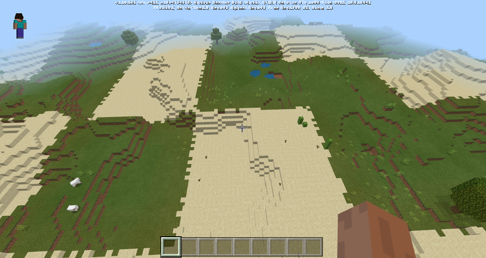 

​ 【Figure】1 

### 8-3. Biome source writing format 

1. Create a netease_dimension folder in the behavior pack 

2. Add a dmXXX.json file, where XXX Refers to the dimension id you want to configure 

3. If you want to generate [Figure 1](2-Biome Landscape.md#Biome Source Generation Introduction) chessboard biome, then the biome source configuration process is as follows: 

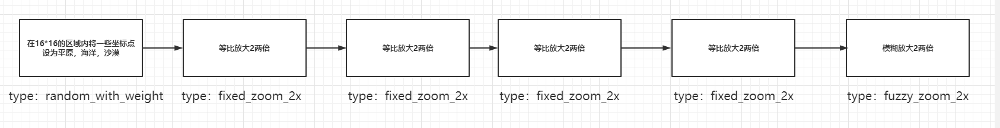 

4. The specific configuration is as follows: 

```json 
{

"format_version": "1.14.0", 
"netease:dimension_info": { 
"components": { 
"netease:dimension_type": "minecraft:overworld", //Dimension type, currently custom biome sources only support minecraft:overworld 
"netease:biome_source":[ //Biome source configuration, this parameter means using custom biome layout, netease:biome_source is an array, each element in the array represents a stage, each stage will have a different type, through different types of mutual cooperation, to jointly create a variety of biomes 
{ 
"type":"random_with_weight", //Fill some coordinate points in the 16*16 area according to the elements in the pool, weight can change the proportion of the biome 
"pool":[ 
{"biome_type":"dm660_plains", "weight": 1}, 
{"biome_type":"dm660_desert", "weight": 1} 
] 
}, 
{ 
"type":"fixed_zoom_2x" //Zoom the biome layout by 2 times 
}, 
{ 
"type":"fixed_zoom_2x" //Zoom the biome layout by 2 times 
}, 
{ 
"type":"fixed_zoom_2x" //Zoom the biome layout by 2 times 
}, 
{ 
"type":"fixed_zoom_2x" //Zoom the biome layout by 2 times 
}, 
{ 
"type":"fuzzy_zoom_2x" //Fuzzy zoom the biome layout by 2 times 
} 
] 
} 
} 
} 
``` 

### 8-4. Biome source node type 

#### 1.random_with_weight 

Introduction: Fill the 16*16 area according to the elements in the pool. For each coordinate point in the area, a random operation will be performed. Weight can change the probability of the biome appearing. The following assumes that only plains and deserts are filled in the pool. 

**Note: Biomes in the End and Hell dimensions are not supported yet** 

Sample code: 

```json 
{ 
"type":"random_with_weight", //Fill some coordinate points in the 16*16 area according to the elements in the pool. Weight can change the proportion of the biome appearing. 
"pool":[ 
{"biome_type":"dm660_plains", "weight": 1}, //biome_type is the biome type of this dimension (other dimension biomes cannot be filled in). Weight represents the weight of the biome appearing. 
{"biome_type":"dm660_desert", "weight": 1}, 
]

} 
``` 

Coordinate and biome layout diagram (without any zoom): 

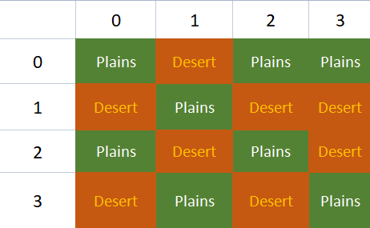 

In-game effect: 

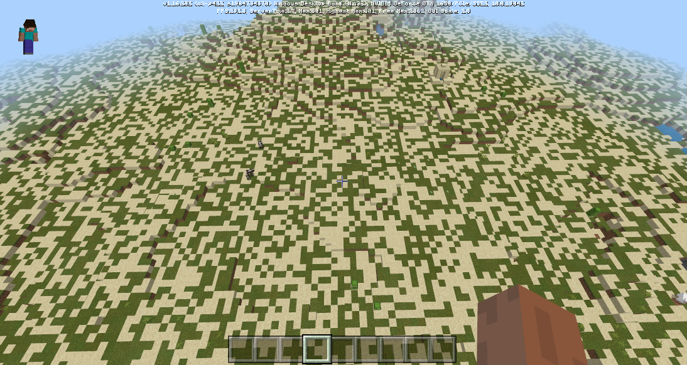 

#### 2.fixed_zoom_2x 

Introduction: Enlarge the area by two times. If there are 2×2 areas that are all plains, then after enlarging the area by 2 times, the 4×4 area will all become plains. 

Sample code: 

```json 
{//Zoom in twice here 
"type":"fixed_zoom_2x" 
}, 
{ 
"type":"fixed_zoom_2x" 
} 
``` 

Coordinate and biome layout diagram: 

Before zooming in: 

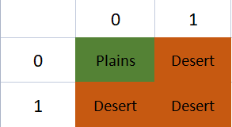 

After zooming in: 

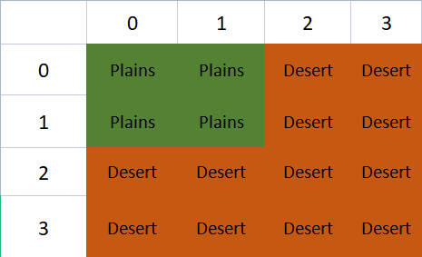 

In-game effect: 

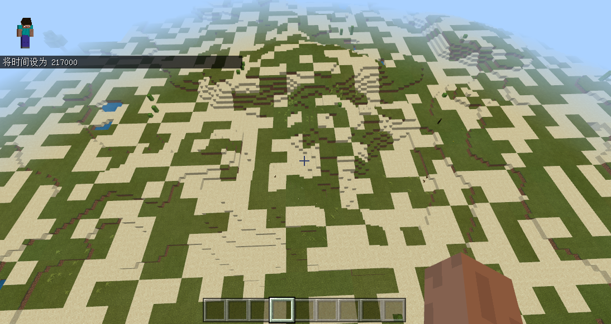 

#### 3.fuzzy_zoom_2x 

Introduction: Fuzzy zoom the biome layout by twice 

Sample code: 

```json 
{ 
"type":"fuzzy_zoom_2x" 
},

{ 
"type":"fuzzy_zoom_2x" 
} 
``` 

Coordinate and biome layout diagram: 

Before zooming in: 

 

After zooming in (there will be a certain degree of randomness): 

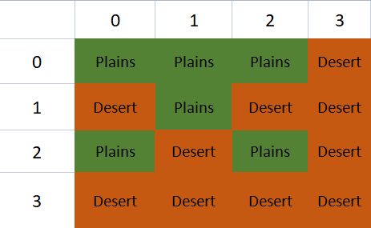 

In-game effect: 

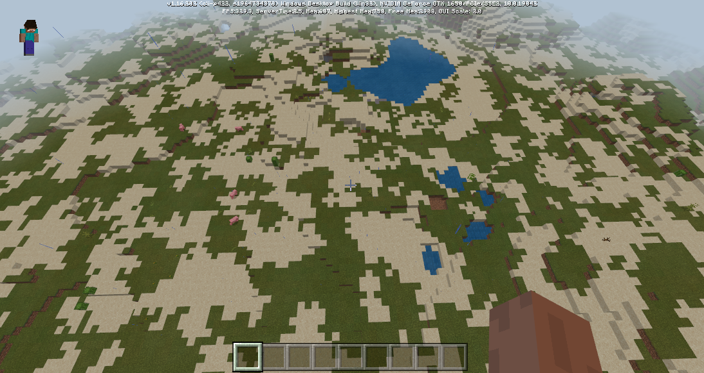 

#### 4. vanilla_zoom_2x 

Introduction: MC original zoom logic. If you want to have the same zoom algorithm as the original map, you can use vanilla_zoom_2x. The logic of the original zoom is a bit similar to fuzzy zoom, but many optimization operations have been done. For example, if the left side (←), top side (↑), and top left (↖) of a point are the same biome, then the biome of this point will be assimilated to be consistent with them. 

Sample code: 

```json 
{ 
"type":"vanilla_zoom_2x" 
}, 
{ 
"type":"vanilla_zoom_2x" 
} 
``` 

Coordinate and biome layout diagram: 

Before zooming in: 

 

After zooming in (based on the original random zooming in, more processing was done on the biome, for example, the yellow part should be a desert, but it was assimilated into a plain): 

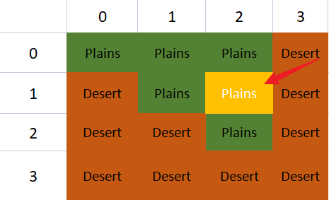 

In-game effect: 

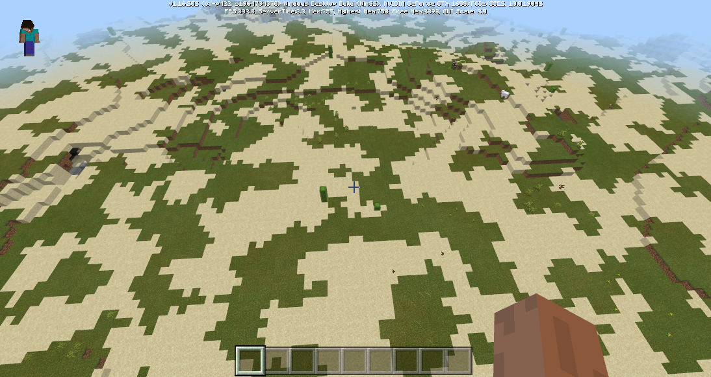 

#### 5.replace 


Introduction: Replace part (percentage) of a biome (from_biome) with another biome (to_biome) 

Sample code: 

```json 
{ 
"type":"replace", 
"from_biome":"dm660_plains", 
"to_biome":"dm660_ice_plains", 
"percentage":0.1 //Randomly replace plains with tundra, the replacement ratio is 10%, the percentage value range is [0,1] 
} 
``` 

Coordinate and biome layout diagram: 

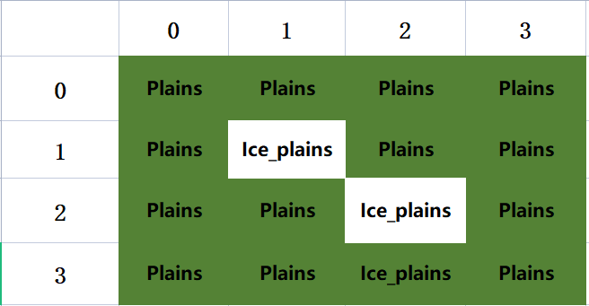 

**Note: The percentage value range is [0, 1]** 

In-game effects: 

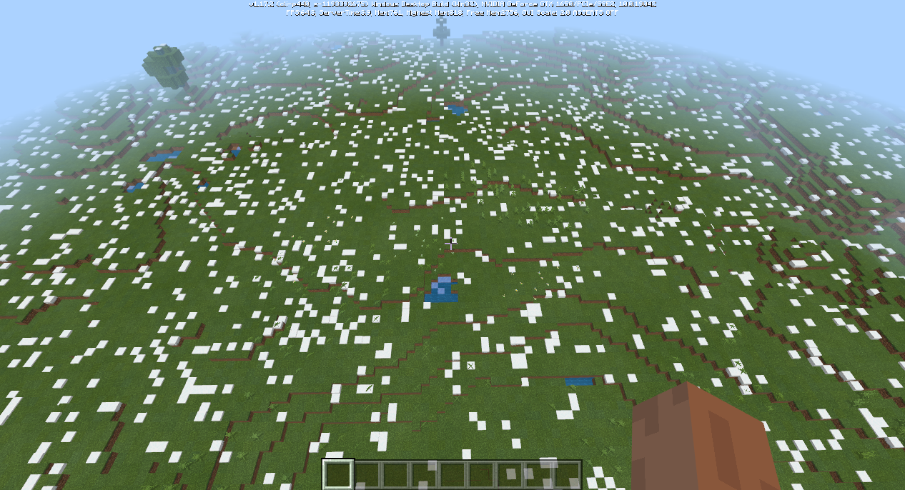 

#### 6.transition 

Introduction: When biome A and biome B are adjacent, a transition biome is generated between them, such as generating an ocean between a desert and a plain 

Sample code: 

```json 
{ 
//Generate an ocean transition biome between a desert and a plain 
"type":"transition", 
"biome_a":"dm660_plains", 
"biome_b":"dm660_desert", 
"biome_transition":"dm660_ocean" 
} 
``` 

Coordinate and biome layout diagram: 

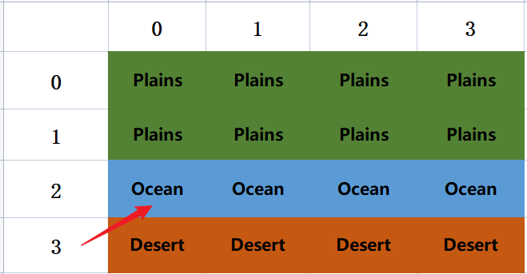 

In-game effect (the effect in the picture has been enlarged): 

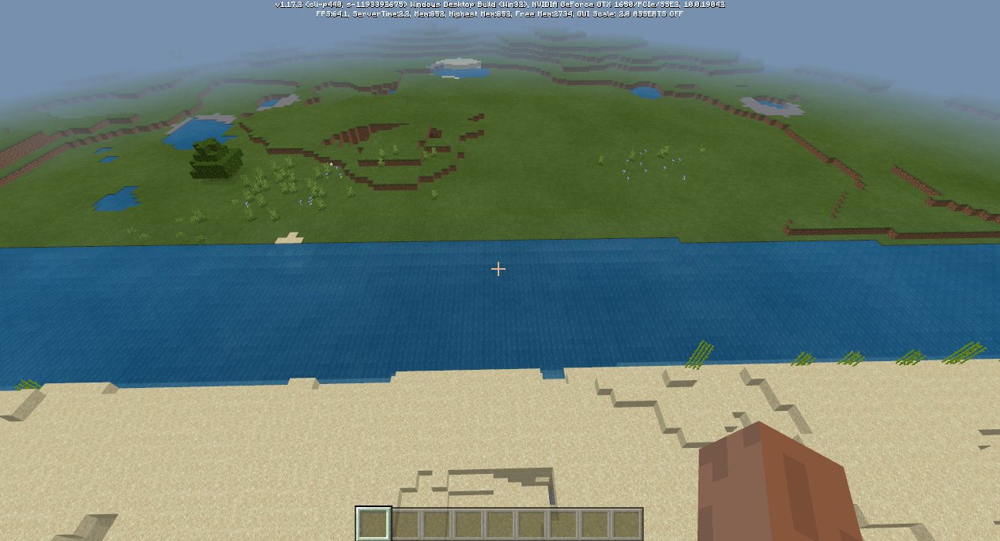 

#### 7.associated 

Introduction: Generate associated biomes (associated_biomes) around the core biome (core_biome)


Sample code: 

```json 
{ 
//The positions [0,1],[-1,0],[1,0] of the desert biome will be associated with the ice biome 
"type":"associated", 
"core_biome":"dm660_desert", 
"associated_biomes":[ 
{"biome_type":"dm660_ice_plains", "relative_pos":[0, 1]}, //relative_pos:[x,z], x and z are of type int 
{"biome_type":"dm660_ice_plains", "relative_pos":[-1, 0]}, 
{"biome_type":"dm660_ice_plains", "relative_pos":[1, 0]} 
] 
} 
``` 

**Note:** 

**1. The value range of x and z in relative_pos is [-1,1]. If you fill in x<-1, x>1 or z<-1, z>1, you will get the wrong value and cause confusion in biome generation** 

**2. The type of x and z in relative_pos is int** 

Coordinate and biome layout diagram: 

Before companion biome generation: 

 

After the companion biome is generated: 

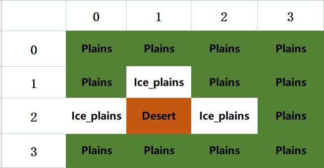 

In-game effect (the effect in the picture has been enlarged): 

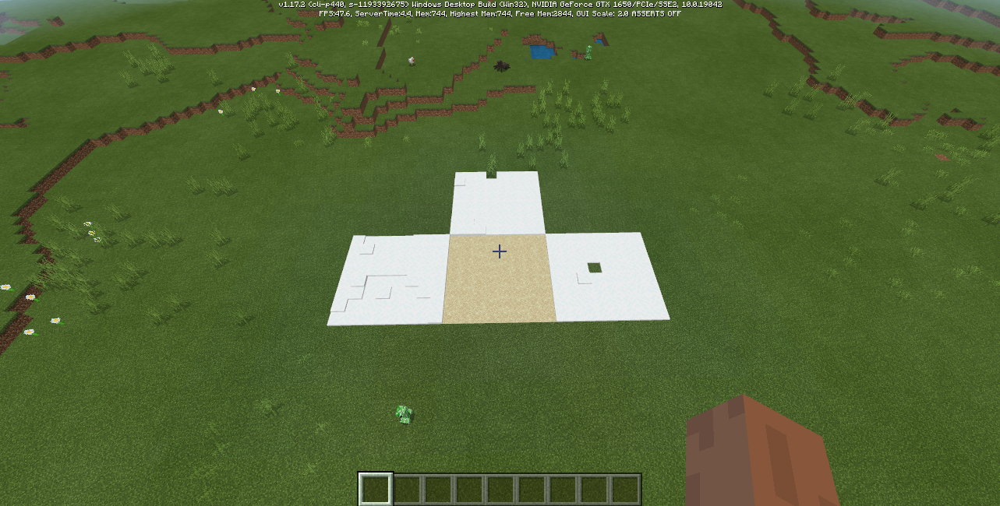 

#### 8.gen_key_biomes 

Introduction: Used for key biomes configuration. In a fixed length (len_x) and width (len_z), randomly select a point to place the key biomes. You can set the minimum distance from this point to the edge (border_x, border_z) 

Sample code: 

```json 
{ 
//In the range of 5*5 in length and width, in an area at least 1 away from the edge, randomly select a point to place the biomes in the pool 
"type":"gen_key_biomes", 
"len_x":5, //x-axis length range, len_x >= 1 
"len_z":5, //z-axis length range, len_z >= 1 
"border_x":1, //The length of the key biomes from the x-axis edge, 0 <= border_x < len_x / 2 
"border_z":1, //The length of the key biomes from the z-axis edge, 0 <= border_z < len_z / 2

"pool":[ //Key biome random pool 
{"biome_type":"dm660_ice_plains", "weight": 1}, 
{"biome_type":"dm660_desert", "weight": 1} 
] 
} 
``` 

**Note:** 

**1.len_x, len_z must be integers >= 1, otherwise the key biome cannot be generated** 

**2.border_x, border_z must be non-negative integers and must meet the following conditions** 

​ **0 <= border_x < len_x / 2** 

​ **0 <= border_z < len_z / 2** 

Biome layout diagram: 

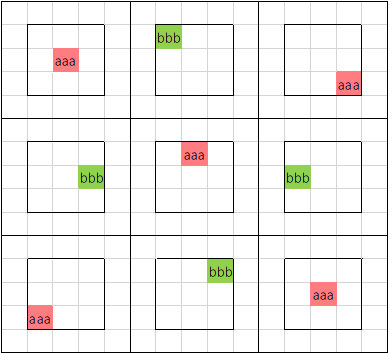 

In-game effect: 

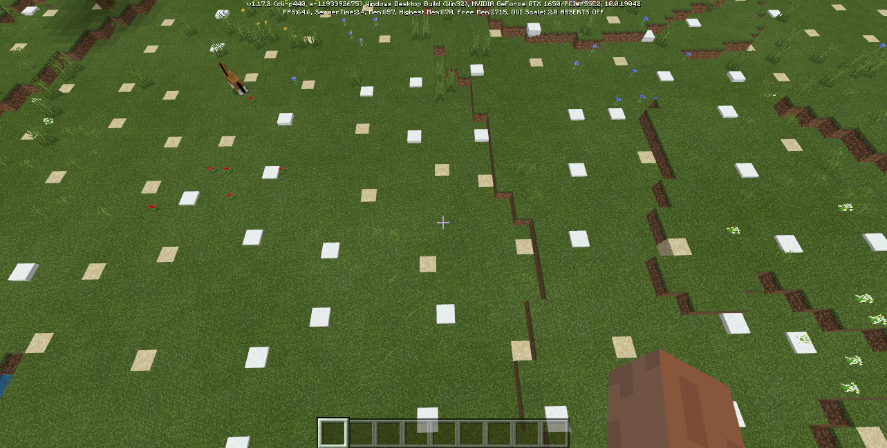 

#### 9.condition 

Introduction: Implement biome source control based on molang statements 

The implementation principle of the biome source node type is to determine what biome the current coordinates (variable.worldx, variable.worldz) are based on **coordinates** and **surrounding biome types** (query.is_neiborhood_at). In type:condition, developers can use these two variables to create a more incredible world! 

**Note: Try not to make the molang statement in condition too complicated. Using too many molang statements of this type or too complicated ones may cause performance problems** 

1. First, we create a biome source type that is a desert biome when the absolute values ​​of the x and z coordinates are both greater than 15, otherwise it is a plain biome 

Sample code: 

```json 
{ 
//When the absolute values ​​of the x and z coordinates are both greater than 15, it is a desert biome, otherwise it is a plain 
"type":"condition", 
"condition":"(math.abs(variable.worldx) > 15) && (math.abs(variable.worldz) > 15) ? 0:1", //Judge the condition and return a subscript pointing to the corresponding biome in the pool 
"pool":[ 
"dm660_desert", 
"dm660_plains" 
] 
} 
``` 

In-game effect display:


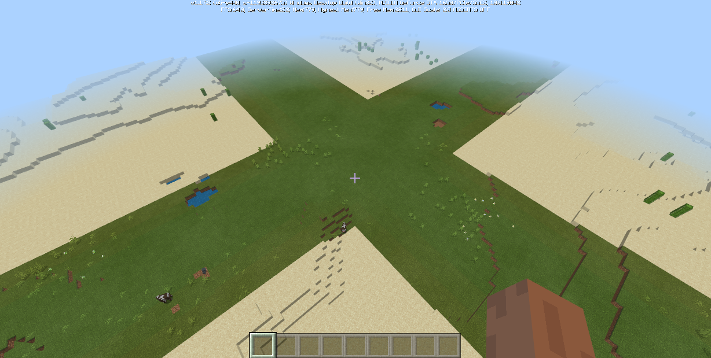 

2. Based on the above picture, we use query.get_neighborhood_is_biome(0, 0, 1) to determine whether the currently rendered node is a plain. If so, turn it into an ocean. 

Sample code: 

```json 
{ 
//When the absolute values of the x and z coordinates are both greater than 15, it is a desert biome, otherwise it is a plain 
"type":"condition", 
"condition":"(math.abs(variable.worldx) > 15) && (math.abs(variable.worldz) > 15) ? 0:1", //Judge the condition and return a subscript pointing to the corresponding biome in the pool 
"pool":[ 
"dm660_desert", 
"dm660_plains" 
] 
}, 
{ 
"type":"condition", 
"condition":"query.get_neighborhood_is_biome(0, 0, 1) ? 0:-1", //query.get_neighborhood_is_biome(0, 0, 1) is used to determine whether the coordinate point to be rendered is a plain; -1 means that the biome source node type remains unchanged 
"pool":[ 
"dm660_ocean" 
] 
} 
``` 

Effect in the game: 

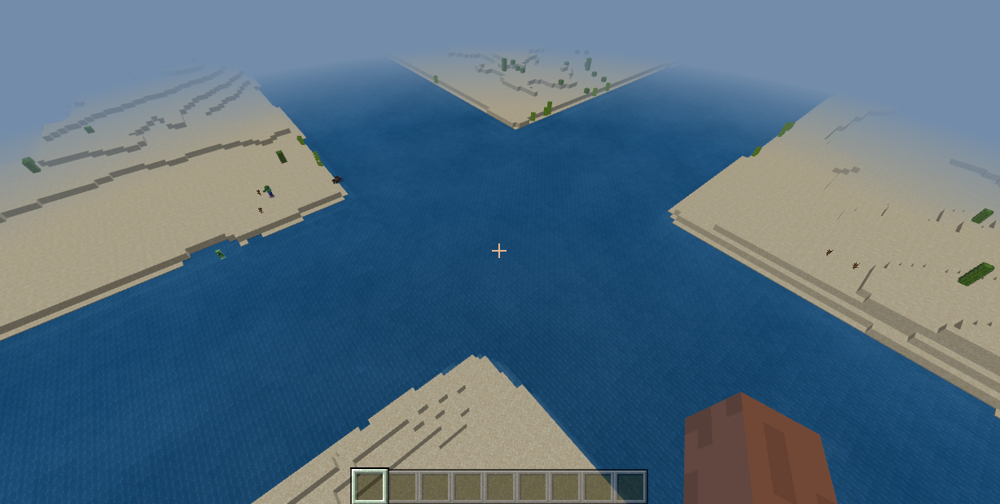 

**Note:** 

**The biome source node is executed when the biome is initially laid out, so the query.get_is_biome field cannot be used to obtain the biome type based on the coordinates** 

The following variable attributes can be used in condition: 

| Variable | Explanation | 
| ---------------- | ----------------------- | 
| variable.worldx | The actual x-coordinate of the actual position | 
| variable.worldz | The actual z-coordinate of the actual position | 
| variable.originx | The minimum x-coordinate of the block | 
| variable.originz | The minimum z-coordinate of the block | 

query.get_neighborhood_is_biome 

- Description 

Determine whether the target biome is near the current rendering coordinates 

- Parameters


| Parameter name | Parameter type | Description | 
| ------ | -------- | ------------------------------------------------------------ | 
| x | int | The x-axis offset of the nearby node relative to the current node, the value is [-1,1] | 
| z | int | The z-axis offset of the nearby node relative to the current node, the value is [-1,1] | 
| biomes | Args... | The enumeration value int of the biome, refer to <a href="../../../../mcdocs/1-ModAPI/Enumeration Value/BiomeType.html">BiomeType</a> in the minecraft enumeration value document | 

**Note: The x and z parameters of query.get_neighborhood_is_biome should not exceed the range of [-1,1], otherwise there will be a misjudgment problem** 

In the example [CustomBiomesMod] (../../../20-Gameplay Development/13-Module SDK Programming/60-Demo Example.md#CustomBiomesMod), three custom dimensions are defined. The python script implements the function of teleporting the player to the corresponding dimension when he enters the dimension name. 

- dm3 

The dimensions generated using the template tool without any modification are exactly the same as the main world. 

- dm4 

Only ice_plains and frozen_ocean dimensions will be generated. 

1. Set the generate_for_climates attribute of dm4_ice_plains and dm4_frozen_ocean to have a generation weight of 1 for all temperatures, and then change the weights of all other biomes to 0. 

This will only generate these two biomes when generating the base biome. 

2. Set the hills_transformation and mutate_transformation of dm4_ice_plains to itself. Since frozen_ocean does not have these two properties, you do not need to set them. 

This will not generate other biomes when performing mountain mutation and mutation mutation 

Note: 

Because of some hard-coded generation processes, in addition to ice_plains and frozen_ocean, mushroom_island, mushroom_island_shore (coast variant of mushroom island), cold_beach (coast variant of ice plains), frozen_river (river variant of ice plains), and river (river variant of cold_beach) will also be generated. Therefore, there will be a total of 7 biomes generated in this dimension. 

- dm5 

Only ice_plains and frozen_ocean will be generated, and the ground is made of ore blocks. 

1. Refer to the first and second steps of dm4 

2. Modify the block composition of the 7 generated biomes (see the note of dm4). For example, in dm5_ice_plains 

```json 
"minecraft:surface_parameters": { 
"sea_floor_depth": 7, 
"sea_floor_material": "minecraft:emerald_block", 
"foundation_material": "minecraft:iron_block", 
"mid_material": "minecraft:gold_block", 
"top_material": "minecraft:diamond_block", 
"sea_material": "minecraft:water" 
}

``` 

The surface of the biome is diamond blocks, the middle is gold blocks, and the bottom is iron blocks. 

- dm660 

Defined a chessboard biome using a custom biome source 

- dm770 

Used a custom biome to simulate the layout of the "Twilight Forest" biome 

- dm111 

Use the **Fill node** in the custom height to fill the part with a height of 90 <= y <= 95 at a ratio of 10 (glass): 1 (gold block), and use the **Replace node** to select the [highest non-air block - 3, highest non-air block] interval, replace 50% of the grass blocks and air with black wool and end stone, and then use the **Move node** to select the [highest non-air block - 3, highest non-air block] interval and move it up 5 squares 

## References 

1. There are more custom biome json formats and instructions on the [official wiki](https://minecraft.gamepedia.com/Bedrock_Edition_beta_biomes_documentation): 
2. The json of the original biome can be found in the `data/definitions/biomes` directory of the "Mod PC Development Kit" 

## Notes 

1. Custom dimensions defined by this method cannot be used with the "MirrorDimension" interface 

2. When a mod with a custom biome is uninstalled, the explored areas of the map will remain in the custom form, but the newly explored areas after uninstallation will return to the original biome. 

If the mod is reloaded on the archive, the newly explored areas after uninstallation will remain in the form of the original biome. 

3. If this is not the first time you use a custom biome, you need to pay attention to the format_version in the json when modifying an old mod. 

Starting from NetEase version 1.21, the format_version of the biome has been upgraded from 1.13.0 to 1.14.0, and the structure of json has changed as follows: 

- minecraft:overworld_surface is renamed to minecraft:surface_parameters 

- The properties in minecraft:surface_parameters, minecraft:swamp_surface, minecraft:mesa_surface, and minecraft:frozen_ocean_surface are adjusted as follows: 

floor_depth is renamed to sea_floor_depth 

floor_material is renamed to sea_floor_material 

sea_material is added 

- minecraft:world_generation_rules is renamed to minecraft:overworld_generation_rules 

- Under minecraft:surface_material_adjustments/adjustments/materials, floor_material is renamed to sea_floor_material 

If you need to upgrade the json version to use new features, you can use the biome development template to generate the latest 1.14.0 version of json, then merge and modify it, or manually upgrade your json according to the above rules. No matter which method you use, please make sure that the structure of the json is consistent with format_version. 

4. If a custom biome source is used, "minecraft:overworld_generation_rules" in the biome file will be invalid.


## Common problems and errors 

1. JSON: xxx has an error 

Generally, there is a problem with the json format. You can check whether the comma is missing or written too much, and whether the brackets are corresponding. 

The picture shows the error of writing too many commas 

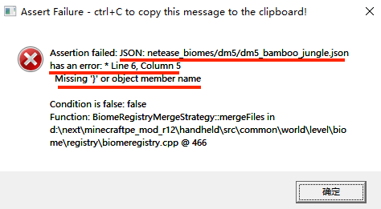 

2. lookupByName can not find biome 

Generally, there is a problem with the biome name filled in for two transforms 

The picture shows that an extra s is written in the biome name 

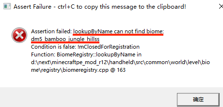 

3. different Dimension between 

Generally, the transform that did not rewrite the original version, or the biome filled in is not the same dimension as the current biome. 

If you use the "biome development template" for development, check whether you missed step 2. 

The picture shows that in the bamboo_jungle biome of dm5, the hillsTransformation is mistakenly filled in as the biome of dm3. 

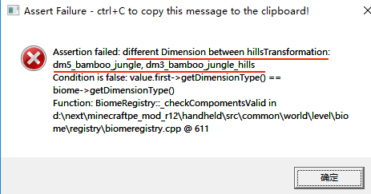 

4. total weight of xxx is zero 

The total weight of a certain temperature is 0. Check the writing of generate_for_climates attribute 

The picture shows that the weight of medium temperature on land is 0 

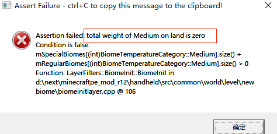 

5. empty Biome in xxxTransformation 

transformation filled in an empty string 

6. Definition of biome xxx is invalid! 

There is a problem with the inheritance relationship. Check whether it inherits the original biome without the dimension prefix 

7. value of json is not valid 

Check whether the content of json is legal, such as the spelling of component and the spelling of each attribute.


8. In 2.0 and later versions, caves will no longer be hard-coded in the engine, but will appear in the game as large features. As a result, if you use the Microsoft original attribute "[minecraft:ignore_automatic_features](https://bedrock.dev/docs/1.17.0.0/1.17.10.22/Biomes)" in the biome landscape, caves and large features will be blocked. If you only want to block the original small features and keep the original large features, you can use ["netease:ban_vanilla_feature"](./1-Custom Dimension.md#Dimension Configuration). In subsequent versions, we will launch attribute fields for blocking large features. Stay tuned... 

9. lookupByName can not find biome:dmxxx_plains 

​To use a custom biome source, you need to define a dmxxx_plains biome in the behaviorPack/netease_biome path, otherwise the following assertion will appear when loading 

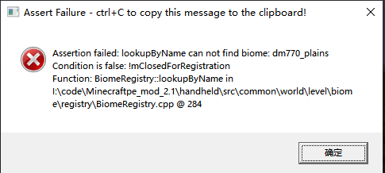 

