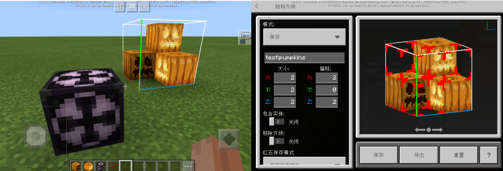
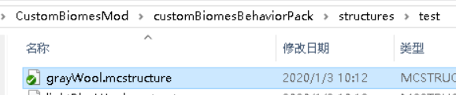
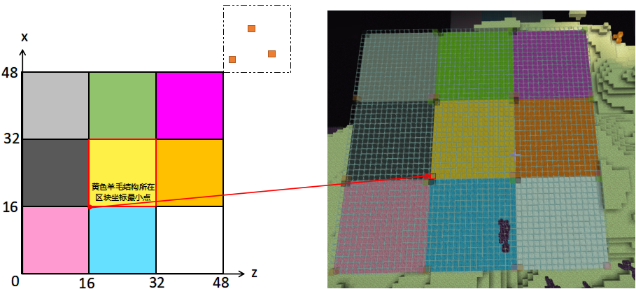
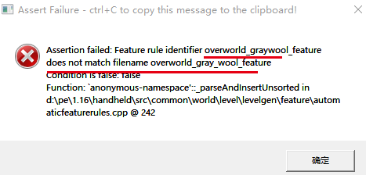
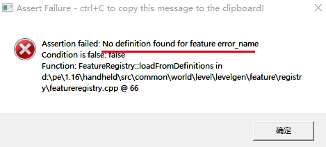
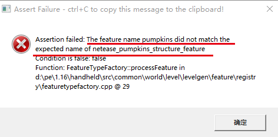
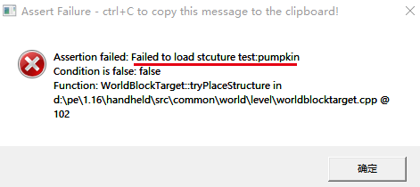

--- 
front: 
hard: Getting Started 
time: minutes 
--- 

# Custom Features 

## Overview 

This feature only requires experimental gameplay to be enabled when saving structures. 

Developers can configure features (features) and feature rules (feature_rules) to control the post-processing stage after the base terrain is generated when the custom biome chunks are generated. 

Features can be understood as a combination of blocks, such as minerals or trees in the vanilla addon; feature rules define how to place these features in the terrain. 

In addition to the feature types supported in the vanilla addon, we have also added a feature that derives structures based on structure blocks. 

Netease Structure Feature and Feature Rules automatically place multiple structures derived from structure blocks on chunks when the terrain is generated. 

**Custom features cannot be generated in the Nether and Superflat worlds** 

**Since version 1.21 of NetEase, the identifiers of features and feature_rules need to add namespaces, and the format version of custom features has been updated to 1.14.0** 

**The namespace in this example is custombiomes. Developers can customize the namespace and it is recommended to be consistent with the mod name** 

## References 

1. [Official wiki](https://minecraft.gamepedia.com/Bedrock_Edition_features_documentation) Explanation and examples of features and feature rules 

This page lists the features of the original version, including single blocks, ore clusters, etc. 

2. For the method of configuring features directly in the custom biome json without using feature_rules, see the [official wiki](https://minecraft.gamepedia.com/Bedrock_Edition_biomes_documentation#Schema) biome json structure explanation 

3. Original features json: see "Mod PC Development Kit" 

4. Original feature rules json: see "Mod PC Development Kit"'s "data/definitions/feature_rules" directory 

## Features 

The feature json file should be placed in the netease_features directory of the behavior pack 

Original features (see reference 1) can be defined directly in this directory. The following mainly explains how to use structure blocks to make **structure features**. 

### Structure 

Structure refers to the map template saved using [Structure Block](https://minecraft-zh.gamepedia.com/index.php?title=%E7%BB%93%E6%9E%84%E6%96%B9%E5%9D%97). The editing and exporting of structures requires the player to be in creative mode and turn on experimental gameplay. 

#### Acquisition and placement of structure blocks 


You can get the structure block through the command `/give @p structure_block`

After the structure block is placed, you can see the white outline of the structure in the world. Use the structure block to open its GUI, where you can edit the size of the structure and the offset from the structure block. 

The intersection of the red, blue, and green lines in the structure is the minimum coordinate point of the structure block, and the placement of the structure starts from the block where this point is located. 

If you don't want the air block in the structure to cover other blocks when placing it, you can get the [structure void](https://minecraft-zh.gamepedia.com/%E7%BB%93%E6%9E%84%E6%96%B9%E5%9D%97#.E7.BB.93.E6.9E.84.E7.A9.BA.E4.BD.8D) through the command `/give @p structure_void` and place it on the corresponding air block. 

 

#### Export of structure 

The maximum size of a single structure supported by the structure feature is the size of a block (and 16x255x16). If the maximum size is exceeded, the blocks beyond the range may not be placed successfully; if the height of the block in the world exceeds 255, it will not be placed successfully. It is recommended not to set the structure height too high. 

The structure feature **does not support the inclusion of entities** function. Even if entities are saved in the structure, they will not be generated. 

Select "Save" in the structure block GUI interface mode, and click Export to export the structure. 

After exporting, put the mcstructure file in the behavior/structures/xxx directory. The xxx directory can generally use the mod name. 

Then in subsequent use, "folder name: file name" is the identifier of the structure 

For example, the structure in the figure below has an identifier of test: grayWool 

 

If the structure contains a fire block, the fire placed by NeteaseStructureFeature is similar to [Eternal Fire](https://minecraft-zh.gamepedia.com/%E7%81%AB#.E6.B0.B8.E6.81.92.E4.B9.8B.E7.81.AB), which will not extinguish or spread, but still has burning damage. 

#### Original test instructions 

**For testing only, only available on PC development kit**, if you need to place a structure in Python code, see [Python events and interfaces](#Python events and interfaces) 

You can directly place the structure through the `/placefeature featureName x y z` instruction 

### JSON structure of structural features 

**The identifier of the feature must be lowercase, and the file name must be consistent with the part after the colon in the identifier** 

```json 
netease_pumpkins_structure_feature.json： 

{ 
"format_version": "1.14.0", // Format version is 1.14.0 
"netease:structure_feature": { // Feature type must be netease:structure_feature 
"rotation":0, //Optional, rotate the structure according to the (0,0) point of the structure, the default is 0, the optional values are 90, 180, 270 
"description": { 
"identifier": "custombiomes:netease_pumpkins_structure_feature" // The identifier of the feature, custombiomes is its namespace, developers can define it by themselves 
}, 
"places_structure": "test:pumpkins" // The identifier of the placed structure 
}

} 
``` 

## Feature rules (feature_rules) 

The json file of feature rules should be placed in the netease_feature_rules directory of the behavior pack 

**The identifier of the feature rule must be lowercase, and the file name must be consistent with the part after the colon in the identifier** 

### Basic process 

Combined with a simple feature rule json to understand how the feature is generated into the world: 

```json 
overworld_pumpkins_feature.json： 

{ 
"format_version": "1.14.0", // Format version is 1.14.0 
"minecraft:feature_rules": { 
"description": { 
"identifier": "custombiomes:overworld_pumpkins_feature", // The identifier of the feature_rule, custombiomes is its namespace, developers can define it 
"places_feature": "custombiomes:netease_pumpkins_structure_feature" // The identifier of the feature placed by this feature_rule 
}, 
"conditions": { // Control feature generation conditions 
"placement_pass": "surface_pass", // Control the execution order of feature_rules 
"minecraft:biome_filter": [ // Control which biomes the feature will be generated in 
... 
] 
}, 
"distribution": { // Control the distribution of feature 
"iterations": 1, 
"coordinate_eval_order": "xzy", 
"scatter_chance": 100.0, 
"x": 0, 
"y": 100, 
"z": 0 
} 
} 
} 
``` 

A feature_rule can be understood as a definition of how a feature is generated. If you want to apply a feature_rule to multiple features, you can use the original Aggregate Feature (see reference 1) 

The generation of a feature is bound to a single block, so the volume of a single feature should not exceed the scope of the current block. The same is true for structural features, but the following will talk about how to use other methods to generate large buildings. 

After a block generates basic terrain, it will go through a post-processing stage, such as adding original minerals, vegetation, etc., and feature_rules will also take effect at this time. 

The conditions in the feature_rule determine in which biomes this feature will be generated, and the order of generation 

And distribution defines whether to generate this feature for each biome type block, the number of times to generate, and the location of the generation


1. Iterate according to the value of iterations 
2. A random operation is performed in each iteration, and the probability greater than scatter_chance is performed in step 3 
3. The actual position of the feature generated in this iteration is determined according to the content of coordinate_eval_order and xyz. 

### Parameter explanation 

Parameter explanation in conditions 

| Parameter | Type | Explanation | 
| --- | ---| --- | 
| placement_pass | str | The post-processing stage is divided into several steps, which are performed in sequence. After processing the feature_rules of one step, the next step will be processed. These steps are, in order: <br>first_pass<br>before_underground_pass<br>underground_pass<br>after_underground_pass<br>before_surface_pass<br>surface_pass<br>after_surface_pass<br>before_sky_pass<br>sky_pass<br>after_sky_pass<br>final_pass | 
|minecraft:biome_filter|array|Which biomes can this feature_rule be applied to| 

Parameter explanation in distribution 

| Parameter | Type | Explanation | 
| --- | ---| --- | 
|iterations|molang|The number of times this block tries to generate a feature| 
|scatter_chance|float|The probability of generating a feature in each iteration| 
|coordinate_eval_order|str|The order in which the three coordinates of the actual position xyz are generated, the default is xzy| 
|x/y/z|molang or object|The calculation method of each coordinate of the actual position, returning the value relative to the minimum coordinate of the block (i.e. x and z should be between 0-15)| 

Variables that can be used in iterations and x/y/z: 

| Variable | Explanation | 
| --- | ---| 
|variable.originx|The minimum x coordinate of this block| 
|variable.originz|The minimum z coordinate of this block| 

If the y axis is at the end of coordinate_eval_order, the molang of the "y" field has an additional variable that can be used: 

| Variable | Explanation | 
| --- | ---| 
|variable.worldx|The actual coordinate of the x-axis of the actual position| 
|variable.worldz|The actual coordinate of the z-axis of the actual position| 

In molang in distribution, you can use the following query: 

- query.get_height_at(x, z) 

- Description 

Get the height of the highest non-air block above it according to the x and z coordinates. Coordinates outside the current block can be passed in. Usually used to generate the actual coordinate of the y axis 

- Parameters 

| Parameter name | Data type | Description | 
| ------ | -------- | --------- | 
| x | int | x world coordinate |

| z | int | z world coordinate | 

- query.is_biome(x, z, biomes...) 

- Description 

Determines whether the biome at the x, z coordinates is the target biome. Coordinates outside the current chunk can be passed in. Generally used for the generation of large structures composed of multiple structures 

- Parameters 

| Parameter Name | Data Type | Description | 
| :----- | :------- | :------------------------------------------- | 
| x | int | x world coordinate | 
| z | int | z world coordinate | 
| biomes | Args... | Biome enumeration value int, refer to <a href="../../../../mcdocs/1-ModAPI/Enumeration Value/BiomeType.html" rel="noopenner">BiomeType </a> in the minecraft enumeration value document | 

- Example 

If we want to get whether the current block is in the desert or the forest, we can write 

```json 
query.is_biome(variable.originx + 15, variable.originz + 15, 2 ,4) 
``` 

- Notes 

The biome type of a block is determined by the biome of the largest point in the block (15, 15). To keep consistent with the native block biome type definition, it is recommended that developers use query.is_biome() with the coordinates of the largest point in the block, i.e. variable.originx (the minimum x coordinate in the current block) + 15 and variable.originz (the minimum z coordinate in the current block) + 15. 

- query.noise(num1, num2)<a name="query.noise"></a> 

- Description 

Used to generate pseudo-random numbers, pass in two numbers, and return a floating point number between -1 and 1. When the two parameters passed in are the same, query.noise also gets the same result. 

Can be used to control the probability of generating large structures composed of multiple structures. 

- Parameters 

| Parameter name | Parameter type | Description | 
| ------ | -------- | ---------- | 
| num1 | float | Pass in parameter one | 
| num2 | float | Pass in parameter two | 

### Example 

```json 
{ 
"format_version": "1.14.0", // Format version is 1.14.0 
"minecraft:feature_rules": { 
"description": {

"identifier": "custombiomes:overworld_pumpkins_feature", // identifier of this feature_rule 
"places_feature": "custombiomes:netease_pumpkins_structure_feature" // identifier of the feature placed by this feature_rule 
}, 
"conditions": { // Set feature spawning conditions 
"placement_pass": "surface_pass", 
"minecraft:biome_filter": [ // Set which biomes the feature will spawn in 
{ 
"all_of": [ 
{ 
"any_of": [ 
{ 
"test": "has_biome_tag", 
"operator": "==", 
"value": "dm4" // custom dimension 4 
}, 
{ 
"test": "has_biome_tag", 
"operator": "==", 
"value": "dm5" // custom dimension 5 
}, 
{ 
"test": "has_biome_tag", 
"operator": "==", 
"value": "the_end" // End 
} 
] 
} 
] 
} 
] 
}, 
"distribution": { // featuer placement rule 
"iterations": "math.mod(variable.originx - 48, 96) == 0 && math.mod(variable.originz - 48, 96) == 0 && query.is_biome(variable.originx - 17, variable.originz - 17, 0, 1, 2, 9, 12, 46)?3:0", // Iteration placement times, this sentence means every 96 blocks (6 blocks) in the X and Z directions and try to place three times. variable.originx is the smallest x coordinate in the block where the feature is to be placed, and variable.originz is the same 
"coordinate_eval_order": "xzy", // The coordinates of the feature placement determine the order. The final y coordinate below depends on the x and z coordinates, so the order is xzy 
"scatter_chance": 100.0, // The probability of placing a feature should satisfy 0 < scatter_chance ≤ 100 
"x": { 
"distribution": "uniform", // Randomly select an integer value within a certain range 
"extent": [ 0, 16 ] // Select the range, excluding the maximum value 
}, 
"y": "query.get_height_at(variable.worldx, variable.worldz)", // variable.worldx is the x coordinate of the final feature placement, and variable.worldz is the same 
"z": { 
"distribution": "uniform", 
"extent": [ 0, 16 ] 
} 
} 
} 
} 
``` 

## Python events and interfaces


- PlaceNeteaseStructureFeatureEvent event (

Events generated by structure features, see <a href="../../../../mcdocs/1-ModAPI/Events/World.html#placeneteasestructurefeatureevent" rel="noopenner"> MOD SDK Documentation </a> for details. 

- PlaceStructure Interface 

Manually place structures in the world, see <a href="../../../../mcdocs/1-ModAPI/Interfaces/World/Map.html#placestructure" rel="noopenner"> MOD SDK Documentation </a> for details. 

## Generation of large structural features 

For features larger than 16x16, we need to divide them into multiple sub-features according to a block size of 16x16. 

Taking the wool feature in the CustomBiome example as an example, assuming that we need to design a large feature of 48x48, it will be divided into 9 sub-structures of 3x3, and the corresponding feature and feature_rule will be written for each structure. 

The key is to arrange the 9 sub-structures in the original order when they are generated through the configuration of feature_rule, how to ensure the integrity of large features when they are generated at the edge of the biome, and how to ensure that the generated height is not misplaced. 

Arrangement and integrity are mainly achieved by setting scatter_chance to 100, and then relying on the configuration of iterations. Through some methods, the 9 sub-structures are simultaneously 0 or 1 at the appropriate position. The height is mainly achieved through the configuration of y, and the output of the 9 sub-structures needs to be the same. 

 

### Control the arrangement of multiple features 

Here we use the remainder feature to achieve this effect. If the minimum coordinate point of the lower left feature (pink wool) is the origin (0, 0), then the minimum coordinate point of the central feature (yellow wool) is (16, 16) 

Then if we set a value, when the remainder of the x and z axes of the minimum point of the lower left feature divided by this value is 0, then the remainder of the x and z axes of the minimum point of the central feature divided by this value is 16, and so on. 

The meaning of this value can be understood as trying to generate a large feature at a certain distance, and in order to make the 16*16 structure fit in a block, the value needs to be a multiple of 16. Here we assume it is 96, so we can write the conditions of the iterations of these two features: 

```json 
Lower left feature: 
"iterations": "math.mod(variable.originx, 96) == 0 && math.mod(variable.originz, 96) == 0 ? 1:0" 
Central feature: 
"iterations": "math.mod(variable.originx - 16, 96) == 0 && math.mod(variable.originz - 16, 96) == 0 ? 1:0" 
``` 

### Dealing with the edge of the biome 

There are two cases with different solutions. 

1. After the feature is generated, the biome feature is not needed, such as spawning monsters. 

This situation means that the entire feature does not need to be located in a specific biome, and it is allowed to partially cross the edge of the biome. The wool feature in the CustomBiome example uses this method. 

First of all, minecraft:biome_filter only adds dimension filtering, and cannot write specific biome filtering, that is, sub-features are allowed to be generated in all biomes. 

Then we use query.is_biome in iterations to limit the biome and integrity of the feature. 

Still taking the 3x3 wool feature as an example, assuming that we stipulate that the lower left feature must fall in the desert biome, and other sub-features are not restricted, it can be concluded that the biome of the minimum point of the lower left feature is a desert, and the biome where the minimum point of the central feature is located after subtracting 16 from the x and z axes is also a desert, and so on. 


So we write iterations as 

```json 
Lower left feature: 
math.mod(variable.originx, 96) == 0 && math.mod(variable.originz, 96) == 0 
&& query.is_biome(variable.originx + 15, variable.originz + 15, 2) ? 1:0 
Central feature: 
math.mod(variable.originx - 16, 96) == 0 && math.mod(variable.originz - 16, 96) == 0 
&& query.is_biome(variable.originx - 1, variable.originz - 1, 2) ? 1:0 
``` 

2. After the feature is generated, the biome feature is needed. 

This means that each sub-feature needs to be in the correct biome. First, add the filter of the feature biome in minecraft:biome_filter. 

For each sub-feature, we need to determine whether the entire 3x3 area falls on the specified biome before generating it. 

So we write iterations as

```json
Lower left features:
    math.mod(variable.originx, 96) == 0 && math.mod(variable.originz, 96) == 0
      && query.is_biome(variable.originx+15, variable.originz+15, 2)
      && query.is_biome(variable.originx+31, variable.originz+15, 2)
      && query.is_biome(variable.originx+47, variable.originz+15, 2)
      && query.is_biome(variable.originx+15, variable.originz+31, 2)
      && query.is_biome(variable.originx+31, variable.originz+31, 2)
      && query.is_biome(variable.originx+47, variable.originz+31, 2)
      && query.is_biome(variable.originx+15, variable.originz+47, 2)
      && query.is_biome(variable.originx+31, variable.originz+47, 2)
      && query.is_biome(variable.originx+47, variable.originz+47, 2) ? 1 : 0
Central features:
    math.mod(variable.originx - 16, 96) == 0 && math.mod(variable.originz - 16, 96) == 0
      && query.is_biome(variable.originx-1, variable.originz-1, 2)
      && query.is_biome(variable.originx+15, variable.originz-1, 2)
      && query.is_biome(variable.originx+31, variable.originz-1, 2)
      && query.is_biome(variable.originx-1, variable.originz+15, 2)
      && query.is_biome(variable.originx+15, variable.originz+15, 2)
      && query.is_biome(variable.originx+31, variable.originz+15, 2)
      && query.is_biome(variable.originx-1, variable.originz+31, 2)
      && query.is_biome(variable.originx+15, variable.originz+31, 2)
      && query.is_biome(variable.originx+31, variable.originz+31, 2) ? 1 : 0 
``` 

### Control height 

Usually, we use the height of the highest non-air block on a certain coordinate for the y-axis of the feature. In this case, the coordinates obtained for each sub-feature must be consistent so that the sub-features will not be misaligned in height. 

Taking the 3x3 wool feature as an example, assuming that we stipulate that the entire feature is based on the height of the minimum point of the lower left feature, then for the central feature, we need to obtain the height of the position after subtracting 16 from the minimum point coordinates, and so on. 


Finally written as 

```json 
Lower left feature: 
"y": "query.get_height_at(variable.originx, variable.originz)" 
Central feature: 
"y": "query.get_height_at(variable.originx-16, variable.originz-16)" 
``` 

### Control the randomness of generation 

We can add a little randomness to the feature based on a certain spacing, which requires the pseudo-random function query.noise. In order to ensure the integrity of the feature, it is necessary to ensure that each sub-feature passes in the same parameters. 

Taking the 3x3 wool feature as an example, for convenience, we directly use the coordinates of the minimum point of the lower left feature as the parameter, and for the central feature, the coordinates of the minimum point minus 16 are used as the parameter, and so on. 

Assuming you want to spawn with a 50% probability, you need to add the following condition on top of [Handling the edge of a biome](#Handling the edge of a biome): 

```json 
Lower left feature: 
... && math.abs(query.noise(variable.originx, variable.originz))<0.5 
Central feature: 
... && math.abs(query.noise(variable.originx-16, variable.originz-16))<0.5 
``` 

## demo explanation 

There are 10 structures stored in the CustomBiome example, see `behavior/structures/test`, of which 9 structures are made of 16x3x16 glass-wool-glass blocks (hereinafter referred to as wool structures), the only difference is the wool color. The remaining structure is four jack-o'-lantern blocks of size 2x2x2 (referred to as pumpkin structure), and the structure space is placed at the air block position to avoid covering the block at that position.

Each structure then has a structure feature, see `behavior/netease_features`, and a feature rule, see `behavior/netease_feature_rules` 

In the End and dm4 dimensions, these ten features together form a large feature, and the entire large feature is placed every 96 blocks (6 blocks) in the x and z directions. The nine wool types are arranged in a fixed order at the same height; the pumpkin feature will be placed three times, with random x and z coordinates offset in [0, 16], and the height is the height of the highest non-air block where the final x and z coordinates are located. 

In addition, pumpkin features are generated separately in the dm5 dimension. 

The following figure shows the structure of the entire large feature actually placed in the End: 

 

In the iterations of feature_rule, the minimum coordinate of the block is used to determine whether the feature should be placed. When placing the 9 wool structures, it will determine whether the biome of the block where the middle yellow wool is located is 0 (oceans), 1 (plains), 2 (desert), 9 (the End), 12 (ice field), 46 (frozen ocean). If it is, it will try to place the structure once, and the placement height is the height of the highest non-air block of the minimum coordinate point of the block where the yellow wool structure is located. 

For [handling the edge of the biome](#Handling the edge of the biome), the example adopts the first solution, that is, as long as the biome where the yellow wool is located meets the requirements, the entire structure will be generated, regardless of the biome where other surrounding wool is located. 

The following uses pink wool structure and light blue wool structure as examples to explain the configuration of distribution: 

* Pink wool structure 

Both are placed every 96 grids (6 blocks) in the x and z directions, and the generation interval is controlled by math.mod. 

As shown in the coordinate system in the figure above, the pink wool is located at (x=0, z=0), so use math.mod(variable.originx,96)==0 to control the x coordinate, and math.mod(variable.originz,96)==0 to control the z coordinate. 


As mentioned above, when all structures are placed, the biome type of the block where the yellow wool is located will be determined (determined by the maximum coordinate point in the block). In this demo, the offset of each wool structure when placed is 0, that is, the minimum coordinate point of the structure coincides with the minimum coordinate point of the block, and there is an offset of (x=15, z=15) between the maximum coordinate point of the block. The distance between the minimum coordinate point of the pink wool structure and the minimum coordinate point of the yellow wool structure is (x=16, z=16), so the first two parameters in query.is_biome are variable.originx + 15 + 16 (the x coordinate of the maximum coordinate point of the block where the yellow wool is located) and variable.originz + 15 + 16 (the z coordinate of the maximum coordinate point of the block where the yellow wool is located). 

At the same time, the height of the entire structure is based on the height of the highest non-air block of the minimum coordinate point of the block where the yellow wool structure is located, so the parameters used by query.get_height_at when calculating the y coordinate are variable.originx + 16 and variable.originz + 16. 

```json 
"distribution": { 
"iterations": "math.mod(variable.originx, 96) == 0 && math.mod(variable.originz, 96) == 0 && query.is_biome(variable.originx + 31, variable.originz + 31, 0, 1, 2, 9, 12, 46) ? 1:0", 
"coordinate_eval_order": "xzy", 
"scatter_chance": 100.0, 
"x": 0, 
"y": "query.get_height_at(variable.originx + 16, variable.originz + 16)", 
"z": 0 
} 
``` 

* Light blue wool structure 

As shown in the coordinate system above, the light blue wool is located at (x=0, z=16), so math.mod(variable.originz - 16, 96) == 0 is used to control the z coordinate. 

The distance between the minimum coordinate point of the block where the light blue wool is located and the minimum coordinate point of the block where the yellow wool is located is (x=16, z=0), so the first two parameters in its query.is_biome are variable.originx + 15 + 16, variable.originz + 15 + 0, and the query.get_height_at parameters are variable.originx + 16, variable.originz. 

```json
  "distribution": {
        "iterations": "math.mod(variable.originx, 96) == 0 && math.mod(variable.originz - 16, 96) == 0 && query.is_biome(variable.originx + 31, variable.originz + 15, 0, 1, 2, 9, 12, 46) ? 1:0",
        "coordinate_eval_order": "xzy",
        "scatter_chance": 100.0,
        "x": 0,
        "y": "query.get_height_at(variable.originx + 16, variable.originz)",
  	  "z": 0
  }
  ```

## Common errors

1. Feature rule identifier xxx does not match filename yyy

   Usually Feature The Rules file name does not match the identifier in the file. 

The picture shows the error reported when the Feature Rules file named overworld_gray_wool_feature is configured with the identifier overworld_graywool_feature. 

 

2. No definition found for feature xxx 

Generally, the feature file corresponding to the "places_feature" item filled in the Feature Rules file cannot be found. 

The picture shows the error reported when the "places_feature" value in Feature Rules is filled in as error_name. 

 


3. The feature name XXX did not match the expected name of YYY 

This usually means that the feature file name does not match the identifier in the file. 

The picture shows an error message when the feature file named netease_pumpkins_structure_feature is configured with the identifier pumpkins. 

 

4. Failed to load feature XXX 

This usually means that the structure name corresponding to the places_structure item in the feature file is filled in incorrectly, or the structure file is placed in the wrong directory. 

The picture shows an error message when test:pumpkins is written as test:pumpkin, resulting in the inability to load the structure normally. 

