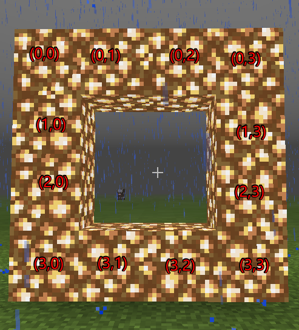
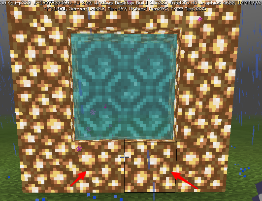
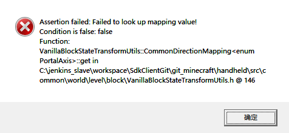

--- 
front: 
hard: Getting Started 
time: minutes 
--- 

# Custom Portal DEMO 

The portal demo is [portalGateDemo](../../13-Module SDK Programming/60-Demo Example.md#portalGateDemo), and is used in combination with custom dimensions. 

### Gameplay Introduction 

1. Use fluorite to form a 4x4 box. Use bone meal on the fluorite at the specified point, which will consume 1 bone meal. Then the box is filled with portal blocks. Entering the portal block will teleport to the new custom dimension. 

2. Portal forcer function after teleportation: 

If there is a custom portal nearby, move the player to the vicinity of the portal; 

Otherwise, create a portal near the player and save the data in level extraData; 

Destroy the portal in the map and delete the portal information in level extraData. 

### Mod configuration instructions 

1. DEMO configures two [custom blocks] (../2-Custom Blocks/0-Custom Block Overview.md#customBlockJump) with teleport components, one target is set to the custom dimension, and the other is set to the main world 

2. Configure the custom dimension according to this document 

3. Explanation of portal configuration: 

- Set the door shape: 

```python 
self.pattern =[ 
'####', 
'#**#', 
'#**#', 
'####', 
] 
``` 

- Set the door block definition: 

``` 
self.defines ={ 
'#':'minecraft:glowstone', 
'*':'minecraft:air' 
} 
``` 


- Set the portal activation item information (bone meal) 

``` 
self.useOnItemName = 'minecraft:dye' 
self.useOnItemAux = 15 
``` 

- Set the position where the portal border can be activated 

Relative to the position defined in the previous pattern 

 

``` 
self.touchPos =[(3,1),(3,2)] 
``` 

4. Activation detection 

When the player uses an item, listen to the **ServerItemUseOnEvent** event to detect whether it is the set item. If so, perform the portal construction detection. For the specific matching algorithm interface, see <a href="../../../../mcdocs/1-ModAPI/接口/世界/地图.html#detectstructure" rel="noopenner"> DetectStructure interface </a> 

Using bone meal at position (3,1) or (3,2) can activate the portal, as shown in the figure below. 

 

5. Portal Forcer Function 

By listening to the event <a href="../../../../mcdocs/1-ModAPI/事件/玩家.html#dimensionchangefinishserverevent" rel="noopenner"> DimensionChangeFinishServerEvent </a>, a similar Portal Forcer function in the engine (the logic of entering the hell portal and then being transferred to the hell) is completed. 

The main process is as follows: 

After the dimension switching is completed, look for a portal near the player. If found, move the player to the vicinity of the found portal; 

Otherwise, create a portal near the player and save the portal information to the level extraData. 

Please refer to the portal demo for this function. 

6. Custom portal block related features: 

- If the portal block is placed through the SetBlockNew interface of the server-side blockInfo component: 

- When the additional value 'aux' is set to 1, the block extends in the same direction as the X axis, and the particles corresponding to particle_north_south are played; 
- When the additional value 'aux' is set to 2, the block extends in the same direction as the Z axis, and the particles corresponding to particle_east_west are played. 
- **Avoid setting the additional value 'aux' to 0. ** 

- You can also place blocks in the game through the command /setblock, **note that the 'aux' value should be set to 1 or 2. ** 

The following is the command to place a customblocks_test_portal_blue block with an aux value of 2 at (0, 65, 0): 

`/setblock 0 65 0 customblocks_test_portal_blue 2`


- The additional value 'aux' of a manually placed portal block is always 0, no matter where it faces. **It is not recommended for developers to manually place portal blocks. ** 

- Teleportation will not occur when the target dimension is the same as the current dimension. 

- Only players can teleport through custom portal blocks. 

- There is a certain teleportation cooldown for the same player, and they will not teleport continuously. 

- The player's coordinates do not change before and after teleportation. 

### FAQ 

1. The following assertion appears in the PC development package 

 

Reason: Since the additional value (aux) of manual placement is 0, this assertion will appear when loading a manually placed portal block through a structure block 

Solution: You can use the /setBlock command to set the position of the portal block to solve this problem. Note that the 'aux' value should be set to 1 or 2. 
