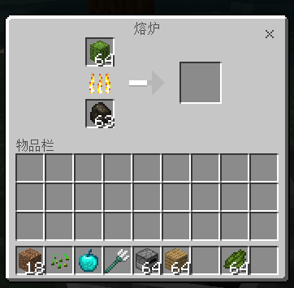

--- 
front: 
hard: Getting Started 
time: minutes 
--- 
# Custom Recipes 

## Overview 

This feature does not require experimental gameplay. 

Developers can add a netease_recipes folder in the addon's bevavior directory, and then configure json to add custom recipes. 

This recipe supports custom items. 

## Define Recipe Json 

### Recipe Type Description 

Currently, there are five main types of recipes that can be customized through json: 

#### minecraft:recipe_shaped 

Represents an ordered crafting recipe for a [**workbench**]. 

In `pattern`, any character except space (` `) can be used as `key`, because space represents an empty crafting slot. 

The output item of the recipe cannot set a custom NBT data tag. 

**Common properties for recipes** 

```css 
. 
├── pattern: An array of single-character keys describing a 2×2 or 3×3 ordered crafting pattern. A string in the array represents a row in the crafting grid. Each string should contain at most 3 keys, and the number of keys should be the same. Spaces represent an empty crafting slot. 
└── key: All keys used in this ordered crafting recipe. 
| ├── one-key: The item represented by the key. 
| │ └── item: Item ID 
| | └── data: Item added value 
| ├── one-key: The item represented by the key. 
| │ └── item: Item ID 
| | └── data: Item added value 
└── result: The output item of this recipe. Can be an array containing multiple output items. 
├── item: item ID 
├── data: item added value 
``` 

Example: wooden shovel + plank to synthesize a boat 

```json 
{

"format_version": "1.12", 
"minecraft:recipe_shaped": { 
"description": { 
"identifier": "minecraft:netease_acacia_boat" 
}, 
"tags": [ "crafting_table" ], 
"pattern": [ 
"#P#", 
"###" 
], 
"key": { 
"P": { 
"item": "minecraft:wooden_shovel" 
}, 
"#": { 
"item": "minecraft:planks", 
"data": 1 
} 
}, 
"result": { 
"item": "minecraft:boat", 
"data": 4 
} 
} 
} 
``` 

#### minecraft:recipe_shapeless 

Represents a shapeless crafting recipe for a [**crafting table**]. 

The output item of a recipe cannot have custom NBT data tags. 

**Common properties of recipes** 

```css 
. 
└── ingredients: A series of raw materials for this unordered crafting recipe. The quantity should be between 1 and 9. 
| ├── : The item represented by the key. 
| │ └── item: Item ID 
| | └── data: Item added value 
| ├── : The item represented by the key. 
| │ └── item: Item ID 
| | └── data: Item added value 
└── result: The output item of this recipe. Unlike ordered recipes, there can only be one output item. 
├── item: Item ID 
├── data: Item added value 
├── count: Number of items

``` 

Example: Diorite + Cobblestone -> Andesite 

```json 
{ 
"format_version": "1.12", 
"minecraft:recipe_shapeless": { 
"description": { 
"identifier": "minecraft:netease_andesite" 
}, 
"tags": [ "crafting_table" ], 
"ingredients": [ 
{ 
"item": "minecraft:stone", 
"data": 3 
}, 
{ 
"item": "minecraft:cobblestone" 
} 
], 
"result": { 
"item": "minecraft:stone", 
"data": 5, 
"count": 2 
} 
} 
} 
``` 

Where, the number defined in `ingredients` should be between 1 and 9. 

#### minecraft:recipe_furnace 

Represents a [**Furnace**] recipe 

**Common properties of recipes** 

```css 
. 
└── input: Input material of furnace recipe, placed in the grid on the upper left of the furnace. 
└── output: Output item of furnace recipe, produced in the grid on the right of the furnace. 
``` 

 

Example: Cactus -> Cactus Green 


```json 
{ 
"format_version": "1.12", 
"minecraft:recipe_furnace": { 
"description": { 
"identifier": "minecraft:netease_furnace_cactus" 
}, 
"tags": ["furnace"], 
"input": "minecraft:cactus", 
"output": "minecraft:dye:2" 
} 
} 
``` 

#### minecraft:recipe_brewing_mix 

Represents a [**brewing stand**] mixed brewing recipe 

Mixed brewing recipes refer to a recipe that puts a potion with a certain status effect into a brewing stand and then adds an item to brew a potion with another status effect. 

**Common properties of recipes** 

```css 
. 
└── input: an item ID, the potion type accepted by the recipe. 
└── reagent: An item ID, an additional item required for brewing. 
└── output: The type of potion output by this recipe. Note: The output item cannot be combined with the original item 
``` 
**Note: The output item cannot be stacked with the original item** 

Example: Awkward Potion + Blaze Powder -> Strength Potion 

```json 
{ 
"format_version": "1.12", 
"minecraft:recipe_brewing_mix": { 
"description": { 
"identifier": "minecraft:netease_brew_awkward_blaze_powder" 
}, 

"tags": [ "brewing_stand" ], 

"input": "minecraft:potion_type:awkward", 
"reagent": "minecraft:blaze_powder", 
"output": "minecraft:potion_type:strength" 
} 

} 
``` 


#### minecraft:recipe_brewing_container 

Represents a [**brewing stand**] container-changing brewing recipe 

Container-changing brewing recipes refer to the recipe of a potion that will change the container after it is brewed. For example, from a normal glass bottle to a splash glass bottle or a lingering glass bottle. 

Example: 

```json 
{ 
"format_version": "1.12", 
"minecraft:recipe_brewing_container": { 
"description": { 
"identifier": "minecraft:netease_brew_potion_sulphur" 
}, 

"tags": [ "brewing_stand" ], 

"input": "minecraft:potion", 
"reagent": "minecraft:gunpowder", 
"output": "minecraft:splash_potion" 
} 

} 
``` 

### tags description 

tags has the following values: 

#### crafting_table 

Use crafting table to craft recipes 

#### stonecutter 

Use stonecutter to craft recipes. Note: Since **stonecutter** has only one crafting grid, the sum of the count values of the ingredients in the crafting recipe cannot be greater than 1!

example:

```python
{
  "format_version": "1.12",
  "minecraft:recipe_shapeless": {
    "description": {
        "identifier": "minecraft:netease_stonecutter_polished_andesite_slab"
        },
        "tags": [ "stonecutter" ],

"priority": 4, # For multiple recipes, the higher the priority, the earlier the recipe is crafted 
"ingredients": [ 
{ 
"item": "minecraft:stone", 
"data": 5 
} 
], 
"result": { 
"item": "minecraft:double_stone_slab3", 
"data": 2, 
"count": 2 
} 
} 
} 
``` 

#### cartography_table 

Use cartography table to craft recipes 

Example: 

```python 
{ 
"format_version": "1.12", 
"minecraft:recipe_shapeless": { 
"description": { 
"identifier": "minecraft:netease_cartography_table_locator_map" 
}, 
"tags": [ "cartography_table" ], 
"ingredients": [ 
{ 
        "item": "minecraft:paper"
      },
      {
        "item": "minecraft:compass"
      }
    ],
    "result": {
      "item": "minecraft:emptymap",
      "data": 2
    }
  }
}
```

#### furnace 

Crafting recipes using furnaces 

A furnace is a block used to smelt blocks and items and convert them into another block or item. 

#### blast_furnace 

Crafting recipes using blast furnaces 

A blast furnace is a block entity similar to furnaces and smokers, specialized for smelting ores, armor, and tools. 

#### smoker 

Crafting recipes using smokers 

A smoker is a job site block for butcher villagers, a furnace variant specialized for cooking food. 

#### campfire 

Crafting recipes using campfires 

A campfire is a block that can be used to cook food and as a light source or smoke signal. 

#### brewing_stand 

Brewing Stand Recipe 

A Brewing Stand is a block used to brew potions, splash potions, and lingering potions. 

***Note that data is the additional value corresponding to the item** 

## Recipes that support durability configuration 

Currently, the [Workbench] **Ordered Crafting Recipe** and **Disordered Crafting Recipe** support durability configuration. 

Example: 

``` 
{ 
"format_version": "1.12", 
"minecraft:recipe_shaped": { 
"description": { 
"identifier": "minecraft:recipe_shaped_test14" 
}, 
"tags": [ "crafting_table" ],

"pattern": [ 
" P#", 
" # " 
], 
"key": { 
"P": { 
"item": "minecraft:diamond_sword", 
"durability": [1, 1560] 
}, 
"#": { 
"item": "minecraft:iron_sword" 
} 
}, 
"result": { 
"item": "minecraft:bow", 
"durability": [1, 300] 
} 
} 
} 
``` 

This example shows that a diamond sword with a durability between 1 and 1560 and two iron swords with any durability are combined to form a bow with a durability between 1 and 300. The durability configuration format is `"durability": [min, max]`, where min and max are both positive integers, and max is greater than or equal to min. The durability of the generated item is a random value between min and max. If it is greater than the maximum durability of the item, the maximum durability of the item will prevail. 

**Note: If the generated item is configured with a durability parameter and the item supports durability (such as weapons, equipment, etc.), the durability within the parameter range will be randomly displayed in the workbench generation preview interface, but it does not represent the final durability. The durability is only finalized when the synthesized item is taken out of the workbench after the synthesis is completed. ** 

## Notes 
- If the recipe identifier is repeated with an existing recipe of the engine or an existing recipe of your own mod, only one of these repeated recipes will take effect (it is not guaranteed which one), and the development kit will also report an error of **Recipe for ×× already exists**. At this time, you need to change the recipe identifier to a different one.