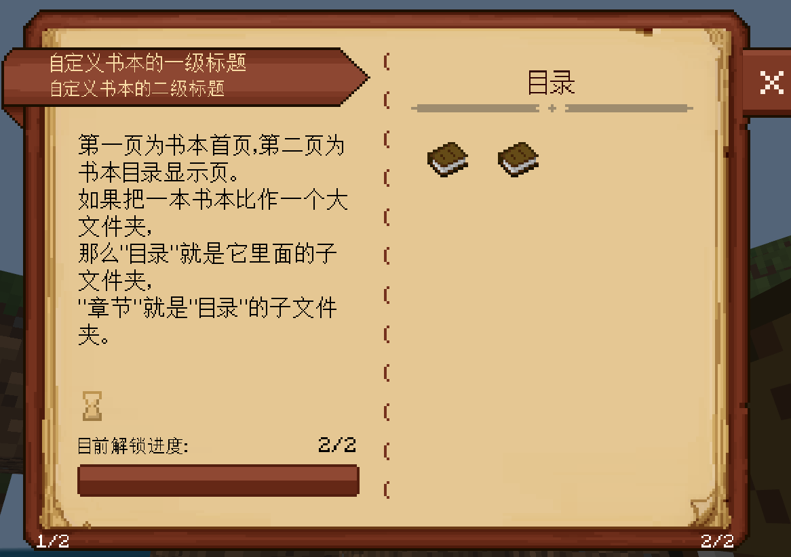
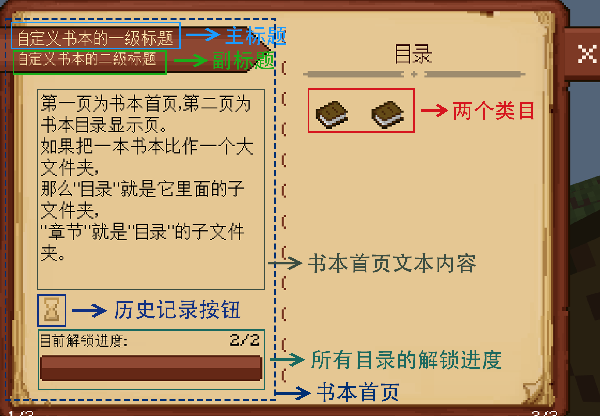
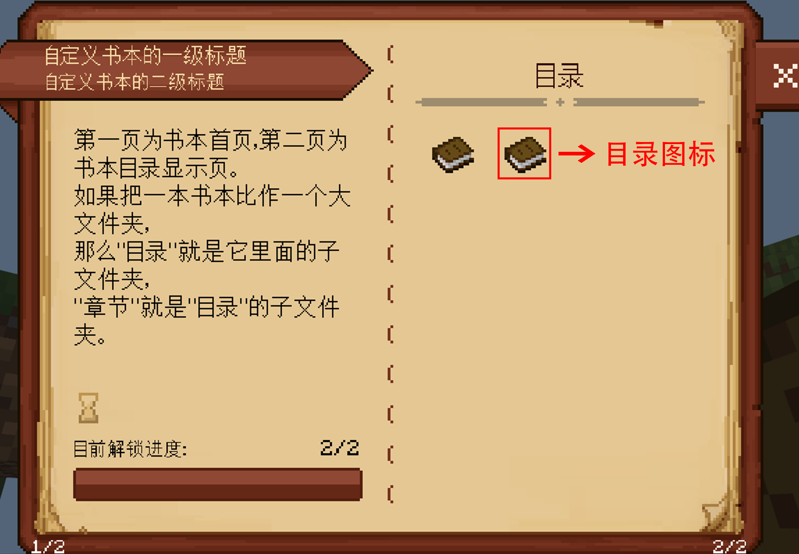
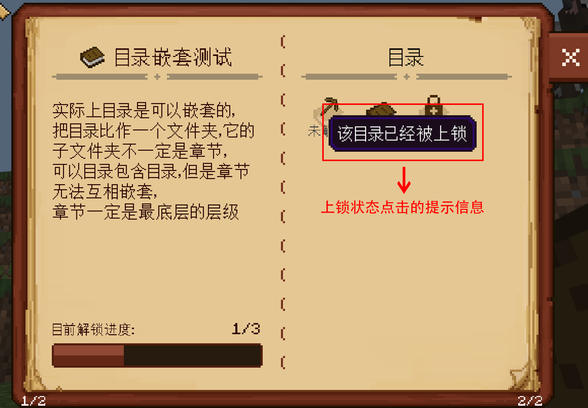
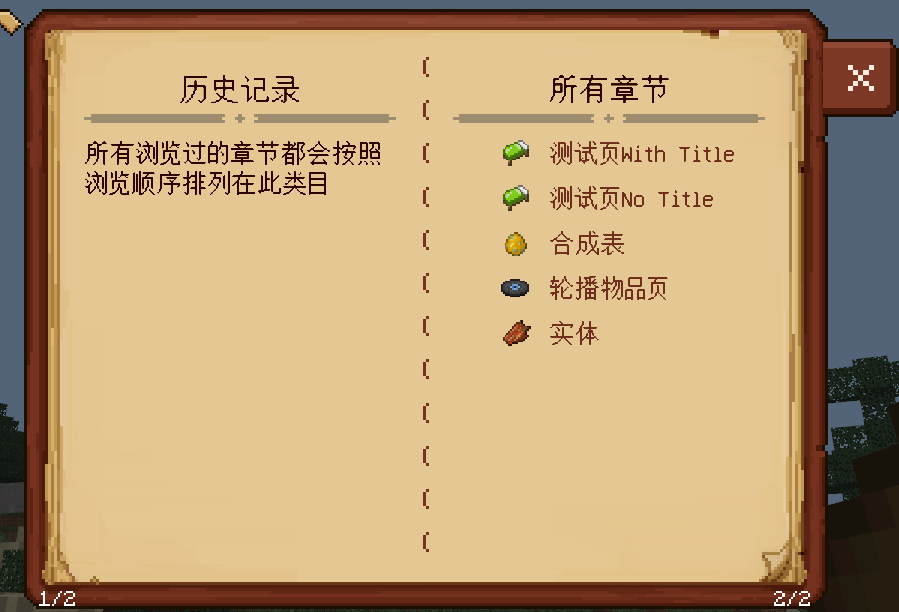

--- 
front: 
hard: Getting Started 
time: minutes 
sidebarDepth: 4 
--- 
# Custom Basic Books 

## 1. Overview 

Books are an item that is mainly used by players to browse information. Based on custom books, you can provide a book interface for players, allowing them to acquire knowledge by flipping through books. 

Developers need to first configure the custom book as a custom item in the "**netease_items_res**" directory of the behavior pack and resource pack. For details, see [Custom Basic Items](../1-Custom Items/1-Custom Basic Items.md). 

Then add custom books by configuring json in "**behavior_pack/customBooks**". You can expand the book style and function by writing scripts. The added books support all book-related events and interfaces in the "**MOD SDK Document**". 

The following will show how to define a custom book by defining a book named "**customBook**". (See the example [CustomBookMod](../../13-Module SDK Programming/60-Demo Example.md#CustomBookMod) for details). 

 

## 2.json configure the book 

### 1. Create a book 

A book corresponds to a folder. We must create a folder "**customBook**" for the book in the directory "**behavior_pack/customBooks**", and then create a file "**book.json**" and empty folders "**category**", **"entry"** in the "**customBook**" folder. The complete directory structure is as follows: 

``` 
| customBook (folder, name can be customized) 
| book.json (file name is fixed) 
| category (folder, name is fixed) 
| entry (folder, fixed name) 
``` 

"**category**" stores the information of all directories in the book, "**entry**" stores the information of all chapters in the book, these two folders will be expanded later, and "**book.json**" describes the basic information of the book. 

Similar to resource identifiers, each book actually has its own <span id="目录identifier">**identifier**</span><span id="书名称"></span>, that is, the corresponding **folder** name, this example is "**customBook**". 

### 2. Write json 

We divide a complete book into three index levels: book, directory, chapter. Chapter is the most basic level, it contains the most basic content page, and the directory is one level higher than the chapter, it contains multiple chapters, and the book contains multiple directories. For example, if you want to index the page in the book that contains the introduction of vegetables and fruits, you need to go to the directory "page type", and then index the chapter "carousel item page", and the second page is your target page. 

 

<center>First find the customBook item (local name is "test custom book"), then use the item to open the interface, and index to the target layer by layer according to the hierarchy</center> 

#### 1. Write book.json 

"**book.json**" contains two parts of information, one is to indicate what kind of item can be used to open the book interface, and the other is to describe the layout information of the book homepage. Write "**book.json**" as follows: 


``` 
{ 
"item": "custombooks:test0", 
"title1": "Customize the first-level title of the book", 
"title2": "Customize the second-level title of the book", 
"content": "The first page is the homepage of the book, and the second page is the book directory display page.\nIf a book is compared to a large folder,\nthen the \"directory\" is the subfolder in it,\n\"chapter\" is the subfolder of the \"directory\".", 
"titleArea":{ 
"offset": [-10,0], 
"textSize1": 9, 
"textSize2":8, 
"padding": 1 
}, 
"pageConfig": { 
"subtitle":"Default subtitle" 
} 

} 
``` 

 

<center>Structure of the book homepage</center> 

| <div style="width:100px">Attributes</div> | Explanation | 
| :---------------------------------: | ------------------------------------------------------------ | 
| item | The **identifier** of the item corresponding to the book. | 
| title1 | The main title text content of the book homepage. | 
| title2 | The subtitle text content of the book homepage. | 
| titleArea | The layout attributes of the main title and subtitle of the book homepage. The following is an introduction to the sub-attributes: <br>offset: The overall offset of the main title and subtitle relative to the default position (for coordinates, see ["Custom Book UI Coordinate System"](#Page Writing)). <br>textSize1: The font size of the main title. <br>textSize2: The font size of the subtitle. <br>padding: The vertical spacing between two titles. | 
| content | The content text of the book homepage. The height of the text box is 100px. If there is too much text, the text beyond the limit will not be displayed. | 
| contentTextSize | The font size of the content text of the book homepage. <br>The system default value of this property is **BookConfig.TextSize.content**, and the value is **10** (integer). It can be omitted. | 
| pageConfig | The configuration default value of the page, represented by **object**. The default value of the property in the page inherits the property value defined here. <br>This property has no default value. If this property is not written, the default value of the property in the page inherits the system default value. <br>For the difference between the system default value and the configuration default value, please see the notes below. | 
| categoryConfig | The configuration default value of the directory, represented by **object**. The default value in the directory inherits the property value defined here. <br/>This property has no default value. If this property is not written, the default value of the property in the directory inherits the system default value. <br/>For the difference between the system default value and the configuration default value, please see the notes below. | 
| entryConfig | The default value of the configuration of the chapter is represented by **object**. The default value in the chapter inherits the attribute value defined here. <br/>This attribute has no default value. If this attribute is not written, the default value of the attribute in the chapter inherits the system default value. <br/>For the difference between the system default value and the configuration default value, please see the following notes. | 

Notes: 

1. Regarding the difference between the system default value and the configuration default value, **please have a certain understanding of [Directory Writing](#Directory Writing), [Chapter Writing](#Chapter Writing), and [Page Writing](#Page Writing) before reading this**. When writing the attributes of the directory, chapter, and page, some attributes with default values will give priority to the configuration default value when using the default value. If there is no configuration default value, the system default value will be used. Please do not configure attributes that do not carry default values in the configuration default value, otherwise unexpected problems will occur. 

Let's take a use case as an example. We hope that the default font size of the text content in all catalog homepages (attribute name "**contentTextSize**") is 12px, and the default font size of the text content of all pages (attribute name "**contentTextSize**") is 8px (the first page of a chapter is a user-defined page and does not necessarily contain the "**contentTextSize**" attribute). You can write it like this: 

book.json 

```python 
{ 
"item": "custombooks:test0", 
"title1": "Customize the first-level title of the book", 
"title2": "Customize the second-level title of the book", 
"content": "The first page is the book homepage, and the second page is the book catalog display page.\nIf a book is compared to a large folder,\nthen the \"catalog\" is its subfolder,\n\"chapter\" is the subfolder of the \"catalog\".", 
"titleArea":{

"offset": [-10,0], 
"textSize1": 9, 
"textSize2":8, 
"padding": 1 
}, 
"categoryConfig":{ 
"contentTextSize": 12 
}, 
"pageConfig":{ 
"contentTextSize": 8 
} 
} 
``` 

These default values are called configuration default values. If there is no definition of "**contentTextSize**" property in the directory json file or the chapter json file, the default value here is used. If "categoryConfig", "entryConfig", and "pageConfig" are not defined in book.json, their property values are taken from the system default values. 

2. Because rich text is supported, if you want to modify the text style, you can modify it through [formatting code](https://minecraft.fandom.com/zh/wiki/格式代码?variant=zh). 

3. All texts follow the Label control specification in UI controls, see [UI Instructions-Label](../../../18-Interface and Interaction/30-UI Instructions.md#label) for details. 

#### 2. Directory Writing <span id="Directory Writing"></span> 

The json files of the directory are defined in the "**category**" folder, mainly describing the information of the homepage of the directory, such as "**pages.json**". Please note that the chapter information in the directory is not stored in the directory json file, but the chapter json file points to the directory. The subsequent "[Chapter Writing](#Chapter Writing)" will explain in detail. 

Each directory actually has its own <span id="Directory identifier">**identifier**</span>, that is, the corresponding **json** file name (remove the suffix), such as the **identifier** of the directory file "**pages.json**" is "**pages**". 

```python 
{ 
"title": "Page type", 
"content": "Each chapter in this directory displays a page type", 
"isLocked": false 
} 
``` 

 

<center>Home page of directory "Page type"</center> 

Attribute description: 

| <div style="width:100px">Attribute</div> | Explanation | 
| :---------------------------------: | ------------------------------------------------------------ | 
| title | Title text of the directory home page. | 
| content | Content text of the directory home page. The height of the text box is 100px. If there is too much text, the text beyond the limit will not be displayed. | 
| contentTextSize | Font size of the content text of the directory home page. <br>The default value of this property is **BookConfig.TextSize.content**, and the value is **10** (integer). You can leave it blank. | 
| icon | The icon displayed on the homepage of the book and the title icon on the homepage of the directory. The path string is written here. For example, if you want to index the image "**resource_pack/textures/items/apple.png**", write the address "**textures/items/apple**". <br>The default value of this property is **BookConfig.Images.categoryDefaultIcon** (see [Book Configuration](05-Common Script Objects.md#Book Configuration) for details). You can leave it blank. | 
| isLocked | Whether the directory is locked. If true, the directory becomes locked and users cannot view the contents under the directory. <br>The default value of this property is false. You can leave it blank. | 
| lockIcon | The path of the lock icon when the directory is locked. The format is the same as the icon property. <br>The system default value of this property is **BookConfig.Images.lockBtn_dark** (see [Book Configuration](05-Common Script Objects.md#Book Configuration) for details. If **categoryConfig** is defined in **book.json**, the default value is the **lockIcon** value of **categoryConfig**). It can be omitted. | 
| lockMsg | The message displayed when the directory is locked and clicked on the homepage of the book. <br>If the value of this property is "", the message will not be displayed, but the title of the directory will be displayed. <br>The system default value of this property is "", which can be omitted. | 
| parent | The name of the json file of the parent directory of the directory. <br>This property has a system default value. If this property is not written, the default parent directory is the book, that is, the directory becomes a first-level directory. |

| sortnum | The sorting priority of the directory, represented by an **int** type value. The smaller the number, the higher the priority, and the directory is sorted in the front. <br>This attribute has no default value. If this attribute is not set, the directory has the lowest priority (multiple directories without **sortnum** attributes are sorted according to the directory title text string). | 

The following pictures supplement the attributes "**icon**", "**lockIcon**", and "**lockMsg**". 

 

<center>The icon of the directory "page type" on the first page of the book, corresponding to the "icon" attribute</center><br> 

 

<center>The lock icon of the directory in the locked state, corresponding to the "lockIcon" attribute, the default icon is displayed here</center><br> 

 

<center>The prompt message text of the directory in the locked state, corresponding to the "lockMsg" attribute. </center> 

<span id="Directory nesting">For the usage of the attribute "**parent**", please refer to "**subcategoryTest.json**" and its corresponding two sub-directories "**subcategory1.json**" and "**subcategory2.json**" in **demo**. The directory level supports multiple layers of nesting. You can define sub-directories at the first, second, third, fourth and even fifth levels. </span>However, it should be noted that the book system does not support **directories and chapters at the same level**. For example, if the "**parent**" of a **subdirectory** is "**subcategoryTest**", and the "**parent**" of a **chapter** is also "**subcategoryTest**", it will cause a conflict error. 

#### 3. Chapter Writing <span id="Chapter Writing"></span> 

The json files of the chapters are defined in the "**entry**" folder. Let's take the simplest "**imageEntry.json**" as an example. This chapter has 4 pages. The first page is a general introduction, and the next three pages show pictures and corresponding content. 

Similar to the directory, each chapter has its own <span id="Chapter identifier">**identifier**</span>, which is the corresponding **json** file name (remove the suffix). For example, the **identifier** of the chapter file "**imageEntry.json**" is "**imageEntry**". 

``` 
{ 
"parent": "pages", 
"icon": "textures/items/sign", 
"title": "Picture", 
"pages":[ 
{ 
"type": "textPage", 
"content": "This chapter is the introduction of the image page\n\"imagePage\"" 
}, 
{ 
"type": "imagePage", 
"subtitle": "Title 1 of the content page", 
"content": "subtitle is the title of the content page, image is the path of the image (place it in the ui folder of resource_pack)", 
"image": "textures/ui/myCustomBook/testImage_1", 
"info": "Picture description, corresponding to info attribute" 
}, 
{ 
"type": "imagePage", 
"subtitle": "Title 2 of the content page", 
"content": "subtitle is the title of the content page, image is the path of the image (place it in the ui folder of resource_pack)", 
"image": "textures/ui/myCustomBook/testImage_2", 
"info": "Image description, corresponding to info attribute" 
},

{ 
"type": "imagePage", 
"subtitle": "Title of content page 3", 
"content": "subtitle is the title of the content page, image is the path of the image (place it in the ui folder of resource_pack)", 
"image": "textures/ui/myCustomBook/testImage_3", 
"info": "Image description, corresponding to info attribute" 
} 
] 
} 
``` 

 

<center>The icon and title of the first page of the "page type" of the chapter "image", corresponding to the "icon" attribute and the "title" attribute</center> 

 

<center>The first two pages of the chapter "image". </center> 

Property description: 

| <div style="width:100px">Property</div> | Explanation | 
| :---------------------------------: | ------------------------------------------------------------ | 
| title | The title text of the chapter. | 
| icon | The icon displayed on the homepage of the chapter and the title icon on the homepage of the directory. The path string is written here. For example, if you want to index the image "**resource_pack/textures/ui/apple.png**", write the address "**textures/items/apple**". <br>The default value of this property is **BookConfig.Images.categoryDefaultIcon** (see [Book Configuration](05-Common Script Objects.md#Book Configuration) for details). You can leave it blank. | 
| isLocked | Whether the chapter is locked. If true, the chapter becomes locked and users cannot view the content under the chapter. <br>The default value of this property is false. You can leave it blank. | 
| lockIcon | The path of the lock icon when the chapter is locked. The format is the same as the icon property. <br>The default value of this property is **BookConfig.Images.lockBtn_dark** (see [Book Configuration](05-Common Script Objects.md#Book Configuration) for details). It can be omitted. | 
| lockMsg | The message displayed when the chapter is locked and clicked on the catalog homepage. <br>If the value of this property is "", the message will not be displayed, but the title of the chapter will be displayed. <br/>The default value of this property is "", which can be omitted. | 
| parent | The json file name of the directory to which the chapter belongs. <br>This property has no default value and must be written. | 
| pages | All pages under this chapter. See the page type introduction for details. | 
| sortnum | The sorting priority of the chapter, represented by a **int** type value. The smaller the number, the higher the priority, and the higher the order. <br>This attribute has no default value. If this attribute is not set, the chapter has the lowest priority (multiple chapters without **sortnum** attributes are sorted according to the chapter title text string). | 

### 3. Browsing history <span id="Browsing history"></span> 

The entry to the history is located in the history button on the homepage of the book. The history shows all the chapters that the user has browsed, and is sorted in the order of browsing (the most recently browsed is arranged first). Users can click on the chapter in the list to jump to the page. 

 

### 4. Preset page type <span id="Page editing"></span> 

#### 1. Book interface coordinate system, interface size, page common attributes 

Currently, there are 5 types of pages provided. First, let's introduce the book UI layout coordinate system. It follows the conventional image coordinate system. The origin is located in the upper left corner of the book interface. All offset attribute directions follow this coordinate system, as shown in the figure below. **The default size of the book interface is (268, 200)**, in pixels, and then the common attributes of each page. The <span id="global coordinate system">**global coordinate system**</span> is actually the screen coordinate system. The difference between the two is shown in the figure below. 

 

<center>UI layout coordinate system. </center> 


 

<center>Global coordinate system. </center> 

Common attributes of pages: 

| <div style="width:100px">Attributes</div> | Explanation | 
| :---------------------------------: | ------------------------------------------------------------ | 
| type | Page type, optional values are: "textPage", "highlightPage", "imagePage", "entityPage", "tableRecipePage", developers can customize more types by writing python classes, see [python writing part](02-Script Custom Book.md#Script Custom Component) for details. | 
| subtitle | Page title text, if this attribute is not written, there is no title, and the content is directly pinned to the top. | 

 

<center>The page on the left has a title, and the page on the right does not have a title. </center> 

For the homepage of a chapter, the "**subtitle**" attribute is generally not defined, because a main title (that is, the title of the chapter) will be added to the page by default. 

 

#### 2. Text page 

The type attribute value of the text page in the json file is "**textPage**", and the example is in **behavior_pack/customBooks/entry/textEntry.json**. 

 

| <div style="width:100px">Attributes</div> | Explanation | 
| :---------------------------------: | ------------------------------------------------------------ | 
| content | Content text, supports formatted text. The text box size will automatically adapt to the page. If there is too much text content, the text beyond the page will not be displayed. | 
| contentTextSize | Font size of the content text. <br>The default value of this property is **BookConfig.TextSize.content**, and the value is **10** (integer), which can be omitted. | 

#### 3. Image page 

The type attribute value of the image page in the json file is "**imagePage**", and the example is in **behavior_pack/customBooks/entry/imageEntry.json**. 

 

| <div style="width:100px">Attributes</div> | Explanation | 
| :---------------------------------: | ------------------------------------------------------------ | 
| image | Image path. Developers need to put the image into resource_pack first. For example, to index the image "**resource_pack/textures/ui/myCustomBook/testImage_1.png**", write the address "**textures/ui/myCustomBook/testImage_1**". | 
| imageSize | The size of the image, represented by a two-dimensional floating-point array. <br>The default value of this attribute is [80.0, 80.0], which can be omitted. | 
| info | The comment text of the image is displayed below the image. If this attribute is not written, there is no comment and the content text will automatically align upwards. | 
| content | Content text, supports formatted text. The text box size will automatically adapt to the page. If there is too much text, the text beyond the page will not be displayed. | 
| contentTextSize | Font size of content text. <br>The default value of this property is **BookConfig.TextSize.content**, and the value is **10** (integer). It can be omitted. | 

#### 4. Carousel item page 

The type attribute value of the carousel item page in the json file is "**highlightPage**", and the example is in **behavior_pack/customBooks/entry/highlightEntry.json**. 

 


Clicking the item in the current carousel will display its local name. 

| <div style="width:100px">Attributes</div> | Explanation | 
| :---------------------------------: | ------------------------------------------------------------ | 
| itemData | All item data that needs to be carouseled, represented by an array, stores the information of each item to be carouseled, see the table below. | 
| itemSize | The size of the item display, represented by a two-dimensional floating point array. <br/>The default value of this attribute is [30.0, 30.0], which can be omitted. | 
| info | The note text of the carousel item is displayed below the item. If this attribute is not written, there is no note, and the content text will automatically align upward. | 
| content | Content text, supports formatted text. The text box size will automatically adapt to the page. If there is too much text content, the text beyond the page will not be displayed. | 
| contentTextSize | The font size of the content text. <br>The default value of this property is **BookConfig.TextSize.content**, and the value is **10** (integer). You can leave it blank. | 

Information of each item: 

| <div style="width:100px">Properties</div> | Explanation | 
| :---------------------------------: | ------------------------------------------------------------ | 
| item | The **identifier** of the item, such as the apple in MC, this property is written as: "**minecraft:apple**", supports [custom items](../1-Custom Items/1-Custom Basic Items.md) | 
| data | The additional value **AuxValue** of the item, this property can be left blank, and the system default value is 0 (integer). | 

#### 5. Workbench Crafting Table Page 

The type attribute value of the workbench crafting table page in the json file is "tableRecipePage", and the example is in **behavior_pack/customBooks/entry/tableRecipeEntry.json**. 

 

| <div style="width:100px">Attributes</div> | Explanation | 
| :---------------------------------: | ------------------------------------------------------------ | 
| recipeId | The ID of the recipe, usually the **identifier** of the item being synthesized, supports [custom recipes](../5-custom recipes.md) | 
| recipeSize | The size of the recipe table, represented by a two-dimensional floating-point array. <br/>The default value of this attribute is [90.0, 48.0], which can be omitted. | 
| aux | The additional value **AuxValue** of the synthesized item, which can be omitted, and the default value is 0 (integer). | 
| info | The notes of the synthesized item, displayed below the item. If this attribute is not written, there will be no notes, and the content text will automatically align upwards. | 
| content | Content text, supports formatted text. The text box size will automatically adapt to the page. If there is too much text, the text beyond the page will not be displayed. | 
| contentTextSize | The font size of the content text. <br>The default value of this property is **BookConfig.TextSize.content**, and the value is **10** (integer). It can be omitted. | 

#### 6. Entity page 

The type attribute value of the entity page in the json file is "**entityPage**", and the displayed entity will **automatically rotate clockwise**. The example is in **behavior_pack/customBooks/entry/entityEntry.json**. 

 

| <div style="width:100px">Attributes</div> | Explanation | 
| :---------------------------------: | ------------------------------------------------------------ | 
| entity | Contains information about the entity to be displayed, see the table below for details | 
| entitySize | The size of the entity display, represented by a two-dimensional floating-point array. <br/>The default value of this attribute is [100.0, 100.0], which can be omitted. | 
| info | The comment text of the displayed entity, displayed below the entity. If this attribute is not written, there is no comment, and the content text will automatically align upward. | 
| content | Content text, supports formatted text. The text box size will automatically adapt to the page. If there is too much text content, the text beyond the page will not be displayed. | 
| contentTextSize | The font size of the content text. <br>The default value of this property is **BookConfig.TextSize.content**, and the value is **10** (integer), which can be omitted. | 

Properties included in entity: 

| <div style="width:100px">Properties</div> | Explanation | 
| :---------------------------------: | ------------------------------------------------------------ |

| name | The entity's **identifier**, for example, the cat here is "**minecraft:cat**", supports [custom creatures](../3-Custom Creatures/01-Custom Basic Creatures.md) | 
| offset | The offset of the displayed entity relative to the outer border, used for fine-tuning, represented by a two-dimensional floating-point array, this attribute must be filled in, and if there is no offset, fill in [0, 0] | 
| molang_dict | molang expression dictionary | 

## 3.Demo Description 

The example Demo ([CustomBookMod](../../13-Module SDK Programming/60-Demo Example.md#CustomBookMod)) contains three books, and the corresponding item names are: "Test Custom Book", "Link Test Book", "Recycling Component Test Book". 

### 1. "Test Custom Book" 

- For developers to preview the basic functions of the book, combined with this article for understanding. 
- "Test Page No Title" and "Test Page With Title" under the "Page Type" directory, these two chapters demonstrate [How to customize the page] (02-Script Custom Book.md#Script Custom Page) 
- "Test Custom Component" under the "Page Type" directory, this chapter demonstrates [How to customize the component] (02-Script Custom Book.md#Script Custom Component) 
- "Test buttonComp" under the "Page Type" directory, this chapter demonstrates [Click button to display message] (05-Common Script Object.md#Display message text) and [Click button to jump] (05-Common Script Object.md#Page Jump Mechanism). 
- "Directory Nesting Test" directory demonstrates [Directory Nesting] (#Directory Writing). 

### 2. "Link Test Book" 

- This book has only one chapter, and it demonstrates [Book page jump mechanism] (05-Common Script Object.md#Page Jump Mechanism). 

### 3. "Recycling component test book" 

- This book has only one chapter, which demonstrates [Problems to pay attention to when custom components enable recycling] (03-Component API.md#Reset). 

