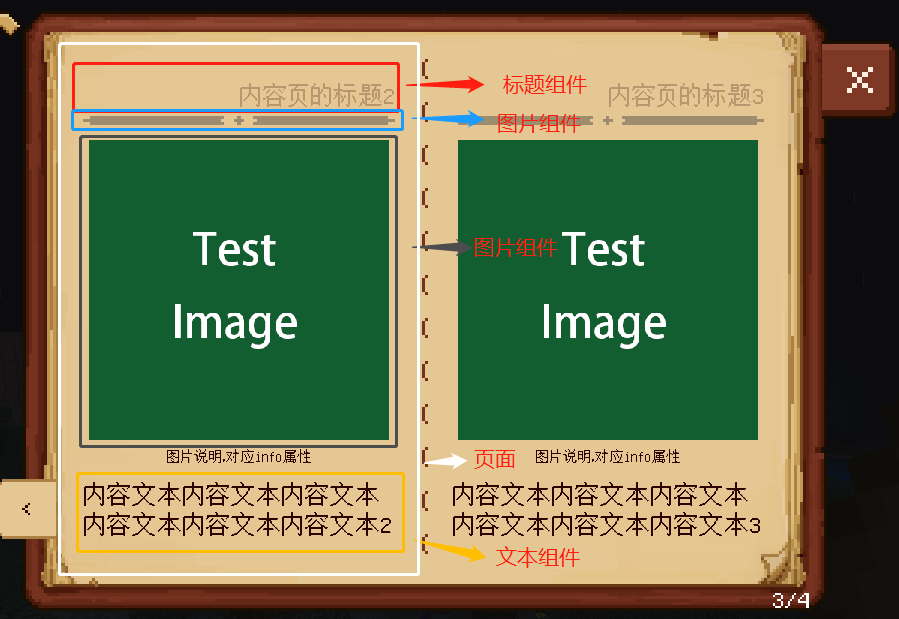
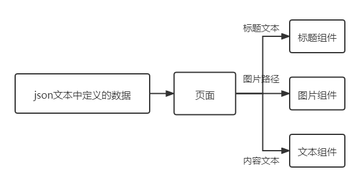
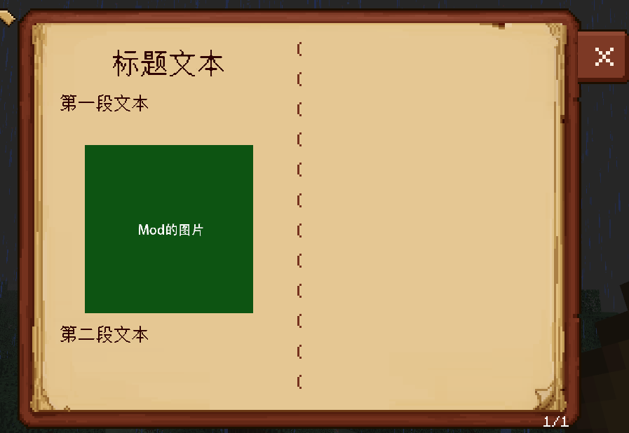

--- 
front: 
hard: Getting Started 
time: minutes 
sidebarDepth: 4 
--- 

# Script Custom Book 

## 1. Overview 

In the custom book framework, a chapter is composed of pages of a specific type, and the UI elements that make up a page are called components. The following figure simply shows what a page is and what a component is. 

 

According to the functional definition, the three levels of the book "book", "catalog", and "chapter" determine the layout of each page (for example, in a double-page book, page 1 will be placed on the left side of the book, and page 2 will be placed on the right side of the book) and whether each page can be displayed. 

The page is equivalent to the container of the component, which layouts the internal components as needed, and the component is the unit that actually stores and processes the displayed data. The so-called data is actually the book json file defined by the developer, which is obtained by the page and assigned to its built-in components. 

 

<center> Take the image page in the above picture as an example to show the data flow. </center> 

## 2. Custom page <span id="script custom page"></span> 

### 1. Create a page 

In the preset pages (such as image pages, text pages, etc.), there is generally a title processing. Here we first write a page without title processing to learn how to write a general page, and then do a similar title processing to the preset page. The following takes the page type "**MyNoTitlePage**" in [CustomBookMod] (../../13-Module SDK Programming/60-Demo Example.md#CustomBookMod) as an example. 

 

<center>A custom page</center> 

Before writing the script class, we first define the data in the file "**behavior_pack/customBooks/customBook/entry/noTitlePage.json**". For a custom page, except for the "**type**" attribute, other attributes can be customized (parsed by the script class written later). The "**type**" value is the name of the page to be written (which will be detailed when registering the page later). Here, the four attributes "**testTitle**", "**image**", "**content1**", and "**content2**" are customized. When writing the class later, we will use text components, image components, text components, and text components to store and display them respectively. 

myNoTitlePage.json 

``` 
{ 
"parent": "pages", 
"icon": "textures/items/bed_lime", 
"title": "Test page No Title", 
"lockMsg": "Need to unlock fixed achievements", 
"lockIcon": "textures/ui/book_gui/icon02", 
"isLocked": false, 
"pages":[ 
{ 
"type": "CustomMod:MyNoTitlePage", 
"testTitle": "Title text", 
"image": "textures/ui/myCustomBook/testImage",

"content1": "First paragraph of text", 
"content2": "Second paragraph of text" 
} 
] 
} 
``` 

In [CustomBookMod](../../13-Module SDK Programming/60-Demo Example.md#CustomBookMod), the script class corresponding to **myNoTitlePage.json** is **MyNoTitlePage** in "**behavior_pack/tutorialScripts/pages/noTitlePage.py**". A page needs to write 3 basic function interfaces: 

- Class initialization function "\_\_init\_\_" 
- Function "SetData" to get the data passed by json 
- Function "Show" to display the page 

These interfaces must conform to the format of chain calls and finally return **self**. **MyNoTitlePage** implements the most basic page, so it inherits **BasePage** here. **BasePage** does not include preprocessing of the title. If you need to preprocess the title, you need to inherit **TitlePage**, which will be mentioned later. For details of **BasePage**'s interface, see ["Page API"](04-Page API.md). In addition, the following code contains many uses of preset components, please refer to ["Component API"](03-Component API.md) for details. 

myNoTitlePage.py 

```python 
#-*- coding: UTF-8 -*- 

import mod.client.extraClientApi as clientApi 
# Get the book management object, see "05-Common Script Objects" for detailed usage 
bookManager = clientApi.GetBookManager() 
# Get the book configuration constants, see "05-Common Script Objects" for detailed API 
bcf = bookManager.GetBookConfig() 
# Get the page base class BasePage 
BasePage = bookManager.GetBasePageCls() 
# Get the preset component class TextComp 
TextComp = bookManager.GetTextCompCls() 
# Get the preset component class ImageComp 
ImageComp = bookManager.GetImageCompCls() 

class MyNoTitlePage(BasePage): 
""" 
Custom page class 
""" 
def __init__(self, size = None, position = None): 
"""" 
To write this interface, you need to write it as follows. 
1. First call the method of the same name of the parent class. 
2. Define the components you need to use. 
3. Call the AddComps interface to add all components. 
""" 
# Call the parent class __init__ method 
BasePage.__init__(self, size, position) 

# Instantiate the components you need to use 
self.testTitle = TextComp(bcf.TextAlign.Fit_Center) # Use the text component to store and display the custom attribute "testTitle"" 
self.content1 = TextComp(bcf.TextAlign.Left) # Use the text component to store and display the custom attribute "content1"" 
self.image = ImageComp() # Use the image component to store and display the custom attribute "image""

self.content2 = TextComp(bcf.TextAlign.Left) # Use the text component to store and display the custom attribute "content2"" 

# Call the AddComps interface to add all defined components 
self.AddComps(self.testTitle, self.content1, self.image, self.content2) 

# Correspond to the SetData method 
self.data = None 

def SetData(self, data): 
""" 
Before calling Show, the book will call this method to package the data in json into the Dict variable "data" as a parameter. 
It is recommended to store the data and then read it in the Show method. 
""" 
# Store the data of each component 
self.data = data 
return self 

def Show(self): 
""" 
After the book passes the data to the page, it calls this interface, which is responsible for filling the data for each component and formatting their positions. 
To write this interface, you need to write it as follows. 
1. Inject data into all components.
2. Call the method of the same name of the parent class. 
3. Reset the position of all components relative to the page. 
4. Lay out the components (by calling the layout API of the component, see "03-Component API" for the explanation of each API). 
""" 
if self.data: 
# Inject data into each component, the key value in data corresponds to the page attribute value in the json file 
self.testTitle.SetDataBeforeShow(self.data["testTitle"], bcf.TextSize.title) 
self.content1.SetDataBeforeShow(self.data["content1"], bcf.TextSize.content) 
self.content2.SetDataBeforeShow(self.data["content2"], bcf.TextSize.content) 
self.image.SetDataBeforeShow(self.data["image"]) 

# Execute the Show method of the parent class, which will call the Show method of all components in turn 
BasePage.Show(self) 
# Reset the position of all components relative to the page to ensure that the layout of the components is relative to the origin of the page each time Show is called 
self.ResetCompsPosition() 
# Get the center coordinates and size of the page for later use 
pageCenter = self.Center() 
pageSize = self.GetSize() 

# Lay out your own components. Before calling the Align and Move methods, you need to call the SetSize method because these methods are calculated based on GetSize. 
# testTitle is a Fit type text. It will adjust its size according to the text content. There is no need to call SetSize. Align its center to the center of the page, align its top edge with the top edge of the page, and then move it down 4px 
self.testTitle.AlignCenterToX(pageCenter[0]).AlignTopToY(self.Top()).MoveY(4) 
# After setting the size of content1, align its left edge to the left edge of the page, align its top edge with the bottom edge of testTitle, and then move it down 5px 
self.content1.SetSize((pageSize[0], 20)).AlignLeftToX(self.Left()).AlignTopToY(self.testTitle.Bottom()).MoveY(5) 
# After setting the size of image, align its left center to the center of the page, align its top boundary with the bottom boundary of content1, and then move it down 5px 
self.image.SetSize((80, 80)).AlignCenterToX(pageCenter[0]).AlignTopToY(self.content1.Bottom()).MoveY(5) 
# After setting the size of content2, align its left boundary to the left boundary of the page, align its top boundary with the bottom boundary of image, and then move it down 5px

self.content2.SetSize((pageSize[0], 40)).AlignLeftToX(self.Left()).AlignTopToY(self.image.Bottom()).MoveY(5) 

return self 
else: 
print "in MyNoTitlePage Show: no data present" 
return self 
``` 

In the **MyNoTitlePage** page, it actually contains a simple text title processing (the **self.testTitle** text component), and this book provides the **TitlePage** class to save developers from the title processing. For details, see [“Page API”](04-Page API.md), as well as “**behavior_pack/customBooks/customBook/entry/myTitlePage.json**” and “**behavior_pack/tutorialScripts/pages/myTitlePage.py**” in the Demo. 

### 2. Registration page 

After creating a custom page and the corresponding json file, you need to register your custom page in the system so that the system can read the class information when parsing the json file. You only need to call the registration interface when the **client System** is initialized. **BookManager** contains various interfaces for custom books. For details, see [BookManager API](05-Common Script Objects.md#BookManager). Because some common page types are built into the custom book system, developers try to use standardized names to name their own page types. It is recommended to use the fixed format "**Mod Name: Page Type Name**", where the page type name is recommended to be consistent with the defined class name (the class name will be more recognizable if it is followed by "**page**"). For example, the above **MyNoTitlePage** can be named "**CustomMod:MyNoTitlePage**". This custom page type name is used for the corresponding **type** field attribute value in the **json** data. 

```python 
# -*- coding: utf-8 -*- 

# Get the client engine API module 
import mod.client.extraClientApi as clientApi 
# Get the base class ClientSystem of the client system 
ClientSystem = clientApi.GetClientSystemCls() 

# Client System class registered in modMain 
class TutorialClientSystem(ClientSystem): 

# Client System initialization function 
def __init__(self, namespace, systemName): 
# First initialize the base class ClientSystem of TutorialClientSystem 
super(TutorialClientSystem, self).__init__(namespace, systemName) 
print "==== TutorialClientSystem Init ====" 
# Register a custom page 
# First import the defined page class 
from tutorialScripts.pages.myNoTitlePage import MyNoTitlePage 
from tutorialScripts.pages.myTitlePage import MyTitlePage 
from tutorialScripts.pages.customCompPage import MyCustomCompPage 
from tutorialScripts.pages.buttonPage import MyButtonPage 
from tutorialScripts.pages.addrPage import MyAddrPage 
from tutorialScripts.pages.recyclePage import MyRecyclePage 
# Get the book management object. For detailed usage, see "05-Common Script Objects" 
bookManager = clientApi.GetBookManager() 
# Register custom page classes and name them. These names are used in json 
bookManager.AddPageType("CustomMod:MyNoTitlePage", MyNoTitlePage) 
bookManager.AddPageType("CustomMod:MyTitlePage", MyTitlePage) 
bookManager.AddPageType("CustomMod:MyCustomCompPage", MyCustomCompPage) 
bookManager.AddPageType("CustomMod:MyButtonPage", MyButtonPage) 
bookManager.AddPageType("CustomMod:MyAddrPage", MyAddrPage)
        bookManager.AddPageType("CustomMod:MyRecyclePage", MyRecyclePage)
        print "============== add MyTestPage success =============="
 


# The function will be called only if it is named Destroy. When this System is recycled by the engine, this function will be called to destroy some content. 
def Destroy(self): 
pass 
``` 

### 3. How to use it for others 

If other developers want to use your custom page, they only need to load your MOD and then use your page type name when configuring the json of the custom book. 

## 3. Custom components (advanced) <span id="Script custom components"></span> 

This content is an **advanced** topic. If the developer is not satisfied with the **preset components** provided by the system, you can learn how to customize components here. Please note the following two points: 

- Before reading this, please master the use of **MC Studio** in [Interface and Interaction](../../../18-Interface and Interaction/2-Creating UI from Scratch.md) and be familiar with various **UI controls** (**BaseUIControl**), and write **UI json** files. 

- Currently, books only support the use of these controls to encapsulate components. For their introduction, see [UI Description Document](../../../18-Interface and Interaction/30-UI Description Document.md): 

- Label 
- NineSliceImage 
- Image Button 
- Panel 
- StackPanel 
- NeteasePaperDoll 
- ItemRenderer 
- ProgressBar 

In the custom book system, the UI control object is obtained by loading the **UI json** file, and the obtained UI control object is encapsulated as a component for use. We define a custom component **MyCustomComp** in [CustomBookMod](../../13-Module SDK Programming/60-Demo Example.md#CustomBookMod), and its script file is "**behavior_pack/tutorialScripts/comps/customComp.py**". The UI related to this component The json file is "**resource_pack/ui/CustomComp.json**", and a page is customized to use the component **MyCustomComp**. Its script file is "**behavior_pack/tutorialScripts/pages/customCompPage.py**". Then we use a chapter to call the page. The data is defined in the "**behavior_pack/customBooks/customBook/entry/customCompPage.json**" file. The final page display result of this chapter is as follows. 

 

<center>This custom component can be filled with pictures, texts, and set the text font size. There are two such components on this page, located in the upper left and lower right respectively. </center> 

### 1. Define UI json file <span id="UI template library"></span> 

Like [Interface and Interaction](../../../18-Interface and Interaction/2-Creating UI from Scratch.md), we can use MC Studio to create a UI template for a component, or we can write a UI json file according to the UI json file specification. In this example, we use MC Studio to create a UI control named testComp, which will be used as the encapsulation object of the custom component MyCustomComp. At the same time, the UI json file needs to meet the following node structure to be used by the component. We call the collection of all UI control nodes under comps the component's UI template library. 

Note! Please do not name the json file "book_preset.json", as the name has been used by the preset template. 

``` 
main (fixed name, must be "main") 
| comps (panel control, fixed name, must be "comps") 
| testComp (the root node of the UI to be used by the component, testComp in this case, and the control type of this node is not specified) 
| ... 
``` 

You can create multiple UI root nodes under the **comps** hierarchy, but a root node will only be bound to one component. 

And in order to make the custom component coordinate system consistent with the preset component coordinate system, the size of the **comps** node must be set as follows


 

The corresponding properties in the **UI json** file are **"size" : [ "100.0%+0.0px", "100.0%+0.0px" ]** 

```json 
"comps" : { 
"alpha" : 1.0, 
"anchor_from" : "center", 
"anchor_to" : "center", 
"clip_offset" : [ 0, 0 ], 
"clips_children" : false, 
"controls" : [ 
{ 
"testComp@CustomComp.testComp" : {} 
} 
], 
"enabled" : true, 
"layer" : 0, 
"max_size" : [ 0, 0 ], 
"min_size" : [ 0, 0 ], 
"offset" : [ 0, 0 ], 
"priority" : 0, 
"propagate_alpha" : false, 
"size" : [ "100.0%+0.0px", "100.0%+0.0px" ], 
"type" : "panel", 
"visible" : true 
} 
``` 

And the anchor point coordinate system of the child nodes under **Comps** (such as **testComp**) must be set as shown below: 

 

Corresponding to **UI The properties in the json** file are as follows: 

```json 
"anchor_from" : "top_left", 
"anchor_to" : "top_left", 
``` 

### 2. Create a component class 

Similar to a page, a component class needs to write 3 basic function interfaces: 

- Class initialization function "\_\_init\_\_" 

- Method to store data passed from the page "SetDataBeforeShow" 

- Function to display the component "Show"


These interfaces must conform to the format of chain calls and eventually return **self**. **MyCustomComp** implements a graphic control that can change the text size, color, content, and image based on the incoming data. 

The parent class inherited here is **BaseComp**. For details, please refer to ["Component API"](03-Component API.md). 

customComp.py 

```python 
#-*- coding: UTF-8 -*- 

import mod.client.extraClientApi as clientApi 
# Get the book management object, see "05-Common Script Objects" for detailed usage 
bookManager = clientApi.GetBookManager() 
# Get the book configuration constants, see "05-Common Script Objects" for detailed API 
bcf = bookManager.GetBookConfig() 
# Get the component base class BaseComp 
BaseComp = bookManager.GetBaseCompCls() 

class MyCustomComp(BaseComp): 
""" 
Customized book component class 
""" 
def __init__(self): 
""" 
To write this interface, you need to write it as follows. 
1. First call the method of the same name in the parent class. 
2. Define custom attributes 
""" 
# Call the parent class __init__ method, which will register the book custom component name, so this method can only be called once (one component is bound to one control node). 
# The first parameter is the registered name of the component. To prevent duplicate names, the recommended name format is 'mod name: any name', preferably with the "Comp" suffix. 
# The second parameter is the json file name where the UI control encapsulated by the component is located + '.main' 
# The third parameter is the name of the UI control node encapsulated by the component 
# The second and third parameters allow the component to locate the UI control node to be encapsulated. For more details, see the "Component API" section. 
BaseComp.__init__(self, "CustomMod:MyCustomComp", "CustomComp.main", "testComp") 

# Define custom attributes, which are exposed to the page 
self.text = None # Component text string, type str 
self.textSize = None # Component text size, type int 
self.textColor = None # Component text color, type tuple(4) 
self.image = None # Component image path, type str 

def SetDataBeforeShow(self, image, text, textColor, textSize): 
""" 
The page will call this method by default to store data before calling the component's Show 
It is recommended to store the data and then read it in the Show method. 
""" 
# Store data passed by the page 
self.text = text 
self.textSize = textSize

self.textColor = textColor 
self.image = image 

return self 

def Show(self): 
""" 
The page calls this interface after passing data to the component. The component operates the UIControl node here. 
To write this interface, you need to write it as follows. 
1. Call the method of the same name of the parent class. 
2. Process your UIControl node according to specific logic 
""" 
# Execute the Show method of the parent class. Only after executing this method can the component get the corresponding UI control node and point to it with the _node_ attribute. 
BaseComp.Show(self) 

# Fill the UI control node with data. _node_ is the UI control node corresponding to the component (testComp in this demo, that is, the third parameter in the __init__ method). 
textNode = self.GetRootUINode().GetChildByPath("/text").asLabel() 
# If it is a LabelUIControl node, you need to call SetNodeText and SetTextFontSize respectively to set the text and font size. For details, see the "Component API" section. 
self.SetNodeText(textNode, self.text).SetNodeTextFontSize(textNode, 10, self.textSize) 
textNode.SetTextColor(self.textColor) 
imageNode = self.GetRootUINode().GetChildByPath("/image").asImage() 
imageNode.SetSprite(self.image) 
return self 
``` 

Essentially, a component is a UI control node with data. When a component calls Show, the custom book system copies the corresponding node in the UI template to the component. Therefore, if the component does not call Show but calls the UI control in it or the child nodes under the UI control, an error will be reported. 

Although most of the nodes written have copy operations, they can be set to be recyclable when initializing the nodes to prevent excessive copying and deletion of UI control nodes. For details, see the ["Component API"](03-Component API.md) section 

