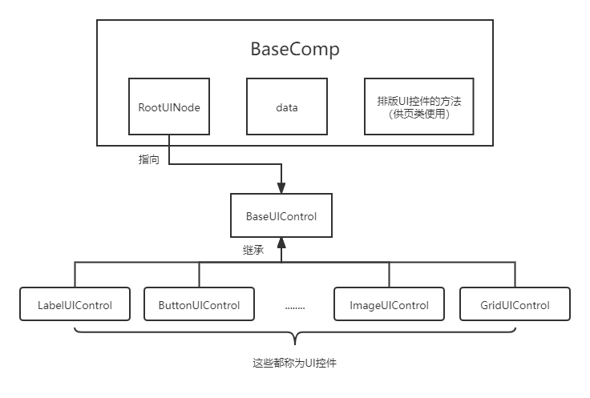
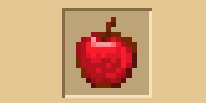
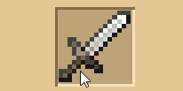
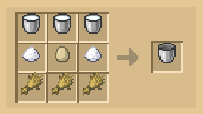
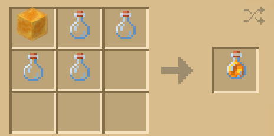
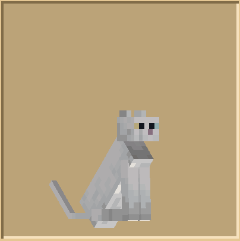
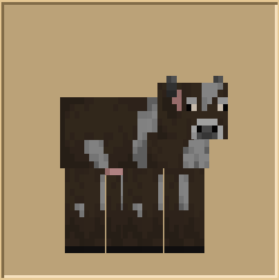

--- 
front: 
hard: Getting Started 
time: minutes 
sidebarDepth: 4 
--- 

# Component API 

## 1.BaseComp 

All book components inherit **BaseComp**, which essentially encapsulates data and UI control objects together, and correctly fills data into corresponding UI controls through program logic, while UI controls are obtained from [UI Template Library](02-Script Custom Book.md#UI Template Library). The overall structure is as follows. 

 

### 1. Override method 

#### \_\_init\_\_ 

- Description 

Initialize the component. 

- Parameters 

| Parameter Name | Data Type | Description | 
| ------------ | -------- | ------------------------------------------------------------ | 
| compName | str | The name of the registered custom component. To prevent duplicate names, the recommended name format is 'mod name: component name'. | 
| jsonFile | str | The json file name (without suffix) + '.main' where the UI control encapsulated by the component is located. | 
| compNodeName | str | The name of the UI control node encapsulated by the component, which serves as the UI root node (RootUINode) of the component. | 
| recycled | bool | Whether the component is recyclable, see the notes for details. <br>The default value is False | 

- Return value 

| Data type | Description | 
| -------- | -------- | 
| BaseComp | Component instance | 

- Notes 

- When you customize a component, you must override the class initialization method and execute the parent class "**\_\_init\_\_**" method. For how to override, please refer to [Script Custom Book](02-Script Custom Book.md#Script Custom Component). 
- When a custom book displays a component for the first time, it will copy the corresponding UI control node from the UI template library to the book interface and display it. **If the component recycling is turned on**, then when the component is not displayed (for example, when turning pages, the component on the first page will call the Hide method to hide), **the copied UI control node will not be deleted**, but will be added to the idle node queue. When **the component is displayed for the second time** or there are **other components with the same name to be displayed**, it will find available UI control nodes from the idle queue to avoid excessive deletion and copying. However, due to node reuse, if the properties of the UI control node are changed for the first time, you must consider which properties need to be reset when reusing it. Therefore, if the component recycling is turned on, the Reset method must be rewritten. The component will call Reset before calling Hide. 
- If the component recycling is turned off, the copied UI control node will be deleted immediately when the component is not displayed, and will not be added to the idle node queue. When the component is displayed again, the corresponding UI control node will be copied from the UI template library again for display. Therefore, there is no need to consider property reset and rewrite the Reset method. 
- Because there is a performance overhead in copying UI nodes, turning on component recycling can improve the speed of UI rendering to a certain extent, but it also increases memory usage and program logic control. 
- A component can only correspond to one UI control root node. When the component calls the parent class "\_\_init\_\_**" method, it will register the name compName for this component (with internal prevention of repeated registration). Every time the component needs to be displayed, it will obtain the corresponding UI control root node from the UI template library according to compName.

#### Show 

- Description 


Show component. 

- Parameters 

None 

- Return value 

| Data type | Description | 
| -------- | -------- | 
| BaseComp | Component instance | 

- Notes 

- When you customize a component, you must override this method and execute the parent class's Show method. You must return to yourself to support chain calls. For how to override, please refer to [Script Custom Book] (02-Script Custom Book.md#Script Custom Component). 
- When to call this method: This method is called by the page class. The page class calls its own Show method before layouting the component, thereby calling the component's Show method. 
- The component will only copy and display the UI control node when it is displayed, so the encapsulated UI control node cannot be obtained before the component is displayed. 
- Usually, data is set to the UI control node in this method. 

#### Hide 

- Description 

Hide the component. 

- Parameters 

None 

- Return value 

| Data type | Description | 
| -------- | -------- | 
| BaseComp | Component instance | 

- Notes 

- When you customize a component, you can **not override this method**, but if you override this method, you must actively call the parent class **Hide** method at the end, and must return to itself to support chain calls. 
- When to call this method: This method is called by the page class. When the page class is hidden, it will call its own **Hide** method, thereby calling the component's **Hide** method. 
- If the component is recyclable, calling this method will call the component's **Reset** method to reset the properties of the UI control nodes in the component. If the component is not recyclable, the UI control nodes in it will be directly deleted and copied from the UI template library again when it is displayed next time. 

- Example 

```python 
def Hide(self): 
""" 
This is a rewrite example of a component class that inherits BaseComp. For example, if we want to clear the data in the component before hiding it, we can write it as follows 
""" 
# Clear the data in the component 
self.clearData()

# Just complete other logic in the front, and finally call the parent class method. 
return BaseComp.Hide(self) 
``` 

#### Reset<span id="Reset"></span> 

- Description 

Reset the properties of the UI control node when the component is recycled. 

- Parameters 

None 

- Return value 

| Data type | Description | 
| -------- | -------- | 
| BaseComp | Component instance | 

- Notes 

- When you customize a component, you can **not rewrite this method**, but if the type of the component is **recyclable**, it is recommended to rewrite this method, in which **there is no need to call the parent class Reset method**. 
- When to call this method: This method is called by the component, and the component will call this method first when calling Hide. 
- If the default properties of the UI control node (defined in UI json) are modified in the Show method, and the component hopes to read the default value every time it is Showed, you need to fill in the logic in this method, otherwise just return self directly. 

- Example 

To illustrate the necessity of rewriting the Reset function, here is an example of an error. The structure of the UI control node in this example is as follows: 

```python 
| RootUINode # Control node encapsulated by the component (root node) 
| entity # Ragdoll control 
| background # Image control 
``` 

We hope to provide an offset property in the component to move the entity node up 3px relative to its default position (layout in UI Json). 

```python 
def Show(self): 
# Get entity node 
entityNode = self.GetRootUINode().GetChildByPath("/entity").asNeteasePaperDoll() 
# Read current entity position 
pos = entityNode.GetPosition() 
newPos = (pos[0], pos[1] - 3) 
entityNode.SetPosition(newPos) 
``` 

The Show method needs to get the position of the node before offsetting. Each Show will cause the node offset to be superimposed, and the final result will look like the following figure (the component gradually moves up). 


 

In order to solve the problem caused by the reuse of UI controls, you can use the Reset method to reset the properties of this class so that the pos obtained each time is consistent with the default value defined in the UI json. 

```python 
def Show(self): 
# Get entity node 
entityNode = self.GetRootUINode().GetChildByPath("/entity").asNeteasePaperDoll() 
# Read the current entity position 
pos = entityNode.GetPosition() 
newPos = (pos[0], pos[1] - 3) 
entityNode.SetPosition(newPos) 
# Record the position 
self.originPos = pos 

def Reset(self): 
entityNode = self.GetRootUINode().GetChildByPath("/entity").asNeteasePaperDoll() 
# Restore the position attribute 
entityNode.SetPosition(self.originPos) 
``` 

This method is a unified interface, mainly **to remind developers of issues that need to be paid attention to when using component reuse**. Developers can completely reset properties in other ways (such as storing the default properties when reading for the first time and reading them later when showing) without **rewriting the Reset method**. 

For example, in our Demo, there is a custom component **MyRecyleToggle**. For details, see the usage in the example [CustomBookMod](../../13-Module SDK Programming/60-Demo Example.md#CustomBookMod) in "**behavior_pack/tutorialScripts/comps/recycleToggleComp.py"** and the custom page "**behavior_pack/tutorialScripts/pages/recyclePage.py"** and **json** data "**behavior_pack/customBooks/RecycleBook"** (the Chinese name of the item corresponding to the book is: "**Recycling Component Test Book**"), the **Reset** method of this component is not specifically implemented, but the component records the status and only reads the first data from the **json** data. 

In addition, for the convenience of developers, some common reuse problems have been solved by built-in tools and methods. For example, the control reuse problem caused by node offset can be solved by using the tool method **SetNodeOffset** provided in **BaseComp**. For more information, see the following methods. 

### 2. Methods for layout UI controls 

BaseComp provides a series of methods to facilitate developers to layout in the page. These methods are based on the UI coordinate system, see [“Custom Book UI Coordinate System”] (01-Custom Basic Book.md# Page Writing). Before calling the layout method on the component, you need to ensure that the component is in the **display state**, that is, the component has obtained the encapsulated **UI control object**. 

Layout of components is actually to operate the **control root node** encapsulated by the component. The four most basic methods are **GetPosition, SetPosition, GetSize, SetSize**. The remaining methods essentially call these four methods, such as **Left, Right, Top, Bottom, Center** to get the left and right boundaries, upper and lower boundaries, and center of the component, as well as various methods to align the component with other things (methods prefixed with **Align**), and methods prefixed with **Move**. These methods must call **SetSize** before using them, otherwise unexpected results will occur when the component is laid out. 

#### GetPosition 

- Description 

Get the position of the component in the book coordinate system. 

- Parameters 

None 

- Return value 

| Data type | Description | 
| --------------- | ------------------------------------ | 
| tuple(int, int) | The position of the component in the book coordinate system, in pixels | 

- Notes

- The **anchor** of the root node control of the component is located in the **upper left corner**, as shown in [Custom Components](02-Script Custom Book.md#Script Custom Components), so the coordinates obtained here also refer to the coordinates of the anchor point in the book coordinate system, see [Book Coordinate System](01-Custom Basic Book.md#Page Writing). 

#### SetPosition 

- Description 

Set the position of the component in the book coordinate system. 

- Parameters 

| Parameter Name | Data Type | Description | 
| ----------- | --------------- | -------------------------------------- | 
| newPosition | tuple(int, int) | The position of the component in the book coordinate system, in pixels. | 

- Return value 

| Data type | Description | 
| -------- | -------- | 
| BaseComp | Component instance | 

- Notes 
- This method actually calls the **SetPosition** method of the root node control in the component. 

#### GetSize 

- Description 

Get the size of the component 

- Parameters 

None 

- Return value 

| Data type | Description | 
| --------------- | ------------------------ | 
| tuple(int, int) | The size of the component in pixels. | 

- Notes 
- This method actually calls the **GetSize** method of the root node control in the component. 

#### SetSize 

- Description 

Set the component size 

| Parameter name | Data type | Description | 
| ------- | -------------- | ---------------------------- |

| newSize | tuple(int, int) | Set the component size in pixels. | 

- Return value 

| Data type | Description | 
| -------- | -------- | 
| BaseComp | Component instance | 

- Notes 
- This method actually calls the **SetSize** method of the root node control in the component. If the node controls under the root node are all adaptive layout structures (for example, the size is defined as **follow the percentage of the parent control**), then when the component size is changed, the adaptive node controls under the root node will also change. If the node controls under the root node are non-adaptive layouts, their fixed sizes will not change. 
- If the developer is not satisfied with the series of control layout methods provided by the UI, it is recommended to rewrite this method to define your own control scaling rules. 

#### Center 

- Description 

Get the center coordinates of the component 

- Parameters 

None 

- Return value 

| Data type | Description | 
| --------------- | ---------------------------- | 
| tuple(int, int) | The center coordinates of the component, in pixels. | 

#### Left 

- Description 

Get the X value of the left border of the component 

- Parameters 

None 

- Return value 

| Data type | Description | 
| -------- | ----------------------------- | 
| int | The X value of the left border of the component, in pixels. | 

#### Right 

- Description 

Get the X value of the right border of the component 


- Parameters 

None 

- Return value 

| Data type | Description | 
| -------- | ----------------------------- | 
| int | The X value of the right border of the component, in pixels. | 

#### Top 

- Description 

Get the Y value of the top border of the component 

- Parameters 

None 

- Return value 

| Data type | Description | 
| -------- | ----------------------------- | 
| int | The Y value of the top border of the component, in pixels. | 

#### Bottom 

- Description 

Get the Y value of the bottom border of the component 

- Parameters 

None 

- Return value 

| Data type | Description | 
| -------- | ----------------------------- | 
| int | The Y value of the bottom border of the component, in pixels. | 

#### MoveToX 

- Description 

Do not change the Y value of the component position coordinates, and set the X value of the component position coordinates separately 

- Parameters 


| Parameter name | Data type | Description | 
| ------ | -------- | --------------------------- | 
| x | int | Set the x value of the coordinate in pixels. | 

- Return value 

| Data type | Description | 
| -------- | -------- | 
| BaseComp | Component instance | 

#### MoveToY 

- Description 

Do not change the X value of the component position coordinate, but set the Y value of the component position coordinate separately 

- Parameter 

| Parameter name | Data type | Description | 
| ------ | -------- | --------------------------- | 
| y | int | Set the y value of the coordinate in pixels. | 

- Return value 

| Data type | Description | 
| -------- | -------- | 
| BaseComp | Component instance | 

#### MoveX 

- Description 

Move a certain distance along the positive direction of the X axis 

- Parameter 

| Parameter name | Data type | Description | 
| ------ | -------- | -------------------------------------------------------- | 
| x | int | The distance moved. If it is a negative number, it means moving in the negative direction. The unit is pixel. | 

- Return value 

| Data type | Description | 
| -------- | -------- | 
| BaseComp | Component instance | 

#### MoveY 

- Description 


Move a distance along the positive direction of the Y axis 

- Parameters 

| Parameter name | Data type | Description | 
| ------ | -------- | -------------------------------------------------------- | 
| y | int | The distance to move. If it is a negative number, it means moving in the negative direction. The unit is pixel. | 

- Return value 

| Data type | Description | 
| -------- | -------- | 
| BaseComp | Component instance | 

#### AlignCenterToX 

- Description 

Move the component horizontally so that the center of the component is at the specified x value 

- Parameters 

| Parameter name | Data type | Description | 
| ------ | -------- | ----------------------- | 
| x | int | The specified x value. The unit is pixel. | 

- Return value 

| Data type | Description | 
| -------- | -------- | 
| BaseComp | Component instance | 

#### AlignCenterToY 

- Description 

Move the component vertically so that the center of the component is at the specified y value 

- Parameters 

| Parameter name | Data type | Description | 
| ------ | -------- | ----------------------- | 
| x | int | The specified x value in pixels. | 

- Return value 

| Data type | Description | 
| -------- | -------- | 
| BaseComp | Component instance | 


#### AlignCenterToPosition 

- Description 

Move the component so that the center of the component is at the specified coordinate value 

- Parameters 

| Parameter name | Data type | Description | 
| -------- | --------------- | -------------------------- | 
| position | tuple(int, int) | Specified coordinate value, in pixels. | 

- Return value 

| Data type | Description | 
| -------- | -------- | 
| BaseComp | Component instance | 

#### AlignLeftToX 

- Description 

Move the component horizontally so that the left edge of the component is at the specified x value 

- Parameters 

| Parameter name | Data type | Description | 
| ------ | -------- | ----------------------- | 
| x | int | Specified x value, in pixels. | 

- Return value 

| Data type | Description | 
| -------- | -------- | 
| BaseComp | Component instance | 

#### AlignRightToX 

- Description 

Move the component horizontally so that the right edge of the component reaches the specified x value 

- Parameters 

| Parameter name | Data type | Description | 
| ------ | -------- | ----------------------- | 
| x | int | The specified x value in pixels. | 

- Return value 


| Data Type | Description | 
| -------- | -------- | 
| BaseComp | Component Instance | 

#### AlignTopToY 

- Description 

Move the component vertically so that the upper boundary of the component is at the specified y value 

- Parameters 

| Parameter Name | Data Type | Description | 
| ------ | -------- | ----------------------- | 
| y | int | The specified y value in pixels. | 

- Return Value 

| Data Type | Description | 
| -------- | -------- | 
| BaseComp | Component Instance | 

#### AlignBottomToY 

- Description 

Move the component vertically so that the lower boundary of the component is at the specified y value 

- Parameters 

| Parameter Name | Data Type | Description | 
| ------ | -------- | ----------------------- | 
| y | int | The specified y value in pixels. | 

- Return value 

| Data type | Description | 
| -------- | -------- | 
| BaseComp | Component instance | 

### 3. Methods related to UI control nodes 

#### GetRootUINode 

- Description 

Get the root node of the UI control encapsulated by the component 

- Parameters 


None 

- Notes 

- This method returns the root node of BaseUIControl type only when the component is visible 

- If the component is not visible, an error will be reported and None will be returned 

- Return value 

| Data type | Description | 
| ------------- | ------------------------ | 
| BaseUIControl | The root node of the UI control encapsulated by the component | 

#### HasRootUINode 

- Description 

Determine whether the component has a UI control root node 

- Parameters 

None 

- Return value 

| Data type | Description | 
| -------- | ------------------------------------------------- | 
| bool | Returns True if the component has a UI control root node, otherwise returns False | 

#### SetNodeOffset 

- Description 

Offset the position of the UI control node (and its child nodes) encapsulated by the component. 

- Parameters 

| Parameter name | Data type | Description | 
| ------ | -------------- | -------------------- | 
| node | BaseUIControl | Node to be offset | 
| offset | tuple(int, int) | Offset value, in pixels. | 

- Notes 

- This method is mainly used to solve the problem of reuse of UI control nodes in components. When this method is called, the position of the node before offset will be recorded, and then the position of the node will be restored when the component is hidden to ensure that it is still correct when the component is displayed next time. Therefore, users do not need to reset the position of the corresponding node in Reset. 

- Return value 

| Data type | Description | 
| -------- | -------- |

| BaseComp | Component Example | 

- Example 

Still using the example of the **Reset** function, the UI control node structure in the component is as follows: 

```python 
| RootUINode # Control node encapsulated by the component (root node) 
| entity # Ragdoll control 
| background # Picture control 
``` 

When displaying, move the entity node up 3px relative to its default position (layout in UI Json). 

```python 
def Show(self): 
# Get entity node 
entityNode = self.GetRootUINode().GetChildByPath("/entity").asNeteasePaperDoll() 
# Offset entity node 
self.SetNodeOffset(entityNode, (0, -3)) 
``` 

And there is no need to rewrite the **Reset** function. 

#### SetNodeSize 

- Description 

Set the size of the UI control node (and its descendant nodes) encapsulated by the component. 

- Parameters 

| Parameter name | Data type | Description | 
| ------- | --------------- | -------------------- | 
| node | BaseUIControl | Node to be offset | 
| newSize | tuple(int, int) | Node size to be set | 

- Notes 

- This method is similar to **SetNodeOffset**, mainly to solve the problem of UI control node reuse in components, and users do not need to reset the size of the corresponding node in Reset. 

- Return value 

| Data type | Description | 
| -------- | -------- | 
| BaseComp | Component instance | 

#### SetNodeText 

- Description


Sets the text for the text control (LabelUIControl) specified in the component. 

- Parameters 

| Parameter name | Data type | Description | 
| ------ | ------------- | ---------------- | 
| node | BaseUIControl | Text node to be set | 
| text | str | Text value to be set | 

- Return value 

| Data type | Description | 
| -------- | -------- | 
| BaseComp | Component instance | 

- Notes 

- Compared with calling the **SetText** method directly after obtaining the **LabelUIControl** control node, this method refreshes the interface after setting the text. 
- This method needs to reset the text in Reset when the component is recycled. 

- Example 

For example, the UI control node structure in the component is as follows: 

```python 
| RootUINode # Control node encapsulated by the component (root node) 
| somepanel # panel 
| text # Text control (LabelUIControl) 
``` 

When displaying, modify the text of the "**text" control node** to "**hello world**": 

```python 
def Show(self): 
# Get text node 
textNode = self.GetRootUINode().GetChildByPath("/somepanel/text") 
# Set text 
self.SetNodeText(textNode, "hello world") 
``` 

#### SetNodeTextFontSize 

- Description 

Set the text size of the text control (LabelUIControl) specified in the component 

- Parameters 

| Parameter name | Data type | Description |

| -------------- | ------------- | ----------------------------------------------------- | 
| node | BaseUIControl | The text node to be set | 
| originFontSize | int | The original size of the text (the default value defined in UI json), in pixels. | 
| newFontSize | int | The text size to be set, in pixels. | 

- Return value 

| Data type | Description | 
| -------- | -------- | 
| BaseComp | Component instance | 

- Notes 

- When this method is combined with component recycling, the font size value needs to be reset in Reset. 

- Example 

For example, the UI control node structure in the component is as follows: 

```python 
| RootUINode # Control node encapsulated by the component (root node) 
| somepanel # panel 
| text # Text control (LabelUIControl) 
``` 

The original font size of the "**text**" control node is 8, which is changed to 10 when displayed: 

```python 
def Show(self): 
# Get text node 
textNode = self.GetRootUINode().GetChildByPath("/somepanel/text") 
# Set text 
self.SetNodeTextFontSize(textNode, 8, 10) 
``` 

#### GetNodeCenterGlobal 

- Description 

Get the global coordinates of the center of the specified UI control node in the component 

- Parameters 

| Parameter name | Data type | Description | 
| ------ | ------------- | ---------------- | 
| node | BaseUIControl | Specified UI control node | 

- Return value 

| Data type | Description |

| --------------- | ---------------------------- | 
| tuple(int, int) | Specify the global coordinates of the center of the UI control node | 

- Notes 

- The global coordinate system is different from the book coordinate system, see [Global Coordinate System](01-Custom Basic Book.md# Page Writing) 

#### SetLayer 

- Description 

Change the UI level of the root node of the UI control encapsulated by the component 

- Parameters 

| Parameter name | Data type | Description | 
| ------ | -------- | -------------- | 
| layer | int | UI level to set | 

- Return value 

| Data type | Description | 
| -------- | -------- | 
| BaseComp | Component instance | 

- Notes 

- When this method is combined with component recycling, the UI level needs to be reset in Reset. 

### 4. Other tool methods 

#### Call 

- Description 

Call callback function 

- Parameters 

| Parameter name | Data type | Description | 
| ------------ | -------- | -------------------------------- | 
| callbackDict | dict | Callback function and its parameters (see notes for properties) | 

- Return value 

| Data type | Description | 
| -------- | ---------------- | 
| object | Return value of callback function | 


- Notes 

- This function is mainly used to pass callback functions as additional data into components (such as **ButtonComp**) 

- The format of callbackDict is as follows: 

| Parameter name | Data type | Description | 
| ------ | -------- | ------------------------------------------------------ | 
| func | function | Callback function | 
| args | list | Callback function parameter list. If the callback function has no parameters, this property does not need to be defined | 

- Example 

```python 
""" 
We define two callback functions and then use Call to call them respectively 
""" 
def func_1(): 
pass 
def func_2(args1, args2): 
pass 

callbackDict_1 = { 
"func": func_1 # func_1 function has no parameters, so no parameter list is passed in here 
} 
callbackDict_2 = { 
"func": func_2, 
"args": [1, 2] # The func_2 function requires two parameters, so the parameter list containing two parameters is passed in here 
} 

comp = BaseComp() 
comp.Call(callbackDict_1) 
comp.Call(callbackDict_2) 
``` 

#### GetPage 

- Description 

Returns the page object where the component is currently located 

- Parameters 

None 

- Return value 

| Data type | Description | 
| ---------------------------------- | ---------------------------------------------------- | 
| [BasePage](04-Page API.md#BasePage) | Page instance<br>If the component is not added to any page, None is returned |


## 2. System preset controls 

All preset controls are inherited from **BaseComp**. You must set the component data before displaying the component. 

### 1.TextComp 

#### \_\_init\_\_ 

- Description 

Text component initialization 

- Parameters 

| Parameter name | Data type | Description | 
| --------- | -------- | ------------------------------------------------------------ | 
| textAlign | int | Text alignment, optional values are as follows, with graphic descriptions in the notes: <br>BookConfig.TextAlign.Left<br>BookConfig.TextAlign.Right<br>BookConfig.TextAlign.Center<br>BookConfig.TextAlign.Fit_Left<br>BookConfig.TextAlign.Fit_Center<br>BookConfig.TextAlign.Fit_Right<br>Default value: BookConfig.TextAlign.Left | 

- Return value 

| Data type | Description | 
| -------- | -------- | 
| TextComp | Component instance | 

- Notes 

 

The **Fit prefix** indicates that the size of the **root node** of the UI control will adapt to the text content (the **red box** is the actual border of the root node of the UI control), so calling the **SetSize** method for the **Fit** type text component is **invalid**. Please note that the alignment of the text box has nothing to do with the actual alignment of the component it is in. The alignment of the component needs to call various Align methods to achieve it. The object of alignment is the root node of the UI control, and the alignment of the text box indicates the alignment within the box (and **vertical centering is not supported within the box**). 

- Example 

```python 
import mod.client.extraClientApi as clientApi 
# Get the book management object, see "05-Common Script Objects" for detailed usage 
bookManager = clientApi.GetBookManager() 
# Get the book configuration constants, see "05-Common Script Objects" for detailed API 
bcf = bookManager.GetBookConfig() 
# Get the preset component class TextComp 
TextComp = bookManager.GetTextCompCls() 
# Create a TextComp instance 
textComp = TextComp(bcf.TextAlign.Fit_Center) 
``` 


#### SetDataBeforeShow 

- Description 


Set the component data before displaying it 

- Parameters 

| Parameter name | Data type | Description | 
| -------- | -------- | ------------------------------------------------------------ | 
| text | str | Text content | 
| textSize | int | Font size of text content, in pixels<br>Default value is **BookConfig.TextSize.content**, value is **10** | 

- Return value 

| Data type | Description | 
| -------- | -------- | 
| TextComp | Component instance | 

- Notes 

- This function should be called before the component is displayed (that is, before the component calls **Show**) 

- Example 

```python 
textComp.SetDataBeforeShow("hello world", 12) # Content is "hello world", font size is 12px 
textComp.Show() 
``` 

#### SetAlpha 

- Description 

Set the transparency of the text font 

- Parameters 

| Parameter name | Data type | Description | 
| ------ | -------- | -------------------------- | 
| alpha | float | Transparency value, the range is (0, 1) | 

- Return value 

| Data type | Description | 
| -------- | -------- | 
| TextComp | Component instance | 

- Notes 

- Before using this method, ensure that the component is in the display state (that is, after calling **Show**), because this method essentially calls **SetAlpha** of the control node. 

- Example 


```python 
textComp.SetAlpha(0.5) # Set text translucency 
``` 

#### SetColor 

- Description 

Set text font color 

- Parameters 

| Parameter name | Data type | Description | 
| ------ | --------------------------------- | ---------------------------------------------- | 
| color | tuple(float, float, float, float) | Color value, RGBA four channel values, range is (0, 1) | 

- Return value 

| Data type | Description | 
| -------- | -------- | 
| TextComp | Component instance | 

- Notes 

- Before using this method, make sure the component is in display state (that is, after calling **Show**), because this method essentially calls **SetColor** of the control node. 

- Example 

```python 
textComp.SetColor((0, 0, 1.0, 1.0)) # Set the text color to blue 
``` 

### 2.ImageComp 

#### \_\_init\_\_ 

- Description 

Image component initialization 

- Parameters 

| Parameter name | Data type | Description | 
| --------------- | -------- | ------------------------------------------------------------ | 
| imageResizeRule | int | Image resizing rule, optional values are as follows, the notes will be illustrated: <br>BookConfig.ImageReszieRule.Ninesliced<br>BookConfig.ImageReszieRule.Fit<br/>The default value is **BookConfig.ImageReszieRule.Ninesliced** | 

- Return value 

| Data type | Description |

| --------- | -------- | 
| ImageComp | Component Example | 

- Notes 

 

**Fit** means that the image maintains a fixed aspect ratio, while **Ninesliced** will change the aspect ratio of the original image to adapt it to the given size. 

- Example 

```python 
import mod.client.extraClientApi as clientApi 
# Get the book management object, see "05-Common Script Objects" for detailed usage 
bookManager = clientApi.GetBookManager() 
# Get the book configuration constants, see "05-Common Script Objects" for detailed API 
bcf = bookManager.GetBookConfig() 
# Get the preset component class ImageComp 
ImageComp = bookManager.GetImageCompCls() 
# Create an ImageComp instance 
imageComp = ImageComp(BookConfig.ImageReszieRule.Fit) # The scaling rule of this image component is a fixed aspect ratio 
``` 

#### SetDataBeforeShow 

- Description 

Set the component data before displaying the component 

- Parameters 

| Parameter name | Data type | Description | 
| ------ | -------- | ------------------------------------------------------------ | 
| image | str | The path of the image to be displayed. Here is the path string. For example, if you want to index the image "**resource_pack/textures/items/apple.png**", write the address "**textures/items/apple**". | 

- Return value 

| Data type | Description | 
| -------- | -------- | 
| BaseComp | Component instance | 

- Notes 

- This function should be called before the component is displayed (that is, before the component calls **Show**) 

- Example 

```python 
imageComp.SetDataBeforeShow("textures/items/apple") # The image is displayed as an apple 
imageComp.Show()

``` 

#### SetAlpha 

- Description 

Set the transparency of the image 

- Parameters 

| Parameter name | Data type | Description | 
| ------ | -------- | -------------------------- | 
| alpha | float | Transparency value, the range is (0, 1) | 

- Return value 

| Data type | Description | 
| -------- | -------- | 
| BaseComp | Component instance | 

- Notes 

- Before using this method, you must ensure that the component is in the display state (that is, after calling **Show**), because this method essentially calls **SetAlpha** of the control node. 

- Example 

```python 
imageComp.SetAlpha(0.5) # Set the image to be semi-transparent 
``` 

### 3.HighlightComp 

#### \_\_init\_\_ 

- Description 

Initialize the carousel item component 

- Parameters 

None 

- Return value 

| Data type | Description | 
| ------------- | -------- | 
| HighlightComp | Component instance | 

- Notes 


 

This component will play the next item every 3 seconds, and click to display the item information. 

- Example 

```python 
import mod.client.extraClientApi as clientApi 
# Get the book manager object, see "05-Common Script Objects" for detailed usage 
bookManager = clientApi.GetBookManager() 
# Get the preset component class HighlightComp 
HighlightComp = bookManager.GetHighlightCompCls() 
# Create a HighlightComp instance 
highlightComp = HighlightComp() 
``` 

#### SetDataBeforeShow 

- Description 

Set the component data before displaying the component 

- Parameters 

| Parameter name | Data type | Description | 
| -------- | -------- | -------------------------------- | 
| itemData | dict | Item data to be rotated, see the notes for the format | 

- Return value 

| Data type | Description | 
| ------------- | -------- | 
| HighlightComp | Component instance | 

- Notes 

- This function should be called before the component is displayed (that is, before the component calls **Show**) 

- itemData is of **List** type, and the format of each element stored is as follows: 

| Parameter name | Data type | Description | 
| ------ | -------- | ------------------------------------------------------------ | 
| item | str | **identifier** of the item, supports [custom items](../1-Custom items/1-Custom basic items.md) | 
| data | int | **AuxValue** of the item, this attribute can be left blank, the default value is 0. | 

- Example 

```python 
itemData = [ 
{

"item": "minecraft:iron_pickaxe", 
"data": 0 
}, 
{ 
"item": "minecraft:iron_shovel", 
"data": 0 
}, 
{ 
"item": "minecraft:iron_sword", 
"data": 0 
} 
] 
highlightComp.SetDataBeforeShow(itemData) # Set up a carousel of 3 items 
highlightComp.Show() 
``` 

The result is as follows: 

 

### 3.TableRecipeComp 

#### \_\_init\_\_ 

- Description 

Workbench Crafting Table Component Initialization 

- Parameters 

None 

- Return Value 

| Data Type | Description | 
| --------------- | -------- | 
| TableRecipeComp | Component Instance | 

- Notes 

 

If the crafting table outputs multiple items, the output items will be rotated at the crafting item location just like the carousel item component, and item information can be displayed by clicking on the item. 

- Example 

```python 
import mod.client.extraClientApi as clientApi 
# Get the book management object, see "05-Common Script Objects" for detailed usage 
bookManager = clientApi.GetBookManager()

# Get the preset component class TableRecipeComp 
TableRecipeComp = bookManager.GetTableRecipeCompCls() 
# Create a TableRecipeComp instance 
tableRecipeComp = TableRecipeComp() 
``` 

#### SetDataBeforeShow 

- Description 

Set the component data before displaying the component 

- Parameters 

| Parameter name | Data type | Description | 
| -------- | -------- | ------------------------------------------------------------ | 
| recipeId | str | The ID of the synthesis recipe, usually the **identifier** of the synthesized item, supports [custom recipes](../5-custom recipes.md) | 
| aux | int | The additional value **AuxValue** of the item, this attribute can be left blank, the default value is 0. | 

- Return value 

| Data type | Description | 
| --------------- | -------- | 
| TableRecipeComp | Component instance | 

- Notes 

- This function should be called before the component is displayed (that is, before the component calls **Show**) 

- Example 

```python 
tableRecipeComp.SetDataBeforeShow("minecraft:honey_bottle", 0) # Set the honey recipe 
tableRecipeComp.Show() 
``` 

The result is shown in the figure below: 

 

### 4.EntityComp 

#### \_\_init\_\_ 

- Description 

Entity preview component initialization 

- Parameters 


None 

- Return value 

| Data type | Description | 
| ---------- | -------- | 
| EntityComp | Component instance | 

- Notes 

 

When this component is displayed, the set entity will automatically rotate. 

- Example 

```python 
import mod.client.extraClientApi as clientApi 
# Get the book management object, see "05-Common Script Objects" for detailed usage 
bookManager = clientApi.GetBookManager() 
# Get the preset component class EntityComp 
EntityComp = bookManager.GetEntityCompCls() 
# Create an EntityComp instance 
entityComp = EntityComp() 
``` 

#### SetDataBeforeShow 

- Description 

Set the component data before displaying the component 

- Parameters 

| Parameter name | Data type | Description | 
| -------------- | -------------- | ------------------------------------------------------------ | 
| entityName | str | Entity's **identifier**, for example, the cat here is "**minecraft:cat**", supports [custom creatures](../5-Custom recipes.md) | 
| molang_dict | dict | molang expression dictionary<br>Default value is {} | 
| entityOffset | tuple(int, int) | The offset of the displayed entity relative to the outer border, used for fine-tuning, in pixels. <br>Default value is (0, 0) | 
| backgroundImage | str | The background image displayed by the entity. Here is the path string. For example, if you want to index the image "**resource_pack/textures/items/apple.png**", write the address "**textures/items/apple**". <br>Default value is **BookConfig.Images.sqrtPanel_light**, see [Book Configuration](05-Common Script Objects.md#Book Configuration) for details | 

- Return value 

| Data type | Description | 
| ---------- | -------- | 
| EntityComp | Component instance | 

- Notes 

- This function should be called before the component is displayed (that is, before the component calls **Show**)


- Example 

```python 
entityName = "minecraft:cow", 
molang_dict = {} 
entityOffset = (0, -20) 
entityComp.SetDataBeforeShow(entityName, molang_dict, entityOffset) # Set cow 
entityComp.Show() 
``` 

The result is as shown below: 

 

### 5.ProgressBarComp 

#### \_\_init\_\_ 

- Description 

Initialize the progress bar component 

- Parameters 

None 

- Return value 

| Data type | Description | 
| --------------- | -------- | 
| ProgressBarComp | Component instance | 

- Example 

```python 
import mod.client.extraClientApi as clientApi 
# Get the book manager object, see "05-Common Script Objects" for detailed usage 
bookManager = clientApi.GetBookManager() 
# Get the preset component class ProgressBarComp 
ProgressBarComp = bookManager.GetProgressBarCompCls() 
# Create a ProgressBarComp instance 
progressBarComp = ProgressBarComp() 
``` 

#### SetDataBeforeShow 

- Description 

Set the component data before displaying the component


- Parameters 

| Parameter name | Data type | Description | 
| ---------- | -------- | ------------------------------------------------------------ | 
| value | float | The value of the progress bar, ranging from (0, 1). **0** indicates a progress of **0%**, and **1** indicates a progress of **100%**. <br>Default is **1** | 
| emptyImage | str | The base image of the progress bar. Here is the path string. For example, if you want to index the image "**resource_pack/textures/items/apple.png**", write the address "**textures/items/apple**"<br>The default value is **BookConfig.Images.progressBar_dark**, see [Book Configuration](05-Common Script Objects.md#Book Configuration) for details | 
| fillImage | str | The fill image of the progress bar<br>The default value is **BookConfig.Images.progressBar_light**, see [Book Configuration](05-Common Script Objects.md#Book Configuration) for details | 

- Return value 

| Data type | Description | 
| --------------- | -------- | 
| ProgressBarComp | Component instance | 

- Notes 

- The display of the progress bar is mainly through cropping **fillImage** to display part of **emptyImage**.

- Example 

```python 
progressBarComp.SetDataBeforeShow(0.5) # Set the progress bar to 50% 
progressBarComp.Show() 
``` 

The result is shown in the figure below: 

 

### 6.ButtonComp 

#### \_\_init\_\_ 

- Description 

Initialize the button component 

- Parameters 

None 

- Return value 

| Data type | Description | 
| ---------- | -------- | 
| ButtonComp | Component instance | 

- Example 


```python 
import mod.client.extraClientApi as clientApi 
# Get the book management object, see "05-Common Script Objects" for detailed usage 
bookManager = clientApi.GetBookManager() 
# Get the preset component class ButtonComp 
ButtonComp = bookManager.GetButtonCompCls() 
# Create a ButtonComp instance 
buttonComp = ButtonComp() 
``` 

#### SetDataBeforeShow 

- Description 

Before displaying the component, set the component data 

- Parameters 

| Parameter name | Data type | Description | 
| -------------- | -------- | ------------------------------------------------------------ | 
| defaultImage | str | The image displayed when the button is in normal state (not clicked or when the mouse is floating). The path string is written here. For example, if you want to index the image "**resource_pack/textures/items/apple.png**", write the address **"textures/items/apple**"<br/>The default value is **BookConfig.Images.blank**, which means a blank image. For details, see [Book Configuration](05-Common Script Objects.md#Book Configuration) | 
| pressCallBack | dict | The function called when the button is pressed. For the format, see the notes. <br>The default value is **None** | 
| moveInCallBack | dict | The function called when the button is pressed and slid to. For the format, see the notes. <br>Default value is **None** | 
| text | str | Text on the button<br>Default value is "" | 
| pressImage | str | Image displayed when the button is clicked<br>Default value is **None** | 
| hoverImage | str | Image displayed when the button is hovered by the mouse<br/>Default value is **None** | 

- Return value 

| Data type | Description | 
| ---------- | -------- | 
| ButtonComp | Component instance | 

- Notes 

- The data format of pressCallBack and moveInCallBack is the same: 

| Parameter name | Data type | Description | 
| ------ | -------- | ------------------------------------------------------ | 
| func | function | Callback function | 
| args | tuple | Parameter list of callback function. If the callback function has no parameters, this property does not need to be defined | 

- Example 

```python 
def OnPress(arg): 
      print "on button press with arg '{0}'".format(arg)
  
  pressCallBackDict = {
      "func": OnPress,

"args": [1] 
} 
buttonComp.SetDataBeforeShow(defaultImage="textures/items/apple", pressCallBack=pressCallBackDict) 
buttonComp.Show() 
``` 

#### SetAlpha 

- Description 

Set the transparency of the image in the button 

- Parameters 

| Parameter name | Data type | Description | 
| ------ | -------- | -------------------------- | 
| alpha | float | Transparency value, the range is (0, 1) | 

- Return value 

| Data type | Description | 
| ---------- | -------- | 
| ButtonComp | Component instance | 

- Notes 

- Before using this method, make sure the component is in the display state (that is, after calling **Show**), because this method essentially calls **SetAlpha** of the control node. 

#### SetTextColor 

- Description 

Set the color of the text in the button 

- Parameters 

| Parameter name | Data type | Description | 
| ------ | --------------------------------- | ---------------------------------------------- | 
| color | tuple(float, float, float, float) | Color value, RGBA four channel values, the range is (0, 1) | 

- Return value 

| Data type | Description | 
| ---------- | -------- | 
| ButtonComp | Component instance | 

- Notes 

- Before using this method, you must ensure that the component is in display state (that is, after calling **Show**), because this method essentially calls **SetColor** of the **text control node**. 


#### SetTextSize 

- Description 

Set the font size of the text in the button 

- Parameters 

| Parameter name | Data type | Description | 
| ------- | -------- | -------------------- | 
| newSize | int | Text font size to set | 

- Return value 

| Data type | Description | 
| ---------- | -------- | 
| ButtonComp | Component instance | 

- Notes 
- Before using this method, ensure that the component is in display state (that is, after calling **Show**), because this method essentially calls **SetTextFontSize** of **text control node**. 

#### SetTextAlpha 

- Description 

Set the transparency of the text in the button 

- Parameters 

| Parameter name | Data type | Description | 
| ------ | -------- | -------------------------- | 
| alpha | float | Transparency value, the range is (0, 1) | 

- Return value 

| Data type | Description | 
| ---------- | -------- | 
| ButtonComp | Component instance | 

- Notes 

- Before using this method, ensure that the component is in the display state (that is, after calling **Show**), because this method essentially calls **SetAlpha** of the **text control node**. 

