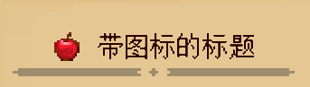

--- 
front: 
hard: Getting Started 
time: minutes 
sidebarDepth: 4 
--- 

# Page API 

## 1.BasePage<span id="BasePage"></span> 

All book pages inherit **BasePage**, and the page is responsible for layout of components within the page. 

### 1. Override method 

#### \_\_init\_\_ 

- Description 

Initialize page 

- Parameters 

| Parameter name | Data type | Description | 
| -------- | --------------- | ------------------------------------------------------------ | 
| size | tuple(int, int) | Page size, in pixels<br>The default value is **None**, the book system will automatically get the page size according to the current book interface | 
| position | tuple(int, int) | Page position (anchor point is the upper left corner), in pixels<br/>The default value is **None**, the book system will automatically get the page position according to the current book interface | 

- Return value 

| Data type | Description | 
| -------- | -------- | 
| BasePage | Page instance | 

- Notes 

- When you customize a page class, you must override the class initialization method and execute the parent class "**\_\_init\_\_**" method. For how to override, please refer to [Script Custom Book] (02-Script Custom Book.md#Script Custom Page). 

#### Show 

- Description 

Display page 

- Parameters 

None 

- Return value


| Data Type | Description | 
| -------- | -------- | 
| BasePage | Page Instance | 

- Notes 

- When you customize a page, you must override this method and execute the parent class's Show method. You must return to yourself to support chain calls. For how to override, please refer to [Script Custom Book] (02-Script Custom Book.md#Script Custom Page). 
- This method will call the Show method of the components in the page in turn, so you need to call the AddComps method to add the component to the page before calling this method. 

#### Hide 

- Description 

Hide page 

- Parameters 

None 

- Return value 

| Data type | Description | 
| -------- | -------- | 
| BasePage | Page instance | 

- Notes 

- When you customize a page, you can **not override this method**, but if you override this method, you must actively call the parent class **Hide** method at the end, and must return itself to support chain calls. 
- When to call this method: This method is called by the book system. When the user turns the page, the current page will be hidden. 

### 2. Layout method 

BasePage provides a series of methods to facilitate developers to layout in the page. For the UI coordinate system based on these methods, please refer to ["Customize Book UI Coordinate System"](01-Customize Basic Book.md#Page Writing). Before calling the layout method on a component, make sure that the component has been added to the page (call **AddComps** to add the component during initialization) and that the **Show** method of the page parent class has been called. 

#### GetPosition 

- Description 

Get the position of the page in the book coordinate system 

- Parameters 

None 

- Return value 

| Data type | Description | 
| --------------- | ---------------------------------------------------- |

| tuple(int, int) | The position of the page in the book coordinate system (the anchor point is in the upper left corner), in pixels | 

#### GetSize 

- Description 

Get the size of the page 

- Parameters 

None 

- Return value 

| Data type | Description | 
| --------------- | ------------------------ | 
| tuple(int, int) | The size of the page, in pixels. | 

#### Center 

- Description 

Get the center coordinates of the page 

- Parameters 

None 

- Return value 

| Data type | Description | 
| --------------- | ---------------------------- | 
| tuple(int, int) | The center coordinates of the page, in pixels. | 

#### Left 

- Description 

Get the X value of the left border of the page 

- Parameters 

None 

- Return value 

| Data type | Description | 
| -------- | ----------------------------- | 
| int | The X value of the left border of the page, in pixels. | 


#### Right 

- Description 

Get the X value of the right border of the page 

- Parameters 

None 

- Return value 

| Data type | Description | 
| -------- | ----------------------------- | 
| int | The X value of the right border of the page, in pixels. | 

#### Top 

- Description 

Get the Y value of the top border of the page 

- Parameters 

None 

- Return value 

| Data type | Description | 
| -------- | ----------------------------- | 
| int | The Y value of the top border of the page, in pixels. | 

#### Bottom 

- Description 

Get the Y value of the bottom border of the page 

- Parameters 

None 

- Return value 

| Data type | Description | 
| -------- | ----------------------------- | 
| int | The Y value of the bottom border of the page, in pixels. | 

#### ResetCompsPosition 


- Description 

Reset the position of all components to the current position of the page 

- Parameters 

None 

- Return value 

| Data type | Description | 
| -------- | -------- | 
| BasePage | Page instance | 

- Notes 

- This function is used after calling the **Show** method of the parent class of the page and before calling the layout method of the component. It is equivalent to aligning the component to the page first and then translating it. For specific usage, see [Script Custom Book] (02-Script Custom Book.md#Script Custom Page). 

### 3. Tool methods 

#### GetPageGroup 

- Description 

Get the page group object where the page is currently located 

- Parameters 

None 

- Return value 

| Data type | Description | 
| --------- | ------------------------------------------------------------ | 
| PageGroup | The [page group object] where the page is currently located (05-Common script objects)<br>If there is none, return **None** | 

#### AddComps 

- Description 

Add components to the page 

- Parameters 

| Parameter name | Data type | Description | 
| ------ | -------------------------- | :------------- | 
| comps | Variable length parameter, element is BaseComp | Added component object | 

- Return value


| Data Type | Description | 
| -------- | -------- | 
| BasePage | Page Instance | 

- Notes 

- This function is used in the page initialization function. Only after the component is added to the page, the component's **Show** method will be called when the page calls the **Show** method. For specific usage, see [Script Custom Book] (02-Script Custom Book.md#Script Custom Page). 

#### Call 

- Description 

Call callback function 

- Parameters 

| Parameter name | Data type | Description | 
| ------------ | -------- | -------------------------------- | 
| callbackDict | dict | Callback function and its parameters (see notes for properties) | 

- Return value 

| Data type | Description | 
| -------- | ---------------- | 
| object | Return value of callback function | 

- Notes 

- This function is mainly used to pass callback function as additional data into the component (such as **ButtonComp**) 

- The format of callbackDict is as follows: 

| Parameter name | Data type | Description | 
| ------ | -------- | ------------------------------------------------------ | 
| func | function | Callback function | 
| args | list | Callback function parameter list. If the callback function has no parameters, this attribute does not need to be defined | 

- Example 

```python 
""" 
We define two callback functions and then use Call to call them back respectively 
""" 
def func_1(): 
pass 
def func_2(args1, args2): 
pass 

callbackDict_1 = {

"func": func_1 
} 
callbackDict_2 = { 
"func": func_2, 
"args": [1, 2] 
} 

page = BasePage() 
page.Call(callbackDict_1) 
page.Call(callbackDict_2) 
``` 

## 2.TitlePage 

### 1.Overview 

TitlePage provides a method for processing titles to facilitate developers. For specific examples, see "**behavior_pack/customBooks/customBook/entry/myTitlePage.json**" and "**behavior_pack/tutorialScripts/myTitlePage.py**" in Demo. 

The processing logic of the page for the title is: 

1. Whether the current page is the homepage of the chapter, if so, set its title to the title of the chapter (including the chapter icon) 
2. If the current page is not the homepage, there are two cases: if the "**subtitle**" attribute is defined in the **Data** passed into the page, the title is the value of "**subtitle**", if not, the title is not displayed, and the remaining content of the page is automatically pushed up. 

The page style of the title can be divided like this. When there is a large title, there can be an icon or no icon. When there is no large title but a small title, the small title is displayed. Let's look at the different attribute values in the **json** file in the example: 

</img> 

```json 
"title": { 
"icon": "textures/items/apple", 
"text": "Title with icon" 
} 
``` 

If the current page is not the homepage, **title** is defined as an object as above, and the display effect is a large title with an icon. 

</img> 

```json 
"title": "Big title" 
``` 

If the current page is not the homepage, **title** is defined as a string as above, then the displayed effect is a big title without an icon. 

</img> 

```json 
"subtitle": "Default subtitle"

``` 

If the current page is not the homepage, only **subtitle** is defined without **title**, then the above text subtitle will be displayed. 

### 2. Method 

#### SetTitleData 

- Description 

Set the data of the title 

- Parameters 

None 

- Return value 

| Data type | Description | 
| --------- | -------- | 
| TitlePage | Page instance | 

- Notes 

- This function is called when you override the **Show** method in your custom page to inject data into the title. See Demo for how to use it. 

#### LayoutTitle 

- Description 

The title of the layout page 

- Parameters 

None 

- Return value 

| Data type | Description | 
| -------- | ------------------------------------ | 
| int | The bottom edge of the title after layout, in pixels | 

- Notes 

- This function is called when you override the **Show** method in your custom page, and is used to layout the title. See Demo for how to use it. 


