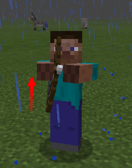
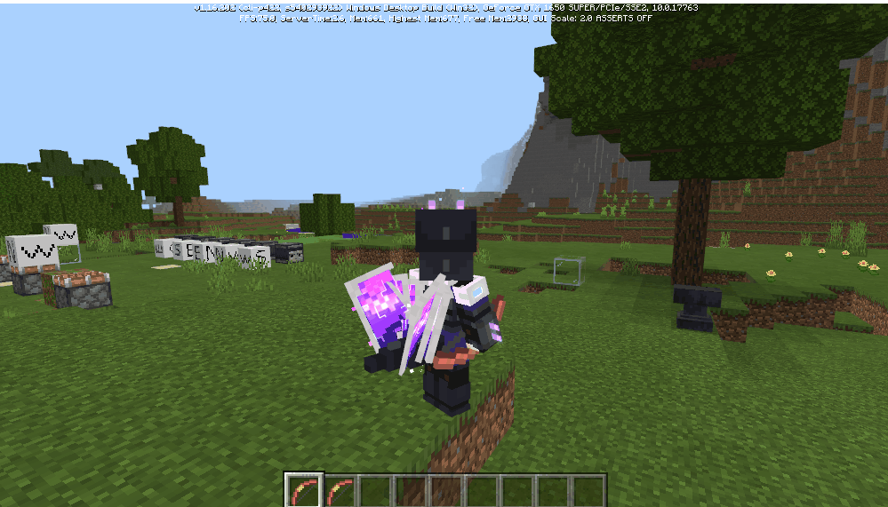
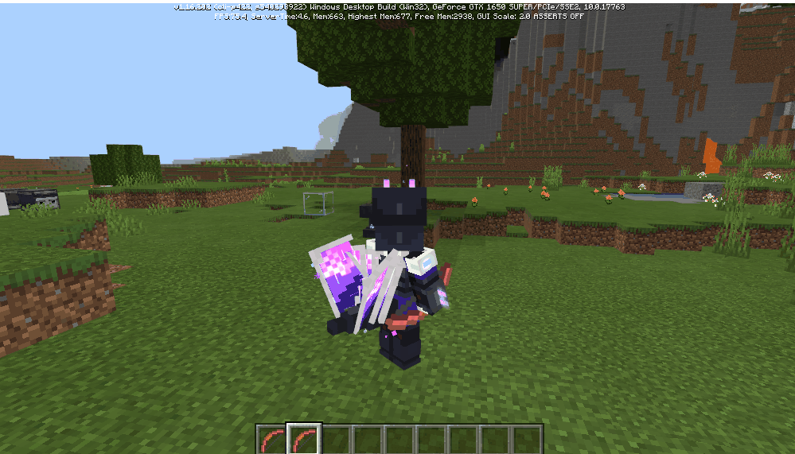

--- 
front: 
hard: Getting Started 
time: minutes 
--- 

# Custom Ranged Weapons 

## 1 Overview 

This feature does not require experimental gameplay. 

Chargeable items are like bows (minecraft: bow) and crossbows (minecraft: crossbow) in the original game. When the right mouse button is pressed, the weapon is charged, and when the right mouse button is raised, the weapon is fired. 

Custom ranged weapons include the following: 

* Custom items 
* Sequence frame animation, which can be used as shooting animation 
* Release the trigger event after right-clicking to charge, and you can launch custom projectiles in the event 
* Rendering offset configuration in first-person view 
* Camera control during charging, zooming in during charging 
* Custom projectiles 
* Custom textures, models, and animation configurations 
* Pick up items when projectiles fall to the ground 
* Control of projectile launch, including launch force, initial position, direction, gravity factor, damage value, etc. 
* Directional projectiles 

This document will combine the example [CustomRangedWeaponMod](../13-Module SDK Programming/60-Demo Example.md#CustomRangedWeaponMod) to explain how to define a ranged weapon. 

## 2 Custom chargeable items 

### 2.1 Custom items 

**The identifier of a custom chargeable item must end with :bow, otherwise the hand-raising action in third-person will not take effect. ** 

 

#### 2.1.1 json component description 

* minecraft:use_duration 

The maximum use time of the item, that is, the maximum time of the item charging process, is related to the speed of raising the hand in third-person. The larger the value, the slower the hand-raising speed. 

The following figures show the speed comparison when use_duration is 40 and use_duration is 100: 
 
↑use_duration is 40 
 
↑use_duration is 100

**If `minecraft:use_duration` is not configured, the animation will not be played, and there is no upper limit to the charging time. The durationLeft returned by the two events ItemReleaseUsingClientEvent/ItemReleaseUsingServerEvent is a negative number. ** 

* netease:render_offsets 

Item rendering parameters in first person view 

* netease:frame_animation 

Item usage process animation sequence frame 

* minecraft:use_animation 

The animation played when using an item must be defined in the texture pack. For example, when using `apple` in the original version, the `eat` animation will be played. In `resource_packs/vanilla/items/apple.json`, there is a `"minecraft:use_animation": "eat"` configuration. 

In custom remote items, the bow animation is usually used, that is, `"minecraft:use_animation": "bow"`. 

#### 2.1.2 Behavior Pack JSON Configuration 

Same as the *1.2 Registration* section in the "1-Custom Basic Items" document, add item JSON files in the `behavior/netease_items_beh` directory, such as customrangedweapon_bow.json. 

Note: The custom_item_type field of description is marked as **ranged_weapon**, and the identifier must end with :bow (such as: customrangedweapon:bow), otherwise the animation will not play in the third-person perspective, as shown in the following example: 

```json 
{ 
"format_version": "1.10", 
"minecraft:item": { 
"description": { 
"identifier": "customrangedweapon:bow", # Must end with :bow 
"register_to_create_menu":true, 
"custom_item_type": "ranged_weapon" # This type indicates a custom ranged weapon item 
}, 

"components": { 
"minecraft:use_duration": 72000, # This value affects the speed of the hand-raising action 
"netease:render_offsets": { 
"controller_position_adjust": [ 0.0, 0.1, 0.0 ], 
"controller_rotation_adjust": [ 0.0, -45.0, 0.0 ], 
"controller_scale": 1 
} 
} 
} 
} 
``` 

netease:render_offsets is described in the [Custom Rendering Offsets](#render_offsets) section below. 

#### 2.1.3 Customizing the Charge Animation Frame


* **Resource pack json configuration** 

Add a json file under resource/netease_items_res, such as customrangedweapon_bow.json 

The content is as follows: 

```json 
{ 
"format_version": "1.10", 
"minecraft:item": { 
"description": { 
"identifier": "customrangedweapon:bow", # The value must end with :bow 
"category": "Equipment" 
}, 
"components": { 
"minecraft:icon": "customrangedweapon:bow", 
"netease:frame_animation": { 
"frame_count": 3, 
"texture_name": "customrangedweapon:bow_frame", 
"animate_in_toolbar": true 
} 
} 
} 
} 
``` 

* **json component description** 

**netease:frame_animation** 

| Key | Type | Default value | Explanation | 
| ------------------ | ---- | ------ | ------------------------------ | 
| frame_count | int | 1 | Number of frames of frame animation during charging | 
| texture_name | str | | Texture mapping name of frame animation during charging | 
| animate_in_toolbar | bool | false | Whether to display animation in the inventory during charging | 

* **Animation sequence frame** 

Add three textures in the resource/textures/items folder, namely: 

customitems_ranged_weapon_0.png 

customitems_ranged_weapon_1.png 

customitems_ranged_weapon_2.png 

resource/textures/item_texture.json is as follows:


```json 
"customrangedweapon:bow": { 
"textures": "textures/items/customitems_ranged_weapon_0" 
}, 
"customrangedweapon:bow_frame": { 
"textures": [ 
"textures/items/customitems_ranged_weapon_0", 
"textures/items/customitems_ranged_weapon_1", 
"textures/items/customitems_ranged_weapon_2" 
] 
} 
``` 

Among them, the suffixes 0, 1, and 2 of these three texture files represent the number of frames of the animation respectively. 

So far, we have defined a chargeable item that supports frame animation. 

#### <span id="render_offsets"></span>2.1.4 Custom Rendering Offsets 

In addition, for custom chargeable items, we have added configurable offsets for item rendering in first-person perspective. 

**netease:render_offsets** 

| Key | Type | Default | Explanation | 
| -------------------------- | ----- | ------------- | -------- | 
| controller_position_adjust | tuple | [0.0,0.0,0.0] | Position offset | 
| controller_rotation_adjust | tuple | [0.0,0.0,0.0] | Rotation offset | 
| controller_scale | float | 1.0 | Size coefficient | 

### 2.2 Field of view change control 

In [CustomRangedWeaponMod](../13-Module SDK Programming/60-Demo Example.md#CustomRangedWeaponMod), we use the interface provided by the camera component to implement a demo similar to the bow zoom lens effect, which is briefly explained here. 

```python
def ListenEvent(self):
		self.ListenForEvent(conf.EngineNamespace, conf.EngineSystemName, 'OnScriptTickClient', self,
		                    self.OnScriptTickClient)
		self.ListenForEvent(conf.EngineNamespace, conf.EngineSystemName, 'ClientItemTryUseEvent', self,
		                    self.OnClientItemTryUseEvent)
		self.ListenForEvent(conf.EngineNamespace, conf.EngineSystemName, "RangedWeaponReleaseUsingClientEvent",
		                    self, self.OnRangedWeaponReleaseUsingClientEvent)

	def Init(self):
		self.cameraComp = self.CreateComponent(clientApi.GetLevelId(), "Minecraft", "camera")
		self.cameraComp.SetFov(self.initFov)
		
	def OnScriptTickClient(self):
		self.tickCnt += 1
		offset = self.tickCnt - self.startUsingTick

		if self.isUsingItem:
			self.cameraComp.SetFov(self.initFov - offset * 0.15)

	def OnRangedWeaponReleaseUsingClientEvent(self, args):
		self.isUsingItem = False
		if self.initFov:
			self.cameraComp.SetFov(self.initFov)
    
    def OnClientItemTryUseEvent(self, args):
		if args["itemName"] == "customrangedweapon:bow" or args["itemName"] == "customrangedweapon:cross_bow" or \
			args["itemName"] == "customrangedweapon:boa":
			# control camera
			self.isUsingItem = True
			self.startUsingTick = self.tickCnt
```

* When you right-click to start using an item, mark the item being used isUsingItem and record the current frame number startUsingTick 
* Use the interface SetFov in the callback event of OnScriptTickClient to continuously zoom in on the camera 
* Reset the camera's fov in the callback of the RangedWeaponReleaseUsingClientEvent when the right mouse button is released 

## 3 Custom Projectiles 

### 3.1 Overview 

The custom projectile in the scene is an entity, and its definition is the same as that of a custom creature. 

The following uses a custom arrow to illustrate how to customize a projectile. 

### 3.2 Customization process 

* Add entity definition under behavior/entities, such as custom_arrow.json in the example 

​ Where netease:custom_entity_type is as follows: 

```json 
"netease:custom_entity_type": { 
"value": "projectile_entity" 
}, 
``` 

* Customize the item picked up by the projectile 

```json 
"netease:pick_up": { 
"item_name": "customrangedweapon:projectile", # Pick up item id 
"favored_slot": 1 # The position of the picked up item in the inventory 
} 
```


* Add entity's performance definition under resource/entity, such as custom_arrow.entity.json in the example 

Here, textures, materials, geometry, animations, and rendering controllers are associated together. 

```json
  {
  	"format_version": "1.10.0",
  	"minecraft:client_entity": {
  	  "description": {
  		"identifier": "customrangedweapon:custom_arrow",
  		"materials": {
  		  "default": "arrow"
  		},
  		"textures": {
  		  "default": "textures/entity/custom_arrows"
  		},
  		"geometry": {
  		  "default": "geometry.custom_arrow"
  		},
  		"animations": {
  		  "move": "animation.custom_arrow.move"
  		},
  		"scripts": {
  		  "pre_animation": [
  			"variable.shake = query.shake_time - query.frame_alpha;",
  			"variable.shake_power = variable.shake > 0.0 ? -Math.sin(variable.shake * 200.0) * variable.shake : 0.0;" 
], 
"animate": [ 
"move" 
] 
}, 
"render_controllers": [ "controller.render.custom_arrow" ] 
} 
} 
} 

``` 

* Textures 

Add custom_arrows.png to the resource/textures/entity directory as a texture for custom creatures 

* Geometry 

Add custom_arrow.geo.json to the resource/models/entity directory to define the geometry of custom creatures 

* Animation components 

Add custom_arrow.animation.json to the resource/animations directory to define animations for custom creatures


  Among them, because the arrow model has directionality, the rotation angle needs to be adjusted, as shown below: 

```json 
{ 
"format_version" : "1.8.0", 
"animations" : { 
"animation.custom_arrow.move" : { 
"loop" : true, 
"bones" : { 
"body" : { 
"rotation" : [ "variable.shake_power - query.target_x_rotation", "-query.target_y_rotation", 0.0 ], 
"scale" : [ 0.7, 0.7, 0.9 ] 
} 
} 
} 
} 
``` 


* Rendering controller 

Add custom_arrow.render_controllers.json in the resource/render_controllers directory to define the rendering controller of the custom creature 

### 3.3 Use custom projectiles 

#### 3.3.1 Use items to launch custom projectiles 

For the process, refer to the "Custom Items" document. The differences include the following two points: 

1) custom_item_type is projectile_item 

2) What kind of projectile to use needs to be included under components (including vallina or custom projectiles) 

```json 
{ 
"format_version": "1.10", 
"minecraft:item": { 
"description": { 
"identifier": "customrangedweapon:projectile", 
"register_to_create_menu":true, 
"category": "Nature", 
"custom_item_type": "projectile_item" # Custom projectile item tag 
}, 

"components": { 
"minecraft:max_stack_size": 32, 
"minecraft:max_damage": 10,

"netease:show_in_hand": { 
"value": false 
}, 
"netease:projectile": "customrangedweapon:custom_arrow" # Which projectile to use when right-clicking 
} 
} 
} 
``` 

The above example launches a custom projectile customrangedweapon:custom_arrow when right-clicking and using the item customrangedweapon:projectile 

#### 3.3.2 Python script directly launches custom projectiles 

The Python script layer provides an interface CreateProjectileEntity for creating projectiles (including vallina or custom projectiles), which is defined as follows: 

```python 
def CreateProjectileEntity(self, spawnerId, entityIdentifier, param): 
``` 

For details, please refer to the mod sdk document, the example is as follows: 

```python 
def ListenEvent(self): 
		self.ListenForEvent(serverApi.GetEngineNamespace(), serverApi.GetEngineSystemName(), "RangedWeaponReleaseUsingServerEvent",
		                    self, self.OnRangedWeaponReleaseUsingServerEvent)

	def OnRangedWeaponReleaseUsingServerEvent(self, args):
		print 'RangedWeaponReleaseUsingServerEvent:', args
		playerId = args["playerId"]
		comp = self.CreateComponent('', "Minecraft", "projectile")
		projectile_entity_id = comp.CreateProjectileEntity(playerId, "customrangedweapon:custom_arrow")
```


### 3.4 Customizing the direction of projectiles 

If the projectile is not circular and has a certain directionality, the direction of the model needs to be adjusted through animation, such as the custom arrow (custom_arrow) in the example [CustomRangedWeaponMod](../13-Module SDK Programming/60-Demo Example.md#CustomRangedWeaponMod) 

```json 
{ 
"format_version" : "1.8.0", 
"animations" : { 
"animation.custom_arrow.move" : { 
"loop" : true, 
"bones" : { 
"body" : { 
"rotation" : [ "variable.shake_power - query.target_x_rotation", "-query.target_y_rotation", 0.0 ], 
"scale" : [ 0.7, 0.7, 0.9 ] 
}

} 
} 
} 
} 

``` 

Variable.shake_power is a variable defined in json, which is used to make the arrow shake after collision; 

query.target_x_rotation is a variable defined in the engine, which returns the rotation angle of the custom arrow in the x direction at this time; 

query.target_y_rotation is a variable defined in the engine, which returns the rotation angle of the custom arrow in the y direction at this time. 

In addition, if the projectile has a changing direction, mathematical operations are required to obtain the final rotation angle. 

### 3.5 Other related 

#### 3.5.1 Related events 

##### ProjectileDoHitEffectEvent 

##### ProjectileCritHitEvent 

#### 3.5.2 Skeleton model settings 

Custom projectiles support setting skeleton models, refer to the following: 

```python 
def changeModel(args): 
comp = clientApi.CreateComponent(args['id'], "Minecraft", "model") 
comp.SetModel("xuenv") 
``` 

