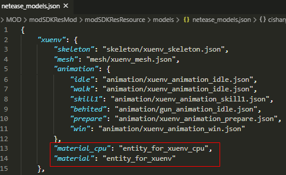
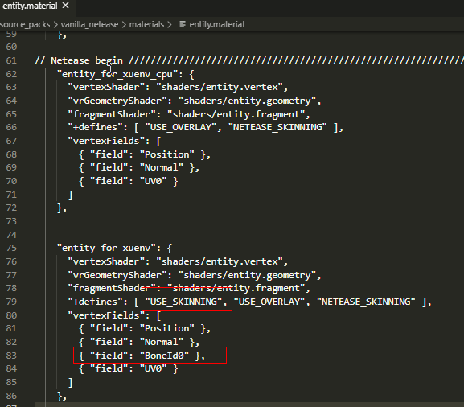
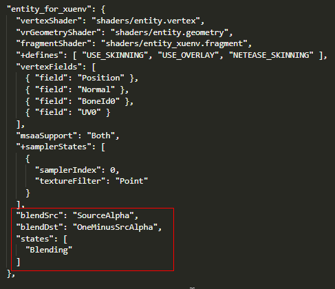

--- 
front: 
hard: Getting Started 
time: minutes 
--- 

# Use custom materials for skeleton models 

## Use custom materials 

If we want to achieve more complex rendering effects, we may need to use special shaders. At this time, we need to modify the material and configure it to use our shader. We can specify the material_cpu and material fields for the model in netease_models.json, and the skeleton model will be rendered using the specified material. 

 

material_cpu is a traditional rendering method, and each vertex in the vertex shader stores its own transformation matrix; 
material is a bone rendering method, which stores the transformation matrix list of all bones globally. Each vertex in the vertex shader only stores the corresponding bone index. During the execution process, the transformation matrix is queried from the list through the index. Because different vertices share the same bone, this method can save more GPU bandwidth compared to the traditional rendering method. Currently, the engine will only use material bone rendering on the Android platform and when the device vertex shader supports the use of more uniforms. In other cases, the traditional material_cpu rendering method is used. 

In the material definition, compared with the material_cpu material, the material material needs to define USE_SKINNING, and the BoneId0 field needs to be added to vertexFields. For the specific usage of USE_SKINNING and BoneId0 in shader, please refer to data/shaders/glsl/entity.vertex. 

 

## Materials that support semi-transparent rendering 

Bone models are rendered using opaque materials by default. The fourth parameter alpha of gl_FragColor in the fragment shader output has no effect in opaque rendering, that is, no matter what the value of gl_FragColor.a is, it does not affect the final rendering effect. 
After turning on semi-transparent rendering, gl_FragColor.a represents transparency, ranging from [0.0, 1.0], 1.0 represents completely opaque, and 0.0 represents completely transparent and invisible. The way to enable it is as follows. Just declare the following part in the material definition: 

 

Blending means using the blending mode for rendering, blendSrc means using SourceAlpha as the blending source factor, and blendDst means using OneMinusSrcAlpha as the target blending factor. 

The blending factor can be configured as follows: 

 

Next, we try to modify gl_FragColor.a for testing, and modify it to 0.5 transparency: 

 

After the modification, the skeleton model in the game will have a translucent effect: 

 

Note: Because translucent materials cannot be optimized through depth detection, try not to use them too much, otherwise it will cause certain rendering pressure.