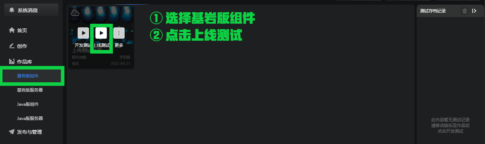
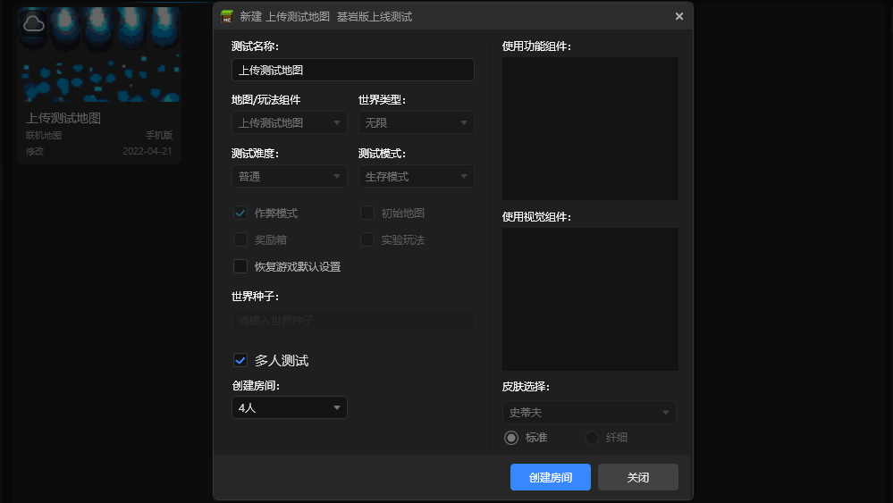
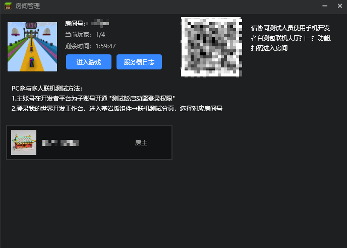
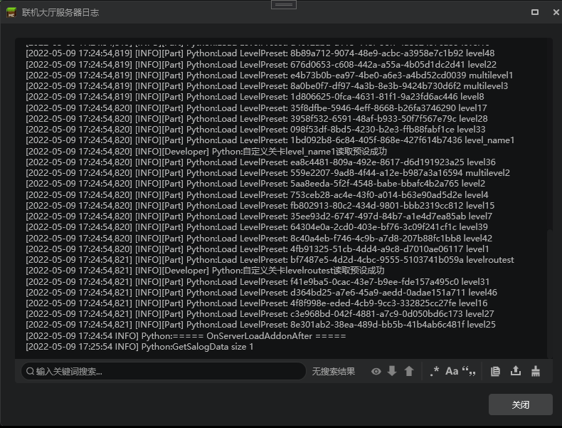
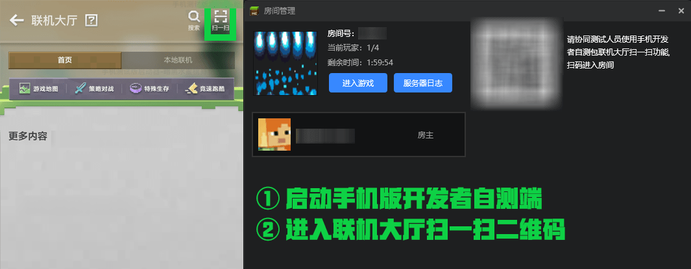
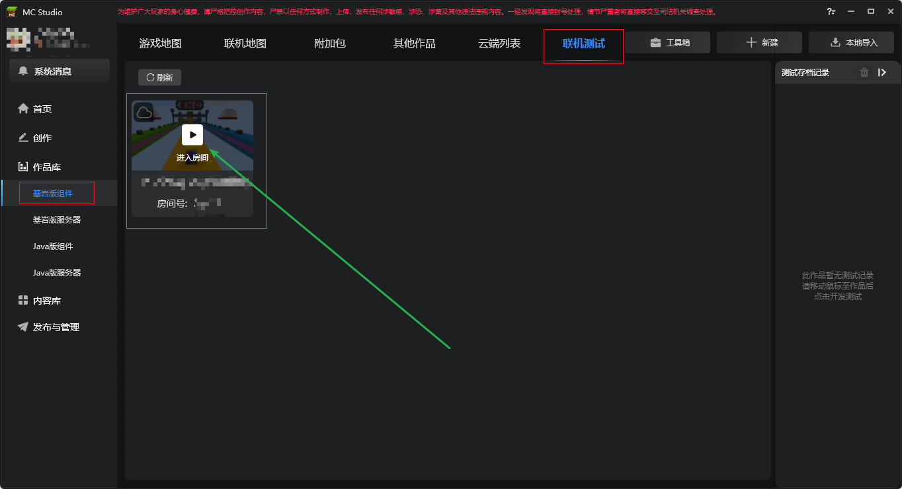
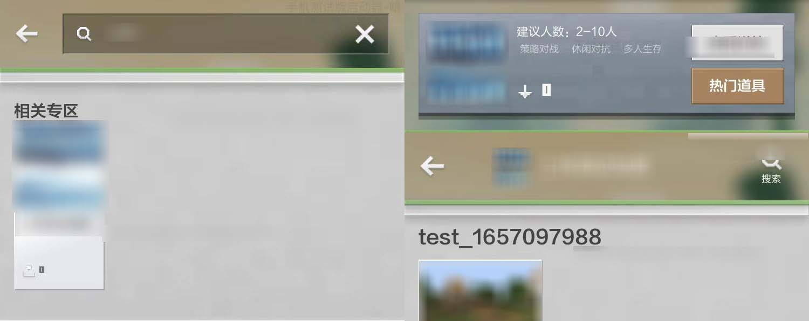
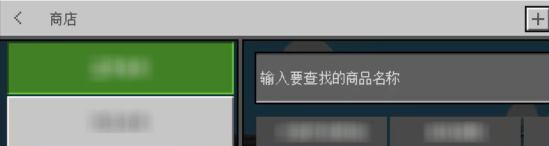

--- 
front: https://mc.163.com/dev/mcmanual/mc-dev/assets/img/20_1.87b71158.png 
hard: Getting Started 
time: 15 minutes 
--- 

# Online lobby debugging and multiplayer testing documentation 

Online lobby works use **remote hosts** to host games during operation, and **local players** join the game online. Considering that there may be actual differences between mobile games and computer development, after the online lobby map works are developed locally, it is strongly recommended that developers conduct online self-tests of simulated online lobbies in the mobile self-test development kit and the computer client according to the type of online map works released. 

**During local testing, the log window will only display the logs of the local client**, which is far from enough for testing online lobby works. Using multiplayer online testing is not only convenient for finding problems, but also can pull up the server log for log analysis. 

## 1. The host starts multiplayer testing and creates a room 
Enter **My World Development Workbench** , click **[Library]** - **[Bedrock Edition Components]** - **[Online Map]** , and click Online Test to pull up the server log. 

 

Check **[Multiplayer Testing]** , click **[Create Room]** , and wait patiently for the room to open. 

 

After the room is opened, you can find the server log button in the **[Room Management]** window, and click it to open the server log. 

 

The server log is as shown below. After clicking to enter the game, the script test log will be automatically pulled up. Two log windows will exist at the same time, one for the client log and one for the server log. 

 

## 2. Other players join the game for multiplayer online testing 
After the room is opened, sub-accounts under the same developer account can enter the room and conduct online testing, and can allow PC and mobile self-test packages to enter the same room at the same time. Details are as follows. 

### 1. Enter the multiplayer test with the mobile version self-test package 
Open the mobile version developer self-test package, enter the online lobby, and use the **[Scan]** function to scan the QR code next to the server log button to enter the room and connect with the development members. 

For the download link of the mobile version development self-test package, you can visit the [Developer Platform Website](https://mcdev.webapp.163.com/#/square) and click [Download Mobile Version Test Tool] in the upper left corner to download. 

 

### 2. Enter the multiplayer test in the PC client 

Start the Minecraft development workbench on other computers and log in to the corresponding test sub-account, enter and click **[Library]** - **[Bedrock Edition Components]** - **[Online Test]** paging, you can now see the multiplayer test rooms opened under the current main account and sub-account system, find the corresponding test room according to the room number and enter the test. 
 

## Product purchase test 
> Currently, only product purchase tests are supported in the mobile version development self-test package. The Minecraft development workbench does not currently support product testing.

When the product is located in **[Resource Center Online Hall Item Showcase]**: 

- Click Search on the homepage of the Online Hall to find the corresponding work. 
- Click on the popular props to enter the product showcase to purchase. 

 

When the product is located in **[In-game Prop Showcase Visible]**: 

- Click the product button in the upper left corner of the game. 
- Make a purchase on the product page. 

 

For the editing and listing of online lobby works and products, [you can view this document link](./5-Online lobby works and product upload document.html).