--- 
front: https://mc.163.com/dev/mcmanual/mc-dev/assets/img/5_5.998edd66.png 
hard: Getting Started 
time: 15 minutes 
--- 

# Online lobby works and product upload documents 

Online lobby works usually include a multiplayer map with a good online experience, built-in add-on packs or command blocks, and a building panorama that matches the theme. 

Players can create **remote rooms** of corresponding works in the online lobby. These rooms will not be closed because of the departure of the creating player. As long as there are always players active, the room will always exist. Help the room owner player to minimize the burden of data bandwidth and equipment. 

Developers need to upload online lobby works on the developer platform and use the "Minecraft" developer workbench for work development and multiplayer self-testing. 

## Online lobby work packaging 

Currently, online lobby works need to be uploaded to the developer platform through local packaging, and can carry add-on packs to enhance the game experience. The work needs to be compressed in ZIP format. Most computer systems and mobile phone systems support this type of compression format. 

Open the target map work folder. If there are **【netease_world_behavior_packs.json】** and **【netease_world_resource_packs.json】** in the map, you need to remove **【netease_】** at the beginning of the file name and change it according to the following specifications: 

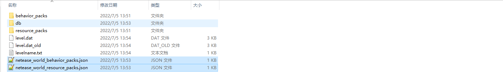 

**【world_behavior|resource_packs.json】** The file accepts an array by default. Multiple resource packs or behavior pack manifest file information can be passed into the array to help the map identify the package that needs to be loaded. Among them: 

- pack_id: corresponds to the uuid value of the header key pair under **【Manifest file (manifest.json|pack_manifest.json)】** for a single resource pack or behavior pack. 
- version: The version value of the header key pair under **[manifest file (manifest.json|pack_manifest.json)]** corresponding to a single resource pack or behavior pack. 
- type: Required, the value is **["Addon"]**. 

```json
// behavior_packs/some_behavior/manifest|pack_manifest.json
{
  "format_version": 1,
  "modules": [
    {
        //....
    }
  ],
  "header": {
    "description": "",
    "name": "behavior_pack",
    "uuid": "93c89241-3ecb-478f-a16c-c5eb99ceb580", // Corresponding to a pair of pack_id in world_behavior_packs.json
    "version": [0, 0, 1]// A pair of versions corresponding to world_behavior_packs.json
  }
}
```

```json
// resource_packs/some_resource/manifest|pack_manifest.json

{ 
"format_version": 1, 
"modules": [ 
{ 
//.... 
} 
], 
"header": { 
"description": "", 
"name": "resource_pack", 
"uuid": "614ba977-6b46-42da-afb6-50fa5a568ab6", // Corresponds to a pair of pack_id in world_resource_packs.json 
"version": [ 0, 0, 1] // Corresponds to a pair of version in world_resource_packs.json 
} 
} 
``` 

```json 
// world_behavior_packs.json 
[ 

{ 
"pack_id" : "93c89241-3ecb-478f-a16c-c5eb99ceb580", 
"type": "Addon", 
"version" : [ 0, 0, 1 ] 
} 
] 
``` 

```json 
// world_resource_packs.json 
[ 
{ 
"pack_id": "614ba977-6b46-42da-afb6-50fa5a568ab6", 
"type": "Addon", 
"version" : [ 0, 0, 1 ] 
} 
] 
``` 

And confirm again that behavior_packs and resource_packs have carried the corresponding resource packs and add-on packs. 

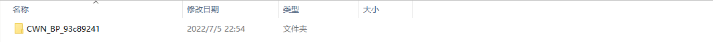 

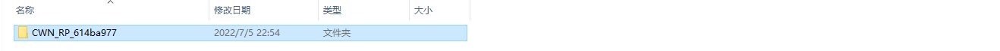 

Right-click the entire map folder and compress it into zip format to complete the packaging. The map folder is the top-level folder that includes the entire map file content. The following uses the UploadMap name to refer to the top-level folder. 

```yaml 
UploadMap: "Top-level folder" 
Content:

- "behavior_packs" 
- "db" 
- "resource_packs" 
- "level.dat" 
- "level.dat_old" 
- "levelname.txt" 
- "world_behavior_packs.json" 
- "world_resource_packs.json" 
``` 

## Upload online lobby works 

Enter the developer platform, click **[Work Management]** - **[Shelf and Resource Management]**, and choose to publish a new **[Mobile Version]** new resource. 

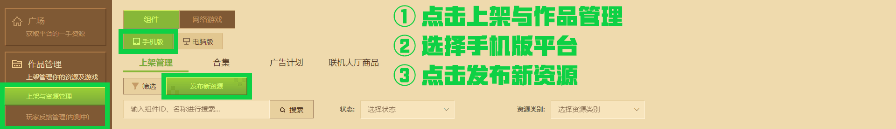 

Fill in the basic information of the online lobby work, and select **[multiplayer world]** for the payment type. 

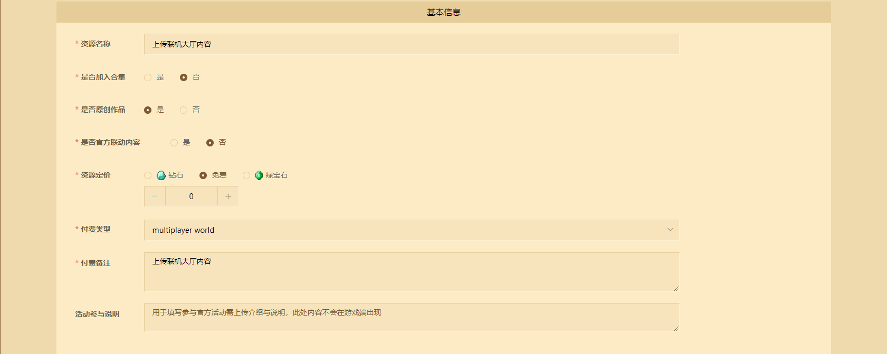 

Select the resource type **[Online Lobby]** . Choose whether to open the **[Commercial In-App Purchase]** function according to actual needs. Finally, select up to 3 online lobby area categories and upload the package body, and provide the work introduction and video information to assist in review and players to understand, and then the resource editing operation can be completed. 

**Note: After turning on the [Commercial In-App Purchase Function], it will not support the simultaneous listing of maps in the Resource Center-Map Partition. For works that have been listed in the online lobby but do not support the commercial in-app purchase function, and have not been set to be synchronously listed in the Resource Center Map Partition, it is supported to re-enable the [Commercial In-App Purchase Function]. ** 

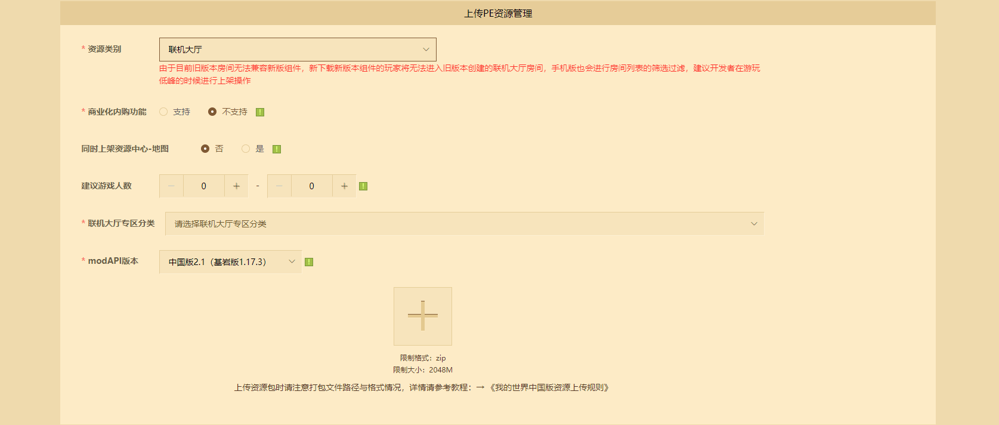 

## Online lobby product editing 

Select **[Mobile platform]** - **[Online lobby products]** on the **[Listing and resource management]** page to create, edit and list products for saved online lobby works. 

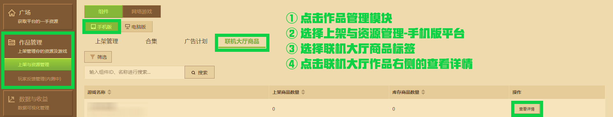 

### Product creation 

Click **[Inventory Edit]** and then click **[Add product]** to create an in-app purchase product for the online lobby. 

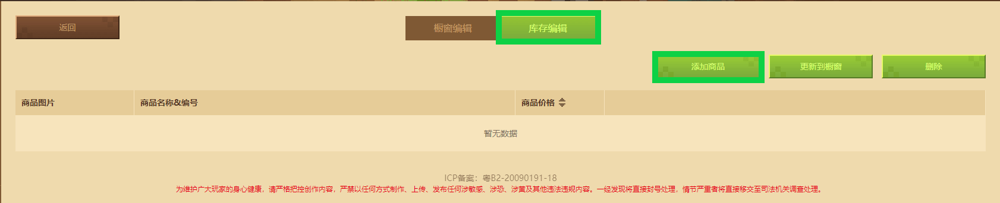 

Fill in the basic information of the product, including: 

- Product introduction: displayed in the product 
- Product pricing: the amount of currency that players need to spend to purchase, supporting diamonds, emeralds or free pricing. 
- Number of purchases: the number of times a player can purchase in-app purchases. If you fill in -1, it means unlimited purchases. For the rest of the purchases, please set the number to be greater than or equal to 1. 
- Purchase scenario: You must at least choose a purchase entrance in **[In-game item display window]** and **[Resource Center online lobby item display window]**, or display it in both places at the same time. **During the self-test period, the product can be found in the corresponding purchase scenario of the "Minecraft" Bedrock Edition mobile phone self-test development end after the review, which is convenient for developers to test the product. ** 

| Display type | Sample image |

| -------------------------------- | ------------------------------------------------------------ | 
| [In-game item display window visible] |  | 
| [Resource Center Online Lobby item display window visible] | 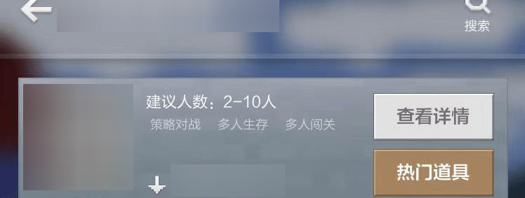 | 

- Commodity category: You can customize the commodity category, and you need to select one of the categories. **Each online lobby work comes with a commodity category, and the default category can be customized to display the first category name. Click Add Category for subsequent new categories to customize the new name and category again. ** 
- Payment type: Select **【multiplayer world commodity】** by default. 
- Payment Notes: Mainly used for information notes during review. 
- Implementation instructions: After using <a href="../../mcdocs/1-ModAPI/接口/在线大厅.html#QueryLobbyUserItem">QueryLobbyUserItem</a> to obtain the player's undelivered product information, you can get the cmdStr field value in the returned dictionary. It is often used to determine the type of goods shipped, or to provide a deserializable structure for the business with the built-in Json module in Python, thereby assisting in the completion of product delivery. 

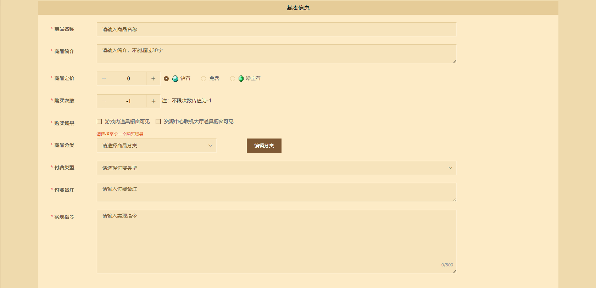 

The text in the details information will be displayed in the details information area of the corresponding product. Enter the purchase scene, and the product cover of different products will be displayed under each product category. The carousel will only be displayed in the prop showcase of the online lobby of the resource center. For the specific location, please refer to the following example: 

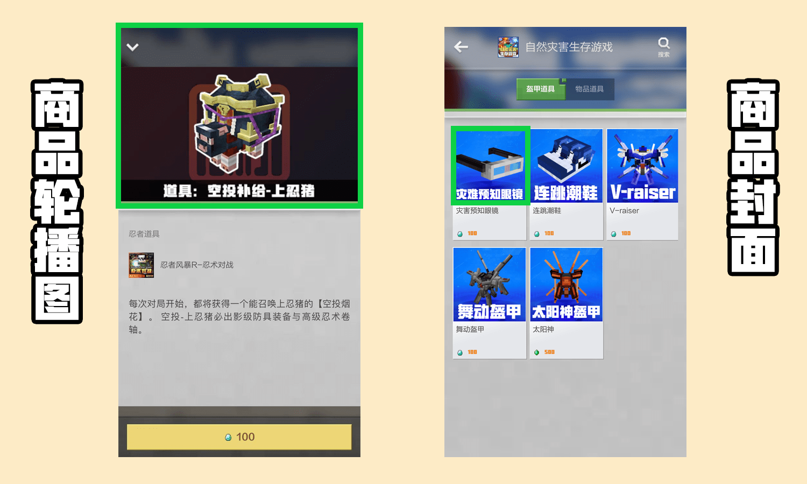 

Click **[Save]** to complete the product creation. 

## Online lobby product self-test 

Online lobby products support self-testing in the "Minecraft" mobile version self-test development package. Developers need to click **Self-test** on the developer platform before they can see the purchase entrance in the self-test terminal. 

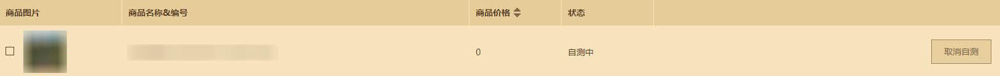 

**Note: The mobile version self-test development package will not display the set product category. Developers can pre-set and view the official effect in the subsequent online version. ** 

Using the "Minecraft" development workbench online lobby multiplayer online self-test function, you can purchase products in the mobile version developer self-test package, trigger the delivery logic in the game, and verify the integrity of the commercialization function. [For details, please refer to this document link. ](./20-Online lobby debugging and multiplayer testing document.html) 

## Online lobby product listing 

After the online lobby product is approved, the developer can click **[Update to showcase]** on the **[Inventory Edit]** page to update the product to **[Showcase Edit]**. 

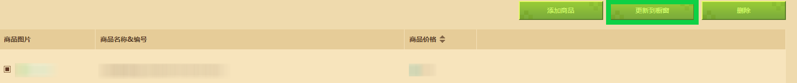 

Then on the **[Showcase Edit]** page, the developer can set the display order of the product, and then choose to click **[Complete Update Showcase List]** to display it to players online. 

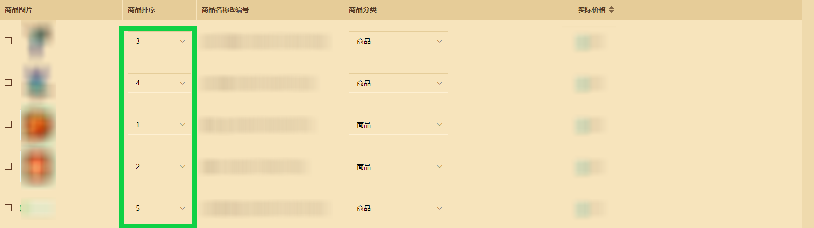 

If the product needs to be removed from the shelves, you need to check the confirmation box on the left of the corresponding product line and click the Remove button to remove the product. 

**Note: No review is required for removed products. Subsequent products can be updated to the showcase under the [Inventory Edit] page. Products that have been removed and not edited can skip the review at the next update, but products that have been re-edited need to be reviewed again. ** 

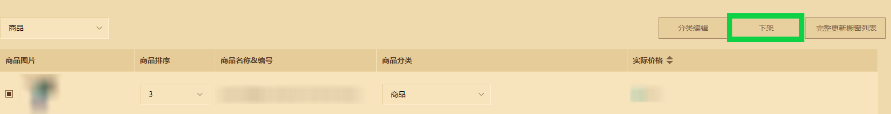 

