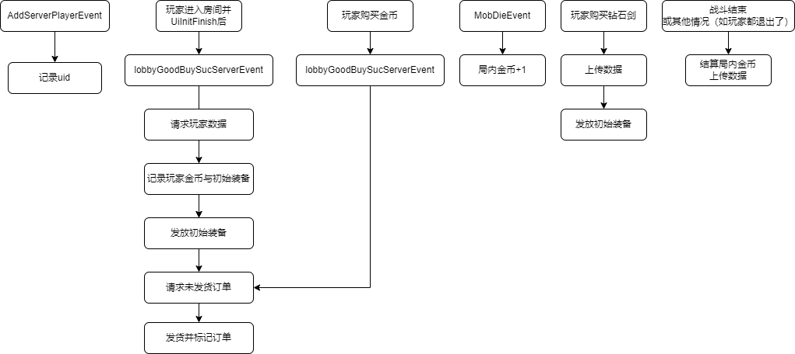
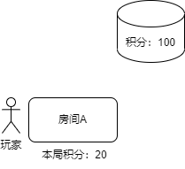
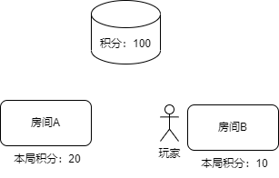
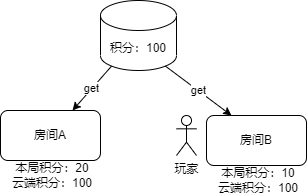
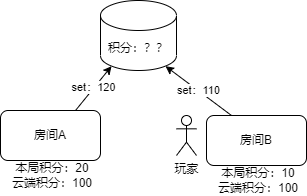
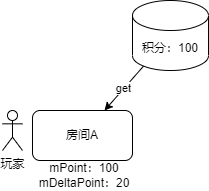
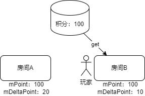
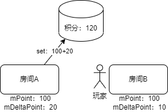
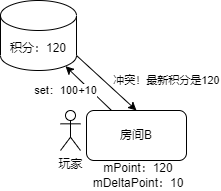
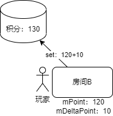

--- 
front: https://mc.163.com/dev/mcmanual/mc-dev/assets/img/1.385e53eb.png 
hard: Advanced 
time: 30 minutes 
--- 

# Online Lobby Product 2.0 Document 

**Minecraft Mobile Online Lobby** now opens **commercialization** and **data storage** interfaces, breaking the creative boundaries of developers and providing new conditions such as experiential purchase and player data persistence for online game development. 

## Data Storage Description 

Compared to the Resource Center component, the data storage interface of the online lobby supports reporting game data to the cloud database, and supports cross-save and cross-room access to data information. Every time you create an online lobby work, you can host global and single player data separately in the **self-test phase** and **online phase**. 

| Interface type | Service scope | Valid range | Quantity | 
| ---------------- | -------------------------- | -------------------------- | ---- | 
| Custom data storage | Resource center component\|Online lobby gameplay | Single game archive | 1 | 
| Online lobby data storage | Online lobby gameplay | All online lobby rooms in the same gameplay | ∞+ | 

Using the online lobby data storage function, developers can use the standard **interface call** and **data structure format** to bring **growth value**, **currency amount**, and even **backpack information** in the game from one room to another, and share unlimited fun with players in different rooms. 

| Common data storage types | Application direction | 
| ------------------ | ------------------------------- | 
| Growth value | Experience\|Level\|Sign-in days\|RPG attributes, etc. | 
| Turn settlement | Mini-game\|Turn-based, etc. | 
| Currency amount | Equipment trading\|Purchase of goods, etc. | 
| Backpack information | Player backpack\|Extra baggage, etc. | 

## Commercialization description 

Commercialization allows developers to create experiential purchases, that is, players can purchase value-added services and items in the online lobby room based on their willingness and recognition of the gameplay, so that each developer's love can be echoed. 

| Common product types | Application content | 
| -------------- | ------------------------- | 
| Special appearance | Characters, weapons, equipment, props | 
| Value-added services | Shouts, titles, VIP privileges, gift packs | 
| Game pass | Limited props purchased only once | 

## MODSDK API and events 

### API 


- <a href="../../mcdocs/1-ModAPI/接口/在线大厅.html#querylobbyuseritem">QueryLobbyUserItem</a> 

Query orders that have not been shipped 

- <a href="../../mcdocs/1-ModAPI/接口/在线大厅.html#lobbysetstorageanduseritem">LobbySetStorageAndUserItem</a> 

Set the order to be shipped or store data 

- <a href="../../mcdocs/1-ModAPI/接口/在线大厅.html#lobbygetstorage">LobbyGetStorage</a> 

Get the stored data 

- <a href="../../mcdocs/1-ModAPI/接口/在线大厅.html#lobbygetstoragebysort">LobbyGetStorageBySort</a> 

Sort and get the stored data. Only the sortable key configured on the developer platform can be queried. 
### Event 
- <a href="../../mcdocs/1-ModAPI/Event/Online Hall.html#lobbygoodbuysucserverevent">lobbyGoodBuySucServerEvent</a> 
Triggered when the player purchases the product or logs into the online lobby mod 

## Sample mod 

[lobbyGoodsMod2.0](../20-Gameplay Development/13-Module SDK Programming/60-Demo Example.html) shows a basic gameplay: 

- The gameplay is designed with the virtual currency "gold coins", which is stored using the key money and is set as a sortable key. 
- A product is put on the market in the gameplay. Players can get 100 gold coins after purchasing it. The implementation instruction of the product is add_money_100 
- Players can enter buysword in the chat bar to obtain the 7-day validity period of the initial equipment "Diamond Sword". During the validity period, players will get a diamond sword every time they enter a new room. Repeated purchases will overlap the validity period. 
- Players can get 1 gold coin for each zombie killed in the battle, and the gold coins obtained will be settled at the end of the battle. Enter endbattle in the chat bar to trigger the battle settlement. 
- The main process of the demo is as follows. For details, please read the code comments of the demo 

 

## Q&A 

### Why is there a data conflict? 

The root cause is that there may be multiple online lobby rooms modifying the data of the same player at the same time, and the set operation of other rooms may be inserted between the get and set operations of the same room. 

Suppose we set the data in the following process (note that this process is wrong!): 

1. Each room records the points obtained by the players in this battle 
2. At the end of the battle, a unified settlement is made, first obtaining the latest points of the players, and then adding the points of this round and setting them back 


The following situation may occur: 

1. A player's cloud score is 100 

2. This player enters room A and has 20 points in this game 

 

2. Then this player dies first, so he exits room A (the battle in room A has not ended yet, and the settlement has not been completed), enters another room B, and then obtains 10 points 

 

3. Then room A and room B settle at the same time: both rooms go to obtain cloud score, and both get 100 

 

4. So room A will set the score to 120, and room B will set the score to 110. No matter what the order of setting is, the result is wrong! The correct score should be 130! 

 

### How to ensure the correctness of data? 

In order to prevent the above situation, a "version number" will be attached every time the data is set. The version of each data setting is the last version plus one. In this way, the cloud can judge whether the data has been modified by other containers based on the version number, which is a conflict. This version number control has been controlled by the engine internally, and developers do not need to worry about it. You only need to handle conflicts according to the specifications in the API documentation. 

The data control process we recommend is as follows (taking points as an example): 

1. Each room maintains two containers, one container (mPoint) stores cloud points, and the other container (mDeltaPoint) stores the difference in points generated in this room (for example, +10 points or -10 points) 

2. Get data when the player logs in and store it in mPoint. If it cannot be obtained, put the default points (such as 1000) into mPoint 

3. Settlement, call LobbySetStorageAndUserItem 

4. The uploaded points are the points of mPoint plus the points of mDeltaPoint 

```python 
def getter(): 
return [ 
{ 
'key': 'point', 
'value': self.mPoint[playerId] + self.mDeltaPoint[playerId] 
} 
] 
``` 

5. If the returned data conflicts, update mPoint with the latest points returned 

6. Then the engine will automatically retry step 4 

The following explains why this process can avoid data overwriting: 


1. A player's cloud score is 100 

2. The player enters room A, and the room gets the player's cloud score of 100 (and also gets the corresponding "version number"), and the score in this game is 20 

 

3. Then the player dies first, so he exits room A (the battle in room A has not ended yet, and the settlement has not been made), and enters another room B. 

The room gets the player's cloud score of 100 (and also gets the corresponding "version number"), and the player's score in this game is 10 

 

4. Room A and room B settle at the same time: Room A wants to set the score to 100+20, and room B wants to set the score to 100+10. 

Assume that the request from room A arrives first, then the cloud points are successfully set to 120 (and the "version number" + 1) 

 

5. The request from room B arrives later, and the cloud finds that the version number is inconsistent! So it returns the latest data (120) to room B. After receiving it, room B updates the local mPoint 

 

6. The engine of room B calls getter again and submits the data. The points set this time are 120+10, the setting is successful, and the final data is correct. 

 

### Why does the demo lobbyGoodsServerSystem.py, _EndBattle function require the callback, getter and interface calls to be encapsulated into a subfunction? 

Assume we don't encapsulate, and write it as follows: 

```python 
def _EndBattle(self): 
for playerId in self.mBattleMoney.keys(): 
def getter(): 
return [ 
{ 
'key': 'money', 
'value': self.mMoney[playerId] + self.mBattleMoney[playerId] 
} 
] 
def callback(data): 
print playerId 
... 
httpComp.LobbySetStorageAndUserItem(callback, self.mUid[playerId], None, getter) 
``` 

Because the call of LobbySetStorageAndUserItem is asynchronous, getter and callback may not be called immediately. 

When they are called, the for loop may have ended, and the value of playerId is the last one in mBattleMoney! 


If there is one more layer of function call, this situation will not occur, and the traversal of playerId will not affect the parameters of the child function. 

### My gameplay is not calculated by round, and the data will be updated in real time. How should I reduce the frequency of set? 

1. Update data to the cloud at a certain interval (for example, 5 minutes) 
2. Update data to the cloud when the player exits 

The upper limit of the set interface frequency is 50 times/second. The interval of 5 minutes can ensure that 5\*60\*50=15000 players are online at the same time, and so on 

If you need to carry a higher number of players, you must abandon the scheduled upload and only upload when the player exits 

### My gameplay is not calculated by round, and the data will be updated in real time. How should I maintain the correctness of the data? 

For scheduled upload, you can refer to the following writing method: 

```python 
def callback(data): 
if data: 
code = data['code'] 
if code==0： 
# Set successfully 
newData = {i["key"]: i["value"] for i in data["entity"]["data"]} 
newPoint = newData.get('point', DEFAULT_POINT) 
# Subtract the difference of successful upload from mDeltaPoint (cannot be cleared directly, because mDeltaPoint may be updated before the call returns) 
self.mDeltaPoint[playerId] -= newPoint - self.mPoint[playerId] 
# Update mPoint with the returned new data 
self.mPoint[playerId] = newPoint 
else if code==2: 
# Data conflict, directly update mPoint with the returned data 
newData = {i["key"]: i["value"] for i in data["entity"]["data"]}
            self.mPoint[playerId] = newData.get('point', DEFAULT_POINT)
            
def getter():
    return [
        {
            'key': 'point',
            'value': self.mPoint[playerId] + self.mDeltaPoint[playerId]
        }
    ]
            
```