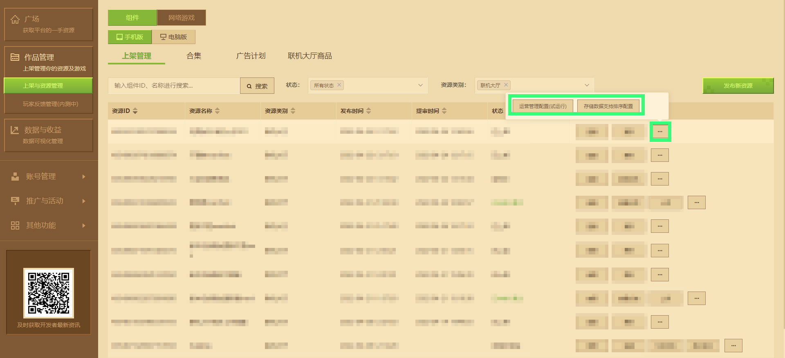
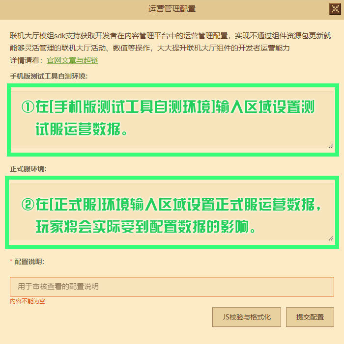
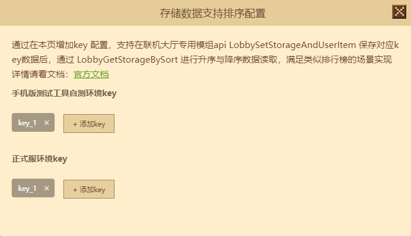

--- 
front: https://mc.163.com/dev/mcmanual/mc-dev/assets/img/8_1.4e8d31aa.jpg 
hard: Advanced 
time: 20 minutes 
--- 
# Online lobby operation management configuration trial run document 
**"My World"** continues to be committed to creating a more complete **developer content ecosystem** . Since **Module SDK2.0** opened the online lobby map in-app purchase function, the official has received many developers' enthusiastic suggestions for the new **development track** . Through a comprehensive assessment of everyone's needs, you can now configure the **operation information** of the **online** online lobby gameplay through the developer platform. 

**Note: The online lobby operation management configuration is in trial operation, and the specific usage document does not represent the final presentation effect of the function. We will continue to collect suggestions and trial feedback from developers. You can contact us through the [Developer FAQ] - [Feedback on other issues] on the upper left of the developer platform. ** 

## Operation Information Description 

**Module SDK Online Lobby Module** will support obtaining the operation management configuration of developers in the content management platform, and realize the online lobby activities, values and other operations that can be flexibly managed without updating the gameplay package, greatly improving the developer operation capabilities of the online lobby component. The following will use instructions and examples to explain the role and common use cases of operation configuration to developers. 

**Note: The operation management configuration function currently only supports the mobile version of the online lobby, and the computer version and other platforms are not supported for the time being. ** 

### Function 

Operation information is a functional module that directly interacts with game players. Its main function is to serve players, configure in-game operation activities, and notify players of upcoming updated functions or optimized content through announcements, emails, marquees, etc. 

### Common Use Cases 

#### Mail 

The main function of email is reward distribution/content notification, which is often used when content updates, bug notifications, and activity rewards are distributed. 

#### Marquee 

Displayed directly in the game, usually in temporary maintenance/emergency situations, the content is edited in the background to inform players. 

#### In-game announcements 

The main function of in-game announcements is to notify players of information (update information, event information, etc.), and the announcement format is relatively simple. 

#### Questionnaires 

Generally during the launch of new game features, questions to ask players are configured in the background to understand the satisfaction of players in each system, and players are encouraged to answer through rewards. 

#### Name customization 

It is often used to encourage players to recharge a certain amount of money to give naming privileges. For ease of operation, the player's nickname prefix (prefix) and suffix (suffix) can be modified directly in the background. 

#### Operation activity configuration 

Periodic activities or holiday operation activities in the game can be directly configured in the background. 


## Operation management configuration operation process 

Enter the developer platform, click **[Work Management]-[Shelf and Resource Management]**, select the mobile version under the component label, find the online lobby resources that have been launched, click **[···]** on the right and select [**Operation Configuration Management (Trial Run)**](#Operation Configuration Management (Trial Run)) or [**[Storage Data Support Sorting Settings]**](#Storage Data Support Sorting Settings). 

**Note: Operation configuration and storage data sorting settings do not need to be reviewed, but the official will regularly review the data information to ensure compliance with platform specifications and protect the rights and interests of the official, developers and players. ** 

 

### Operation Configuration Management (Trial Run) 

During the trial run of the operation management configuration, only operation data can be set, and the submitted information format must be JSON. Developers can directly click **[JS Verification and Formatting]** to standardize the data format. Obtain data information through the **Module SDK** interface, and finally reflect the results in the online lobby room through the code logic preset by the developer. 

**Note: Each submitted JSON configuration will replace the previous configuration information. Please save the data configuration submitted last time locally. ** 

The platform also supports setting the operation data of [Mobile Version Test Tool Self-Test Environment] and [Formal Service Environment], which is convenient for developers to verify the correctness of data on the mobile test tool before submitting it to the formal service environment. 

 

Please be sure to fill in the configuration explanation reason when submitting the configuration. So that the auditor can review the security and compliance of the data information. 

In the corresponding online lobby gameplay, developers can use the <a href="../../mcdocs/1-ModAPI/接口/在线大厅.html#lobbygetstorage">LobbyGetStorage</a> interface, pass in uid 0 and key as a list parameter with op_config, and get the data configured in the operation management configuration from the developer platform. 

```python 
def callback(data): 
if data: 
# Execute your own business logic under the code block 
print { i["key"]: i["value"] for i in data["entity"]["data"] } 
httpComp = compFactory.CreateHttp(serverApi.GetLevelId()) 
# Returns the data configured in the operation management configuration from the developer platform. Note: Each JSON configuration data submitted to the developer platform will replace the previous configuration information. 
httpComp.LobbyGetStorage(callback, 0, ['op_config']) 
``` 

Callback needs to accept a parameter. When the request fails, the parameter returns None. When the request succeeds, the parameter is a Dict with the following format. (If the key obtained has not been set, it will not appear in the latest data returned). 

```json 
{ 
"entity": { 
"data": [ 
{ 
"key": str, // data key 
"value": int/float/str // data value 
}, 
{ 
//... 
} 
]

} 
} 
``` 

### Storage data supports sorting settings 

Storage data supports sorting configuration to support ascending or descending order of online lobby gameplay cloud data, realizing a scenario similar to the in-game leaderboard display. According to the **data key (key)** of the corresponding player data storage, click **[+Add key]** in the window. The online lobby gameplay can sort the data in time with the help of the official encapsulated interface after each room is started, and complete the corresponding gameplay logic. 

 

The platform also supports setting the **data key (key)** to be sorted in the [Mobile version test tool self-test environment] and [Official service environment], which is convenient for developers to verify the correctness of the data on the mobile test tool before submitting it to the official service environment. 

To store player data, use the online lobby module development interface <a href="../../mcdocs/1-ModAPI/接口/在线大厅.html#lobbysetstorageanduseritem">LobbySetStorageAndUserItem</a>, and cooperate with <a href="../../mcdocs/1-ModAPI/接口/在线大厅.html#lobbygetstoragebysort">LobbyGetStorageBySort</a> to get data in ascending or descending order. Click the hyperlink to view the corresponding interface document. 

**Note: The corresponding value of the data key to be sorted must be an integer, and the value range is between -2^63 and 2^63. ** 

## Example Mod 

For details, see [lobbyGoodsMod2.0](../20-玩法开发/13-模块SDK编程/60-Demo示例.html).